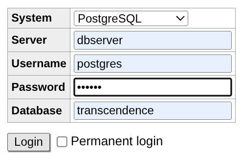
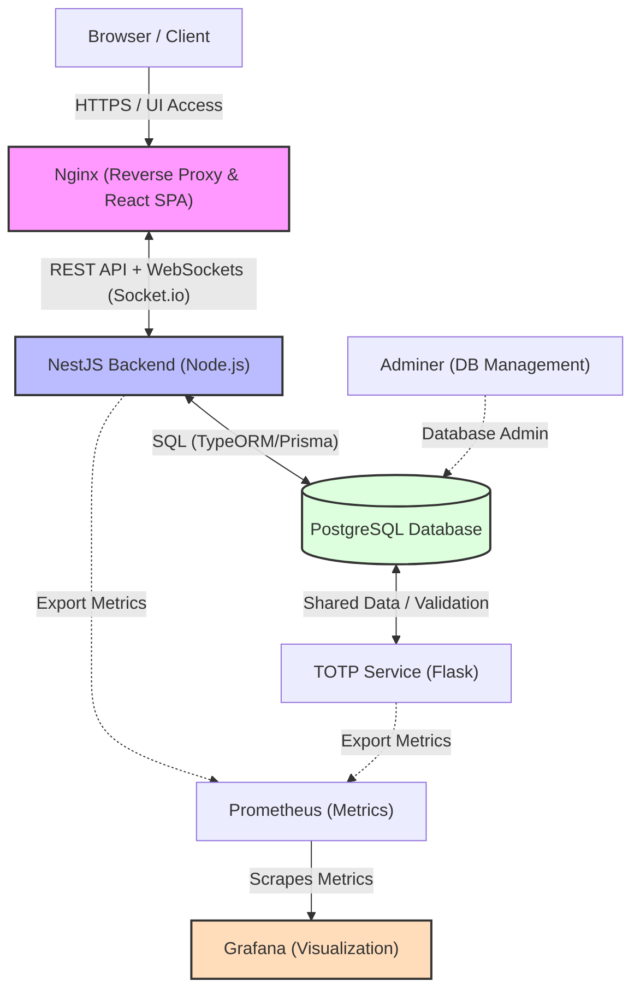

*This project has been created as part of the 42 curriculum by adrmarqu, fcatala-, luicasad, maria-nm.*

# ft_transcendence

## Description

**ft_transcendence** is a full-stack, real-time multiplayer Pong platform built for the 42 curriculum. It transforms the classic 1972 Atari arcade game into a modern web application where players can compete locally or remotely, manage social connections, and track their performance through a rich statistics system.

The platform is designed around three core pillars: **play**, **community**, and **observability**. Players authenticate securely via standard login or OAuth providers (42 intra and Google), customize their profiles and avatars, challenge friends to live matches, and communicate through an integrated real-time chat. Every match is recorded and contributes to a persistent statistics history.

Key features at a glance:

- Real-time Pong — local (same keyboard) and remote (two separate browsers/machines)
- Secure authentication with optional Two-Factor Authentication (TOTP)
- OAuth 2.0 login via 42 School and Google
- Friend system with online status
- Persistent match history and performance metrics
- Real-time chat with public channels and direct messages
- Multi-language interface (English, Spanish, French,  Catalan)
- Monitoring stack (Prometheus + Grafana)
- Internationalized avatar and profile system

---

## Instructions

### Prerequisites

- **Docker** ≥ 24 and **Docker Compose** v2
- **Make**
- A configured `.env` file at the project root (see `.env.example` for the required variables — API keys, DB credentials, OAuth client IDs/secrets, JWT secret, and encryption keys)

### Step-by-step

1. **Clone the repository:**
   ```bash
   git clone <repo-url> ft_transcendence
   cd ft_transcendence
   ```

2. **Build and launch with Make:**
   ```bash
   make
   ```

Makefile requests these secrets. 
   
```bash
   POSTGRES_PASSWORD:
   GRAFANA_USER:
   GRAFANA_PASSWORD:
   OAUTH_GOOGLE_CLIENT_ID:
   OAUTH_GOOGLE_CLIENT_SECRET:
   OAUTH_42_CLIENT_ID:
   OAUTH_42_CLIENT_SECRET:
   GITHUB_TOKEN:
```

Define Postgres' password at will, as well as Grafana credentials.
   
Ask developer for OAuth information to authenticate wiht 42 network or Google. As also GitHub Security token to watch
   
   
The Makefile populates the `.env` file with defaults where applicable and calls `docker compose up --build`. All services (frontend, backend, dbserver, prometheus, grafana, TOTP, adminer and nginx) start automatically.


4. **Access the application:**
   - Main app: `https://localhost`
   - Grafana dashboards: `http://localhost:8443/grafana`
   - Adminer (DB admin): `http://localhost:8443/adminer`

4.1. **Adminer session**:

Configure login dialog as shown in the image. You can check such values inside file .env 



5. **Stop the project:**
   ```bash
   make down
   ```

---

## Resources

### References

- [NestJS Documentation](https://docs.nestjs.com)
- [Drizzle ORM Documentation](https://orm.drizzle.team)
- [React Documentation](https://react.dev)
- [Socket.IO Documentation](https://socket.io/docs/v4/)
- [Passport.js Documentation](https://www.passportjs.org)
- [Prometheus Documentation](https://prometheus.io/docs/)
- [Grafana Documentation](https://grafana.com/docs/)
- [RFC 6238 — TOTP Standard](https://datatracker.ietf.org/doc/html/rfc6238)
- [WCAG 2.1 Accessibility Guidelines](https://www.w3.org/TR/WCAG21/)
- [Language codes dataset](https://github.com/datasets/language-codes/tree/main)
- [ISO 3166 Country codes](https://github.com/lukes/ISO-3166-Countries-with-Regional-Codes/blob/master/all/all.csv)

### AI Usage

AI tools were used continuously throughout the project. Their primary contributions were:

- **Debugging and error detection** — AI was systematically used to review code, catch logic errors, identify type mismatches, and suggest fixes during development.
- **Documentation** — All technical documentation artifacts (backend, frontend, monitoring, authentication) were generated with AI assistance based on the implemented code.

AI tools were not used to produce architectural decisions or core game logic autonomously; those remained driven by team design sessions and peer review.

---

## Team Information

| 42 Login | Name | Role(s) | Responsibilities |
|----------|------|---------|-----------------|
| luicasad | Luis | Project Manager, Developer | Project coordination and task distribution (supported by the full team). Database design and synthetic data population. 2FA / TOTP container. Grafana and Adminer setup. README. |
| fcatala- | Xavi | Product Owner, Developer | Product vision and feature prioritization (with Natalia). Login system, OAuth integration (42 & Google), avatar system, user profile. |
| maria-nm | Natalia | Product Owner, Developer | Product vision and feature prioritization (with Xavi). WebSockets infrastructure, real-time chat, remote Pong, Prometheus monitoring, friends system. |
| adrmarqu | Adria | Developer | Local Pong game, AI opponent, full CSS and visual design across the application. |

---

## Project Management

### Organization

The team organized work iteratively, breaking the project into features and assigning ownership per person while maintaining shared responsibility for quality. Luis coordinated task distribution and progress tracking, with active input from all members during in-person sessions.

### Tools

- **GitHub Issues** — used to track tasks, bugs, and feature progress.

### Communication Channels

- **WhatsApp** — primary async communication channel for quick decisions and daily sync.
- **In-person meetings** — used for architecture discussions, code reviews, and sprint planning.

---

## Technical Stack

### Architecture

The application runs entirely in Docker containers orchestrated by Docker Compose. It follows a clean frontend/backend separation with a dedicated database, a TOTP microservice, and an independent monitoring stack.



```
[Browser] → [Nginx / React SPA]
                  ↕ REST + WebSocket
           [NestJS Backend]
                  ↕
           [PostgreSQL DB]
                  ↕
           [TOTP Service (Flask)]

[Prometheus] → [Grafana]
[Adminer]    → [PostgreSQL DB]
```

### Frontend

- **React 19** with TypeScript — component-based SPA
- **Vite** — build tool and dev server
- **i18next** — internationalization (English, Spanish, Catalan)
- **Socket.IO client** — real-time communication with the backend

### Backend

- **NestJS 11** (Node.js) — modular, decorator-driven REST + WebSocket server
- **Passport.js** — authentication strategies (JWT, 42 OAuth, Google OAuth)
- **Drizzle ORM** — type-safe SQL query builder
- **Socket.IO** — WebSocket gateway for chat and game events
- **@nestjs/jwt** — JWT token management

### Database

- **PostgreSQL** — chosen for its robustness, relational integrity, and support for JSONB (used for i18n fields in status tables)

### Monitoring

- **Prometheus** — metrics collection from the NestJS backend
- **Grafana** — dashboards and alerting

### Other Significant Technologies

- **Flask (Python)** — TOTP microservice for Two-Factor Authentication
- **Nginx** — reverse proxy and static file server for the SPA
- **Adminer** — lightweight database administration UI
- **bcryptjs** — password hashing
- **class-validator / class-transformer** — DTO validation pipeline
- **dotenv** — environment variable management

### Justification for Major Choices

NestJS was selected for its strong TypeScript support, built-in dependency injection, and first-class WebSocket and guard abstractions, which matched the project's need for structured, maintainable backend code. Drizzle ORM was chosen over alternatives for its lightweight, type-safe query builder that keeps SQL control without the overhead of a heavy ORM. PostgreSQL provides the relational guarantees needed for match tracking and user relationships. React was the natural frontend choice given team familiarity and the ecosystem around it.

---

## Database Schema

The full entity-relationship diagram is available at [`./docs/ER.md`](./docs/ER.md).

### Core Tables

**USER** — central user entity. Key fields: `p_pk` (PK), `p_nick`, `p_mail` (unique), `p_pass`, `p_totp_secret`, `p_totp_enabled`, `p_oauth_provider`, `p_oauth_id`, `p_avatar_url`, `p_profile_complete`, `p_lang` (FK), `p_country` (FK), `p_role` (FK), `p_status` (FK).

**MATCH** — records individual games. Key fields: `m_pk` (PK), `m_date`, `m_duration`, `m_winner` (FK → USER).

**METRIC** — defines trackable performance indicators. Key fields: `metric_pk` (PK), `metric_name`.

### Reference Tables

`COUNTRY`, `LANGUAGE`, `ROLE`, `STATUS` — lookup tables for user attributes. The `FRIEND_STATUS` table stores status labels as JSONB for i18n support.

### Junction / Association Tables

**COMPETITOR** — links users to matches (many-to-many): `mc_match_fk`, `mc_user_fk`.

**MATCHMETRIC** — stores aggregate metric values per match: `mm_match_fk`, `mm_code_fk`, `mm_value`.

**COMPETITORMETRIC** — stores per-user metric values within a match: `mcm_match_fk`, `mcm_user_fk`, `mcm_metric_fk`, `mcm_value`.

**FRIEND** — manages friendship relationships: `f_1`, `f_2`, `f_date`, `f_status_fk`.

### Key Relationships

- Users participate in matches as competitors (many-to-many via COMPETITOR)
- Each user has exactly one role, country, language, and status
- Metrics are tracked both at match level (MATCHMETRIC) and individual competitor level (COMPETITORMETRIC)
- Friendships are bidirectional and track status history

---

## Features List

| Feature | Description | Team Member(s) |
|---------|-------------|---------------|
| User Registration | Email/password sign-up with profile completion flow | Xavi |
| JWT Authentication | Stateless session management via JSON Web Tokens | Xavi |
| OAuth — 42 School | Login and registration via 42 intra OAuth 2.0 | Xavi |
| OAuth — Google | Login and registration via Google OAuth 2.0 | Xavi |
| Two-Factor Authentication | TOTP-based 2FA with QR code setup and backup codes | Luis |
| User Profile | View and edit personal information, stats, match history | Xavi |
| Avatar System | Upload custom avatar or choose from defaults <br> Real-time avatar synchronization across chat interface and friends list| Xavi / Natalia |
| Friends System | Send/accept/reject friend requests, online status | Natalia |
| Real-time Chat | Public channels and direct messages via WebSockets | Natalia |
| Local Pong | Two players on the same device, same keyboard | Adria |
| Remote Pong | Two players on separate devices via WebSockets | Natalia |
| AI Opponent | Single-player mode with a simulated AI paddle | Adria |
| Match History & Stats | Persistent recording of match results and metrics | Luis / Natalia |
| Internationalization | UI available in English, Spanish, and Catalan | All |
| Prometheus Monitoring | Backend metrics exported and scraped by Prometheus | Natalia / Luis |
| Grafana Dashboards | Visual dashboards for backend and DB metrics | Luis |
| Database Design | Schema design, migrations, synthetic seed data | Luis |
| CSS / Visual Design | Application-wide styling and responsive layout | Adria |
| Privacy Policy & ToS | Accessible legal pages as required by the subject | All |

---

## Modules

Modules are documented in dedicated artifacts. Each link below points to the corresponding documentation file.

**Total points: 15** (7 Major × 2pts + 1 Minor × 1pt = 15 — see table below)

| Module | Category | Type | Points | Owner(s) | Documentation |
|--------|----------|------|--------|----------|---------------|
| Use a Framework as backend | Web | Major | 2 | All | [WEB_MAJOR_DOCUMENTATION.md](./docs/WEB_MAJOR_FRAMEWORK.md) |
| Real-time features using WebSockets | Web | Major | 2 | Natalia | [WEBSOCKET_SYSTEM_DOCUMENTATION.md](./srcs/backend/doc/WEBSOCKET_SYSTEM_DOCUMENTATION.md) |
| Allow users to interact with other users | Web| Major | 2 | Natalia| [CHAT_DOCUMENTATION.md](./srcs/backend/doc/CHAT_SYSTEM_DOCUMENTATION.md)<br> [PROFILE_DOCUMENTATION.md](./srcs/frontend/doc/PROFILE_DOCUMENTATION.md)<br>[FRIENDS_DOCUMENTATION.md](./srcs/frontend/doc/FRIENDS_DOCUMENTATION.md)|
| Use an ORM for the database | Web | Minor | 1 | Luis | [ORM_DOCUMENTATION.md](./srcs/backend/doc/ORM_DOCUMENTATION.md) |
| Standard user management and authentication | User Management | Major | 2 | Xavi / Natalia | [AVATAR_DOCUMENTATION.md](./srcs/frontend/doc/AVATAR_DOCUMENTATION.md)<br> [PROFILE_DOCUMENTATION.md](./srcs/frontend/doc/PROFILE_DOCUMENTATION.md)<br>[FRIENDS_DOCUMENTATION.md](./srcs/frontend/doc/FRIENDS_DOCUMENTATION.md)|
| Implement remote authentication with OAuth 2.0 | User Management | Minor | 1 | Xavi | [OAUTH_DOCUMENTATION](./srcs/backend/doc/OAUTH_DOCUMENTATION.md)|
| Implement a complete 2FA (Two-Factor Authentication) system for the users | User Management | Minor | 1 | Luis | [TOTP_LOGIC.md](./srcs/totp/doc/TOTP_LOGIC.md) <br> [2FA_AUTHENTICATION_DOCUMENTATION.md](./srcs/totp/doc/2FA_DOCUMENTATION.md) <br> [2FA_LOGIN_DOCUMENTATION.md](./srcs/totp/doc/2FA_LOGIN_DOCUMENTATION.md)<br> [2FA_AUTHENTICATION_DOCUMENTATION_v2.md](./srcs/totp/doc/TWO_FACTOR_AUTHENTICATION_COMPLETE_DOCUMENTATION_V2.md)<br> [2FA_LOGIN_DOCUMENTATION_v2.md](./srcs/totp/doc/2FA_LOGIN_FLOW_UPDATED_V2.md)|
| Web-based Pong game | Gaming & User Experience | Major | 2 | Adria / Natalia | [PONG_FRONTEND_DOCUMENTATION.md](./srcs/frontend/doc/PONG_FRONTEND_DOCUMENTATION.md) <br> [PONG_BACKEND_DOCUMENTATION.md](./srcs/backend/doc/PONG_BACKEND_DOCUMENTATION.md) |
| Remote players (real-time multiplayer) | Gaming & User Experience | Major | 2 | Natalia | [WEBSOCKET_SYSTEM_DOCUMENTATION.md](./srcs/backend/doc/WEBSOCKET_SYSTEM_DOCUMENTATION.md) <br>[PONG_BACKEND_DOCUMENTATION.md](./srcs/backend/doc/PONG_BACKEND_DOCUMENTATION.md) |
| i18n — Support multiple languages (3+) | Accessibility & Internationalization | Minor | 1 | All | [I18N_SYSTEM_DOCUMENTATION.md](./srcs/frontend/doc/I18N_SYSTEM_DOCUMENTATION.md) |
| Monitoring system with Prometheus and Grafana. | DevOps | Major | 2 | Natalia / Luis | [PROMETHEUS_DOCUMENTATION.md](./srcs/prometheus/doc/PROMETHEUS_DOCUMENTATION.md) <br>[GRAFANA_DOCUMENTATION.md](./srcs/grafana/doc/GRAFANA_DOCUMENTATION.md) |
| Introduce an AI Opponent for games | IA | Major | 2 | Adria| [IA_OPPONENT_DOCUMENTATIOS.md](./srcs/frontend/doc/AI_OPPONENT_DOCUMENTATION.md)|
| Game statistics and match history | User Management | Minor | 1 | Luis / Natalia | [PROFILE_DOCUMENTATION.md](./srcs/frontend/doc/PROFILE_DOCUMENTATION.md) |

> **Module choice justification:** All modules were selected to build a coherent, production-grade platform rather than accumulate isolated points. WebSockets underpin both the game and the chat. OAuth reduces friction at registration. Prometheus + Grafana provide the observability layer needed to operate the system at scale. 2FA adds a meaningful security layer complementary to OAuth. The ORM (Drizzle) was chosen to keep the data layer type-safe and maintainable. i18n reflects the multilingual team and the international 42 network.

---

## Individual Contributions

### Luis — `luicasad` · Project Manager & Developer

- Designed the full relational database schema and managed PostgreSQL migrations
- Populated the database with realistic synthetic seed data for development and evaluation
- Implemented the TOTP/2FA system including the Flask microservice, secret encryption, QR code generation, backup codes, and login flow integration
- Set up Grafana with custom dashboards and Adminer for database administration
- Coordinated team task distribution, milestone tracking via GitHub Issues
- Authored this README

*Challenges:* Integrating the TOTP Flask container securely within the NestJS authentication flow required careful design of the inter-service HTTP communication and encryption of secrets at rest.

---

### Xavi — `fcatala-` · Product Owner & Developer

- Co-led product vision and feature scope definition with Natalia
- Implemented the full authentication stack: local login, JWT strategy, 42 OAuth, and Google OAuth
- Built the avatar selection and upload system
- Developed the user profile screen (view, edit, stats display)

*Challenges:* Handling OAuth edge cases — particularly account merging when the same email exists via both a local account and an OAuth provider — required careful guard logic and session state management.

---

### Natalia — `maria-nm` · Product Owner & Developer

- Co-led product vision and feature prioritization with Xavi
- Architected and implemented the WebSocket infrastructure (Socket.IO gateway) used by both the chat and the game
- Built the real-time chat system (channels, direct messages, message persistence)
- Developed the remote multiplayer Pong game mode
- Implemented the friends system (requests, acceptance, online status)
- Set up Prometheus metrics exposition from the NestJS backend
- Polished the frontend user experience by integrating timezone-aware real-time chat timestamps and dynamic avatar synchronization.
- Configured Nginx as a reverse proxy to handle secure HTTPS traffic, API routing, and WebSocket tunneling within the Docker network.

*Challenges:* Synchronizing game state over WebSockets with low latency required careful management of event loops and server-side authoritative game logic to prevent cheating and desync between clients. Additionally, establishing stable and secure WebSocket (WSS) and API connections across a local network required advanced Nginx reverse proxy configuration to resolve strict browser SSL certificate constraints.

---

### Adria — `adrmarqu` · Developer

- Implemented the local Pong game (two players, same keyboard, same browser)
- Developed the AI opponent mode with simulated human-like paddle behavior
- Owned the entire CSS and visual design across all screens, ensuring a coherent and responsive UI

*Challenges:* The AI opponent required tuning the paddle prediction algorithm to feel competitive but beatable — achieving a balance between deterministic optimal play and intentional imperfection.

---

## Known Limitations

- The AI opponent uses a heuristic prediction model; it does not learn or adapt between sessions.
- GDPR data export is partially implemented (users can request their data) but the deletion flow may not cover all edge cases in the current version.
- No mobile touch controls are implemented for the Pong game; the game is designed for keyboard input.

---

## License

This project was developed as part of the 42 curriculum. It is submitted for academic evaluation and is not licensed for redistribution.

---

## Credits

- 42 School for the project subject and evaluation framework
- The open-source communities behind NestJS, React, Drizzle ORM, Socket.IO, Prometheus, and Grafana
- AI tools (Claude, ChatGPT) for documentation generation and debugging assistance

---

## Data Sources

- [Language codes](https://github.com/datasets/language-codes/tree/main)
- [Country codes — ISO 3166](https://github.com/lukes/ISO-3166-Countries-with-Regional-Codes/blob/master/all/all.csv)
