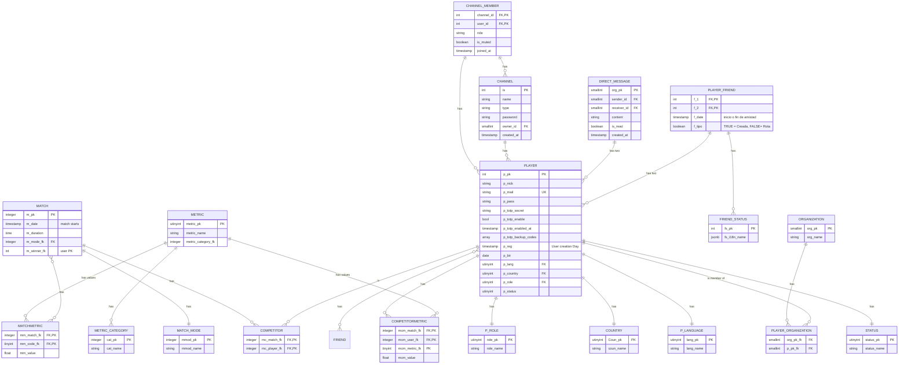

```mermaid
erDiagram
    PLAYER {
        int    p_pk PK
        string p_nick
        string p_mail UK
        string p_pass
        string p_totp_secret
        bool p_totp_enable
        timestamp p_totp_enabled_at
        array p_totp_backup_codes
        timestamp p_reg "User creation Day"
        date p_bir 
        utinyint p_lang FK
        utinyint p_country FK
        utinyint p_role FK
        utinyint p_status
        
    }
    COUNTRY {
        utinyint Coun_pk PK
        string coun_name
    }
    P_LANGUAGE {
        utinyint lang_pk PK
        string lang_name
    }
    P_ROLE {
        utinyint role_pk PK
        string role_name
    }
    STATUS {
        utinyint status_pk PK
        string status_name
    }
    METRIC {
        utinyint metric_pk PK
        string metric_name
        integer metric_category_fk
    } 

    METRIC_CATEGORY {
        integer cat_pk PK
        string cat_name
    }

    MATCH_MODE {
        integer mmod_pk PK
        string mmod_name
    }
       
    MATCH {
        integer m_pk PK
        timestamp m_date "match starts"
        time    m_duration
        integer m_mode_fk FK
        int     m_winner_fk "user PK"

    }
    MATCHMETRIC {
        integer mm_match_fk FK,PK
        tinyint mm_code_fk FK,PK
        float   mm_value
    }
    COMPETITOR {
        integer mc_match_fk FK,PK
        integer mc_player_fk FK,PK
    }    
    COMPETITORMETRIC {
        integer mcm_match_fk FK,PK
        integer mcm_user_fk FK, PK
        tinyint mcm_metric_fk PK
        float   mcm_value
    } 
    PLAYER_FRIEND {
        int f_1 FK,PK
        int f_2 FK,PK
        timestamp f_date "inicio  o fin de amistad"
        boolean f_tipo "TRUE = Creada, FALSE= Rota"
    }
    FRIEND_STATUS {
        int fs_pk PK
        jsonb fs_i18n_name
    }


    PLAYER_ORGANIZATION {
        smallint org_pk_fk FK
        smallint p_pk_fk FK
    }

    ORGANIZATION {
        smallint org_pk PK
        string org_name
    }

    DIRECT_MESSAGE {
        smallint org_pk PK
        smallint sender_id FK
        smallint receiver_id FK
        string content
        boolean is_read
        timestamp created_at
    }

    CHANNEL {
        int is PK
        string name
        string type
        string password
        smallint owner_id FK
        timestamp created_at
    }

    CHANNEL_MEMBER{
        int channel_id FK,PK
        int user_id FK,PK
        string role
        boolean is_muted
        timestamp joined_at
    }

    PLAYER }o--o{ FRIEND : has
    PLAYER ||--o{ COMPETITOR : is    
    PLAYER ||--o{ PLAYER_ORGANIZATION : "is member of"
    PLAYER ||--|| P_ROLE : has
    PLAYER ||--|| COUNTRY : has
    PLAYER ||--|| P_LANGUAGE : has
    PLAYER ||--|| STATUS : has
    MATCH }o--o{ MATCHMETRIC : has
    MATCH ||--o{ COMPETITOR : has
    MATCH ||--|| MATCH_MODE : has
    METRIC ||--o{ MATCHMETRIC : "has values"
    METRIC ||--o{ COMPETITORMETRIC : "has values"
    METRIC ||--o{ METRIC_CATEGORY : has 
    PLAYER ||--o{ COMPETITORMETRIC : has
    PLAYER_FRIEND ||--o{ FRIEND_STATUS : has
    PLAYER_FRIEND ||--o{ PLAYER : "has two"
    DIRECT_MESSAGE ||--o{ PLAYER : "has two"
    CHANNEL ||--o{ PLAYER : has
    CHANNEL_MEMBER ||--o{ CHANNEL : has
    CHANNEL_MEMBER ||--o{ PLAYER : has
    ORGANIZATION ||--o{ PLAYER_ORGANIZATION : has
```
	
