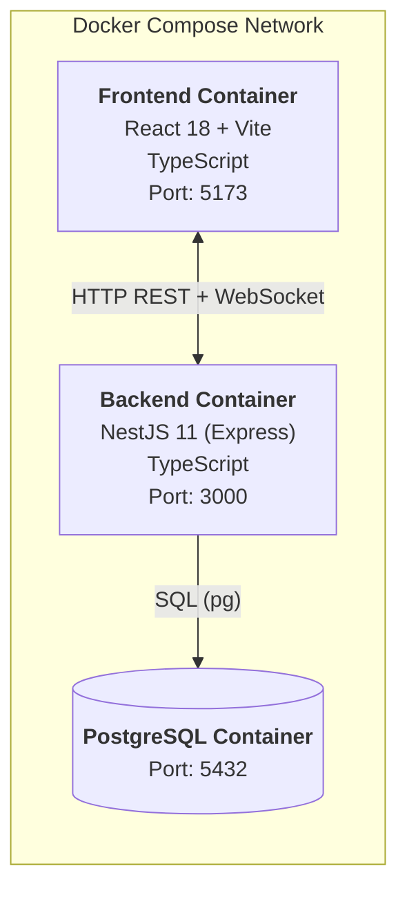
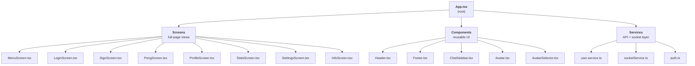
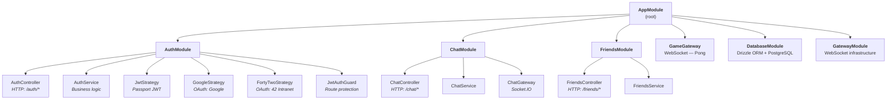
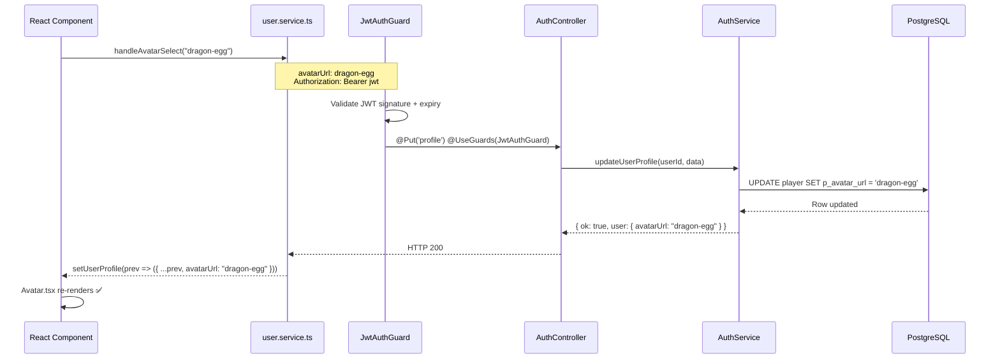

# WEB Major — Framework Usage: Frontend & Backend

## Overview

This module fulfils the **WEB Major** requirement of using a dedicated framework for both the frontend and backend layers of the application. The project employs **React** on the client side and **NestJS** on the server side, each running in its own Docker container and communicating through well-defined HTTP REST and WebSocket interfaces.

---

## Requirement Summary

| Criterion | Implementation |
|-----------|---------------|
| Frontend framework | **React 18** (with Vite + TypeScript) |
| Backend framework | **NestJS 11** (built on Express) |
| Communication | REST over HTTP + Socket.IO WebSockets |
| Language | TypeScript (both sides) |
| Containerisation | Docker Compose (separate containers) |

---

## Architecture Overview



---

## Frontend: React

### Why React

React was chosen for its component-based model, rich ecosystem, and first-class TypeScript support. Its unidirectional data flow and hook system let the team manage complex shared state (authenticated user, active screen, socket connection, game mode) from a single root component (`App.tsx`) without any additional state management library.

### Entry Point & Screen Management

The application is a Single-Page Application (SPA). Navigation is handled through a custom `useReducer`-based router defined in `screenReducer.ts`. There is no URL routing library — each logical view is a full-screen React component rendered conditionally.



### Global State Pattern

`App.tsx` holds the authoritative client-side state and passes only the required slices down through props:

```typescript
// Core session state — owned by App.tsx
const [currentUser, setCurrentUser]           = useState<string>("");
const [currentUserId, setCurrentUserId]       = useState<number | undefined>();
const [currentUserAvatarUrl, setCurrentUserAvatarUrl] = useState<string | null>(null);
const [screen, dispatch]                      = useReducer(screenReducer, "menu");
```

### Key React Features Used

- **`useState`** — local and global UI state
- **`useReducer`** — screen/navigation state machine
- **`useEffect`** — side-effect orchestration (OAuth token parsing, socket connection, profile sync)
- **Conditional rendering** — screens, modals, chat sidebar
- **Props drilling** — intentional for a project of this scope; avoids Context boilerplate

### Build Tooling

| Tool | Version | Purpose |
|------|---------|---------|
| Vite | latest | Dev server + production bundler |
| TypeScript | ~5.x | Static typing across all components |
| ESLint | ^9.x | Code quality |

---

## Backend: NestJS

### Why NestJS

NestJS provides a structured, opinionated architecture on top of Express. Its decorator-based module system, dependency injection container, and built-in support for guards, pipes, and WebSocket gateways made it the right choice for a project that needs HTTP endpoints, real-time game communication, OAuth flows, and a scheduled task layer — all in one coherent codebase.

### Application Bootstrap

```typescript
// main.ts
import { NestFactory } from '@nestjs/core';
import { AppModule } from './app.module';

async function bootstrap() {
  const app = await NestFactory.create(AppModule);

  app.enableCors({
    origin: true,
    methods: 'GET,HEAD,PUT,PATCH,POST,DELETE,OPTIONS',
    credentials: true,
  });

  await app.listen(process.env.BE_CONTAINER_PORT || 3000, '0.0.0.0');
}
bootstrap();
```

Listening on `0.0.0.0` is essential for Docker — it allows the container to accept connections from outside its own network namespace.

### Module Structure

NestJS organises code into **modules**. Each module is a self-contained slice of the application with its own controllers, services, and providers.



### Key NestJS Features Used

**Dependency Injection**

Services are injected automatically by the NestJS IoC container. No manual instantiation is required:

```typescript
@Injectable()
export class AuthService {
  constructor(
    @Inject('DRIZZLE_CONNECTION') private db: NodePgDatabase,
    private jwtService: JwtService,
    private httpService: HttpService,
  ) {}
}
```

**Decorators for Route Definition**

Controllers declare their routes declaratively with method decorators:

```typescript
@Controller('auth')
export class AuthController {
  @Post('register')
  async register(@Body() dto: RegisterUserDto) { ... }

  @Get('profile')
  @UseGuards(JwtAuthGuard)
  async getProfile(@Request() req) { ... }

  @Put('profile')
  @UseGuards(JwtAuthGuard)
  async updateProfile(@Request() req, @Body() data: UpdateProfileDto) { ... }
}
```

**Guards**

`JwtAuthGuard` is a NestJS guard built on Passport that protects routes. Applying it with `@UseGuards(JwtAuthGuard)` is all that is required to restrict a route to authenticated users.

**WebSocket Gateways**

NestJS provides a `@WebSocketGateway` decorator that integrates Socket.IO natively into the module system:

```typescript
@WebSocketGateway({ cors: { origin: '*' } })
export class ChatGateway implements OnGatewayConnection {
  @WebSocketServer()
  server: Server;

  @SubscribeMessage('sendMessage')
  handleMessage(@MessageBody() data: MessageDto) { ... }
}
```

**Passport Strategies**

Authentication strategies (JWT, Google OAuth, 42 OAuth) are registered as NestJS providers and wired into the module via `PassportModule`:

```typescript
@Module({
  imports: [
    PassportModule.register({ defaultStrategy: 'jwt' }),
    JwtModule.registerAsync({ ... }),
    HttpModule.register({ timeout: 5000, maxRedirects: 5 }),
    DatabaseModule,
  ],
  controllers: [AuthController],
  providers: [AuthService, JwtStrategy, JwtAuthGuard, GoogleStrategy, FortyTwoStrategy],
  exports: [AuthService, JwtAuthGuard, JwtStrategy],
})
export class AuthModule {}
```

### Core Backend Dependencies

| Package | Version | Role |
|---------|---------|------|
| `@nestjs/common` | ^11.0.1 | Decorators, pipes, guards, utilities |
| `@nestjs/core` | ^11.0.1 | DI container and application lifecycle |
| `@nestjs/platform-express` | ^11.0.1 | Express HTTP adapter |
| `@nestjs/websockets` | ^11.0.0 | WebSocket abstraction layer |
| `@nestjs/platform-socket.io` | ^11.0.0 | Socket.IO integration |
| `@nestjs/passport` | ^11.0.5 | Authentication strategy integration |
| `@nestjs/jwt` | ^11.0.2 | JWT signing and verification |
| `@nestjs/axios` | ^4.0.1 | HTTP client for inter-service calls |
| `@nestjs/config` | ^4.0.2 | Environment variable management |
| `@nestjs/schedule` | ^6.1.1 | Scheduled tasks (cron) |
| `drizzle-orm` | ^0.45.1 | Type-safe SQL ORM |
| `passport-jwt` | ^4.0.1 | JWT Passport strategy |
| `passport-google-oauth20` | ^2.0.0 | Google OAuth strategy |
| `passport-42` | ^1.2.6 | 42 Intranet OAuth strategy |
| `bcryptjs` | ^3.0.3 | Password hashing |
| `class-validator` | ^0.14.1 | DTO validation decorators |
| `class-transformer` | ^0.5.1 | Object transformation and serialisation |

---

## Frontend ↔ Backend Communication

### REST API

The React frontend communicates with NestJS over HTTP. All requests to protected endpoints include a JWT Bearer token retrieved from `localStorage`:

```typescript
// services/user.service.ts
const response = await fetch(`${API_URL}/auth/profile`, {
  method: 'PUT',
  headers: {
    'Authorization': `Bearer ${localStorage.getItem("pong_token")}`,
    'Content-Type': 'application/json',
  },
  body: JSON.stringify(updateData),
});
```

### WebSocket (Socket.IO)

Real-time features (game matchmaking, live Pong, chat) use Socket.IO. The frontend initialises a single persistent socket connection when a user logs in:

```typescript
// services/socketService.ts
connectSocket(userId); // called from App.tsx on login

// Game events
socket.emit('accept_game_invite', { challengerId });
socket.on('match_found', handleMatchFound);
socket.on('incoming_game_invite', handleIncomingInvite);
```

The backend processes these events in its `GameGateway` and `ChatGateway` classes, which are integrated into the NestJS module system like any other service.

---

## Request Lifecycle (Example: Profile Update)



---

## Project File Locations

### Frontend (`srcs/frontend/src/`)

```
srcs/frontend/src/
├── App.tsx                  ← Root component, global state, screen router
├── main.tsx                 ← Vite entry point, ReactDOM.render
├── screens/                 ← Full-page view components
├── components/              ← Reusable UI components
├── services/                ← API calls and socket management
├── ts/                      ← TypeScript types, reducers, utilities
├── assets/avatars/          ← Avatar images + ID resolution helper
├── local/                   ← i18n translation files
└── css/                     ← Global and component stylesheets
```

### Backend (`srcs/backend/src/`)

```
srcs/backend/src/
├── main.ts                  ← NestFactory bootstrap, CORS, port binding
├── app.module.ts            ← Root module, imports all feature modules
├── database.module.ts       ← Drizzle + PostgreSQL connection provider
├── auth/                    ← AuthModule: registration, login, OAuth, JWT
├── chat/                    ← ChatModule: messaging, ChatGateway
├── friends/                 ← FriendsModule: friend requests, status
├── game/                    ← GameGateway: Pong matchmaking, real-time game
└── db/                      ← Drizzle schema, relations, migrations
```

---

## Technical Decisions

### Why not a full-stack framework (Next.js / Nuxt)?

A full-stack framework was intentionally avoided. The game requires a persistent WebSocket gateway for real-time Pong logic, which is better served by a dedicated, always-on NestJS process. Next.js server-side rendering would add complexity without benefit for a game-focused, authenticated SPA.

### Why keep frontend and backend in separate containers?

Isolation provides independent scaling, cleaner CORS configuration, and the ability to restart one service without affecting the other — a practical advantage when iterating on game logic without touching the UI.

### TypeScript end-to-end

Using TypeScript on both sides means DTOs defined in the backend can be mirrored as interfaces in the frontend, reducing the risk of mismatched data shapes between API producer and consumer.

---

## Summary

The WEB Major framework requirement is satisfied by:

- ✅ **React 18** as the frontend framework — component-based SPA with hooks, custom reducer router, and a service layer for all API communication
- ✅ **NestJS 11** as the backend framework — modular architecture with dependency injection, declarative routing, guards, Passport strategies, and WebSocket gateways
- ✅ Both frameworks are written in **TypeScript**, deployed in **separate Docker containers**, and communicate over **REST + Socket.IO**

[Return to Main modules table](../README.md#modules)
