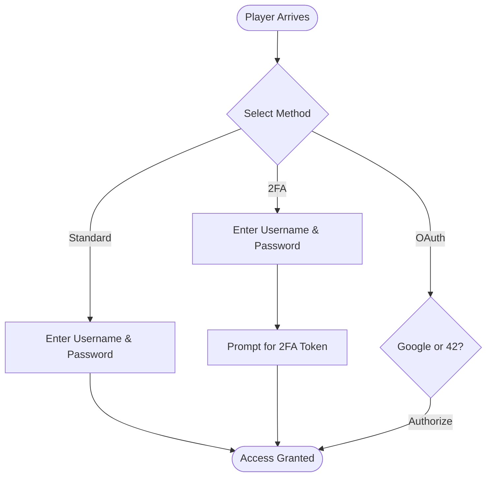

# TRANSCENDENCE

This project has been created as part of the 42 curriculum by adrmarqu, fcatala-, luicasad, maria-nm

# ft_transcendence
Its purpose is to reveal your ability to become acquainted with and complete a complex task using an unfamiliar technology.

# Description

🇬🇧 The Unyielding Citadel: A Grand Siegebattle
Inspired by the monumental Battle of Cartagena de Indias in 1741, this particular engagement elevates the classic naval duel into a full-scale siege, demanding not merely luck, but the strategic genius and unyielding resolve of a commander such as Admiral Don Blas de Lezo.

The game transforms into a desperate defence of a vital colonial stronghold against an overwhelmingly superior invasion force, mirroring the historical disparity where the Spanish, led by the 'Half-Man'—a title earned through the loss of an eye, a leg, and an arm in service—faced a formidable British Armada under Admiral Vernon.

📜 The Commander's Briefing: 'Lezo's Legacy'
In this variant, the playing field is asymmetrical, consisting of two distinct sections: the Defensive Citadel Grid and the Open Sea Grid.

The Defensive Citadel (Spanish Player): The defending player, embodying the spirit of Don Blas de Lezo, controls a smaller, highly fortified grid representing the Bocachica Channel and the Castillo San Felipe de Barajas. Your 'ships' are no longer mere vessels but fixed fortifications, strategically sunk hulks, and concealed gun batteries. Their placement is fixed and known to both players, for your advantage lies in the terrain, not secrecy.

### Goal: 

To withstand a set number of rounds or destroy a critical mass of the attacking fleet before your own key fortifications are neutralised.

The Open Sea (British Player): The attacking player, representing Admiral Vernon, commands the overwhelming Grand Armada. Their ships are numerous and varied (ships-of-the-line, frigates, transports), placed upon the large Open Sea Grid in secret.

Goal: To successfully land a significant quota of 'Troop Transports' by navigating the defensive channel and destroying the fixed fortifications, culminating in a successful 'Assault on the Castle'.

The Attrition Mechanic: Rather than simple 'Hit or Miss,' a successful attack against a vessel on the Open Sea Grid also triggers a Disease/Sickness Check for the attacker, reflecting the debilitating tropical conditions that ravaged the British forces. This introduces an element of long-term attrition, a key to Lezo's victory.

The Grand Assault: If the attacker succeeds in breaching the channel defences, a final, fixed-coordinate assault is launched against the central fortress (Castillo San Felipe). Here, success depends not only on fire-power but also on the successful landing of ground forces, a nod to the disastrous, confused night attack by the British on the fortress.

### 📝 Strategic Features: A Lesson in Command
This revised framework captures the spirit of the 1741 siege:

Asymmetrical Warfare: The British possess overwhelming force (quantity of ships), but the Spanish possess superior position and tenacity (fixed, powerful defences and terrain advantage). This rewards strategic, rather than brute-force, play.

The Power of Fortification: The Spanish 'ships' are forts and batteries, which take a vastly greater number of hits to disable, forcing the British player into a costly, protracted engagement, a direct reflection of the tenacious defence of Bocachica.

The Disease Factor: A card or dice roll following a 'Hit' by the Spanish forces can randomly reduce the attacking player's available moves or hit capacity on subsequent turns. This is an elegant mechanism to represent the calamitous impact of sickness and low morale that ultimately defeated Vernon.

Victory Coins of Hubris: An optional feature allows the British player to claim victory prematurely and mint a token upon conquering the first minor fort. This is a direct, witty reference to Admiral Vernon’s infamous commemorative medals struck before the Spanish defeat, which had to be hastily recalled after his utter humiliation.

The 'Half-Man's' Tenacity: The Spanish commander gains an increasing bonus to their defensive die rolls as their fortifications fall, embodying Blas de Lezo's indomitable will and determination when his forces were at their lowest ebb.

### Game metrics 
#### 1. Competitor Stats (Individual Performance)

+ **Points Scored**: The total number of times you successfully put the ball past your opponent. This is your primary measure of victory.

+ **Paddle Hits**: Every time you make contact with the ball. A high number shows active gameplay and defensive skill.

+ **Service Aces**: Points won directly from your serve without the opponent ever touching the ball. Measures the power and precision of your opening move.

+ **Misses**: The number of times the ball passed your paddle. Lowering this number is the fastest way to improve your win rate.

+ **Winning Streak**: The number of consecutive matches won without a loss. A true mark of dominance on the platform.

#### 2. Match Stats (Game Dynamics)

+ **Peak Ball Speed**: The fastest recorded speed of the ball during a single volley. Higher speeds test your reflexes to the limit.

+ **Max Rally Length**: The highest number of consecutive hits between players before a point was scored. It represents the most intense moment of the match.

+ **Total Wall Bounces**: How many times the ball hit the top or bottom boundaries. Tracks how much "geometry" and angling players are using.

+ **Average Volley Duration**: The average amount of time the ball stays in play per point. High averages indicate two very evenly matched players.

+ **Net Touches**: (In variants with a net) How often the ball grazed the center line. This often leads to unpredictable ball behavior.

#### 3. Organization Stats (Team/Clan Performance)

+ **Total Org Wins**: The combined victory count of every player representing this organization. Measures the collective power of the group.

+ **Member Participation**: The total number of matches played by all organization members. High participation shows a highly active and engaged community.

+ **Org Average Elo**: The mean skill rating of all members. This tells you the "weight class" of the organization in the global rankings.

+ **Tournament Trophies**: The count of first-place finishes in official tournaments. This is the ultimate bragging right for any organization.

#### 4. Tournament Stats (Event Analysis)

+ **Upsets Count** : How many times a lower-ranked "underdog" defeated a higher-seeded player. High upset counts indicate a high-chaos, exciting tournament.

+ **Average Match Margin** : The average score gap between winners and losers (e.g., 11–2 vs 11–9). Narrower margins mean the tournament was highly competitive.

+ **Total Participants**: The total number of unique players who entered the bracket. Measures the scale of the event.

+ **Tournament Duration**: The total time elapsed from the first serve of Round 1 to the final point of the Championship.

+ **Forfeit Count**: How many matches were decided by a player failing to show up or disconnecting. A metric used to gauge the reliability of the player pool.

# Instructions

## Prerequisites
## Step-by-step instructions

# Resources

# Usage Examples

# Feature list

🏛️ Access & Authentication

To engage in the noble sport of Transcendence Pong, players must first establish their identity within our hallowed digital halls. We offer three distinct avenues for registration and entry, ensuring both convenience and the utmost security for our patrons.
1. Traditional Credentials

The foundational method of entry. A player may secure their account by designating a unique Username and a robust Password. This classic approach offers immediate access to the arena with minimal fuss.
2. Enhanced Security (Two-Factor Authentication)

For the discerning player who values the sanctity of their profile, we offer 2FA. Upon providing a standard username and password, one must further verify their identity via a secondary time-based token. It is the digital equivalent of a double-bolted vault.
3. Federated Identity (OAuth)

Should you wish to bypass the manual creation of credentials, you may utilize our OAuth integration. By delegating authentication to the esteemed houses of Google or the 42 Intranet, you may gain entry with a single click, leveraging their existing security infrastructure.

**Initial Engagement**

Upon your inaugural visit to the application, you shall be presented with the primary gateway. Here, one may choose to either Sign In to an existing account or Register a new identity.

**Account Creation**

To establish your presence within the arena, please provide the required particulars. Accuracy is paramount to ensure a seamless entry into our records.

**Confirmation of Enrollment**

Once your credentials have been submitted, a formal confirmation will be displayed, signifying that your registration has been successfully processed.

**Securing the Vault (Two-Factor Authentication)**

Should you elect to enable Two-Factor Authentication, the system will present a unique QR Code alongside a set of Backup Codes. It is highly advised to store these in a secure location, lest you find yourself locked out of the festivities.

# Technical Choices

# Team Information

|Member|Role|responsabilities|
|------|----|----------------|
|Natalia|||
|Xavi|||
|Luis|||

# Project Management

## Organization
## Tools
## Communications Channels

# Technical Stack
## Architecture
## Dependencies

### Core Framework
- **@nestjs/common** (^11.0.1) - Core NestJS functionality including decorators, pipes, guards, and common utilities
- **@nestjs/core** (^11.0.1) - NestJS core engine that handles dependency injection and application lifecycle
- **@nestjs/platform-express** (^11.0.1) - Express adapter for NestJS HTTP server
- **reflect-metadata** (^0.2.2) - Polyfill for metadata reflection API, required by NestJS decorators

### Real-time Communication
- **@nestjs/websockets** (^11.0.0) - WebSocket support for NestJS
- **@nestjs/platform-socket.io** (^11.0.0) - Socket.IO adapter for real-time bidirectional communication

### HTTP Client & Inter-service Communication
- **@nestjs/axios** (^3.0.0) - NestJS wrapper for Axios, enabling HTTP requests between microservices
- **axios** (^1.6.0) - Promise-based HTTP client for inter-container communication
- **rxjs** (^7.8.1) - Reactive programming library for handling asynchronous operations

### Database & ORM
- **drizzle-orm** (^0.45.1) - TypeScript ORM with type-safe SQL query builder
- **pg** (^8.16.3) - PostgreSQL client for Node.js
- **postgres** (^3.4.7) - Modern PostgreSQL client with enhanced performance

### Security & Authentication
- **bcryptjs** (^3.0.3) - Password hashing library for secure credential storage
- **uuid** (^13.0.0) - RFC4122 UUID generation for unique identifiers

### Validation & Transformation
- **class-validator** (^0.14.1) - Decorator-based validation for DTOs and class properties
- **class-transformer** (^0.5.1) - Transform plain objects to class instances and apply validation rules

### Configuration
- **dotenv** (^16.3.1) - Environment variable management from .env files

## Frontend

### A keystone flag `-b´ in TypeScript

The -b flag stands for Build Mode.

This feature was introduced in TypeScript 3.0 to support Project References. 

#### 1. What does it do exactly?

When you run tsc -b:

+ **Dependency Awareness**: TypeScript doesn’t simply compile the current project; it also locates all the projects it depends on (as defined in tsconfig.json) and compiles them in the correct order.

+ **Incremental Compilation**: It only *recompiles what has changed*. If part of the code has already been compiled and its source files remain unchanged, tsc skips it to save time.

+ **Creation of .tsbuildinfo**: It generates a cache file that records what was compiled and when, allowing *future builds to run significantly faster*.

#### 2. Why is it in your “build” script?

The line "build": "tsc -b && vite build" is both a safety measure and an optimisation:

+ tsc -b (The Gatekeeper)  
    First, TypeScript checks that there are no type errors anywhere in your project (or its dependencies). If it finds an error—for example, passing a string where a number is expected—the process stops immediately and never reaches Vite. This prevents you from producing a production bundle containing logical mistakes.

+    &&  
    This operator means: “If the first command succeeds, run the second.”

+   vite build (The Packager)  
    Once the code is confirmed to be type‑safe, Vite takes the files, minifies and optimises them, and produces the dist folder ready for your production container.

In summary

In your microservice, the -b flag ensures that all related modules are compiled efficiently and incrementally, guaranteeing that your code is solid before Vite transforms it into final production assets. 

It is particularly useful sharing share code (such as DTOs) across multiple microservices, as -b will automatically manage those dependencies.

For tsc -b to work correctly, the tsconfig.json file must have the option "composite": true

### A react fragment '<>'

In React, when you use a ternary operator or a function—as is the case in the login screen—you must always return a **single root** element. You cannot return two "sibling" `
` elements sitting side-by-side.

In the code, there are two main blocks: the **User** field and the **Password** field.

+ **The Problem**: If you remove the <>, React will throw a syntax error because you are trying to return two `
` elements at once.

+ The **"Dirty"** Solution: You could wrap them in a `
...
`, but that would clutter your HTML with unnecessary divs that might ruin your design or CSS.

+ The **Elegant** Solution (<>): By using a Fragment, React understands that these elements belong together, but when the page renders, the <> disappears completely, leaving the HTML clean.

In short: It is a "ghost" tag that allows you to group multiple child elements without adding an extra node (like a `
`) to the browser's actual DOM.

## Backend
## Database system

# Database Schema

### Core Entities and Their Fields
#### USER Table
The central entity containing user account information with the following attributes:

|field_name|description|
|----------|-----------|
|p_pk (Primary Key)|: Unique user identifier|
|p_nick|: User's nickname or username|
|p_mail (Unique Key)|: Email address, must be unique across the system|
|p_pass|: Password credential|
|p_totp_secret|:encrypted 2fa secret|
|p_totp_enabled|: Default false|
|p_totp_enabled_at|: TIMESTAMP|
|p_totp_backup_codes|: códigos de respaldo|
|p_oauth_provider|: '42' or 'google'|
|p_oauth_id|: OAuth provider's user ID|
|p_avatar_url|: Profile picture |
|p_profile_complete|: BOOLEAN DEFAULT FALSE,  -- NEW: Track profile completion
|p_reg|: Registration timestamp marking when the account was created|
|p_bir|: Date of birth|
|p_lang (Foreign Key)|: Reference to the user's preferred language|
|p_country (Foreign Key)|: Reference to the user's country|
|p_role (Foreign Key)|: Reference to the user's role within the system|
|p_status (Foreign Key)|: Reference to the user's status|
|unique_oauth_user|CONSTRAINT UNIQUE(p_oauth_provider, p_oauth_id) |

##### Cómo funciona la constraint con valores NULL
En PostgreSQL (y en la mayoría de sistemas SQL estándar), los valores NULL NO se consideran iguales entre sí para propósitos de constraints UNIQUE.
Esto significa que:

✅ Puedes tener múltiples registros con (NULL, NULL) en (p_oauth_provider, p_oauth_id)
✅ La constraint UNIQUE(p_oauth_provider, p_oauth_id) solo se aplica cuando AMBOS valores NO son NULL
✅ Usuarios con contraseña tradicional tendrán (NULL, NULL) y no violarán la constraint

#### MATCH Table
Represents individual competitive matches or games:

|field_name|description|
|----------|-----------|
|m_pk (Primary Key)|: Unique match identifier|
|m_date|: Timestamp indicating when the match commenced|
|m_duration|: Length of time the match lasted|
|m_winner|: User primary key of the victorious participant|

#### METRIC Table
Defines various performance indicators or statistics that can be tracked:

|field_name|description|
|----------|-----------|
|metric_pk (Primary Key)|: Unique metric identifier|
|metric_name|: Descriptive name of the metric|

### Supporting Reference Tables
#### COUNTRY Table

|field_name|description|
|----------|-----------|
|Coun_pk (Primary Key)|: Country identifier|
|coun_name|: Name of the country|

#### LANGUAGE Table

|field_name|description|
|----------|-----------|
|lang_pk (Primary Key)|: Language identifier|
|lang_name|: Name of the language|

#### ROLE Table

|field_name|description|
|----------|-----------|
|role_pk (Primary Key)|: Role identifier|
|role_name|: Name of the role (e.g., administrator, player, moderator)|

#### STATUS Table

|field_name|description|
|----------|-----------|
|status_pk (Primary Key)|: Status identifier|
|status_name|: Name of the status (likely indicating user account state)|

### Junction and Association Tables
#### COMPETITOR Table
Links users to the matches they participate in (many-to-many relationship):

|field_name|description|
|----------|-----------|
|mc_match_fk (Foreign Key, part of composite Primary Key)|: Reference to the match|
|mc_user_fk (Foreign Key, part of composite Primary Key)|: Reference to the user competing|

#### MATCHMETRIC Table
Stores metric values associated with entire matches:

|field_name|description|
|----------|-----------|
|mm_match_fk (Foreign Key, part of composite Primary Key)|: Reference to the match|
|mm_code_fk (Foreign Key, part of composite Primary Key)|: Reference to the metric type|
|mm_value|: The numerical value of the metric for that match|

#### COMPETITORMETRIC Table
Tracks individual competitor performance metrics within matches:

|field_name|description|
|----------|-----------|
|mcm_match_fk (Foreign Key, part of composite Primary Key)|: Reference to the match|
|mcm_user_fk (Foreign Key, part of composite Primary Key)|: Reference to the user|
|mcm_metric_fk (Primary Key)|: Reference to the metric type|
|mcm_value|: The numerical value of that metric for the specific user in that match|

#### FRIEND Table
Manages friendship relationships between users:

|field_name|description|
|----------|-----------|
|f_1 (Foreign Key, part of composite Primary Key)|: First user in the relationship|
|f_2 (Foreign Key, part of composite Primary Key)|: Second user in the relationship|
|f_date|: Date marking either the beginning or ending of the friendship|
|f_status_fk|: Boolean flag indicating relationship status (TRUE = friendship established, FALSE = friendship terminated)|

#### FRIEND_STATUS Table
Defines friendship status

|field_name|description|
|----------|-----------|
|fs_pk|primary key|
|fs_i18n_name|JSONB with status translations|

### Key Relationships

+ Users may have multiple friends and belong to multiple organizations (many-to-many)
+ Users participate in matches as competitors (many-to-many through COMPETITOR)
+ Each user has exactly one role, country, language, and status (one-to-one)
+ Matches contain multiple competitors and can have various metrics tracked both at the match level and individual competitor level
+ Metrics can be applied to both entire matches and individual competitor performances within those matches

This structure supports a comprehensive competitive gaming platform with social features, detailed performance tracking, and flexible metric collection at both aggregate and individual levels.

## [Mermaid scheme here](./docs/ER.md)
# Features List
# Modules

|Module	|Range	|Description	|Points|Luis|Natalia|Xavi| Adria|
|-------|-------|---------------|------|----|-------|----|---|
|WEB	|Major	|Use a framework for both the frontend and backend.	|2|No|No|No|No|
|WEB	|Major	|Implement real-time features using WebSockets or similar technology.	|2|No|No|No|No|
|WEB	|Minor	|Use an ORM for the database.	|1|No|No|No|No|
|Accessibility and Internationalization	|Minor	|Implement i18n (internationalization) to Support multiple languages (at least 3 languages).	|1|No|No|No|No|
|User Management	|Minor	|Game statistics and match history (requires a game module).	|1|No|No|No|No|
|User Management	|Minor	|Implement a complete 2FA (Two-Factor Authentication) system for the users.	|1|No|No|No|No|
|Gamming and User Experience	|Major	|Implement a complete web-based game where users can play against each other.	|2|No|No|No|No|
|Gamming and User Experience	|Major	|Remote players — Enable two players on separate computers to play the same game in real-time.	|2|No|No|No|No|
|Devops	|Major	|Monitoring system with Prometheus and Grafana.	|2|No|No|No|No|
|Data and Analytics	|Minor	|GDPR compliance features. ◦ Allow users to request their data.	|1|No|No|No|No|
||||15|0|0|0|0|

## 

# Individual Contributions

|Member|Individual contributions|
|------|------------------------|
|Adria||
|Natalia||
|Xavi||
|Luis| Readme|
# Known limitations
# Documentation 
# Credits
# License
# Data sources
+ [language codes](https://github.com/datasets/language-codes/tree/main)
+ [Country codes](https://github.com/lukes/ISO-3166-Countries-with-Regional-Codes/blob/master/all/all.csv)
