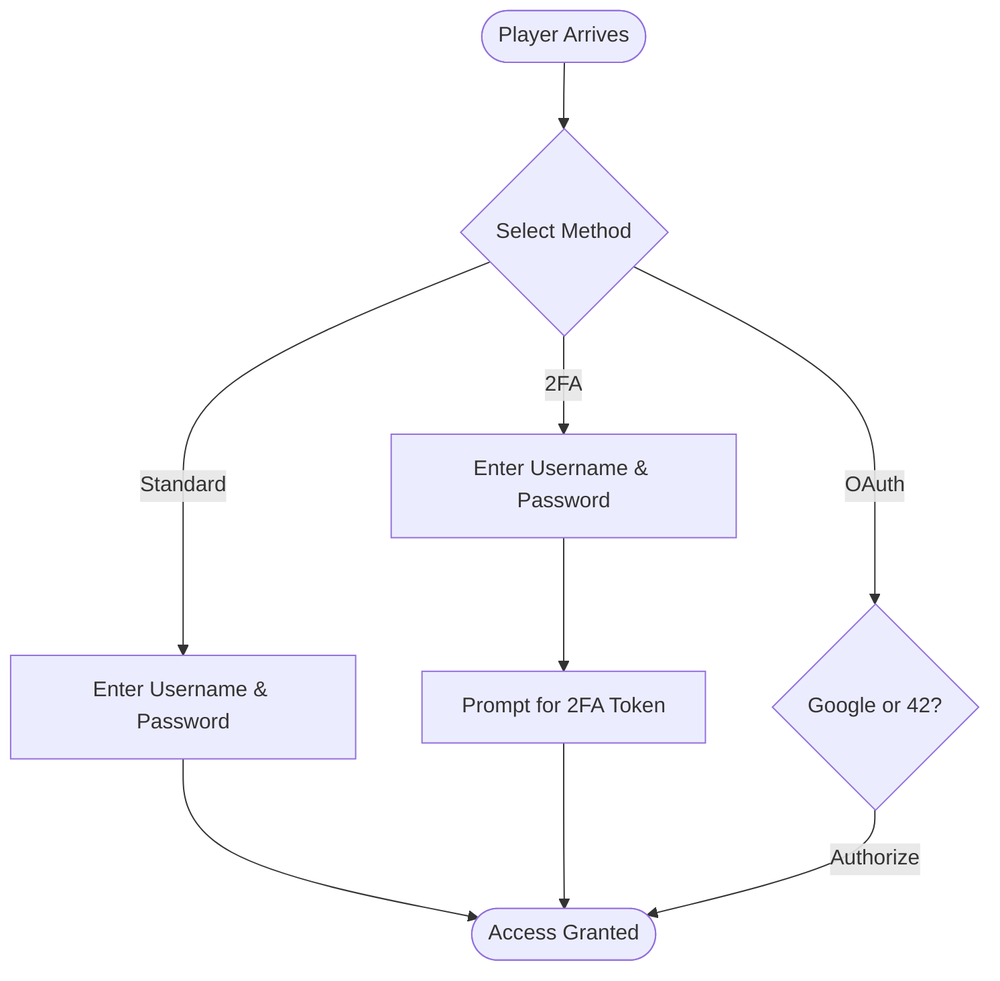
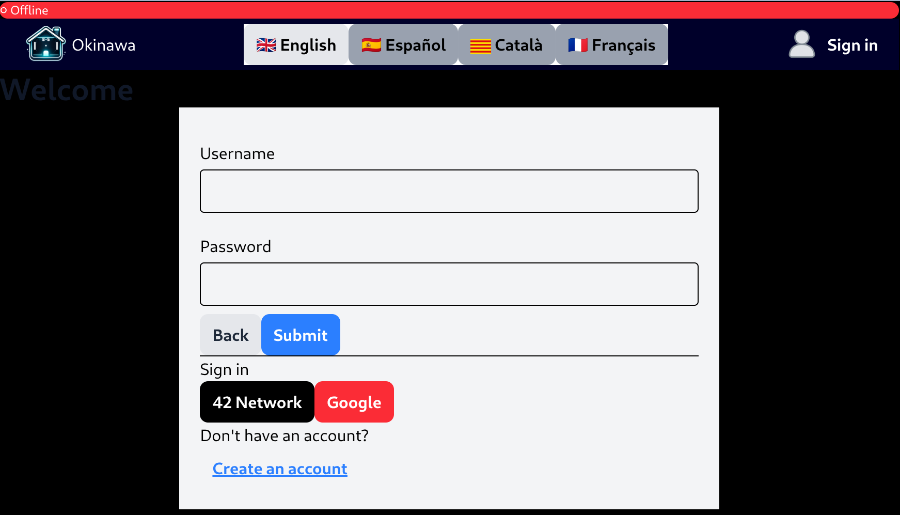

🏛️ Access & Authentication

To engage in the noble sport of Transcendence Pong, players must first establish their identity within our hallowed digital halls. We offer three distinct avenues for registration and entry, ensuring both convenience and the utmost security for our patrons.
1. Traditional Credentials

The foundational method of entry. A player may secure their account by designating a unique Username and a robust Password. This classic approach offers immediate access to the arena with minimal fuss.
2. Enhanced Security (Two-Factor Authentication)

For the discerning player who values the sanctity of their profile, we offer 2FA. Upon providing a standard username and password, one must further verify their identity via a secondary time-based token. It is the digital equivalent of a double-bolted vault.
3. Federated Identity (OAuth)

Should you wish to bypass the manual creation of credentials, you may utilize our OAuth integration. By delegating authentication to the esteemed houses of Google or the 42 Intranet, you may gain entry with a single click, leveraging their existing security infrastructure.

**Initial Engagement**

Upon your inaugural visit to the application, you shall be presented with the primary gateway. Here, one may choose to either Sign In to an existing account or Register a new identity.

**Account Creation**

To establish your presence within the arena, please provide the required particulars. Accuracy is paramount to ensure a seamless entry into our records.

**Confirmation of Enrollment**

Once your credentials have been submitted, a formal confirmation will be displayed, signifying that your registration has been successfully processed.

**Securing the Vault (Two-Factor Authentication)**

Should you elect to enable Two-Factor Authentication, the system will present a unique QR Code alongside a set of Backup Codes. It is highly advised to store these in a secure location, lest you find yourself locked out of the festivities.

