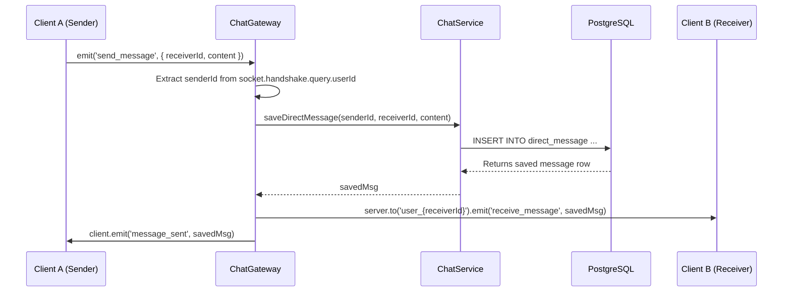
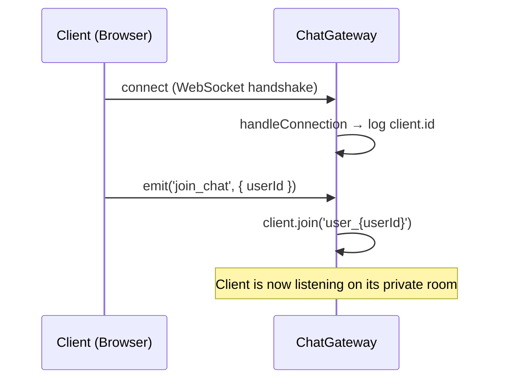
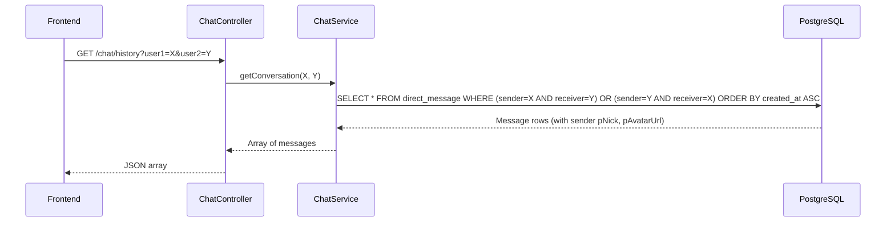
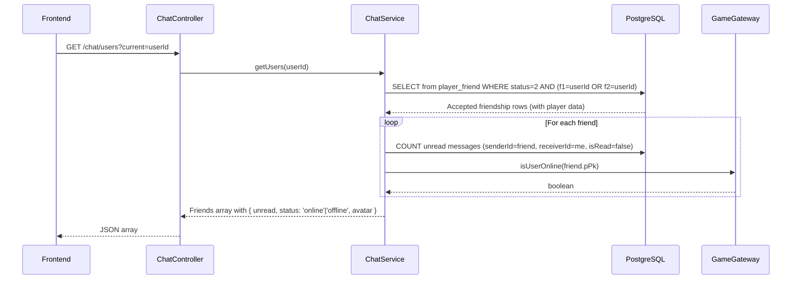
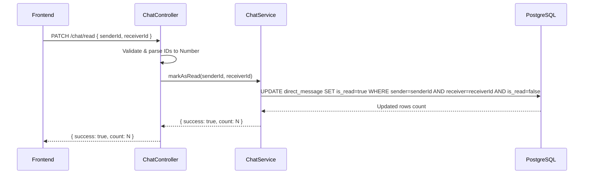
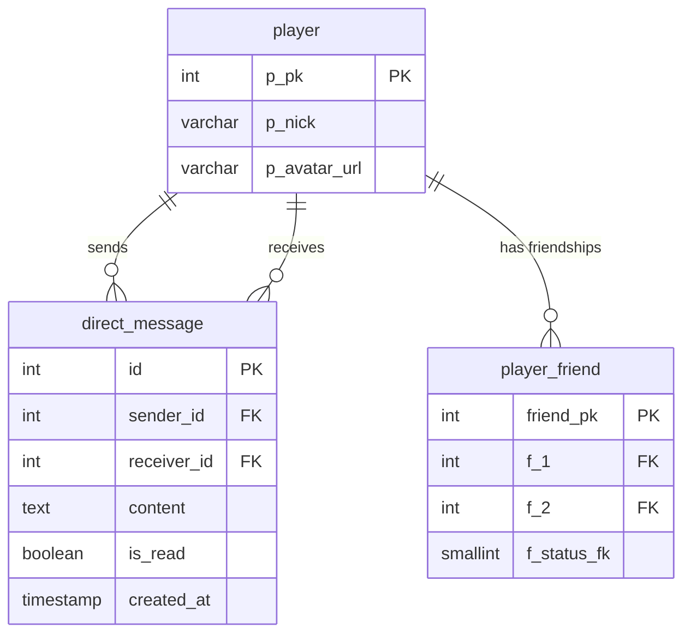

# Chat System - Documentation

## Overview

The chat system enables real-time direct messaging between users. It combines a **WebSocket gateway** (for live delivery) with a **REST controller** (for history retrieval and read-state management). Messages are persisted in PostgreSQL and are scoped to accepted friendships only — users can only open a conversation with players on their friends list.

---

## Evaluation Justification: Interaction Module

This module directly fulfills the requirements for the Major Module: **"Allow users to interact with other users"**. 
Specifically, it provides the core infrastructure for player-to-player communication by implementing:
* **Direct Messaging:** Users can send and receive private messages in real-time.
* **Access Control:** The chat is strictly gated; users can only message confirmed friends (enforcing the social network aspect).
* **Live Notifications:** Unread message counts are dynamically updated and synced with the user's presence.

---

## System Architecture

The chat module is composed of three layers:

- **`ChatGateway`** — Socket.IO WebSocket server. Handles real-time sending and delivery of messages between connected clients.
- **`ChatService`** — Business logic and database access layer. Reads and writes the `direct_message` table via Drizzle ORM.
- **`ChatController`** — REST API. Exposes HTTP endpoints for conversation history, friend lists with unread counters, and marking messages as read.

The module also integrates with `GameGateway` (through `GatewayModule`) to query live presence status (`isUserOnline`) for each friend.

---

## Module Structure

```
backend/src/chat/
├── chat.module.ts        ← NestJS module definition
├── chat.gateway.ts       ← WebSocket gateway (Socket.IO)
├── chat.service.ts       ← Database operations (Drizzle ORM)
├── chat.controller.ts    ← HTTP REST endpoints
├── chat.gateway.spec.ts  ← Gateway unit tests
├── chat.service.spec.ts  ← Service unit tests
└── chat.controller.spec.ts ← Controller unit tests
```

---

## Flow Diagrams

### Sending a Message (Real-Time)



---

### Joining a Private Room (Presence Setup)



---

### Loading Conversation History (REST)



---

### Loading Friends with Unread Counts (REST)



---

### Marking Messages as Read (REST)



---

## WebSocket Events Reference

### Client → Server Events

| Event | Payload | Description |
|---|---|---|
| `join_chat` | `{ userId: number }` | Subscribes the socket to the private room `user_{userId}`. Must be emitted right after connecting. |
| `send_message` | `{ receiverId: number, content: string }` | Sends a direct message. `senderId` is inferred from `socket.handshake.query.userId`. |
| `ping_chat` | `any` | Health-check ping. Returns a `pong_chat` event. |

### Server → Client Events

| Event | Payload | Description |
|---|---|---|
| `receive_message` | Saved message object | Delivered to the receiver's private room (`user_{receiverId}`) in real time. |
| `message_sent` | Saved message object | Confirmation sent back to the sender after the message is persisted. |
| `pong_chat` | `{ msg: string, received: any }` | Response to `ping_chat`. |

---

## REST API Reference

### `GET /chat/history`

Retrieves the chronological conversation between two users.

**Query Parameters:**

| Parameter | Type | Description |
|---|---|---|
| `user1` | `string (number)` | ID of the first user |
| `user2` | `string (number)` | ID of the second user |

**Response:** Array of `directMessage` rows, ordered oldest-first. Each message includes sender's `pNick` and `pAvatarUrl`.

**Example:**
```
GET /chat/history?user1=3&user2=7
```

```json
[
  {
    "id": 101,
    "senderId": 3,
    "receiverId": 7,
    "content": "Hey, ready to play?",
    "isRead": true,
    "createdAt": "2025-06-01T10:00:00.000Z",
    "sender": {
      "pNick": "Alice",
      "pAvatarUrl": "dragon-egg"
    }
  }
]
```

---

### `GET /chat/users`

Returns all accepted friends of the current user, enriched with unread message counts and online presence.

**Query Parameters:**

| Parameter | Type | Description |
|---|---|---|
| `current` | `string (number)` | The authenticated user's ID |

**Response:** Array of friend objects.

**Example:**
```
GET /chat/users?current=3
```

```json
[
  {
    "pPk": 7,
    "pNick": "Bob",
    "pAvatarUrl": "centaur",
    "unread": 3,
    "status": "online",
    "avatar": "centaur",
    "avatarId": "centaur"
  }
]
```

---

### `PATCH /chat/read`

Marks all unread messages from a specific sender as read.

**Request Body:**

```json
{
  "senderId": 7,
  "receiverId": 3
}
```

**Response:**

```json
{
  "success": true,
  "count": 3
}
```

**Error Response** (invalid IDs):

```json
{
  "success": false,
  "msg": "IDs inválidos"
}
```

---

## Database Schema

### Table: `direct_message`

| Column | Type | Constraints | Description |
|---|---|---|---|
| `id` | `INTEGER` | PK, auto-generated | Unique message identifier |
| `sender_id` | `INTEGER` | NOT NULL, FK → `player.p_pk` | The user who sent the message |
| `receiver_id` | `INTEGER` | NOT NULL, FK → `player.p_pk` | The user who receives the message |
| `content` | `TEXT` | NOT NULL | Message body |
| `is_read` | `BOOLEAN` | DEFAULT `false` | Whether the receiver has read it |
| `created_at` | `TIMESTAMP` | DEFAULT `NOW()` | Message creation time |

**SQL Definition:**

```sql
CREATE TABLE direct_message (
    id          INTEGER PRIMARY KEY GENERATED ALWAYS AS IDENTITY,
    sender_id   INTEGER NOT NULL REFERENCES player(p_pk) ON DELETE CASCADE,
    receiver_id INTEGER NOT NULL REFERENCES player(p_pk) ON DELETE CASCADE,
    content     TEXT NOT NULL,
    is_read     BOOLEAN DEFAULT false,
    created_at  TIMESTAMP DEFAULT NOW()
);
```

---

## Entity Relationship



---

## Component Details

### `ChatGateway` (`chat.gateway.ts`)

**Purpose:** WebSocket server for real-time message delivery.

**Key Implementation:**

```typescript
@WebSocketGateway({ cors: { origin: '*' } })
export class ChatGateway implements OnGatewayConnection, OnGatewayDisconnect {

  @SubscribeMessage('join_chat')
  handleJoinChat(@MessageBody() data: { userId: number }, @ConnectedSocket() client: Socket) {
    client.join(`user_${data.userId}`);
  }

  @SubscribeMessage('send_message')
  async handleSendMessage(@MessageBody() payload: SendMessageDto, @ConnectedSocket() client: Socket) {
    const senderId = Number(client.handshake.query.userId);
    const savedMsg = await this.chatService.saveDirectMessage(senderId, payload.receiverId, payload.content);
    this.server.to(`user_${payload.receiverId}`).emit('receive_message', savedMsg);
    client.emit('message_sent', savedMsg);
  }
}
```

**Room Naming Convention:** Each user has a dedicated private Socket.IO room named `user_{userId}`. A client must emit `join_chat` with their own user ID immediately after connecting to start receiving messages.

---

### `ChatService` (`chat.service.ts`)

**Purpose:** Database access layer for all chat operations.

**Methods:**

| Method | Parameters | Description |
|---|---|---|
| `saveDirectMessage` | `senderId, receiverId, content` | Inserts a new message row and returns it |
| `getConversation` | `user1Id, user2Id` | Returns all messages between two users, chronologically |
| `getUsers` | `currentUserId` | Returns accepted friends with unread counts and online status |
| `markAsRead` | `senderId, receiverId` | Sets `is_read = true` on matching unread messages |

**Presence Integration:** `getUsers` calls `this.gateway.isUserOnline(friend.pPk)` on the injected `GameGateway` to attach a live `status` field to every friend in the response.

---

### `ChatController` (`chat.controller.ts`)

**Purpose:** HTTP REST interface for non-real-time chat operations.

```typescript
@Controller('chat')
export class ChatController {

  @Get('history')
  async getHistory(@Query('user1') user1: string, @Query('user2') user2: string) { ... }

  @Get('users')
  async getUsers(@Query('current') currentUserId: string) { ... }

  @Patch('read')
  async markAsRead(@Body() body: { senderId: any, receiverId: any }) { ... }
}
```

---

### `ChatModule` (`chat.module.ts`)

**Purpose:** Wires together all chat components and declares dependencies.

```typescript
@Module({
  imports: [DatabaseModule, forwardRef(() => GatewayModule)],
  controllers: [ChatController],
  providers: [ChatService, ChatGateway],
  exports: [ChatService],
})
export class ChatModule {}
```

`forwardRef()` is used on `GatewayModule` to break the circular dependency between `ChatService` (which needs `GameGateway` for presence) and `GameGateway` (which may depend on other shared services).

---

## Data Flow Examples

### Example 1: First Message in a Conversation

**Scenario:** User Alice (ID 3) sends "Hey!" to Bob (ID 7).

**Step 1 — Alice connects and joins her room:**
```javascript
// Frontend (Alice)
const socket = io('http://backend:3000', { query: { userId: 3 } });
socket.emit('join_chat', { userId: 3 });
```

**Step 2 — Bob is already connected in his room:**
```javascript
// Frontend (Bob)
const socket = io('http://backend:3000', { query: { userId: 7 } });
socket.emit('join_chat', { userId: 7 });
```

**Step 3 — Alice sends the message:**
```javascript
socket.emit('send_message', { receiverId: 7, content: 'Hey!' });
```

**Step 4 — Database write:**
```sql
INSERT INTO direct_message (sender_id, receiver_id, content, is_read)
VALUES (3, 7, 'Hey!', false)
RETURNING *;
```

**Step 5 — Real-time delivery:**
- Bob's browser receives `receive_message` with the saved message object.
- Alice's browser receives `message_sent` with the same object (for UI confirmation).

---

### Example 2: Opening a Chat Window (Load History + Mark as Read)

**Step 1 — Load conversation:**
```
GET /chat/history?user1=3&user2=7
→ Returns all past messages between Alice and Bob
```

**Step 2 — Mark Bob's messages as read (Alice opened the chat):**
```
PATCH /chat/read
Body: { "senderId": 7, "receiverId": 3 }
→ All unread messages from Bob to Alice are now is_read = true
```

**Step 3 — Next `GET /chat/users` call:**
```
GET /chat/users?current=3
→ Bob's "unread" counter returns 0
```

---

### Example 3: Unread Badge on Friend List

```
GET /chat/users?current=3
```

```json
[
  {
    "pPk": 7,
    "pNick": "Bob",
    "unread": 5,
    "status": "online",
    "avatar": "centaur"
  },
  {
    "pPk": 12,
    "pNick": "Carol",
    "unread": 0,
    "status": "offline",
    "avatar": "dragon-egg"
  }
]
```

The frontend uses `unread > 0` to render a notification badge on Bob's entry, and `status` to display the green/grey presence dot.

---

## Security Considerations

### Sender Identity

The sender's identity is derived exclusively from `socket.handshake.query.userId`, which is passed at connection time. This should be replaced with a verified JWT token extracted from the socket handshake to prevent client-side ID spoofing.

```typescript
// Current (development)
const senderId = Number(client.handshake.query.userId);

// Recommended (production)
const senderId = verifyJwt(client.handshake.auth.token).sub;
```

### Input Validation

The `PATCH /chat/read` endpoint validates that both `senderId` and `receiverId` parse to a truthy `Number` before executing the database update:

```typescript
if (!sender || !receiver) {
    return { success: false, msg: "IDs inválidos" };
}
```

### Friend-Only Messaging

`getUsers` filters the friend list to `fStatusFk === 2` (Accepted status only), ensuring users cannot initiate or view conversations with non-friends through the friend-list endpoint. No additional guard exists on `send_message` itself at the gateway level — this is a potential area for hardening.

### Cascade Deletes

Both `sender_id` and `receiver_id` have `ON DELETE CASCADE` constraints, so messages are automatically removed when a user account is deleted, preventing orphaned data.

---

## Performance Considerations

### Unread Count Query

The `getUsers` method performs **one additional SQL query per friend** to count unread messages. For a user with many friends this results in N+1 queries. A future optimisation would consolidate these into a single aggregated query using `GROUP BY`:

```sql
SELECT sender_id, COUNT(*) as unread
FROM direct_message
WHERE receiver_id = $userId AND is_read = false
GROUP BY sender_id;
```

### Presence Check

`isUserOnline()` is an in-memory lookup on the `GameGateway`'s connected socket map, making it O(1) with no database cost.

### Message History

Messages are retrieved with `orderBy: [asc(createdAt)]`. For long conversations, consider adding pagination (`LIMIT` / `OFFSET`) or cursor-based navigation to avoid loading thousands of rows at once.

---

## Testing Checklist

### WebSocket (ChatGateway)
- [ ] Client connects and `handleConnection` fires
- [ ] `join_chat` joins the correct `user_{userId}` room
- [ ] `send_message` persists to the database
- [ ] `receive_message` is delivered to the correct room only
- [ ] `message_sent` confirmation is received by the sender
- [ ] `ping_chat` returns a `pong_chat` event
- [ ] Client disconnects and `handleDisconnect` fires

### REST (ChatController)
- [ ] `GET /chat/history` returns messages in chronological order
- [ ] `GET /chat/history` returns empty array for users with no messages
- [ ] `GET /chat/users` returns only accepted friends
- [ ] `GET /chat/users` includes correct `unread` count
- [ ] `GET /chat/users` includes `status: 'online'` for connected users
- [ ] `PATCH /chat/read` sets `is_read = true` on correct rows
- [ ] `PATCH /chat/read` returns 400-equivalent for invalid IDs
- [ ] `PATCH /chat/read` is idempotent (second call returns count 0)

### Database
- [ ] `direct_message` rows are created with correct `sender_id` and `receiver_id`
- [ ] `is_read` defaults to `false` on insert
- [ ] Deleting a player cascades and removes their messages

---

## Troubleshooting

### Issue: Messages not delivered in real time

**Check:**
1. Did the client emit `join_chat` with the correct `userId` after connecting?
2. Is the room name exactly `user_{userId}` (no leading zeros, correct numeric ID)?
3. Check the backend logs for `👤 Usuario X escuchando en sala: user_X`.

### Issue: Unread count never decreases

**Check:**
1. Is the frontend calling `PATCH /chat/read` when the user opens a chat?
2. Verify the `senderId` and `receiverId` in the PATCH body are **numbers**, not strings.
3. Check backend logs: `🧹 [DB] Marcando como leídos mensajes de X para Y`.

### Issue: Friend list is empty

**Check:**
1. Verify there are rows in `player_friend` with `f_status_fk = 2` for this user.
2. Confirm `f_1` or `f_2` matches the `currentUserId` passed to `GET /chat/users`.

### Issue: Circular dependency error on startup

**Check:**
1. Ensure `ChatModule` imports `GatewayModule` with `forwardRef(() => GatewayModule)`.
2. Ensure `ChatService` injects `GameGateway` with `@Inject(forwardRef(() => GameGateway))`.

---

## Future Enhancements

1. **JWT-based sender authentication** — Validate the WebSocket connection token server-side to prevent ID spoofing.
2. **Paginated history** — Add `limit` / `before` cursor parameters to `GET /chat/history` for scalable conversation loading.
3. **Typing indicators** — Emit a `typing` event from the gateway while the user is composing.
4. **Message deletion** — Add a `DELETE /chat/message/:id` endpoint (soft-delete).
5. **Message reactions** — Extend the `direct_message` table with a reactions JSON column.
6. **Channel (Group) chat** — The `channel` and `channel_member` tables already exist in the schema and are ready to be wired into a group chat gateway.
7. **Consolidated unread query** — Replace the N+1 query in `getUsers` with a single aggregated SQL query.
8. **Push notifications** — Notify offline users via web-push when a message arrives.

---

## Summary

The chat system delivers real-time direct messaging through a dual-channel approach: WebSocket events for instant delivery and a REST API for history, friend lists, and read-state management. Messages are persisted in PostgreSQL and are strictly scoped to accepted friendships.

- ✅ **Real-time** — Messages arrive instantly via Socket.IO private rooms
- ✅ **Persistent** — All messages stored in `direct_message` with timestamps
- ✅ **Presence-aware** — Friend list reflects live online/offline status from `GameGateway`
- ✅ **Read receipts** — `is_read` flag tracked per message, exposed as unread badge counters
- ✅ **Friend-gated** — Conversation list restricted to accepted friendships (status 2)
- ✅ **Cascade-safe** — Messages auto-deleted when a player account is removed

**Files:** 7 backend files (module, gateway, service, controller + 3 spec files)  
**Database tables used:** `direct_message`, `player_friend`, `player`  
**Transport layers:** WebSocket (Socket.IO) + HTTP REST

[Return to Main modules table](../../../README.md#modules)