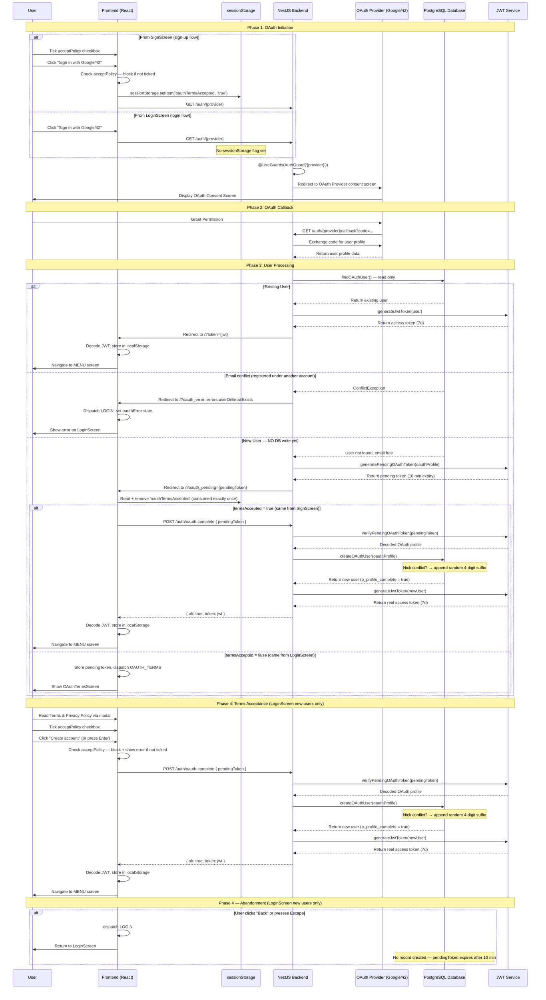
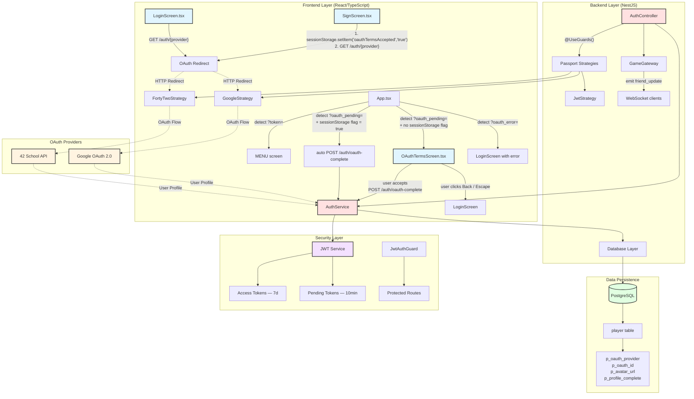

# OAuth 2.0 Remote Authentication

## Executive Summary

The OAuth 2.0 remote authentication system provides third-party authentication integration for the Transcendence platform. By implementing the industry-standard OAuth 2.0 authorization framework with Passport.js strategies, the system enables users to authenticate using their existing accounts from trusted providers including Google and 42 School Network.

The architecture decouples authentication concerns from the core application logic, leveraging NestJS guards and strategies for provider-specific implementations. **New OAuth users are required to accept the Terms of Service and Privacy Policy before their account is created**, ensuring GDPR compliance. Returning OAuth users bypass this step and are logged in directly. The system handles profile synchronization, JWT token generation, and secure session management across both traditional password-based and OAuth-based authentication flows.

---

## System Architecture Diagram

### OAuth Authentication Sequence



### OAuth System Architecture



---

## OAuth 2.0 Implementation Overview

### Supported OAuth Providers

1. **Google OAuth 2.0** — Enables authentication using Google accounts
2. **42 School Network** — Enables authentication for 42 School students and alumni

### Terms of Service Enforcement

**All users — both traditional and OAuth — must accept the Terms of Service and Privacy Policy before account creation.** The mechanism differs by registration path:

| Path | Where enforced | How |
|------|---------------|-----|
| Traditional registration (`SignScreen`) | Frontend | `acceptPolicy` checkbox must be ticked before `handleForm` proceeds |
| OAuth from sign-up screen (`SignScreen`) | Frontend + `sessionStorage` | `acceptPolicy` checkbox must be ticked; `sessionStorage.setItem('oauthTermsAccepted', 'true')` is set before the redirect; `App.tsx` reads and removes it on callback, then auto-completes registration without showing `OAuthTermsScreen` |
| OAuth from login screen (`LoginScreen`) | `OAuthTermsScreen` | No checkbox shown before redirect; `OAuthTermsScreen` is displayed after callback for new users; user must tick the checkbox there before account creation proceeds |

**GDPR note:** For OAuth new users, **no data is written to the database** until the user explicitly accepts the terms. The OAuth profile is transported in a short-lived pending JWT (10 minutes). If the user abandons the flow at `OAuthTermsScreen` (by clicking "Back" or pressing `Escape`), they are returned to `LoginScreen` and no record is ever created. If the pending token simply expires, the same applies — no cleanup is needed.

### How `sessionStorage` Bridges the OAuth Round-Trip

Passport.js manages its own `state` parameter for CSRF protection and does not forward arbitrary query parameters through the OAuth round-trip. To carry the terms acceptance flag across the provider redirect, `SignScreen` writes it to `sessionStorage` before navigating away:

```typescript
sessionStorage.setItem('oauthTermsAccepted', 'true');
window.location.href = `/auth/${provider}`;
```

`sessionStorage` is tab-scoped and survives the full redirect chain within the same browser tab. When `App.tsx` mounts after the callback, it reads and **immediately removes** the flag so it cannot affect any subsequent OAuth flow:

```typescript
const termsAccepted = sessionStorage.getItem('oauthTermsAccepted') === 'true';
sessionStorage.removeItem('oauthTermsAccepted');
```

`LoginScreen` never sets this flag, so its OAuth flow always lands in the `OAuthTermsScreen` branch.

### Database Schema for OAuth

The `player` table includes OAuth-specific fields and constraints:

**Drizzle ORM Schema Definition (`backend/src/schema.ts`):**

```typescript
export const player = pgTable("player", {
  pPk: integer("p_pk").primaryKey().generatedAlwaysAsIdentity(),
  pNick: varchar("p_nick", { length: 255 }).notNull(),
  pMail: text("p_mail").notNull(),
  pPass: text("p_pass"),  // NULL for OAuth users

  // 2FA Fields
  pTotpSecret: bytea("p_totp_secret"),
  pTotpEnabled: boolean("p_totp_enabled").default(false),
  pTotpEnabledAt: timestamp("p_totp_enabled_at", { mode: 'string' }),
  pTotpBackupCodes: text("p_totp_backup_codes").array(),

  // OAuth Fields
  pOauthProvider: varchar("p_oauth_provider", { length: 20 }),  // 'google' or '42'
  pOauthId: varchar("p_oauth_id", { length: 255 }),             // Provider's user ID
  pAvatarUrl: varchar("p_avatar_url", { length: 500 }),         // Profile picture URL
  pProfileComplete: boolean("p_profile_complete").default(false),

  // User Information
  pReg: timestamp("p_reg", { mode: 'string' }).default(sql`CURRENT_TIMESTAMP`),
  pBir: date("p_bir"),
  pLang: char("p_lang", { length: 2 }),
  pCountry: char("p_country", { length: 2 }),
  pRole: smallint("p_role").default(1),
  pStatus: smallint("p_status").default(1),
}, (table) => [
  foreignKey({ columns: [table.pLang],    foreignColumns: [pLanguage.langPk], name: "player_p_lang_fkey" }),
  foreignKey({ columns: [table.pCountry], foreignColumns: [country.coun2Pk],  name: "player_p_country_fkey" }),
  foreignKey({ columns: [table.pRole],    foreignColumns: [pRole.rolePk],     name: "player_p_role_fkey" }),
  foreignKey({ columns: [table.pStatus],  foreignColumns: [status.statusPk],  name: "player_p_status_fkey" }),
  unique("player_p_nick_key").on(table.pNick),
  unique("player_p_mail_key").on(table.pMail),
  unique("unique_oauth_user").on(table.pOauthProvider, table.pOauthId),
]);

// Alias used by 2FA methods
export const users = player;
```

**OAuth-Specific Fields:**

| Field | Type | Description |
|-------|------|-------------|
| `p_oauth_provider` | VARCHAR(20) | OAuth provider name: `'google'` or `'42'` |
| `p_oauth_id` | VARCHAR(255) | Provider's unique user identifier |
| `p_avatar_url` | VARCHAR(500) | Profile picture URL from OAuth provider |
| `p_profile_complete` | BOOLEAN | `true` for all accounts created after terms acceptance |
| `p_pass` | TEXT | Password hash — `NULL` for OAuth-only users |

**Important note on `p_profile_complete`:** All new OAuth accounts are created with `p_profile_complete = true` because terms acceptance is mandatory before `createOAuthUser` is ever called. The flag reliably indicates that the user has consented.

**Unique Constraint:**
```sql
CONSTRAINT unique_oauth_user UNIQUE(p_oauth_provider, p_oauth_id)
```
PostgreSQL treats NULL as non-equal, so multiple traditional users can have `(NULL, NULL)` without conflict.

**Example data:**

| p_pk | p_nick | p_oauth_provider | p_oauth_id | p_pass | p_profile_complete |
|------|--------|-----------------|------------|--------|--------------------|
| 1 | john_doe | NULL | NULL | $2a$10$hash... | TRUE |
| 2 | Jane_Smith | google | 1234567890 | NULL | TRUE |
| 3 | user42 | 42 | 98765 | NULL | TRUE |

---

## Frontend Implementation

### SignScreen.tsx — OAuth Registration Flow

The sign-up screen provides OAuth authentication alongside the terms checkbox. The `acceptPolicy` state guards both the traditional form submission and the OAuth redirect.

```typescript
const handleOAuth = (provider: 'google' | '42') => {
    if (!acceptPolicy) {
        setError(t('errors.mustAcceptTerms'));
        return;
    }
    // Persist the acceptance flag across the OAuth round-trip.
    // sessionStorage survives the provider redirect (same tab) and is
    // consumed exactly once by App.tsx on callback landing.
    sessionStorage.setItem('oauthTermsAccepted', 'true');
    window.location.href = `/auth/${provider}`;
};
```

The terms checkbox renders with clickable links that open `TermsModal`:

```tsx
<div className="login-btn">
    <input type="checkbox" id="acceptPolicy"
        checked={acceptPolicy}
        onChange={(e) => setAcceptPolicy(e.target.checked)} />
    <label htmlFor="acceptPolicy">
        {t('privacy.prefix')}{' '}
        <a href="#" onClick={(e) => { e.preventDefault(); setShowTermsModal(true); }}>
            <u>{t('info.terms_of_service')}</u>
        </a>
        {' '}{t('privacy.and')}{' '}
        <a href="#" onClick={(e) => { e.preventDefault(); setShowPrivacyModal(true); }}>
            <u>{t('info.privacy_policy')}</u>
        </a>
        {t('privacy.dot')}
    </label>
</div>
```

### LoginScreen.tsx — OAuth Login Flow

The login screen handles returning OAuth users (no terms required) as well as traditional and 2FA login. OAuth buttons are only shown outside of 2FA verification mode. No terms checkbox is shown — if a new user authenticates via OAuth here, `OAuthTermsScreen` is shown automatically after the callback.

```typescript
const handleOAuth = (provider: 'google' | '42') => {
    window.location.href = `/auth/${provider}`;
};
```

If the email returned by the OAuth provider is already registered under a different account, the backend redirects to `/?oauth_error=` and `LoginScreen` displays the error inline via the `oauthError` prop passed from `App.tsx`:

```typescript
type LoginScreenProps = ScreenProps & {
    setGlobalUser: (user: string) => void;
    oauthError?: string;
    clearOAuthError?: () => void;
};

useEffect(() => {
    if (oauthError) {
        setError(t(oauthError));
        clearOAuthError?.();
    }
}, [oauthError, t, clearOAuthError]);
```

### OAuthTermsScreen.tsx — Terms Acceptance for New OAuth Users

This screen is shown exclusively to new OAuth users arriving from `LoginScreen`. It carries the OAuth profile in the pending token passed as a prop and does not create any database record until the user explicitly accepts.

```typescript
const handleAccept = async () => {
    if (!acceptPolicy) {
        setError(t('errors.mustAcceptTerms'));
        return;
    }
    setIsLoading(true);
    try {
        const response = await fetch('/auth/oauth-complete', {
            method: 'POST',
            headers: { 'Content-Type': 'application/json' },
            body: JSON.stringify({ pendingToken }),
        });
        const result = await response.json();
        if (!result.ok) {
            setError(t(result.msg) || t('errors.unknownError'));
            return;
        }
        const token = result.token;
        const payload = JSON.parse(atob(token.split('.')[1]));
        localStorage.setItem('pong_user_nick', payload.nick);
        localStorage.setItem('pong_user_id', String(payload.sub));
        localStorage.setItem('pong_token', token);
        setGlobalUser(payload.nick);
        dispatch({ type: 'MENU' });
    } catch {
        setError(t('errors.connectionError'));
    } finally {
        setIsLoading(false);
    }
};

const handleCancel = () => {
    // User declined or navigated away — no account was created.
    // The pending token will expire naturally after 10 minutes.
    dispatch({ type: 'LOGIN' });
};
```

**Keyboard shortcuts:**
- `Enter` → equivalent to clicking "Create account"
- `Escape` → equivalent to clicking "Back" — dispatches `LOGIN`, returns to `LoginScreen`, no account created
- Both shortcuts are suppressed while a Terms or Privacy modal is open

**If the user abandons the flow** (clicks "Back", presses `Escape`, or closes the tab), no database record is created. The pending token expires after 10 minutes and leaves no trace.

### TermsModal.tsx — Reusable Document Viewer

A reusable modal component used in both `SignScreen` and `OAuthTermsScreen` to display the Terms of Service and Privacy Policy. Loads HTML content using the `loadHtmlContent` utility, which resolves the correct language file from `src/local/<lang>/`.

```typescript
const html = await loadHtmlContent(fileName, i18n.language);
// fileName: "terms" | "privacy"
// Resolves to: src/local/<lang>/terms.html or src/local/<lang>/privacy.html
// Falls back to English if the language file is absent
```

**Key features:**
- Lazy loading (only fetches on open, not on mount)
- Closes on `Escape` key or backdrop click
- Automatically reloads if the UI language changes while open

### auth.ts — Frontend Utility Functions

| Function | Parameters | Returns | Description |
|----------|-----------|---------|-------------|
| `checkForm` | user, email, password, repeat, birth, options? | `{ok, msg}` | Client-side form validation. `options.requirePassword` defaults to `true`; pass `false` to skip password checks |
| `registUser` | username, password, email, birth, country, language, enabled2FA | `{ok, msg, qrCode?, backupCodes?}` | Registers new user via `POST /auth/register` |
| `checkLogin` | username, password | `{ok, msg, user?, token?}` | Authenticates user via `POST /auth/login` |
| `send2FACode` | userId, totpCode | `{ok, msg, token?}` | Verifies 2FA code — routes to `POST /auth/verify-totp` if 6 digits, `POST /auth/verify-backup` otherwise |

### App.tsx — OAuth Callback Handler

The main App component handles all OAuth token processing centrally on mount (runs once).

**Token detection:**

```typescript
useEffect(() => {
    const params = new URLSearchParams(window.location.search);

    // Returning user — real JWT in URL
    const token = params.get('token');
    if (token) {
        const base64Url = token.split('.')[1];
        const base64 = base64Url.replace(/-/g, '+').replace(/_/g, '/');
        const jsonPayload = decodeURIComponent(
            window.atob(base64).split('')
                .map(c => '%' + ('00' + c.charCodeAt(0).toString(16)).slice(-2))
                .join('')
        );
        const payload = JSON.parse(jsonPayload);
        localStorage.setItem("pong_token", token);
        localStorage.setItem("pong_user_nick", payload.nick);
        localStorage.setItem("pong_user_id", payload.sub.toString());
        setCurrentUser(payload.nick);
        setCurrentUserId(Number(payload.sub));
        window.history.replaceState({}, document.title, window.location.pathname);
        dispatch({ type: "MENU" });
    }

    // New user — branch on sessionStorage flag set by SignScreen
    const pendingToken = params.get('oauth_pending');
    if (pendingToken) {
        window.history.replaceState({}, document.title, window.location.pathname);

        // Read and immediately consume — prevents affecting any future OAuth flow
        const termsAccepted = sessionStorage.getItem('oauthTermsAccepted') === 'true';
        sessionStorage.removeItem('oauthTermsAccepted');

        if (termsAccepted) {
            // SignScreen path — complete registration without showing OAuthTermsScreen
            fetch('/auth/oauth-complete', {
                method: 'POST',
                headers: { 'Content-Type': 'application/json' },
                body: JSON.stringify({ pendingToken }),
            })
                .then(r => r.json())
                .then(result => {
                    if (result.ok) {
                        const jwt = result.token;
                        const payload = JSON.parse(atob(jwt.split('.')[1]));
                        localStorage.setItem('pong_user_nick', payload.nick);
                        localStorage.setItem('pong_user_id', String(payload.sub));
                        localStorage.setItem('pong_token', jwt);
                        setCurrentUser(payload.nick);
                        setCurrentUserId(Number(payload.sub));
                        dispatch({ type: 'MENU' });
                    } else {
                        dispatch({ type: 'LOGIN' });
                    }
                })
                .catch(() => dispatch({ type: 'LOGIN' }));
        } else {
            // LoginScreen path — show OAuthTermsScreen first
            setPendingOAuthToken(pendingToken);
            dispatch({ type: "OAUTH_TERMS" });
        }
    }

    // Email conflict or other OAuth error
    const oauthError = params.get('oauth_error');
    if (oauthError) {
        window.history.replaceState({}, document.title, window.location.pathname);
        setOAuthError(decodeURIComponent(oauthError));
        dispatch({ type: "LOGIN" });
    }
}, []);
```

**State variables related to OAuth:**
- `pendingOAuthToken` — holds the pending JWT; passed as prop to `OAuthTermsScreen`
- `oauthError` — holds the forwarded error i18n key; passed as prop to `LoginScreen`

**Profile synchronization** (runs whenever `currentUser` becomes truthy):

```typescript
useEffect(() => {
    if (!currentUser) return;
    const syncProfile = async () => {
        try {
            const profile = await getMyProfile();
            if (profile) {
                setCurrentUserId(profile.id);
                setCurrentUserAvatarUrl(profile.avatarUrl ?? null);
                localStorage.setItem("pong_user_id", String(profile.id));
            }
        } catch (err) {
            console.warn("⚠️ [App] Could not sync profile on login:", err);
        } finally {
            setProfileSynced(true);
        }
    };
    syncProfile();
}, [currentUser]);
```

The avatar URL is never stored in the JWT or `localStorage`. This `useEffect` is the single source of truth for it, fetching from `GET /auth/profile` after every login.

### screenReducer.ts

```typescript
export function screenReducer(state: Screen, action: Action): Screen {
  switch (action.type) {
    case "MENU":        return "menu";
    case "LOGIN":       return "login";
    case "SIGN":        return "sign";
    case "PROFILE":     return "profile";
    case "STATS":       return "stats";
    case "PONG":        return "pong";
    case "LOGOUT":      return "login";
    case "INFO":        return "info";
    case "OAUTH_TERMS": return "oauth_terms";
    default:            return state;
  }
}
```

`types.ts` includes `"oauth_terms"` in the `Screen` union and `{ type: "OAUTH_TERMS" }` in the `Action` union.

---

## Data Transfer Objects (DTOs)

### RegisterUserDto (`backend/src/dto/register-user.dto.ts`)

Validates traditional user registration requests. Located in the top-level `src/dto/` directory.

```typescript
export class RegisterUserDto {
  @IsString() @IsNotEmpty() @MaxLength(20)
  user: string;

  @IsEmail() @IsNotEmpty()
  email: string;

  @IsString() @IsNotEmpty() @MinLength(8)
  password: string;
}
```

OAuth registration bypasses this DTO entirely — users are created server-side via `createOAuthUser()`.

### CompleteProfileDto (`backend/src/auth/dto/complete-profile.dto.ts`)

```typescript
export class CompleteProfileDto {
  @IsString() @Length(2, 2)
  country: string;   // 2-letter ISO country code

  @IsString() @Length(2, 2)
  language: string;  // 2-letter ISO language code
}
```

### AuthResponseDto / OAuthCallbackDto (`backend/src/auth/dto/auth-response.dto.ts`)

Type definitions for auth responses, used for typing rather than request validation.

```typescript
export class AuthResponseDto {
  accessToken: string;
  user: { id: number; nick: string; email: string; avatarUrl?: string; profileComplete: boolean; };
}

export class OAuthCallbackDto {
  accessToken?: string;
  requiresProfileCompletion?: boolean;
  tempToken?: string;
  user?: { id: number; nick: string; email: string; avatarUrl?: string; };
}
```

---

## Backend Implementation

### AuthController — OAuth Endpoints

Both OAuth callbacks follow identical logic. `findOAuthUser` is called first and can produce three outcomes: return an existing user, return `null` (new user, email free), or throw a `ConflictException` (email belongs to another account). The controller handles all three:

```typescript
@Get('google/callback')
@UseGuards(AuthGuard('google'))
async googleAuthRedirect(@Req() req, @Res() res: Response) {
    const frontendUrl = this.configService.get<string>('VITE_FRONTEND_URL')
                     || 'https://localhost:8443';
    try {
        const existing = await this.authService.findOAuthUser(req.user);
        if (existing) {
            // Returning user — issue real JWT immediately
            const { accessToken } = this.authService.generateJwtToken(existing);
            return res.redirect(`${frontendUrl}/?token=${accessToken}`);
        }
        // New user — issue pending token, no DB write yet
        const pendingToken = this.authService.generatePendingOAuthToken(req.user);
        res.redirect(`${frontendUrl}/?oauth_pending=${pendingToken}`);
    } catch (e: any) {
        // ConflictException: email already registered under a different account
        const msg = encodeURIComponent(
            e?.status === 409 ? 'errors.userOrEmailExists' : 'errors.unknownError'
        );
        res.redirect(`${frontendUrl}/?oauth_error=${msg}`);
    }
}
```

The 42 School callback is identical in structure.

**`POST /auth/oauth-complete` — Terms acceptance endpoint:**

Called from two places: `App.tsx` directly (SignScreen path) and `OAuthTermsScreen` (LoginScreen path). In both cases it verifies the pending token and, if valid, creates the user.

```typescript
@Post('oauth-complete')
async oauthComplete(@Body() body: { pendingToken: string }) {
    const oauthData = this.authService.verifyPendingOAuthToken(body.pendingToken);
    if (!oauthData) {
        return { ok: false, msg: 'errors.invalidOrExpiredToken' };
    }
    try {
        const newUser = await this.authService.createOAuthUser(oauthData);
        const { accessToken } = this.authService.generateJwtToken(newUser);
        return { ok: true, token: accessToken };
    } catch (e: any) {
        if (e?.status === 409) return { ok: false, msg: 'errors.userOrEmailExists' };
        return { ok: false, msg: 'errors.unknownError' };
    }
}
```

**Profile update side effect:**

When `PUT /auth/profile` succeeds, the controller emits a `friend_update` WebSocket event via `GameGateway` so all connected clients reflect the change immediately:

```typescript
this.gameGateway.server.emit('friend_update', {
    id: userId,
    name: result.user.nick,
    avatar: result.user.avatarUrl,
    status: 'online'
});
```

### AuthService — OAuth User Management

**`findOAuthUser`** — read-only lookup. Returns the existing user, `null` for a genuinely new identity, or throws `ConflictException` if the email is already registered under a different account:

```typescript
async findOAuthUser(oauthData: { oauthId: string; oauthProvider: string; email: string; }) {
    // 1. Check by OAuth identity (returning user)
    const existingUser = await this.db.select().from(player)
        .where(and(
            eq(player.pOauthProvider, oauthData.oauthProvider),
            eq(player.pOauthId, oauthData.oauthId),
        )).limit(1);
    if (existingUser.length > 0) return existingUser[0];

    // 2. New OAuth identity — check for email conflict before issuing pending token
    const emailExists = await this.db.select().from(player)
        .where(eq(player.pMail, oauthData.email)).limit(1);
    if (emailExists.length > 0) {
        throw new ConflictException('Email already registered in other account');
    }

    return null;
}
```

**`createOAuthUser`** — called only after terms acceptance. Handles nick conflicts by appending a random 4-digit suffix if the nick derived from the OAuth profile is already taken:

```typescript
async createOAuthUser(oauthData: {
    oauthId: string; oauthProvider: string; email: string; nick: string;
    avatarUrl?: string; lang?: string; country?: string;
}) {
    // Guard against race-condition email conflict
    const emailExists = await this.db.select().from(player)
        .where(eq(player.pMail, oauthData.email)).limit(1);
    if (emailExists.length > 0) throw new ConflictException('Email already registered');

    // Nick conflict resolution — append random 4-digit suffix if taken
    let finalNick = oauthData.nick;
    const nickExists = await this.db.select().from(player)
        .where(eq(player.pNick, oauthData.nick)).limit(1);
    if (nickExists.length > 0) {
        finalNick = `${oauthData.nick}_${Math.floor(Math.random() * 10000)}`;
    }

    const newUser = await this.db.insert(player).values({
        pNick: finalNick,
        pMail: oauthData.email,
        pTotpSecret: null,
        pTotpEnabled: false,
        pTotpEnabledAt: null,
        pTotpBackupCodes: [],
        pOauthProvider: oauthData.oauthProvider,
        pOauthId: oauthData.oauthId,
        pAvatarUrl: oauthData.avatarUrl,
        pLang: oauthData.lang || 'ca',
        pCountry: oauthData.country || 'FR',
        pProfileComplete: true,  // Terms accepted before this call
        pReg: now,
        pRole: 1,
        pStatus: 1,
    }).returning();
    return newUser[0];
}
```

**Nick conflict example:** If Google returns `displayName = "John Smith"` and `john_smith` already exists in the database, the new user is registered as e.g. `john_smith_4271`. The suffix is a random integer in the range 0–9999.

**`findOrCreateOAuthUser`** — thin backwards-compatibility wrapper:

```typescript
async findOrCreateOAuthUser(oauthData) {
    const existing = await this.findOAuthUser(oauthData);
    if (existing) return existing;
    return this.createOAuthUser(oauthData);
}
```

**Pending token methods:**

```typescript
// Encodes the OAuth profile in a short-lived JWT (10 min) — no DB write
generatePendingOAuthToken(oauthData: { oauthId, oauthProvider, email, nick, avatarUrl?, lang?, country? }) {
    return this.jwtService.sign(
        { oauth_pending: true, ...oauthData },
        { expiresIn: '10m' }
    );
}

// Verifies and decodes; returns null if invalid, expired, or not a pending token
verifyPendingOAuthToken(token: string) {
    try {
        const payload = this.jwtService.verify(token) as any;
        if (!payload.oauth_pending) return null;
        return { oauthId, oauthProvider, email, nick, avatarUrl, lang, country };
    } catch {
        return null;
    }
}
```

**JWT token generation:**

```typescript
generateJwtToken(user: any) {
    const payload: JwtPayload = { sub: user.pPk, email: user.pMail, nick: user.pNick };
    return { accessToken: this.jwtService.sign(payload) };  // 7-day expiry
}
```

### AuthModule — OAuth Configuration

```typescript
@Module({
  imports: [
    PassportModule.register({ defaultStrategy: 'jwt' }),
    ConfigModule,
    DatabaseModule,
    JwtModule.registerAsync({
      imports: [ConfigModule],
      inject: [ConfigService],
      useFactory: async (configService: ConfigService) => ({
        secret: configService.get<string>('JWT_SECRET'),
        signOptions: { expiresIn: '7d' },
      }),
    }),
    HttpModule.register({ timeout: 5000, maxRedirects: 5 }),
  ],
  controllers: [AuthController],
  providers: [AuthService, JwtStrategy, JwtAuthGuard, GoogleStrategy, FortyTwoStrategy],
  exports: [AuthService, JwtAuthGuard, JwtStrategy],
})
export class AuthModule {}
```

**Required Environment Variables:**

```bash
JWT_SECRET=your-super-secret-jwt-key-change-this-in-production-min-32-chars
JWT_EXPIRATION=7d
BE_CONTAINER_PORT=3000

OAUTH_42_CLIENT_ID=u-s4t2ud-your-42-client-id-here
OAUTH_42_CLIENT_SECRET=s-s4t2ud-your-42-client-secret-here
OAUTH_42_CALLBACK_URL=https://yourdomain.com/auth/42/callback

OAUTH_GOOGLE_CLIENT_ID=123456789-xxx.apps.googleusercontent.com
OAUTH_GOOGLE_CLIENT_SECRET=GOCSPX-your-google-client-secret
OAUTH_GOOGLE_CALLBACK_URL=https://yourdomain.com/auth/google/callback

VITE_FRONTEND_URL=https://yourdomain.com
TOTP_SERVICE_URL=http://totp:8070
```

---

## OAuth Strategy Implementation

### GoogleStrategy

```typescript
@Injectable()
export class GoogleStrategy extends PassportStrategy(Strategy, 'google') {
  constructor(private configService: ConfigService, private authService: AuthService) {
    super({
      clientID: configService.get<string>('OAUTH_GOOGLE_CLIENT_ID') || '',
      clientSecret: configService.get<string>('OAUTH_GOOGLE_CLIENT_SECRET') || '',
      callbackURL: configService.get<string>('OAUTH_GOOGLE_CALLBACK_URL') || '',
      scope: ['email', 'profile'],
    });
  }

  async validate(accessToken, refreshToken, profile: Profile, done: VerifyCallback) {
    const { id, displayName, emails, photos, _json } = profile;
    let lang = 'ca', country = 'FR';
    if (_json.locale) {
      const parts = _json.locale.split('-');           // "en-US" → ["en", "US"]
      if (parts.length > 0) lang = parts[0];
      if (parts.length > 1) country = parts[1].toUpperCase();
    }
    const photoUrl = photos?.[0]?.value;
    done(null, {
      oauthId: id,
      oauthProvider: 'google',
      email: emails?.[0]?.value,
      nick: displayName.replace(/\s+/g, '_').substring(0, 20),
      avatarUrl: photoUrl?.split('=')?.[0] ?? photoUrl,  // strip size params for full resolution
      lang,
      country,
    });
  }
}
```

**Key features:** Locale parsing (`"en-US"` → `lang="en"`, `country="US"`); avatar URL parameter removal for full resolution; nickname sanitization (spaces → underscores, truncated to 20 chars).

### FortyTwoStrategy

```typescript
@Injectable()
export class FortyTwoStrategy extends PassportStrategy(Strategy, '42') {
  // Uses require() to avoid TypeScript import incompatibility with passport-42
  constructor(private configService: ConfigService, private authService: AuthService) {
    super({
      clientID: configService.get<string>('OAUTH_42_CLIENT_ID'),
      clientSecret: configService.get<string>('OAUTH_42_CLIENT_SECRET'),
      callbackURL: configService.get<string>('OAUTH_42_CALLBACK_URL'),
      scope: ['public'],
      authorizationURL: 'https://api.intra.42.fr/oauth/authorize',
      tokenURL: 'https://api.intra.42.fr/oauth/token',
    });
  }

  async validate(accessToken, refreshToken, profile: any) {
    const { id, username, emails } = profile;
    const avatarUrl = profile._json?.image?.versions?.medium
                   || profile._json?.image?.link
                   || null;
    const lang = profile._json?.campus?.[0]?.language?.identifier || 'ca';
    const campusCountry = profile._json?.campus?.[0]?.country || null;
    const countryCode = await this.authService.getCountryCode(campusCountry);
    return {
      oauthId: id,
      oauthProvider: '42',
      email: emails?.[0]?.value || `${username}@student.42.fr`,
      nick: username,
      avatarUrl,
      lang,
      country: countryCode,
    };
  }
}
```

**Key features:** Campus data extraction for language and country (`getCountryCode` performs a case-insensitive DB lookup, defaults to `'FR'`); multi-source avatar resolution (medium version → link → null); `@student.42.fr` email fallback.

### JwtStrategy

```typescript
@Injectable()
export class JwtStrategy extends PassportStrategy(Strategy) {
  constructor(private configService: ConfigService) {
    super({
      jwtFromRequest: ExtractJwt.fromAuthHeaderAsBearerToken(),
      ignoreExpiration: false,
      secretOrKey: configService.get<string>('JWT_SECRET') || 'fallback-secret-key',
    });
  }

  async validate(payload: JwtPayload) {
    return { sub: payload.sub, email: payload.email, nick: payload.nick };
  }
}
```

### JwtAuthGuard

```typescript
@Injectable()
export class JwtAuthGuard extends AuthGuard('jwt') {}
```

---

## API Endpoints Reference

| Method | Endpoint | Guards | Description |
|--------|----------|--------|-------------|
| POST | `/auth/login` | None | Traditional username/password login |
| POST | `/auth/register` | None | Traditional user registration |
| POST | `/auth/verify-totp` | None | Verify 2FA TOTP code (6 digits) |
| POST | `/auth/verify-backup` | None | Verify 2FA backup code (8 chars) |
| GET | `/auth/google` | AuthGuard('google') | Initiate Google OAuth flow |
| GET | `/auth/google/callback` | AuthGuard('google') | Google OAuth callback — redirects to `/?token=`, `/?oauth_pending=`, or `/?oauth_error=` |
| GET | `/auth/42` | AuthGuard('42') | Initiate 42 School OAuth flow |
| GET | `/auth/42/callback` | AuthGuard('42') | 42 School OAuth callback — redirects to `/?token=`, `/?oauth_pending=`, or `/?oauth_error=` |
| POST | `/auth/oauth-complete` | None | Complete new OAuth registration after terms acceptance |
| GET | `/auth/profile` | JwtAuthGuard | Get current user profile |
| PUT | `/auth/profile` | JwtAuthGuard | Update user profile (also emits `friend_update` via WebSocket) |
| DELETE | `/auth/profile` | JwtAuthGuard | Anonymize (soft-delete) user account |
| GET | `/auth/countries` | None | Get list of all countries (proxied by Nginx from frontend `/countries`) |

---

## CORS Configuration

```typescript
app.enableCors({
    origin: true,  // Reflects request origin
    methods: 'GET,HEAD,PUT,PATCH,POST,DELETE,OPTIONS',
    credentials: true,
    allowedHeaders: 'Content-Type, Accept, Authorization',
    preflightContinue: false,
    optionsSuccessStatus: 204,
});
await app.listen(port, '0.0.0.0');  // CRITICAL for Docker
```

The backend port is read from `BE_CONTAINER_PORT` (defaults to `3000`).

---

## Security Considerations

1. **Terms acceptance before data storage** — No personal data from OAuth providers is written to the database until the user explicitly consents. The pending JWT carries the profile in memory only for up to 10 minutes.

2. **Pending token expiry** — Pending OAuth tokens expire after 10 minutes. An abandoned flow leaves no database record and requires no cleanup.

3. **Pending token claim guard** — Pending tokens carry an `oauth_pending: true` claim and are signed with the same `JWT_SECRET` as regular tokens. `verifyPendingOAuthToken` rejects any token missing this claim, preventing a regular access token from being submitted to `/auth/oauth-complete`.

4. **Email conflict detection** — `findOAuthUser` throws `ConflictException` (HTTP 409) when the OAuth provider's email is already registered under a different account. The controller catches this and redirects to `/?oauth_error=errors.userOrEmailExists`.

5. **sessionStorage safety** — The `oauthTermsAccepted` flag is written to `sessionStorage` by `SignScreen` and removed by `App.tsx` immediately after reading. It is tab-scoped and cannot leak across tabs or persist beyond the session.

6. **State parameter (CSRF)** — Managed automatically by Passport for all OAuth flows.

7. **Password handling for OAuth users** — OAuth users have `p_pass = NULL`. Traditional login returns `errors.useOAuthProvider`. Password changes are blocked in profile updates for OAuth accounts.

8. **HTTPS in production** — All callback URLs must use HTTPS. HTTP is acceptable only for localhost development.

9. **JWT token payload:**
    ```json
    {
      "sub": 123,
      "nick": "username",
      "email": "user@example.com",
      "iat": 1234567890,
      "exp": 1235172690
    }
    ```

10. **LocalStorage persistence** — Tokens stored in `localStorage` persist across sessions. Always validate server-side with `JwtAuthGuard`. Cleared on explicit logout.

---

## OAuth Flow Detailed Steps

### New OAuth User — via SignScreen

1. User ticks the `acceptPolicy` checkbox and clicks Google/42 button
2. `SignScreen` sets `sessionStorage.setItem('oauthTermsAccepted', 'true')` and redirects to `/auth/{provider}`
3. Passport redirects to the provider consent screen
4. User grants permission → provider redirects to `/auth/{provider}/callback`
5. `GoogleStrategy` / `FortyTwoStrategy` validates and returns the profile object
6. `AuthController` calls `findOAuthUser()`:
   - Email conflict → `ConflictException` → redirects to `/?oauth_error=errors.userOrEmailExists`; `App.tsx` dispatches `LOGIN` and displays the error on `LoginScreen`
7. User not found, email free → `generatePendingOAuthToken()` creates a 10-minute JWT
8. Backend redirects to `/?oauth_pending={pendingToken}`
9. `App.tsx` mounts, reads `sessionStorage.getItem('oauthTermsAccepted')` → `'true'`, removes the flag immediately
10. `App.tsx` calls `POST /auth/oauth-complete` directly — `OAuthTermsScreen` is never shown
11. Backend verifies token, calls `createOAuthUser()`:
    - If the nick derived from the provider profile is already taken, a random 4-digit suffix is appended (e.g. `john_smith` → `john_smith_4271`)
12. Backend returns real JWT; `App.tsx` stores it in `localStorage` and navigates to `MENU`

### New OAuth User — via LoginScreen

1. User clicks Google/42 button on `LoginScreen` (no terms checkbox, no `sessionStorage` flag set)
2. Frontend redirects to `/auth/{provider}`
3–8. (Same as steps 3–8 above)
9. `App.tsx` mounts, reads `sessionStorage.getItem('oauthTermsAccepted')` → `null`, removes (no-op)
10. `App.tsx` stores `pendingToken` in state, dispatches `OAUTH_TERMS`
11. `OAuthTermsScreen` is rendered with the pending token
12. User reads Terms of Service and Privacy Policy (via modal links), ticks the `acceptPolicy` checkbox
13. User clicks "Create account" or presses `Enter`
14. `OAuthTermsScreen` calls `POST /auth/oauth-complete` with the pending token
15. Backend verifies token, calls `createOAuthUser()` (with nick conflict resolution as above)
16. Frontend stores real JWT in `localStorage`, navigates to `MENU`

**If the user abandons at step 11–13** (clicks "Back", presses `Escape`, or closes the tab):
- `handleCancel` dispatches `LOGIN` → user is returned to `LoginScreen`
- No database record is created
- The pending token expires silently after 10 minutes

### Returning OAuth User

1. User clicks OAuth button (either screen)
2–5. (Same as above)
6. `AuthController` calls `findOAuthUser()` → existing user found
7. `generateJwtToken()` creates a real 7-day JWT
8. Backend redirects to `/?token={jwt}`
9. `App.tsx` decodes and stores token in `localStorage`, navigates to `MENU`

---

## Error Handling

| Error Scenario | Response | Where displayed |
|---------------|----------|-----------------|
| Terms checkbox not ticked (`SignScreen` OAuth) | Frontend blocks redirect | Inline error on `SignScreen` |
| Terms checkbox not ticked (`OAuthTermsScreen`) | Frontend blocks submit | Inline error on `OAuthTermsScreen` |
| Pending token expired (>10 min) | `{ ok: false, msg: 'errors.invalidOrExpiredToken' }` | Inline error on `OAuthTermsScreen` |
| Email conflict on `findOAuthUser` | `ConflictException` → `/?oauth_error=errors.userOrEmailExists` | Inline error on `LoginScreen` |
| Email conflict on `createOAuthUser` | `{ ok: false, msg: 'errors.userOrEmailExists' }` | Inline error on `OAuthTermsScreen` |
| OAuth-only user attempts traditional login | `{ ok: false, msg: 'errors.useOAuthProvider' }` | Inline error on `LoginScreen` |
| Inactive account (`p_status = 0`) | `{ ok: false, msg: 'errors.inactiveAccount' }` | Inline error on `LoginScreen` |
| User abandons `OAuthTermsScreen` | `dispatch({ type: 'LOGIN' })` | Silently returns to `LoginScreen` — no record created |
| OAuth provider unavailable | Passport error | User sees connection error |
| User denies OAuth consent | Provider redirects with error | No user created, no redirect to app |

---

## Integration with Existing Features

### 2FA Compatibility

OAuth users are created with 2FA fully disabled (`p_totp_enabled = false`, `p_totp_secret = null`, `p_totp_backup_codes = []`). The `verifyTOTP` and `verifyBackupCode` methods use the `users` alias (= `player` table).

### Avatar System

OAuth profiles include avatar URLs stored in `p_avatar_url`. The avatar is not included in the JWT — `App.tsx` fetches it separately via `getMyProfile()` after every login. When a profile update changes the avatar, a `friend_update` WebSocket event is emitted to all connected clients via `GameGateway`.

### Countries Endpoint

`SignScreen` fetches the countries list from the relative URL `/countries`, which Nginx proxies to `GET /auth/countries` on the backend. The backend serves this via `AuthService.getCountries()` using the Drizzle ORM `country` table, ordered alphabetically by name.

### i18n — Translation Keys Required

The following keys must be present in all language files (`src/local/<lang>/translation_<lang>.json`):

```json
{
  "privacy": {
    "prefix": "I have read and agree to the",
    "and": "and",
    "dot": "."
  },
  "oauth_terms": {
    "title": "One last step",
    "subtitle": "Before we create your account, please read and accept our terms.",
    "confirm_btn": "Create account"
  },
  "errors": {
    "mustAcceptTerms": "You must accept the Terms of Use and Privacy Policy to register.",
    "invalidOrExpiredToken": "This link has expired. Please try signing in again.",
    "useOAuthProvider": "This account uses OAuth. Please sign in with your provider.",
    "userOrEmailExists": "This username or email is already registered.",
    "inactiveAccount": "This account is inactive."
  },
  "modal": {
    "loading": "Loading...",
    "cancel_btn": "close"
  }
}
```

---

## Testing OAuth Integration

### Development Testing Checklist

- [ ] Google OAuth credentials configured in `.env`
- [ ] 42 School OAuth credentials configured in `.env`
- [ ] Callback URLs match environment configuration
- [ ] `VITE_FRONTEND_URL` configured correctly
- [ ] Database migrations applied (all OAuth columns and FK tables present)
- [ ] JWT secret configured (minimum 32 characters)
- [ ] CORS enabled for frontend origin

### Manual Testing Flow

1. **New user via OAuth (from SignScreen):**
   - Leave terms checkbox unticked → click Google/42 → verify inline error, no redirect
   - Tick terms checkbox → click Google/42 → complete OAuth consent
   - Verify `OAuthTermsScreen` is **not** shown — user lands directly on `MENU`
   - Verify user created in database with `p_profile_complete = true`
   - Verify `sessionStorage` key `oauthTermsAccepted` is absent after landing

2. **New user via OAuth (from LoginScreen):**
   - Click Google/42 on `LoginScreen` → complete OAuth consent
   - Verify `OAuthTermsScreen` is shown
   - Leave checkbox unticked → click "Create account" → verify inline error
   - Tick checkbox → click "Create account" (or press `Enter`)
   - Verify user created in database and navigated to `MENU`

3. **Abandonment on OAuthTermsScreen:**
   - Initiate new OAuth flow from `LoginScreen`, reach `OAuthTermsScreen`
   - Click "Back" or press `Escape` → verify navigation to `LoginScreen`
   - Verify no user record was created in the database
   - Repeat the same OAuth flow → verify `OAuthTermsScreen` is shown again (new pending token)

4. **Returning OAuth user:**
   - Authenticate with the same provider again (either screen)
   - Verify `OAuthTermsScreen` is not shown, navigation goes directly to `MENU`

5. **Pending token expiry:**
   - Initiate new OAuth flow from `LoginScreen`, wait >10 minutes on `OAuthTermsScreen`
   - Tick checkbox → click "Create account" → verify expired token error is shown

6. **Email conflict:**
   - Register a user traditionally with `test@example.com`
   - Attempt OAuth with a provider account using `test@example.com`
   - Verify `/?oauth_error=errors.userOrEmailExists` redirect and inline error on `LoginScreen`

7. **Nick conflict:**
   - Ensure a user with nick `john_smith` exists in the database
   - Authenticate via Google with a display name that normalises to `john_smith`
   - Verify the OAuth user is created with a suffixed nick such as `john_smith_4271`

8. **Traditional registration:**
   - Leave terms checkbox unticked → submit → verify inline error
   - Tick terms → complete form → verify normal registration flow

---

## Dependencies

### Backend

```json
{
  "@nestjs/passport": "^11.0.0",
  "@nestjs/jwt": "^11.0.0",
  "passport": "^0.7.0",
  "passport-google-oauth20": "^2.0.0",
  "passport-42": "^1.2.6",
  "bcryptjs": "^3.0.3"
}
```

### Frontend

```json
{
  "react": "^18.3.1",
  "i18next": "^23.x",
  "react-i18next": "^13.x",
  "qrcode.react": "^3.x"
}
```

---

## Configuration Files

### docker-compose.yml (OAuth Environment)

```yaml
services:
  backend:
    environment:
      DATABASE_URL: ${DATABASE_URL}
      JWT_SECRET: ${JWT_SECRET}
      JWT_EXPIRATION: ${JWT_EXPIRATION}
      BE_CONTAINER_PORT: ${BE_CONTAINER_PORT}
      OAUTH_42_CLIENT_ID: ${OAUTH_42_CLIENT_ID}
      OAUTH_42_CLIENT_SECRET: ${OAUTH_42_CLIENT_SECRET}
      OAUTH_42_CALLBACK_URL: ${OAUTH_42_CALLBACK_URL}
      OAUTH_GOOGLE_CLIENT_ID: ${OAUTH_GOOGLE_CLIENT_ID}
      OAUTH_GOOGLE_CLIENT_SECRET: ${OAUTH_GOOGLE_CLIENT_SECRET}
      OAUTH_GOOGLE_CALLBACK_URL: ${OAUTH_GOOGLE_CALLBACK_URL}
      VITE_FRONTEND_URL: ${VITE_FRONTEND_URL}
      TOTP_SERVICE_URL: http://totp:8070
```

---

## File Structure Reference

```
transcendence/
├── frontend/
│   └── src/
│       ├── screens/
│       │   ├── SignScreen.tsx          # Traditional + OAuth signup (terms checkbox guards both)
│       │   ├── LoginScreen.tsx         # Login (OAuth buttons, 2FA support, oauthError prop)
│       │   ├── OAuthTermsScreen.tsx    # Terms acceptance — LoginScreen OAuth path only
│       │   └── ProfileScreen.tsx       # Profile editing
│       ├── components/
│       │   └── TermsModal.tsx          # Reusable Terms/Privacy modal viewer
│       ├── ts/
│       │   ├── utils/
│       │   │   ├── auth.ts             # checkForm, registUser, checkLogin, send2FACode
│       │   │   └── loadHtmlContent.ts  # Loads HTML docs by language (used by TermsModal)
│       │   └── screenConf/
│       │       └── screenReducer.ts    # Screen state machine (includes OAUTH_TERMS)
│       ├── local/
│       │   └── <lang>/
│       │       ├── terms.html          # Terms of Service (per language)
│       │       ├── privacy.html        # Privacy Policy (per language)
│       │       └── translation_<lang>.json
│       └── App.tsx                     # OAuth callback handler (?token=, ?oauth_pending=, ?oauth_error=)
│
└── backend/
    └── src/
        ├── dto/
        │   └── register-user.dto.ts        # Traditional registration DTO (top-level)
        ├── auth/
        │   ├── auth.controller.ts          # OAuth callbacks + /oauth-complete + profile routes
        │   ├── auth.service.ts             # findOAuthUser, createOAuthUser, pending token methods
        │   ├── auth.module.ts              # Module configuration
        │   ├── dto/
        │   │   ├── auth-response.dto.ts    # AuthResponseDto, OAuthCallbackDto
        │   │   └── complete-profile.dto.ts # CompleteProfileDto
        │   ├── strategies/
        │   │   ├── google.strategy.ts
        │   │   ├── fortytwo.strategy.ts
        │   │   └── jwt.strategy.ts
        │   └── guards/
        │       └── jwt-auth.guard.ts
        └── schema.ts                       # Drizzle ORM schema
```

**Key files summary:**

| File | Purpose |
|------|---------|
| `frontend/src/App.tsx` | Reads `sessionStorage` flag on mount; routes `?oauth_pending=` / `?token=` / `?oauth_error=` |
| `frontend/src/screens/SignScreen.tsx` | Sets `sessionStorage.oauthTermsAccepted` before OAuth redirect |
| `frontend/src/screens/LoginScreen.tsx` | OAuth redirect with no flag; displays forwarded `oauthError` |
| `frontend/src/screens/OAuthTermsScreen.tsx` | LoginScreen OAuth path only; Back/Escape returns to LoginScreen with no DB write |
| `frontend/src/components/TermsModal.tsx` | Reusable modal for Terms and Privacy documents |
| `frontend/src/ts/utils/auth.ts` | `send2FACode` auto-routes to `/verify-totp` or `/verify-backup` by code length |
| `backend/src/auth/auth.controller.ts` | Simple callbacks — no state parsing; `GameGateway` injected for WebSocket events |
| `backend/src/auth/auth.service.ts` | `findOAuthUser` throws 409 on email conflict; `createOAuthUser` handles nick collisions |
| `backend/src/dto/register-user.dto.ts` | Located at top-level `src/dto/`, not inside `src/auth/dto/` |

---

## Known Limitations

1. **OAuth-only users cannot set passwords** — `p_pass = NULL` by design. Password changes are blocked with a specific error in profile updates.
2. **Email uniqueness across providers** — The same email registered with different OAuth providers or with a traditional account triggers a conflict error. Account linking is not supported.
3. **2FA not available for OAuth users** — Created with 2FA disabled. Future enhancement: optional TOTP for OAuth accounts.

---

## Future Enhancements

1. **Account linking** — Allow users to link multiple OAuth providers to one account
2. **Additional providers** — GitHub, Microsoft/Azure AD, Discord, Apple Sign In
3. **2FA for OAuth users** — Optional TOTP setup after OAuth login
4. **OAuth token refresh** — Store and manage provider refresh tokens for extended sessions

---

## Obtaining OAuth Credentials

### Google OAuth Setup

1. Go to [Google Cloud Console](https://console.cloud.google.com/)
2. Create or select a project
3. Enable the Google+ API
4. Navigate to "Credentials" → "Create Credentials" → "OAuth 2.0 Client ID"
5. Configure the OAuth consent screen
6. Add authorized redirect URIs:
   - Development*: `http://localhost:8443/auth/google/callback`
   - Production: `https://yourdomain.com/auth/google/callback`
7. Copy Client ID and Secret to `.env`
* Replace 8443 by your active port

### 42 School OAuth Setup

1. Go to [42 Intra OAuth Applications](https://profile.intra.42.fr/oauth/applications)
2. Click "Register a new application"
3. Set redirect URI: 
    - Development localhost*: https://localhost:8443/auth/42/callback
    - Development 42 computers**: https://10.11.8.5:8443/auth/42/callback
    - Production: `https://yourdomain.com/auth/42/callback`
4. Copy UID and SECRET to `.env`
* Replace 8443 by your active port.
** Replace the IP by the server's IP.
---

## Credits

- **NestJS Passport Module** — OAuth integration framework
- **Passport.js** — Authentication middleware
- **Google OAuth 2.0** — Google authentication provider
- **42 School API** — 42 Network authentication provider

## License

This OAuth implementation follows the same license as the Transcendence project.

[Return to Main modules table](../../../README.md#modules)
