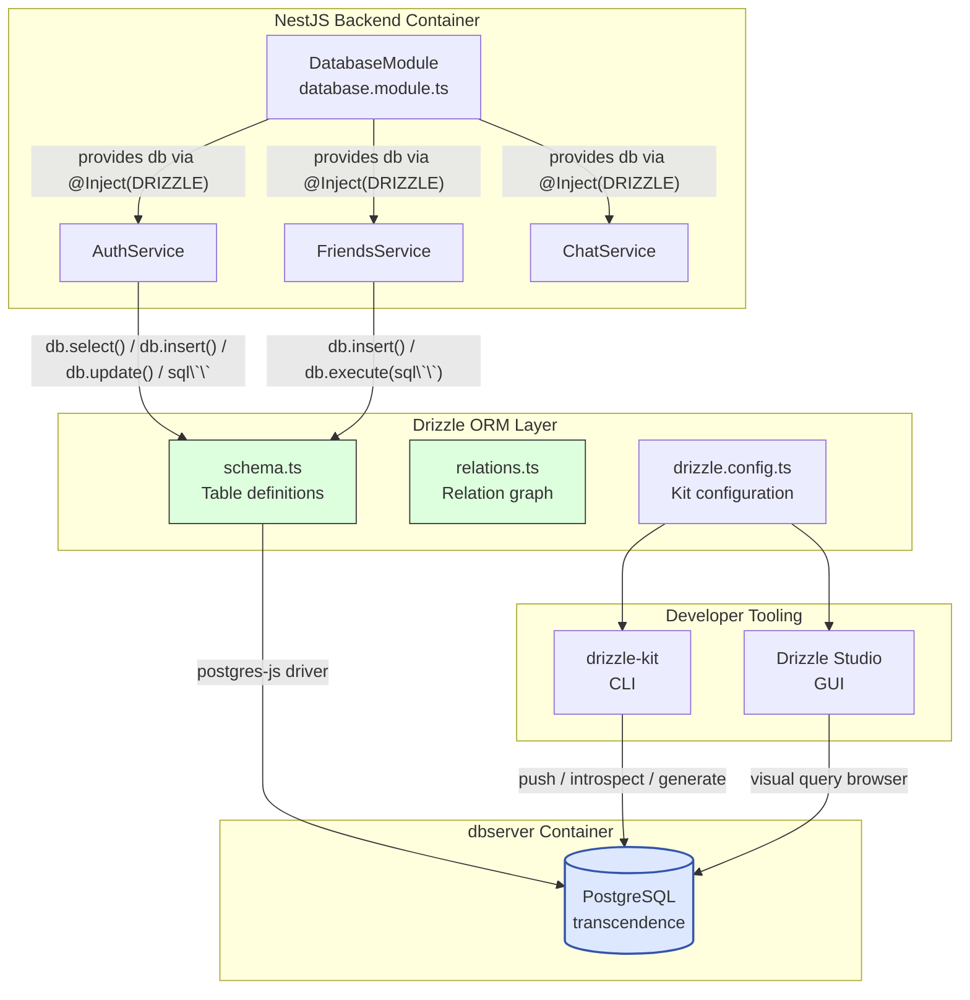
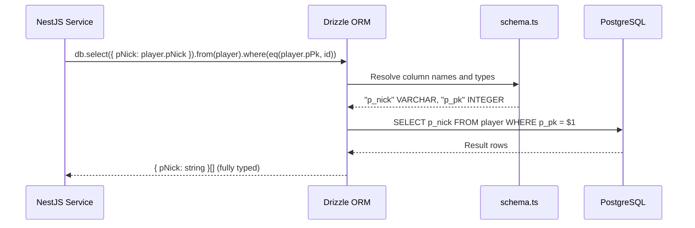
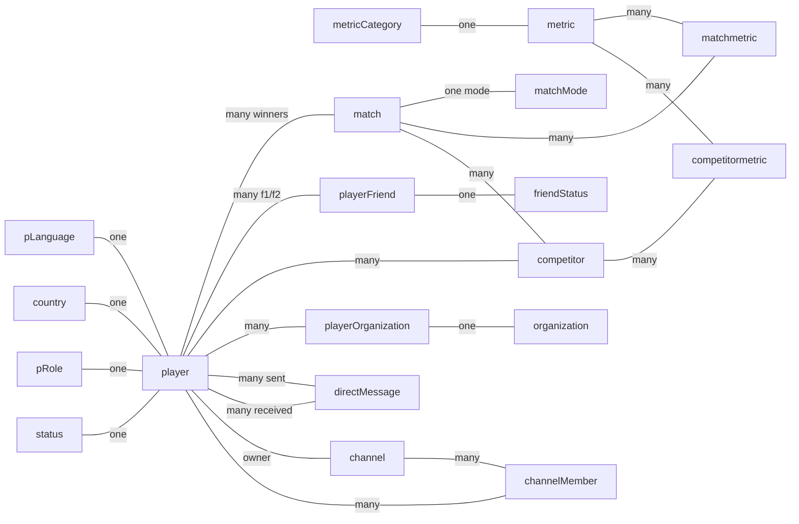

# Drizzle ORM

## Executive Summary

Drizzle ORM is the TypeScript-first query layer that sits between the NestJS backend and the PostgreSQL `dbserver` container. It fulfils the *"Use an ORM for the database"* minor module requirement of the Transcendence subject.

Rather than generating classes at runtime (Hibernate style) or requiring a separate migration DSL, Drizzle keeps **schema, relations, and migrations as plain TypeScript files** — what you read in the source is exactly what hits the database. The query builder is fully type-safe: if a column does not exist, the project will not compile. There are no surprises at runtime.

Three files drive the entire ORM layer:

| File | Role |
|------|------|
| `src/schema.ts` | Single source of truth: defines every table and column with TypeScript types |
| `src/relations.ts` | Declares logical relations between tables for Drizzle's relational query API |
| `drizzle.config.ts` | Drizzle Kit configuration: connection credentials and migration output path |

---

### System Architecture Diagram

The following diagram shows where Drizzle sits in the stack and what each layer is responsible for.



---

### Query Lifecycle Diagram



---

## Configuration — `drizzle.config.ts`

Drizzle Kit reads this file when you run any `drizzle-kit` CLI command.

```typescript
import { defineConfig } from 'drizzle-kit';
import * as dotenv from 'dotenv';
import path from 'path';

dotenv.config({ path: '../.env' });   // Loads from project root .env

export default defineConfig({
  dialect: 'postgresql',
  schema: ["./src/schema.ts", "./src/relations.ts"],  // Files to introspect
  out: "./drizzle",                                    // Migration output directory
  dbCredentials: {
    host:     process.env.DB_IP || process.env.DB_HOST || 'localhost',
    port:     Number(process.env.DB_PORT) || 5432,
    user:     process.env.POSTGRES_USER  || 'postgres',
    password: process.env.POSTGRES_PASSWORD || 'example',
    database: process.env.POSTGRES_DB   || 'transcendence',
    ssl: false,
  },
  verbose: true,   // Prints every SQL statement generated
  strict:  true,   // Aborts on destructive operations without explicit confirmation
});
```

### Key Configuration Decisions

| Option | Value | Rationale |
|--------|-------|-----------|
| `dialect` | `postgresql` | Targets the PostgreSQL driver; enables PG-specific types (`jsonb`, `interval`, `bytea`) |
| `schema` | Both `schema.ts` and `relations.ts` | Kit needs the full graph to generate accurate migrations |
| `out` | `./drizzle` | Migration SQL files are written here and committed to version control |
| `dbCredentials` | Individual fields (not `url`) | Avoids URL-parse failures with special characters in passwords |
| `strict: true` | Enabled | Forces confirmation before any `DROP TABLE` or `DROP COLUMN` in migrations |
| `verbose: true` | Enabled | Useful during development to inspect generated SQL |

---

## Schema — `schema.ts`

`schema.ts` is the **single source of truth** for the database structure. Every table defined here corresponds 1:1 with a table created by `00_schema.sql`. The SQL init script runs on first boot; after that, Drizzle owns schema evolution via `drizzle-kit push` or generated migrations.

### Custom Type

PostgreSQL's `bytea` is not natively supported by Drizzle's type builder, so a custom type is registered at the top of the file:

```typescript
const bytea = customType<{ data: Buffer }>({
  dataType() { return 'bytea'; },
});
```

This is used exclusively for `p_totp_secret` in the `player` table — the encrypted TOTP secret stored as binary ciphertext.

### Naming Convention

The project uses a deliberate split between **TypeScript names** (camelCase) and **database column names** (snake\_case with table prefixes). Drizzle handles the mapping transparently.

| TypeScript (schema.ts) | PostgreSQL column |
|------------------------|-------------------|
| `player.pPk` | `p_pk` |
| `player.pTotpSecret` | `p_totp_secret` |
| `matchmetric.mmMatchFk` | `mm_match_fk` |
| `competitormetric.mcmMetricFk` | `mcm_metric_fk` |

### Alias Export

```typescript
export const users = player;
```

`AuthService` imports both `users` and `player` from `schema.ts`. They point to the same table definition — the alias exists so service code can refer to the table by a name that feels natural in its context (`users` when thinking about authentication, `player` when thinking about match data).

---

### Table Reference

#### Reference / Lookup Tables

| Export | DB Table | PK Type | Notes |
|--------|----------|---------|-------|
| `pLanguage` | `p_language` | `char(2)` (ISO 639) | `lang_status` flag controls which languages are active |
| `country` | `country` | `char(2)` (ISO 3166) | Full ISO metadata: region, sub-region, numeric codes |
| `pRole` | `p_role` | `smallint` identity | `role_i18n_name` JSONB — `{"en":"User","es":"Usuario","fr":"Utilisateur","pt":"Usuário","ca":"Usuari"}` |
| `status` | `status` | `smallint` identity | Same JSONB i18n pattern — 5 statuses (Unconnected → Busy) |
| `friendStatus` | `friend_status` | `smallint` identity | 4 states: Pending (1), Accepted (2), Blocked (3), Rejected (4) |
| `matchMode` | `match_mode` | `smallint` identity | `1v1_local`, `1v1_remote`, `1v1_ia`, `Tournement` |
| `metricCategory` | `metric_category` | `smallint` identity | 5 categories (Competitor, Match, Organisation, Tournament, System) |
| `metric` | `metric` | `smallint` identity | 23 metrics; both name and description are JSONB i18n objects |
| `organization` | `organization` | `smallint` identity | Simple org name, linked to players via `playerOrganization` |

#### Core Entity Tables

**`player`** — the central entity of the entire schema.

| Column | Type | Notes |
|--------|------|-------|
| `pPk` | `integer` identity | Primary key |
| `pNick` | `varchar(255)` | `UNIQUE NOT NULL` |
| `pMail` | `text` | Mapped from `CITEXT` — case-insensitive uniqueness is enforced at DB level |
| `pPass` | `text` | `NULL` for OAuth users |
| `pTotpSecret` | `bytea` (custom) | Encrypted TOTP secret; `NULL` until 2FA is enabled |
| `pTotpEnabled` | `boolean` | Default `false` |
| `pTotpBackupCodes` | `text[]` | Array of one-time recovery codes |
| `pOauthProvider` | `varchar(20)` | `'42'` or `'google'`; `NULL` for local accounts |
| `pOauthId` | `varchar(255)` | Provider UID; `NULL` for local accounts |
| `pAvatarUrl` | `varchar(500)` | URL or avatar identifier |
| `pProfileComplete` | `boolean` | `false` for OAuth users until they fill in their profile |
| `pReg` | `timestamp` | Default `CURRENT_TIMESTAMP` |
| `pBir` | `date` | Date of birth |
| `pLang` | `char(2)` FK | → `p_language.lang_pk` |
| `pCountry` | `char(2)` FK | → `country.coun2_pk` |
| `pRole` | `smallint` FK | → `p_role.role_pk` — default `1` |
| `pStatus` | `smallint` FK | → `status.status_pk` — default `1` |

Unique constraints declared in the schema:
- `unique("player_p_nick_key").on(table.pNick)`
- `unique("player_p_mail_key").on(table.pMail)`
- `unique("unique_oauth_user").on(table.pOauthProvider, table.pOauthId)` — PostgreSQL NULL semantics ensure local users (both fields `NULL`) never collide.

---

#### Match & Statistics Tables

| Export | DB Table | PK | Key FKs |
|--------|----------|----|---------|
| `match` | `match` | `integer` identity | `mModeFk` → `match_mode`, `mWinnerFk` → `player` |
| `competitor` | `competitor` | Composite (`mc_match_fk`, `mc_player_fk`) | Both → `match` and `player` |
| `matchmetric` | `matchmetric` | `integer` identity | `mmMatchFk` → `match`, `mmCodeFk` → `metric` |
| `competitormetric` | `competitormetric` | Composite (`mcm_match_fk`, `mcm_player_fk`, `mcm_metric_fk`) | `fk_mcm_match_player` → `competitor` (composite FK) |

The `competitormetric` composite foreign key is notable:

```typescript
foreignKey({
    columns: [table.mcmMatchFk, table.mcmPlayerFk],
    foreignColumns: [competitor.mcMatchFk, competitor.mcPlayerFk],
    name: "fk_mcm_match_player"
}),
```

This enforces that a metric row can only exist for a `(match, player)` pair that already exists in `competitor` — data integrity at the schema level.

---

#### Social Tables

| Export | DB Table | PK | Notes |
|--------|----------|----|-------|
| `playerFriend` | `player_friend` | `integer` identity | `f1` (actor) → `player`, `f2` (target) → `player`, `fStatusFk` → `friend_status` |
| `playerOrganization` | `player_organization` | — | Pure junction table; no surrogate key |

---

#### Chat Tables

| Export | DB Table | PK | Notes |
|--------|----------|----|-------|
| `directMessage` | `direct_message` | `integer` identity | `senderId` and `receiverId` both → `player`, `ON DELETE CASCADE` |
| `channel` | `channel` | `integer` identity | `ownerId` → `player`, `ON DELETE SET NULL` — channel survives owner deletion |
| `channelMember` | `channel_member` | Composite (`channel_id`, `user_id`) | `role` (`member`/`admin`/`owner`), `isMuted` flag |

---

## Relations — `relations.ts`

The relations file is a **separate logical layer** on top of the schema. It does not create any database objects — it describes the graph of relationships to Drizzle's relational query API, enabling `db.query.player.findMany({ with: { pLanguage: true } })` style queries.



### Self-referencing Relations on `playerFriend`

A friendship record has two `player` foreign keys. Drizzle requires explicit `relationName` identifiers to disambiguate them:

```typescript
// In playerRelations:
playerFriends_f1: many(playerFriend, { relationName: "playerFriend_f1_player_pPk" }),
playerFriends_f2: many(playerFriend, { relationName: "playerFriend_f2_player_pPk" }),

// In playerFriendRelations:
player_f1: one(player, { fields: [playerFriend.f1], references: [player.pPk],
                          relationName: "playerFriend_f1_player_pPk" }),
player_f2: one(player, { fields: [playerFriend.f2], references: [player.pPk],
                          relationName: "playerFriend_f2_player_pPk" }),
```

### Self-referencing Relations on `directMessage`

The same pattern applies to direct messages, where a player can be either sender or receiver:

```typescript
// In playerRelations:
sentMessages:     many(directMessage, { relationName: "sentMessages" }),
receivedMessages: many(directMessage, { relationName: "receivedMessages" }),

// In directMessageRelations:
sender:   one(player, { fields: [directMessage.senderId],   references: [player.pPk],
                         relationName: "sentMessages" }),
receiver: one(player, { fields: [directMessage.receiverId], references: [player.pPk],
                         relationName: "receivedMessages" }),
```

---

## NestJS Integration

Drizzle is wired into NestJS through a dedicated `DatabaseModule` that acts as a provider factory. Any module that imports `DatabaseModule` can inject the Drizzle instance via the `DRIZZLE` token.

### Injection Pattern

```typescript
// In any service that needs DB access:
import { Inject } from '@nestjs/common';
import { DRIZZLE } from '../database.module';
import { PostgresJsDatabase } from 'drizzle-orm/postgres-js';
import * as schema from '../schema';

@Injectable()
export class AuthService {
  constructor(
    @Inject(DRIZZLE)
    private db: PostgresJsDatabase<typeof schema>,
  ) {}
}
```

The type parameter `typeof schema` is critical — it makes `db.select()`, `db.insert()`, and `db.query.*` fully aware of every table's column names and TypeScript types. A typo in a column name will be caught at compile time.

### Module Registration

```typescript
// In auth.module.ts (and any module that needs DB access):
@Module({
  imports: [
    DatabaseModule,   // ← provides the DRIZZLE token
    // ... other imports
  ],
})
export class AuthModule {}
```

---

## Query Patterns

The codebase uses two complementary query styles depending on the complexity of the operation.

### 1. Drizzle Query Builder — Type-safe CRUD

Used for straightforward operations where the query builder covers the full requirement without raw SQL.

**Select with filter and projection:**
```typescript
// auth.service.ts — login
const result = await this.db
  .select({
    pNick: player.pNick,
    pPass: player.pPass,
    pPk:   player.pPk,
    pTotpEnabled: player.pTotpEnabled,
  })
  .from(player)
  .where(eq(player.pNick, username))
  .limit(1);
```

**Select with compound `OR` condition:**
```typescript
// auth.service.ts — check for duplicate user on registration
const existing = await this.db
  .select()
  .from(player)
  .where(or(eq(player.pNick, username), eq(player.pMail, email)))
  .limit(1);
```

**Select with compound `AND` condition:**
```typescript
// auth.service.ts — nick uniqueness check excluding current user
const nickExists = await this.db
  .select()
  .from(player)
  .where(
    and(
      eq(player.pNick, updateData.nick),
      sql`${player.pPk} != ${userId}`   // mixed sql`` for unsupported operators
    )
  )
  .limit(1);
```

**Insert with `.returning()`:**
```typescript
// auth.service.ts — new user registration
const [newUser] = await this.db
  .insert(player)
  .values({
    pNick:    username,
    pMail:    email,
    pPass:    hashedPassword,
    pCountry: country,
    pLang:    lang,
    pReg:     new Date().toISOString(),
    pRole:    1,
    pStatus:  1,
    pTotpEnabled:    enable2FA,
    pProfileComplete: true,
  })
  .returning();   // ← returns the inserted row with generated PK
```

**Update with array SQL helper:**
```typescript
// auth.service.ts — remove a used backup code atomically
await this.db
  .update(player)
  .set({
    pTotpBackupCodes: sql`array_remove(${player.pTotpBackupCodes}, ${totpCode})`,
  })
  .where(
    and(
      eq(player.pPk, userId),
      sql`${player.pTotpBackupCodes} @> ARRAY[${totpCode}]`
    )
  );
```

**Update returning result:**
```typescript
// auth.service.ts — profile update
const [updatedUser] = await this.db
  .update(player)
  .set(dataToUpdate)
  .where(eq(player.pPk, userId))
  .returning();
```

**Case-insensitive search using `sql` template:**
```typescript
// auth.service.ts — country lookup
const result = await this.db
  .select({ code: country.coun2Pk })
  .from(country)
  .where(sql`LOWER(${country.counName}) = LOWER(${countryName})`)
  .limit(1);
```

**Select with `orderBy`:**
```typescript
// auth.service.ts — country dropdown
const result = await this.db
  .select({ coun2_pk: country.coun2Pk, coun_name: country.counName })
  .from(country)
  .orderBy(country.counName);
```

---

### 2. Raw SQL via `db.execute(sql\`\`)` — Complex Queries

Used when the query builder cannot express the logic concisely, particularly for self-referencing joins (friendships) and multi-step operations that benefit from the PostgreSQL query planner.

**Insert with raw cleanup preceding it:**
```typescript
// friends.service.ts — send friend request (clean zombies first)
await this.db.execute(sql`
    DELETE FROM PLAYER_FRIEND 
    WHERE (f_1 = ${userId} AND f_2 = ${targetId}) 
       OR (f_1 = ${targetId} AND f_2 = ${userId})
`);
await this.db.insert(schema.playerFriend).values({
    f1: userId,
    f2: targetId,
    fStatusFk: this.STATUS_PENDING
});
```

**Self-join for bidirectional friend list:**
```typescript
// friends.service.ts — get friends (works regardless of who sent the request)
const result = await this.db.execute(sql`
    SELECT 
        p.p_pk          AS friend_id, 
        p.p_nick        AS friend_nick,
        p.p_avatar_url  AS friend_avatar,
        l.lang_name     AS friend_lang,
        pf.f_date       AS friendship_since
    FROM PLAYER_FRIEND pf
    JOIN PLAYER p ON p.p_pk = (
        CASE 
            WHEN pf.f_1 = ${userId} THEN pf.f_2 
            ELSE pf.f_1 
        END
    )
    LEFT JOIN P_LANGUAGE l ON l.lang_pk = p.p_lang
    WHERE (pf.f_1 = ${userId} OR pf.f_2 = ${userId}) 
    AND pf.f_status_fk = ${this.STATUS_ACCEPTED}
`);
```

**Call a PostgreSQL stored function:**
```typescript
// auth.service.ts — GDPR anonymization via stored procedure
await this.db.execute(sql`SELECT anonymize_player_by_id(${userId})`);
```

---

### Query Style Decision Guide

| Use Drizzle Query Builder | Use `db.execute(sql\`\`)` |
|---------------------------|--------------------------|
| Single table CRUD | Bidirectional self-joins (e.g. friendships) |
| Simple `WHERE` with `eq`, `or`, `and` | Calling stored functions / procedures |
| `.returning()` needed | `CASE`/`WHEN` inside `JOIN ON` clause |
| Compile-time type checking is valuable | `NOT EXISTS` subqueries |
| Column ordering / basic filtering | Operations benefiting from PG query planner directly |

---

## Drizzle Kit CLI

`drizzle-kit` is the companion CLI that manages schema introspection and migrations. It reads `drizzle.config.ts` for all connection details.

| Command | Effect |
|---------|--------|
| `npx drizzle-kit push` | Pushes the current `schema.ts` state directly to the database (no migration file). Ideal for development. |
| `npx drizzle-kit generate` | Generates a SQL migration file in `./drizzle/` by diffing the current schema against the last snapshot. |
| `npx drizzle-kit migrate` | Applies pending migration files in `./drizzle/` to the database. Used in production/CI. |
| `npx drizzle-kit introspect` | Reverse-engineers an existing database into a `schema.ts` file. Used to bootstrap the project from the SQL schema. |
| `npx drizzle-kit studio` | Opens **Drizzle Studio** — a local web GUI to browse and query the database visually. |

> ⚠️ **`strict: true`** is enabled in `drizzle.config.ts`. Any migration that drops a table or column will require explicit interactive confirmation. This prevents accidental data loss during development.

---

## Usage Examples

```bash
# Run from the backend/ directory (where drizzle.config.ts lives)

# Push current schema.ts directly to the running DB (fastest dev workflow)
npx drizzle-kit push

# Generate a migration file after editing schema.ts
npx drizzle-kit generate

# Open Drizzle Studio (visual DB browser at http://localhost:4983)
npx drizzle-kit studio

# Introspect the existing DB into schema.ts (useful after SQL schema changes)
npx drizzle-kit introspect
```

```typescript
// Calling a stored function that returns a custom type
const record = await db.execute(
  sql`SELECT * FROM get_player_record(${playerId})`
);
// record[0] → { wins: 5, losses: 2, draws: 0, total_matches: 7 }

// Insert and immediately get the generated PK
const [inserted] = await db
  .insert(match)
  .values({ mDate: new Date().toISOString(), mModeFk: 2, mWinnerFk: playerId })
  .returning({ id: match.mPk });

// Typed relational query (requires relations.ts to be configured)
const playerWithLang = await db.query.player.findFirst({
  where: eq(player.pPk, 1),
  with: { pLanguage: true, country: true },
});
```

---

## References

- [Drizzle ORM — Official Documentation](https://orm.drizzle.team/docs/overview)
- [Drizzle Kit — Migrations](https://orm.drizzle.team/docs/kit-overview)
- [Drizzle — Relations](https://orm.drizzle.team/docs/relations)
- [Drizzle — Custom Types](https://orm.drizzle.team/docs/custom-types)
- [postgres-js Driver](https://github.com/porsager/postgres)
- [NestJS — Custom Providers](https://docs.nestjs.com/fundamentals/custom-providers)


[Return to Main modules table](../../../README.md#modules)