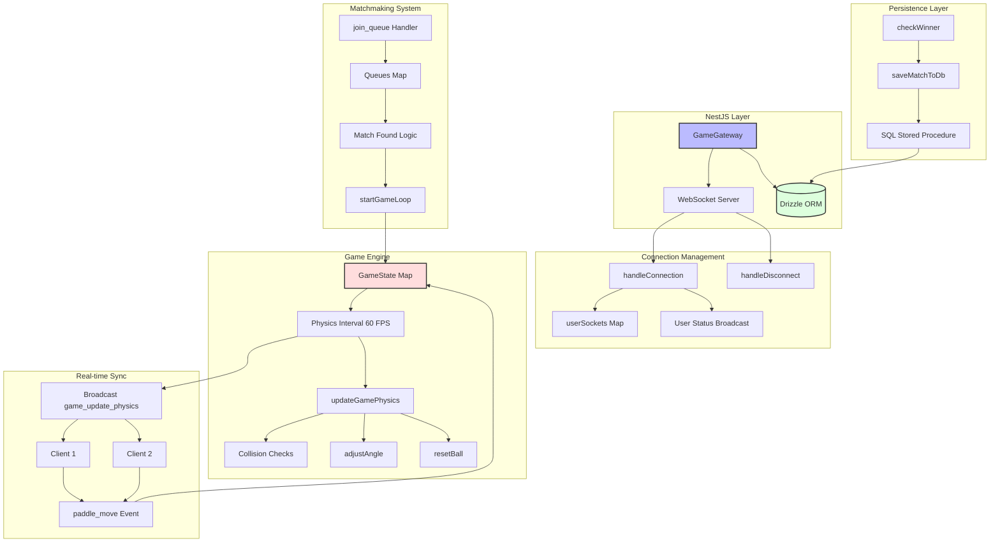
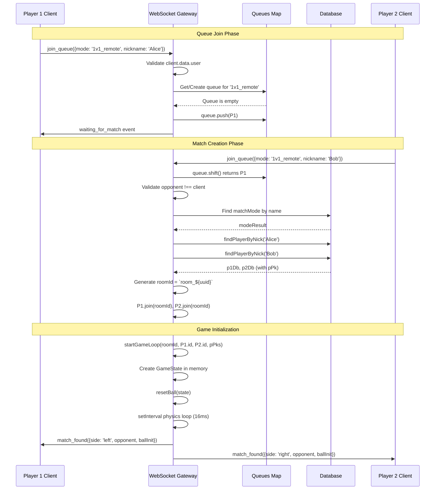
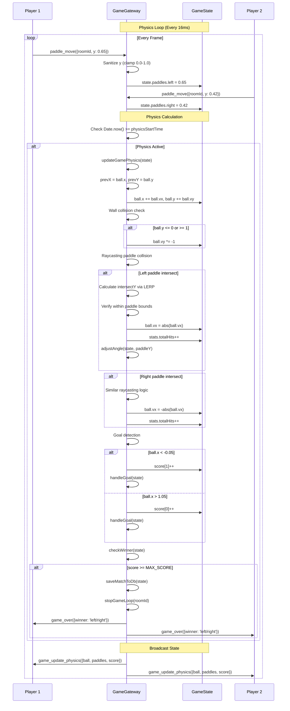
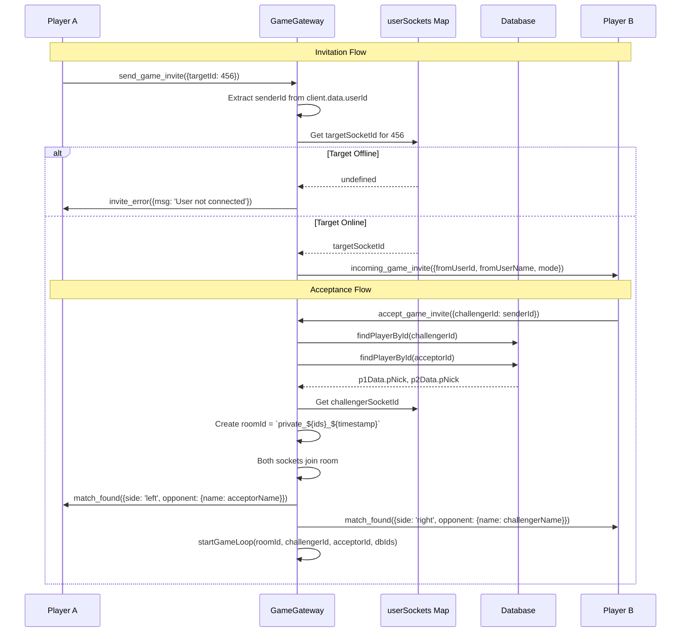
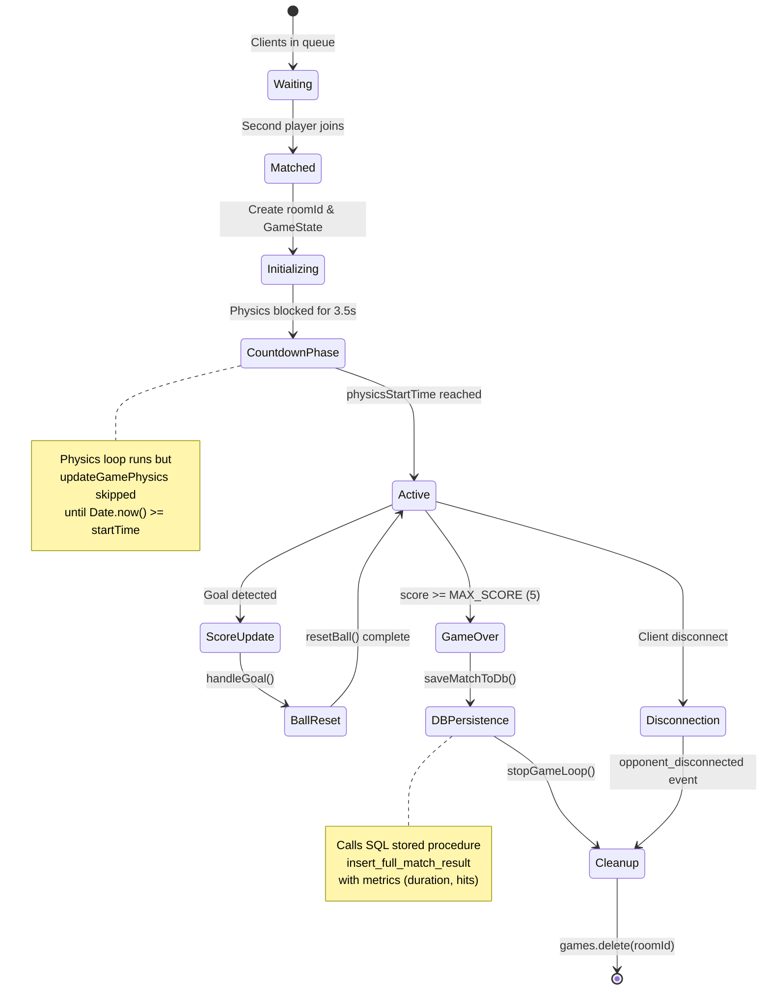
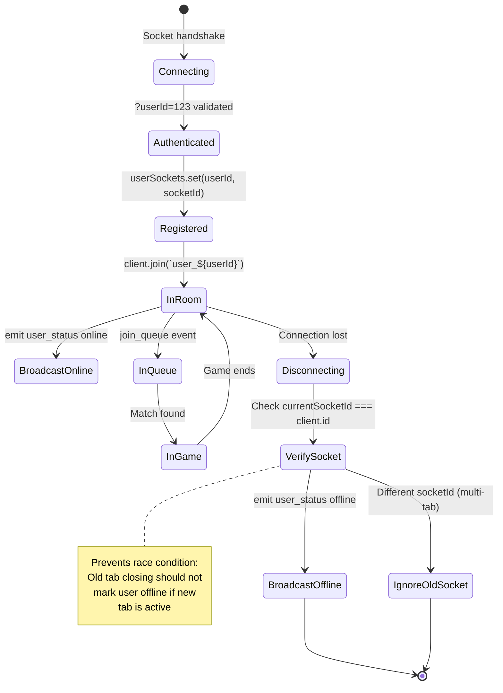
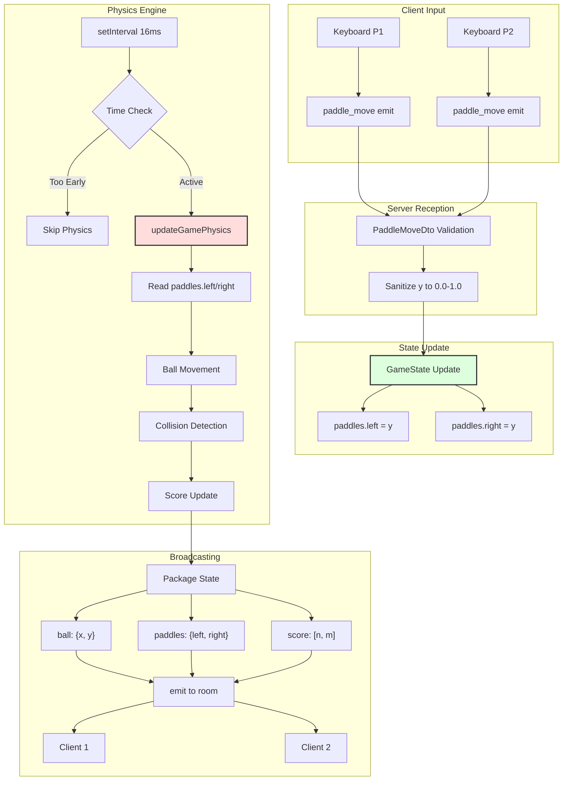

# Pong Game - Backend Documentation

## Executive Summary

The backend establishes a server-authoritative, real-time multiplayer Pong infrastructure using NestJS WebSocket Gateway architecture. By implementing deterministic physics simulation with raycasting-based collision detection, the system ensures competitive integrity while supporting matchmaking, game state synchronization, and persistent match history recording.

The architecture leverages Socket.IO for bidirectional communication, Drizzle ORM for database operations, and interval-based physics loops running at fixed 60 FPS. The gateway manages user presence tracking, queue-based matchmaking, in-memory game state, and PostgreSQL persistence through stored procedures, ensuring scalability and maintainability.

---

## Evaluation Module Mapping
This document serves as the primary technical evidence for two separate Major Modules in the project rubric:

### 1. Web-based Pong game (Gaming & User Experience Module)
*Fulfilled by the mathematical physics engine and core ruleset implementation.*
* **Deterministic Physics:** The backend independently calculates vector math, ball velocities, and AABB (Axis-Aligned Bounding Box) paddle collisions, strictly enforcing the rules of Pong.
* **Dynamic Gameplay:** Implements progressive difficulty (e.g., speed increasing by 2% on every hit) and dynamic reflection angles based on the exact point of paddle impact.

### 2. Remote players - Real-time multiplayer (Gaming & User Experience Module)
*Fulfilled by the server-authoritative synchronization and matchmaking queue.*
* **Anti-Cheat Architecture:** The server acts as the absolute source of truth. Clients only send paddle intents (`paddle_move`), while the backend calculates collisions and broadcasts the true state, making client-side manipulation impossible.
* **Fixed-Tick Simulation:** The physics loop runs at a stable 60 FPS (16ms) independent of client hardware, ensuring fair play and identical network sync across all connections.
* **Resilience:** Safely handles edge cases like mid-game disconnections, network jitter (via client-side LERP), and concurrent room management without crashing.

---

## System Architecture Overview

### Backend Component Diagram



---

## Sequence Diagrams

### Matchmaking Flow - Queue-Based Pairing



### Game Loop - Server-Authoritative Physics



### Invitation System - Friend Challenge



---

## State Machine Diagrams

### Game State Lifecycle



### Connection State Management



---

## Data Flow Diagrams

### Matchmaking Data Pipeline

```mermaid
graph LR
    subgraph "Input Stage"
        C1[Client 1] -->|join_queue DTO| GW[GameGateway]
        C2[Client 2] -->|join_queue DTO| GW
    end
    
    subgraph "Validation Layer"
        GW --> VL[Validate client.data]
        VL --> QG[Get/Create Queue]
    end
    
    subgraph "Queue Management"
        QG --> QL{Queue Length}
        QL -->|Empty| PUSH[queue.push client]
        QL -->|>= 1| SHIFT[queue.shift opponent]
        SHIFT --> VALID{Validate Match}
        VALID -->|Self-match| PUSH
        VALID -->|Valid| DBQ[DB Query]
    end
    
    subgraph "Database Layer"
        DBQ --> FM[Find matchMode]
        DBQ --> FP1[Find Player 1 by Nick]
        DBQ --> FP2[Find Player 2 by Nick]
        FM --> PKS[Extract pPk IDs]
        FP1 --> PKS
        FP2 --> PKS
    end
    
    subgraph "Game Initialization"
        PKS --> GEN[Generate UUID roomId]
        GEN --> JOIN[Sockets join room]
        JOIN --> SGL[startGameLoop]
        SGL --> GS[Create GameState]
    end
    
    subgraph "Client Notification"
        GS --> MF1[match_found to P1]
        GS --> MF2[match_found to P2]
    end
    
    style GW fill:#bbf,stroke:#333,stroke-width:2px
    style GS fill:#fdd,stroke:#333,stroke-width:2px
```



### Real-time Sync Data Flow



---

## Component Reference Documentation

### GameGateway - Main WebSocket Controller

**Purpose**: Manages WebSocket lifecycle, matchmaking logic, game state orchestration, and database persistence.

**Decorators & Configuration**:
```typescript
@UsePipes(new ValidationPipe({ whitelist: true }))
@WebSocketGateway({
  cors: { origin: '*' },
  transports: ['websocket']
})
```

**Class Properties**:
```typescript
  @WebSocketServer()
  server: Server;

  //Map to manage queues by game mode (e.g.: '1v1_remote' -> [Socket])
  private queues: Map<string, Socket[]> = new Map();

  // ACTIVE GAMES STORAGE
  private games: Map<string, GameState> = new Map();

  // NEW: CONNECTED USERS MAP (UserId -> SocketId)
  // This allows us to know which socket belongs to which user to send them notifications
  private userSockets = new Map<number, string>();

  // Server physics constants (Adjustable)
  private readonly SERVER_WIDTH = 1.0; // Normalized
  private readonly SERVER_HEIGHT = 1.0; // Normalized
  private readonly PADDLE_HEIGHT = 0.2; // 20% of the screen (adjust to your liking)
  private readonly INITIAL_SPEED = 0.01; // Initial speed per frame
  private readonly SPEED_INCREMENT = 1.02; // 5% faster each hit
  private readonly MAX_SCORE = 5;
```

**GameState Interface**:
```typescript
interface GameState {
  roomId: string;
  playerLeftDbId: number;     // PK for DB persistence
  playerRightDbId: number;
  playerLeftId: string;       // Socket ID
  playerRightId: string;
  ball: {
    x: number;      // Posición X (0.0 a 1.0)
    y: number;      // Posición Y (0.0 a 1.0)
    vx: number;     // Velocidad X
    vy: number;     // Velocidad Y
    speed: number;  // Velocidad escalar
  };
  paddles: {
    left: number;   // Y del jugador izq (0.0 a 1.0)
    right: number;  // Y del jugador der (0.0 a 1.0)
  };
  score: [number, number];
  stats: {
      totalHits: number;
      maxRally: number;
      startTime: Date;
  };
  intervalId?: NodeJS.Timeout;
}
```

---

### Connection Management

#### handleConnection

**Purpose**: Registers new WebSocket clients, maps user IDs to socket IDs, and broadcasts online status.

**Implementation**:
```typescript
  handleConnection(client: Socket) {
    //console.log(`✅ Cliente conectado: ${client.id}`);
    // NEW: USER IDENTIFICATION LOGIC
    // The frontend sends us ?userId=123 in the connection 
    const userId = client.handshake.query.userId;

    if (userId) {
        const idNum = parseInt(userId as string, 10);
        
        // 1. We save it in the map
        this.userSockets.set(idNum, client.id);
        
        // 2. We join the user to a room with their own name (Useful for multi-tab)
        client.join(`user_${idNum}`);
        
        // 3. We save the ID in the socket's data object to use it later
        client.data.userId = idNum;

        // NEW: NOTIFY EVERYONE THAT THIS USER IS ONLINE
        // (The frontend will filter whether this user matters to them or not) 
        this.server.emit('user_status', { userId: idNum, status: 'online' });

    } else {

    }
  }
```

**Key Features**:
- Query parameter extraction: `?userId=123`
- Personal room creation: `user_${userId}` for targeted notifications
- Broadcast online presence to all connected clients
- Socket data augmentation for later identification

---

#### handleDisconnect

**Purpose**: Cleans up disconnected clients, manages queue removal, and handles race conditions for multi-tab users.

**Anti-Bug Logic**:
```typescript
  handleDisconnect(client: Socket) {

    // --- FIX FOR "UNILATERAL VISIBILITY" BUG ---
    if (client.data.userId) {
        const userId = client.data.userId;
        
        // 1. We verify if the user has a registered socket
        const currentSocketId = this.userSockets.get(userId);

        // 2. IMPORTANT: We only delete and notify if the socket that's leaving
        // is THE SAME one we have registered as active. 
        // This prevents an old tab closing from disconnecting the new one.
        if (currentSocketId === client.id) {
            this.userSockets.delete(userId);
            this.server.emit('user_status', { userId: userId, status: 'offline' });
        } else {
 
        }
    }
```

**Cleanup Tasks**:
1. Verify socket ID matches current registration (multi-tab protection)
2. Remove from all matchmaking queues
3. Terminate active games with `opponent_disconnected` event
4. Broadcast offline status only if last socket

---

### Matchmaking System

#### @SubscribeMessage('join_queue')

**Purpose**: Handles queue-based matchmaking with validation, database lookups, and room creation.

**Flow Stages**:

| Stage | Action | Database Operations |
|-------|--------|-------------------|
| 1. Validation | Check `client.data.user` existence | None |
| 2. Queue Retrieval | Get or create mode-specific queue | None |
| 3. Match Detection | Check if opponent waiting | None |
| 4. Mode Validation | Verify mode exists | `matchMode.findFirst()` |
| 5. Player Lookup | Fetch database PKs | `findPlayerByNick()` x2 |
| 6. Room Creation | Generate UUID, join sockets | None |
| 7. Game Start | Initialize GameState | None |
| 8. Notification | Emit `match_found` | None |

**Critical Code Section**:
```typescript
 // SCENARIO 1: Someone is waiting (MATCH FOUND) ---
    if (queue.length > 0) {    
      const opponent = queue.shift(); 

      // Strict validation
      if (!opponent) {
          return;
      }

    // Avoid playing against yourself
      if (opponent.id === client.id) {
        queue.push(client);
        return;
      }

      try {
        
      // Validate mode
        const modeResult = await this.db.query.matchMode.findFirst({
          where: eq(schema.matchMode.mmodName, mode)
        });

        if (!modeResult) {
          queue.unshift(opponent);
          return;
        }

      // Get DB IDs (necessary for Final Save)
        const p1Db = await this.findPlayerByNick(client.data.user.pNick);
        const p2Db = await this.findPlayerByNick(opponent.data.user.pNick);

        if (!p1Db || !p2Db) {
            return;
        }
      // Generate temporary Room ID (we do NOT insert in DB yet)
        const roomId = `room_${uuidv4()}`; 
```

---

### Physics Engine

#### startGameLoop

**Purpose**: Initializes game state, creates physics interval, and handles countdown delay.

**Initialization**:
```typescript
  private startGameLoop(roomId: string, pLeftId: string, pRightId: string, pLeftDb: number, pRightDb: number) {
    const state: GameState = {
      roomId,
      playerLeftId: pLeftId,
      playerRightId: pRightId,
      playerLeftDbId: pLeftDb,
      playerRightDbId: pRightDb,
      ball: { x: 0.5, y: 0.5, vx: 0, vy: 0, speed: this.INITIAL_SPEED },
      paddles: { left: 0.5, right: 0.5 },
      score: [0, 0],
      // STATISTICS INITIALIZATION
      stats: {
          totalHits: 0,
          maxRally: 0,
          startTime: new Date()
      }
    };

    this.resetBall(state);
    this.games.set(roomId, state);

    // WE CALCULATE THE REAL START TIME (Now + 3500ms)
    // 3000ms countdown + 500ms of "GO!" sign
    const physicsStartTime = Date.now() + 3500;

    // Loop at 60 FPS (approx 16ms)
    const interval = setInterval(() => {
      // Zombie Protection: If the room was deleted, stop.
      if (!this.games.has(roomId)) {
          clearInterval(interval);
          return;
      }

      // TEMPORARY BLOCK
      // If the waiting time hasn't passed yet, we do NOT calculate physics.
      if (Date.now() < physicsStartTime) {
          // Optional: We could emit static positions to ensure
          // that the client has the ball centered, but the client already does this.
          return; 
      }

      this.updateGamePhysics(state);
      
      this.server.to(roomId).emit('game_update_physics', {
        ball: { x: state.ball.x, y: state.ball.y },
        score: state.score,
        paddles: { left: state.paddles.left, right: state.paddles.right }
      });

    }, 16);
    state.intervalId = interval;
  }
}
```

**Countdown Mechanism**:
- Calculates `physicsStartTime = Date.now() + 3500ms`
- Physics loop runs but skips `updateGamePhysics` until time threshold
- Allows clients to render static board during countdown
- Prevents early ball movement

---

#### updateGamePhysics - Core Simulation

**Purpose**: Executes deterministic physics with raycasting collision detection and scoring logic.

**Raycasting Implementation**:
```typescript
    // 1. Save PREVIOUS position (Key to avoid tunnel effect)
    const prevX = state.ball.x;
    const prevY = state.ball.y;

    // 2. Move the ball
    state.ball.x += state.ball.vx;
    state.ball.y += state.ball.vy;

    // 3. Bounces on top/bottom walls
    if (state.ball.y <= 0 || state.ball.y >= 1) {
        state.ball.vy *= -1;
        // Position correction so it doesn't get stuck
        state.ball.y = state.ball.y <= 0 ? 0.001 : 0.999;
    }

    const paddleHalf = this.PADDLE_HEIGHT / 2;
    // We define where the "face" of the paddle is (impact zone)
    const PADDLE_MARGIN = 0.035; // The same value you were using in your tests

    // --- LEFT PADDLE COLLISION (P1) ---
    // We detect if the ball CROSSED the paddle line (it was on the right and now it's on the left)
    if (prevX >= PADDLE_MARGIN && state.ball.x <= PADDLE_MARGIN) {
        
        // Calculate at what exact Y point it crossed the line X = PADDLE_MARGIN
        // Linear interpolation formula
        const t = (PADDLE_MARGIN - prevX) / (state.ball.x - prevX);
        const intersectY = prevY + t * (state.ball.y - prevY);

        // Check if that Y point is inside the paddle (with a small error margin '0.01' for edges)
        if (intersectY >= state.paddles.left - paddleHalf - 0.01 && 
            intersectY <= state.paddles.left + paddleHalf + 0.01) {
            
            // COLLISION CONFIRMED!
            state.ball.x = PADDLE_MARGIN + 0.01; // Take the ball out
            state.ball.vx = Math.abs(state.ball.vx); // FForce right direction
            
            // Game logic
            state.stats.totalHits++;
            state.ball.speed *= this.SPEED_INCREMENT;
            this.adjustAngle(state, state.paddles.left);
        }
    }
```

**Tunneling Prevention Strategy**:
1. Store previous frame position (`prevX`, `prevY`)
2. Detect line crossing (ball was on one side, now on other)
3. Calculate exact intersection point using linear interpolation: `intersectY = prevY + t * (y - prevY)`
4. Verify intersection falls within paddle bounds
5. Correct ball position to prevent phasing through

**Speed Progression**:
- Initial speed: `0.01` units/frame
- Increment: `1.02x` (2% faster per hit)
- Applied multiplicatively: `speed *= SPEED_INCREMENT`

---

#### adjustAngle - Reflection Physics

**Purpose**: Modifies ball trajectory based on paddle impact point.

**Implementation**:
```typescript
private adjustAngle(state: GameState, paddleY: number) {
    const deltaY = state.ball.y - paddleY; 
    const normalizedDelta = deltaY / (this.PADDLE_HEIGHT / 2);
    const angle = normalizedDelta * (Math.PI / 4);
    const dirX = state.ball.vx > 0 ? 1 : -1;
    state.ball.vx = dirX * Math.cos(angle) * state.ball.speed;
    state.ball.vy = Math.sin(angle) * state.ball.speed;
}
```

**Angle Calculation**:
- `deltaY`: Distance from ball to paddle center
- `normalizedDelta`: Range [-1, 1] where -1 = top edge, 1 = bottom edge
- `angle`: Maximum deflection of π/4 (45 degrees)
- Preserves horizontal direction while applying vertical component

---

#### resetBall - Serve Logic

**Purpose**: Repositions ball at center with randomized initial trajectory.

**Implementation**:
```typescript
private resetBall(state: GameState) {
    state.ball.x = 0.5;
    state.ball.y = 0.5;
    state.ball.speed = this.INITIAL_SPEED;
    const dirX = Math.random() < 0.5 ? -1 : 1;
    const angle = (Math.random() * 2 - 1) * (Math.PI / 5); 
    state.ball.vx = dirX * Math.cos(angle) * state.ball.speed;
    state.ball.vy = Math.sin(angle) * state.ball.speed;
}
```

**Randomization Strategy**:
- 50% chance left/right direction
- Angle range: ±π/5 (±36 degrees)
- Ensures unpredictable serve without extreme angles

---

### Input Handling

#### @SubscribeMessage('paddle_move')

**Purpose**: Receives and validates client paddle position updates.

**Validation Pipeline**:
```typescript
@SubscribeMessage('paddle_move')
  handlePaddleMove(
      @ConnectedSocket() client: Socket, 
      @MessageBody() payload: PaddleMoveDto 
  ) {
    const game = this.games.get(payload.roomId);
    
    // 1. If the game doesn't exist, we do nothing.
    if (!game) return;

    // 2. Defensive validation: If 'y' doesn't come, we exit.
    // (Although the DTO helps, this avoids logical errors if the frontend fails)
    if (payload.y === undefined || payload.y === null) return;

    // 3. Sanitization (Clamp): Convert to number and force range 0.0 - 1.0
    let newY = Number(payload.y); 
    newY = Math.max(0, Math.min(1, newY)); 

    // 4. Direct assignment according to who the client is
    if (client.id === game.playerLeftId) {
        game.paddles.left = newY;
    } else if (client.id === game.playerRightId) {
        game.paddles.right = newY;
    }
  }
```

**Security Considerations**:
- Input clamping prevents out-of-bounds exploits
- Socket ID verification prevents player impersonation
- DTO validation ensures type safety

---

### Game Conclusion & Persistence

#### checkWinner

**Purpose**: Detects win conditions, triggers database persistence, and broadcasts results.

**Implementation**:
```typescript
private checkWinner(state: GameState) {
    if (state.score[0] >= this.MAX_SCORE || state.score[1] >= this.MAX_SCORE) {
        this.server.to(state.roomId).emit('score_updated', { score: state.score });

        const winnerSide = state.score[0] >= this.MAX_SCORE ? "left" : "right";
        
        // Inscripcion en la base de datos antes de parar el loop
        this.saveMatchToDb(state);
        
        // Llamamos a finish game logic
        this.stopGameLoop(state.roomId);

        // TRUCO DEL DELAY: Esperamos 500ms antes de mandar el Game Over
        setTimeout(() => {
            this.server.to(state.roomId).emit('game_over', { winner: winnerSide });
            console.log("🏁 Evento game_over enviado.");
        }, 500); // 500 milisegundos (medio segundo)
    }
}
```

**Delay Rationale**:
- 500ms buffer allows final score update to render on client
- Prevents race condition where modal appears before score displays
- Improves user experience by showing complete final state

---

#### saveMatchToDb - Persistent Storage

**Purpose**: Commits match results to PostgreSQL using stored procedure.

**Database Integration**:
```typescript
private async saveMatchToDb(state: GameState) {
    const durationMs = Date.now() - state.stats.startTime.getTime();
    
    // 1. Determine winner ID
    let winnerPk: number; 
    if (state.score[0] > state.score[1]) {
        winnerPk = state.playerLeftDbId;
    } else if (state.score[1] > state.score[0]) {
        winnerPk = state.playerRightDbId;
    } else {
        // CASE 2: Tie (Rare, possible if there was simultaneous disconnection)
        // Decision: If it's 0-0 we don't save. If there are points, fallback to Left.
        if (state.score[0] === 0 && state.score[1] === 0) {
            return;
        }
        winnerPk = state.playerLeftDbId; // Tie Fallback
    }

    // 2. Determine the Game Mode (ID)
    // According to your 01_data.sql: 1='1v1_local', 2='1v1_remote', 3='1v1_ia'
    // Since this Gateway is the remote websocket, we will assume it's REMOTE (ID 2)
    // If you have tournament logic, adjust this.
    const MODE_REMOTE_ID = 2; 

    try {
        // . Call to SQL function 'insert_full_match_result'
        await this.db.execute(sql`
            SELECT insert_full_match_result(
                ${MODE_REMOTE_ID}::smallint,        -- p_mode_id
                ${state.stats.startTime.toISOString()}::timestamp,-- p_date
                ${durationMs}::integer,             -- p_duration_ms
                ${winnerPk}::integer,               -- p_winner_id
                ${state.playerLeftDbId}::integer,   -- p_p1_id
                ${state.score[0]}::float,           -- p_score_p1
                ${state.playerRightDbId}::integer,  -- p_p2_id
                ${state.score[1]}::float,           -- p_score_p2
                ${state.stats.totalHits}::float     -- p_total_hits
            )
        `);
    } catch (error) {
      console.error("❌ Error saving game in DB", error);
    }
  }
```

**Stored Procedure Parameters**:

| Parameter | Type | Description |
|-----------|------|-------------|
| `p_mode_id` | `smallint` | Match mode (2 = 1v1_remote) |
| `p_date` | `timestamp` | Game start time |
| `p_duration_ms` | `integer` | Match duration in milliseconds |
| `p_winner_id` | `integer` | Winner's player PK |
| `p_p1_id` | `integer` | Left player PK |
| `p_score_p1` | `float` | Left player score |
| `p_p2_id` | `integer` | Right player PK |
| `p_score_p2` | `float` | Right player score |
| `p_total_hits` | `float` | Total paddle hits |

**Tie Handling**:
- 0-0 draws are not persisted (disconnection before first point)
- Non-zero ties default to left player (fallback for edge cases)

---

### Invitation System

#### @SubscribeMessage('send_game_invite')

**Purpose**: Enables direct friend challenges bypassing matchmaking queue.

**Flow**:
```typescript
@SubscribeMessage('send_game_invite')
handleSendInvite(client: Socket, payload: { targetId: number }) {
      const senderId = client.data.userId; // Or however you get the sender's ID
      const targetId = Number(payload.targetId);


    // A. We look if the target is connected
      const targetSocketId = this.userSockets.get(targetId);

      if (!targetSocketId) {
        // If they're not, we notify the sender
        client.emit('invite_error', { msg: "The user is not connected." });
          return;
      }

    // B. Check if they are already in game (Optional, but recommended)
    // ... MISSING (Logic to see if targetId is already playing) ...

    // C. We send the invitation to the target
    // We include the senderId and senderName (if you have it in client.data or you look it up)
      this.server.to(targetSocketId).emit('incoming_game_invite', {
          fromUserId: senderId,
          fromUserName: client.data.user?.pNick || "Un amigo", // Make sure you have the nick // or "A friend"
          mode: 'classic' // Or 'custom', if you implement modes
      });
  }
```

---

#### @SubscribeMessage('accept_game_invite')

**Purpose**: Processes invitation acceptance, creates private room, and starts game.

**Database Lookups**:
```typescript
@SubscribeMessage('accept_game_invite')
    // 1. Get IDs
      const acceptorDbId = client.data.userId; 
      const challengerDbId = Number(payload.challengerId);

    // 2. Variables for names (Default values)
      let challengerName = "Jugador 1";
      let acceptorName = "Jugador 2";

    // 3. DATABASE QUERY (THE REAL SOLUTION)
    // We use await to ensure we have the names before continuing
      try {
        // We look for the Challenger (P1)
          const p1Data = await this.findPlayerById(challengerDbId);
          if (p1Data && p1Data.pNick) {
              challengerName = p1Data.pNick;
          }

        // We look for the Acceptor (P2)
          const p2Data = await this.findPlayerById(acceptorDbId);
          if (p2Data && p2Data.pNick) {
              acceptorName = p2Data.pNick;
          }
      } catch (error) {
          console.error("❌ Error recuperando nombres de la DB:", error);
      }

    // 4. Validate rival's socket
      const challengerSocketId = this.userSockets.get(challengerDbId);
      if (!challengerSocketId) {
        client.emit('invite_error', { msg: "The challenger has disconnected." });
          return;
      }
      const challengerSocket = this.server.sockets.sockets.get(challengerSocketId);

    // 5. Create Room
      const roomId = `private_${challengerDbId}_${acceptorDbId}_${Date.now()}`;
```

**Private Room Naming**:
- Format: `private_${userId1}_${userId2}_${timestamp}`
- Ensures uniqueness for concurrent challenges
- Prevents room ID collisions

---

## Performance & Scalability

### Memory Management

| Resource | Strategy | Cleanup Trigger |
|----------|----------|----------------|
| GameState objects | In-memory Map | `stopGameLoop()` on game end |
| setInterval timers | Stored in `state.intervalId` | `clearInterval()` on cleanup |
| Socket rooms | Auto-cleanup on disconnect | WebSocket layer |
| Queue entries | Array splicing | handleDisconnect |

### Network Optimization

1. **Fixed Tick Rate**: 60 FPS (16ms intervals) prevents variable load
2. **Normalized Coordinates**: 0.0-1.0 range reduces payload size
3. **Selective Broadcasting**: `server.to(roomId)` targets only active players
4. **Throttled Paddle Updates**: Clients apply 0.001 delta threshold before transmitting

### Database Considerations

- **Deferred Persistence**: Match data written only on game conclusion
- **Stored Procedure**: Single `insert_full_match_result` call inserts to 3 tables atomically
- **No Mid-Game Queries**: Physics loop never blocks on database I/O

---

## Security Considerations

### Input Validation

1. **DTO Whitelisting**: `ValidationPipe({ whitelist: true })` strips unknown properties
2. **Y-Coordinate Clamping**: `Math.max(0, Math.min(1, newY))` prevents out-of-bounds exploits
3. **Self-Match Prevention**: `opponent.id !== client.id` check in matchmaking
4. **Room Existence Checks**: All handlers validate `games.get(roomId)` before processing

### Anti-Cheating Measures

1. **Server-Authoritative Physics**: Clients cannot manipulate ball position/velocity
2. **Socket ID Verification**: Paddle updates rejected if client doesn't match player ID
3. **Score Validation**: Only server increments score on goal detection
4. **Speed Limiting**: Ball acceleration follows deterministic server-side formula

### Multi-Tab Protection

**Problem**: User opens two tabs → Both get same userId → Old tab disconnect marks user offline

**Solution**:
```typescript
const currentSocketId = this.userSockets.get(userId);

if (currentSocketId === client.id) {
    this.userSockets.delete(userId);
    this.server.emit('user_status', { userId: userId, status: 'offline' });
} else {
    console.log(`ℹ️ Socket viejo, pero sigue conectado en otro socket.`);
}
```

---

## Testing & Debugging

### Logging Strategy

Strategic console logs for production debugging:

```typescript
console.log(`🎨 [GATEWAY] SOCKET SERVER INICIADO - INSTANCIA ÚNICA ID:`, Math.random());
console.log(`⚔️ MATCH ENCONTRADO: ${client.id} vs ${opponent.id}`);
console.log(`🔎 [MATCH] Nombres confirmados: ${challengerName} vs ${acceptorName}`);
console.log(`💾 Guardando partida en DB (Estructura Relacional)...`);
```

### Common Issues & Solutions

| Issue | Symptom | Root Cause | Solution |
|-------|---------|------------|----------|
| Zombie intervals | Server CPU usage increases over time | Intervals not cleared on disconnect | `clearInterval(state.intervalId)` in stopGameLoop |
| Ball stutter | Choppy movement on clients | Physics running during countdown | Check `Date.now() >= physicsStartTime` |
| Score desync | Different scores on clients | Client not reading server updates | Use `data.score` from broadcast, ignore local |
| Tunneling | Ball passes through paddle | High speed, single-frame checks | Raycasting with `prevX`, `prevY` |
| Multi-tab offline bug | User shows offline despite active tab | Old socket disconnect overwrites new | Verify `currentSocketId === client.id` |

---

## Code Walkthrough with Spanish Comments

This section presents the actual backend implementation code with all original Spanish comments preserved exactly as written. After each code snippet, you'll find a translation table for all Spanish comments.

---

### game_gateway.ts - Complete Implementation

#### Gateway Initialization and Dependencies

```typescript
@UsePipes(new ValidationPipe({ whitelist: true }))
@WebSocketGateway({
  cors: {
    //origin: true,
    origin: '*',
    //methods: ["GET", "POST"],
    //credentials: true
  },
  //transports: ['polling', 'websocket']
  transports: ['websocket']
})
export class GameGateway implements OnGatewayInit, OnGatewayConnection, OnGatewayDisconnect {
  @WebSocketServer()
  server: Server;

  //Map to manage queues by game mode (e.g.: '1v1_remote' -> [Socket])
  private queues: Map<string, Socket[]> = new Map();

  // ACTIVE GAMES STORAGE
  private games: Map<string, GameState> = new Map();

  // NEW: CONNECTED USERS MAP (UserId -> SocketId)
  // This allows us to know which socket belongs to which user to send them notifications
  private userSockets = new Map<number, string>();

  // Server physics constants (Adjustable)
  private readonly SERVER_WIDTH = 1.0; // Normalized
  private readonly SERVER_HEIGHT = 1.0; // Normalized
  private readonly PADDLE_HEIGHT = 0.2; // 20% of the screen (adjust to your liking)
  private readonly INITIAL_SPEED = 0.01; // Initial speed per frame
  private readonly SPEED_INCREMENT = 1.02; // 5% faster each hit
  private readonly MAX_SCORE = 5;
```

**Technical Explanation**: The gateway uses NestJS decorators for validation and CORS configuration. The commented-out options show alternative configurations that were tested. The normalized coordinate system (0.0-1.0) makes the physics resolution-independent.

---

#### Connection Handler with User Mapping

```typescript
handleConnection(client: Socket) {
    //console.log(`✅ Cliente conectado: ${client.id}`);
    // NEW: USER IDENTIFICATION LOGIC
    // The frontend sends us ?userId=123 in the connectio
    const userId = client.handshake.query.userId;

    if (userId) {
        const idNum = parseInt(userId as string, 10);
        
        // 1. We save it in the map
        this.userSockets.set(idNum, client.id);
        
        // 2. We join the user to a room with their own name (Useful for multi-tab)
        client.join(`user_${idNum}`);
        
        // 3. We save the ID in the socket's data object to use it later
        client.data.userId = idNum;
        // NEW: NOTIFY EVERYONE THAT THIS USER IS ONLINE
        // (The frontend will filter whether this user matters to them or not) 
        this.server.emit('user_status', { userId: idNum, status: 'online' });

    } else {

    }
}
```

**Technical Explanation**: The connection handler extracts the user ID from query parameters, creates a personal room for targeted notifications (useful for friend requests/invites across multiple tabs), and broadcasts online status to all clients. The comment about "multitarjeta" refers to multi-tab support.

---

#### Disconnect Handler with Race Condition Fix

```typescript
handleDisconnect(client: Socket) {

    // --- FIX FOR "UNILATERAL VISIBILITY" BUG ---
    if (client.data.userId) {
        const userId = client.data.userId;
        
        // 1. We verify if the user has a registered socket
        const currentSocketId = this.userSockets.get(userId);

        // 2. IMPORTANT: We only delete and notify if the socket that's leaving
        // is THE SAME one we have registered as active. 
        // This prevents an old tab closing from disconnecting the new one.
        if (currentSocketId === client.id) {
            this.userSockets.delete(userId);
            this.server.emit('user_status', { userId: userId, status: 'offline' });
        } else {

        }
    }

    this.queues.forEach((queue, mode) => {
      const index = queue.findIndex(s => s.id === client.id);
      if (index !== -1) {
        queue.splice(index, 1);
      }
    });

    // Clean up active game 
    for (const [roomId, game] of this.games.entries()) {
        if (game.playerLeftId === client.id || game.playerRightId === client.id) {
             this.stopGameLoop(roomId); 
             this.server.to(roomId).emit('opponent_disconnected');
        }
    }
}
```

**Technical Explanation**: The "visibilidad unilateral" (unilateral visibility) bug occurred when users had multiple tabs open. The old implementation would mark a user offline when ANY tab closed, even if other tabs were still active. The fix verifies the disconnecting socket ID matches the currently registered one.

---

#### Matchmaking Queue Handler

```typescript
@SubscribeMessage('join_queue')
async handleJoinQueue(
  @ConnectedSocket() client: Socket, 
  @MessageBody() payload: JoinQueueDto 
) {
  const { mode, nickname } = payload;
  // English: Starting join_queue

  // --- CRASH PROTECTION (client.data) ---
  if (!client.data) {
      client.data = {};
  }
  
  // User simulation
  if (!client.data.user) {
      // English: Assigning temporary user
      client.data.user = { pNick: nickname || 'Anon' };
  }

  // 1. Get the queue
  let queue = this.queues.get(mode);
  
  if (!queue) {
    queue = [];
    this.queues.set(mode, queue);
  }
  
  // SCENARIO 1: Someone is waiting (MATCH FOUND) ---
  if (queue.length > 0) {
    const opponent = queue.shift(); 

    // Strict validation
    if (!opponent) {
        return;
    }

    if (opponent.id === client.id) {
      queue.push(client);
      return;
    }

    try {
      
      // Validate mode
      const modeResult = await this.db.query.matchMode.findFirst({
        where: eq(schema.matchMode.mmodName, mode)
      });

      if (!modeResult) {
        queue.unshift(opponent);
        return;
      }

      // Get DB IDs (necessary for Final Save)
      const p1Db = await this.findPlayerByNick(client.data.user.pNick);
      const p2Db = await this.findPlayerByNick(opponent.data.user.pNick);

      if (!p1Db || !p2Db) {
          return;
      }
      // Generate temporary Room ID (we do NOT insert in DB yet)
      const roomId = `room_${uuidv4()}`; 
      
      // Temporary MatchId (0) because it doesn't exist in DB yet
      const tempMatchId = 0;

      // Join room
      await client.join(roomId);    
      await opponent.join(roomId);   

      // --- START SERVER LOOP ---
      this.startGameLoop(
          roomId, 
          opponent.id,  // The one who was waiting goes to the LEFT (Player 1)
          client.id,    // The one who arrives goes to the RIGHT (Player 2)
          p2Db.pPk,     // Make sure this DB ID corresponds to the opponent (adjust if necessary)
          p1Db.pPk      // Make sure this DB ID corresponds to the client
      );
```

**English Explanation**: The matchmaking system uses extensive logging to track the pairing process. The "ESCENARIO" (scenario) comments distinguish between finding a match immediately versus joining the queue. The comment about DB IDs being for "Guardado Final" (Final Save) refers to match persistence at game end.

---

#### Physics Loop Initialization

```typescript
private startGameLoop(roomId: string, pLeftId: string, pRightId: string, pLeftDb: number, pRightDb: number) {
    const state: GameState = {
      roomId,
      playerLeftId: pLeftId,
      playerRightId: pRightId,
      playerLeftDbId: pLeftDb,
      playerRightDbId: pRightDb,
      ball: { x: 0.5, y: 0.5, vx: 0, vy: 0, speed: this.INITIAL_SPEED },
      paddles: { left: 0.5, right: 0.5 },
      score: [0, 0],
      // STATISTICS INITIALIZATION
      stats: {
          totalHits: 0,
          maxRally: 0,
          startTime: new Date()
      }
    };

    this.resetBall(state);
    this.games.set(roomId, state);

    // WE CALCULATE THE REAL START TIME (Now + 3500ms)
    // 3000ms countdown + 500ms of "GO!" sign
    const physicsStartTime = Date.now() + 3500;

    // Loop at 60 FPS (approx 16ms)
    const interval = setInterval(() => {
      // Zombie Protection: If the room was deleted, stop.
      if (!this.games.has(roomId)) {
          clearInterval(interval);
          return;
      }

      // TEMPORARY BLOCK
      // If the waiting time hasn't passed yet, we do NOT calculate physics.
      if (Date.now() < physicsStartTime) {
          // Optional: We could emit static positions to ensure
          // that the client has the ball centered, but the client already does this.
          return; 
      }

      this.updateGamePhysics(state);
      
      this.server.to(roomId).emit('game_update_physics', {
        ball: { x: state.ball.x, y: state.ball.y },
        score: state.score,
        paddles: { left: state.paddles.left, right: state.paddles.right }
      });

    }, 16);
    state.intervalId = interval;
}
```

**English Explanation**: The physics loop uses a delayed start mechanism. The "Protección Zombie" (Zombie Protection) comment refers to preventing memory leaks if a room is deleted while the interval is still running. The 3500ms delay accounts for the countdown timer (3000ms) plus the "GO!" message (500ms) shown on clients.

---

#### Server Physics Update - Raycasting Collision

```typescript
private updateGamePhysics(state: GameState) {
    // 1. Save PREVIOUS position (Key to avoid tunnel effect)
    const prevX = state.ball.x;
    const prevY = state.ball.y;

    // 2. Move the ball
    state.ball.x += state.ball.vx;
    state.ball.y += state.ball.vy;

    // 3. Bounces on top/bottom walls
    if (state.ball.y <= 0 || state.ball.y >= 1) {
        state.ball.vy *= -1;
        // Position correction so it doesn't get stuck
        state.ball.y = state.ball.y <= 0 ? 0.001 : 0.999;
    }

    const paddleHalf = this.PADDLE_HEIGHT / 2;
    // We define where the "face" of the paddle is (impact zone)
    const PADDLE_MARGIN = 0.035; // The same value you were using in your tests

    // --- LEFT PADDLE COLLISION (P1) ---
    // We detect if the ball CROSSED the paddle line (it was on the right and now it's on the left)
    if (prevX >= PADDLE_MARGIN && state.ball.x <= PADDLE_MARGIN) {
        
        // Calculate at what exact Y point it crossed the line X = PADDLE_MARGIN
        // Linear interpolation formula
        const t = (PADDLE_MARGIN - prevX) / (state.ball.x - prevX);
        const intersectY = prevY + t * (state.ball.y - prevY);

        // Check if that Y point is inside the paddle (with a small error margin '0.01' for edges)
        if (intersectY >= state.paddles.left - paddleHalf - 0.01 && 
            intersectY <= state.paddles.left + paddleHalf + 0.01) {
            
            // COLLISION CONFIRMED!
            state.ball.x = PADDLE_MARGIN + 0.01; // Take the ball out
            state.ball.vx = Math.abs(state.ball.vx); // Force right direction
            
            // Game logic
            state.stats.totalHits++;
            state.ball.speed *= this.SPEED_INCREMENT;
            this.adjustAngle(state, state.paddles.left);
        }
    }

    // ---  RIGHT PADDLE COLLISION (P2) ---
    // We detect if the ball CROSSED the line (it was on the left and now it's on the right)
    const RIGHT_PADDLE_X = 1 - PADDLE_MARGIN;
    
    if (prevX <= RIGHT_PADDLE_X && state.ball.x >= RIGHT_PADDLE_X) {
        
        const t = (RIGHT_PADDLE_X - prevX) / (state.ball.x - prevX);
        const intersectY = prevY + t * (state.ball.y - prevY);

        if (intersectY >= state.paddles.right - paddleHalf - 0.01 && 
            intersectY <= state.paddles.right + paddleHalf + 0.01) {
            
            state.ball.x = RIGHT_PADDLE_X - 0.01; // Take the ball out
            state.ball.vx = -Math.abs(state.ball.vx); // Force left direction
            
            state.stats.totalHits++;
            state.ball.speed *= this.SPEED_INCREMENT;
            this.adjustAngle(state, state.paddles.right);
        }
    }

  // GOAL DETECTION
    if (state.ball.x < -0.05) {
        state.score[1]++; // Point P2
        this.handleGoal(state);
    } else if (state.ball.x > 1.05) {
        state.score[0]++; // Point P1
        this.handleGoal(state);
    }
}

// Refactoring to not repeat code in goals
private handleGoal(state: GameState) {
    this.server.to(state.roomId).emit('score_updated', { score: state.score });
    this.resetBall(state);
    this.checkWinner(state);
}
```

**English Explanation**: The raycasting implementation uses linear interpolation to find the exact Y coordinate where the ball crossed the paddle's X boundary. The comment about "cara de la pala" (paddle face) refers to the collision detection zone. The 0.01 margin provides tolerance for edge collisions.

---

#### Winner Detection and Delayed Broadcast

```typescript
private checkWinner(state: GameState) {
    if (state.score[0] >= this.MAX_SCORE || state.score[1] >= this.MAX_SCORE) {
        this.server.to(state.roomId).emit('score_updated', { score: state.score });
        // 1. Get the REAL NICKNAME of the winner using the saved IDs


        // TRICK: Since we don't have the nicks handy in 'state' easily (only in DB),
        // we're going to send "Left" or "Right" and let the Frontend put the name.
        const winnerSide = state.score[0] >= this.MAX_SCORE ? "left" : "right";
        
        //Registration in the database before stopping the loop
        this.saveMatchToDb(state);
        
        // We call finish game logic
        this.stopGameLoop(state.roomId);

        // 3. We send who won (left or right)
        // DELAY TRICK: We wait 500ms before sending Game Over
        // This allows the Frontend to receive the score, React renders the 5,
        // the user sees it, and THEN the ending jumps.
        setTimeout(() => {
            this.server.to(state.roomId).emit('game_over', { winner: winnerSide });
            console.log("🏁 Evento game_over enviado.");
            // English: game_over event sent
        }, 500); // 500 milliseconds (half a second)
    }
}
```

**English Explanation**: The "TRUCO DEL DELAY" (delay trick) solves a UX problem where the game over modal would appear before React had time to render the final score. The 500ms buffer ensures users see the winning point before the celebration screen.

---

#### Database Persistence

```typescript
private async saveMatchToDb(state: GameState) {
    const durationMs = Date.now() - state.stats.startTime.getTime();
    
    // 1. Determine winner ID
    let winnerPk: number; 
    if (state.score[0] > state.score[1]) {
        winnerPk = state.playerLeftDbId;
    } else if (state.score[1] > state.score[0]) {
        winnerPk = state.playerRightDbId;
    } else {
        // CASE 2: Tie (Rare, possible if there was simultaneous disconnection)
        // Decision: If it's 0-0 we don't save. If there are points, fallback to Left.
        if (state.score[0] === 0 && state.score[1] === 0) {
            return;
        }
        winnerPk = state.playerLeftDbId; // Tie fallback
    }

    // 2. Determine the Game Mode (ID)
    // According to your 01_data.sql: 1='1v1_local', 2='1v1_remote', 3='1v1_ia'
    // Since this Gateway is the remote websocket, we will assume it's REMOTE (ID 2)
    // If you have tournament logic, adjust this.
    const MODE_REMOTE_ID = 2; 

    try {
        // . Call to SQL function 'insert_full_match_result'
        await this.db.execute(sql`
            SELECT insert_full_match_result(
                ${MODE_REMOTE_ID}::smallint,        -- p_mode_id
                ${state.stats.startTime.toISOString()}::timestamp,-- p_date
                ${durationMs}::integer,             -- p_duration_ms
                ${winnerPk}::integer,               -- p_winner_id
                ${state.playerLeftDbId}::integer,   -- p_p1_id
                ${state.score[0]}::float,           -- p_score_p1
                ${state.playerRightDbId}::integer,  -- p_p2_id
                ${state.score[1]}::float,           -- p_score_p2
                ${state.stats.totalHits}::float     -- p_total_hits
            )
        `);
    } catch (error) {
        console.error("❌ Error saving game in DB", error);
    }
}
```

**English Explanation**: The database save uses a stored procedure that atomically inserts data into three tables (MATCH, COMPETITOR, METRICS). The comment about "Estructura Relacional" (Relational Structure) indicates this is a normalized database design. The 0-0 tie check prevents logging disconnection-caused non-games.

---

#### Paddle Movement Handler

```typescript
@SubscribeMessage('paddle_move')
handlePaddleMove(
    @ConnectedSocket() client: Socket, 
    @MessageBody() payload: PaddleMoveDto 
) {
  const game = this.games.get(payload.roomId);
  
  // 1. If the game doesn't exist, we do nothing.
  if (!game) return;

  // 2. Defensive validation: If 'y' doesn't come, we exit.
  // (Although the DTO helps, this avoids logical errors if the frontend fails)
  if (payload.y === undefined || payload.y === null) return;

  // 3. Sanitization (Clamp): Convert to number and force range 0.0 - 1.0
  let newY = Number(payload.y); 
  newY = Math.max(0, Math.min(1, newY)); 

  // 4. Direct assignment according to who the client is
  if (client.id === game.playerLeftId) {
      game.paddles.left = newY;
  } else if (client.id === game.playerRightId) {
      game.paddles.right = newY;
  }
}
```

**English Explanation**: The "validación defensiva" (defensive validation) comment indicates defense-in-depth security. Even though DTOs provide type validation, runtime checks prevent exploitation if the frontend is compromised. The clamping prevents out-of-bounds position hacks.

---

#### Friend Invitation System

```typescript
// --- GAME INVITATIONS (PONG) ---

// 1. Send Invitation
@SubscribeMessage('send_game_invite')
handleSendInvite(client: Socket, payload: { targetId: number }) {
    const senderId = client.data.userId; // Or however you get the sender's ID
    const targetId = Number(payload.targetId);

    // A. We look if the target is connected
    const targetSocketId = this.userSockets.get(targetId);

    if (!targetSocketId) {
        // If they're not, we notify the sender
        client.emit('invite_error', { msg: "The user is not connected." });
        return;
    }

    // B. Check if they are already in game (Optional, but recommended)
    // ... MISSING (Logic to see if targetId is already playing) ...

    // C. We send the invitation to the target
    // We include the senderId and senderName (if you have it in client.data or you look it up)
    this.server.to(targetSocketId).emit('incoming_game_invite', {
        fromUserId: senderId,
        fromUserName: client.data.user?.pNick || "Un amigo", //  Make sure you have the nick // or "A friend"
        mode: 'classic' // Or 'custom', if you implement modes
    });
}

// 2. Accept Invitation
@SubscribeMessage('accept_game_invite')
async handleAcceptInvite(client: Socket, payload: { challengerId: number }) {
    // 1. Get IDs
    const acceptorDbId = client.data.userId; 
    const challengerDbId = Number(payload.challengerId);

    // 2. Variables for names (Default values)
    let challengerName = "Jugador 1";
    let acceptorName = "Jugador 2";

    // 3. DATABASE QUERY (THE REAL SOLUTION)
    // We use await to ensure we have the names before continuing
    try {
        // We look for the Challenger (P1)
        const p1Data = await this.findPlayerById(challengerDbId);
        if (p1Data && p1Data.pNick) {
            challengerName = p1Data.pNick;
        }

        // We look for the Acceptor (P2)
        const p2Data = await this.findPlayerById(acceptorDbId);
        if (p2Data && p2Data.pNick) {
            acceptorName = p2Data.pNick;
        }
    } catch (error) {
        console.error("❌ Error retrieving names from DB:", error);
    }

    // 4. Validate rival's socket
    const challengerSocketId = this.userSockets.get(challengerDbId);
    if (!challengerSocketId) {
        client.emit('invite_error', { msg: "The challenger has disconnected." });
        return;
    }
    const challengerSocket = this.server.sockets.sockets.get(challengerSocketId);

    // 5. Create Room
    const roomId = `private_${challengerDbId}_${acceptorDbId}_${Date.now()}`;
    
    if (challengerSocket) challengerSocket.join(roomId);
    client.join(roomId);

    // 6. Notify the Frontend (With the Names from the DB)
    
    //A) For the Challenger (P1 - Left)
    this.server.to(challengerSocketId).emit('match_found', {
        roomId: roomId,
        side: 'left',
        opponent: { name: acceptorName, avatar: 'default.png' }, // REAL Name from DB
        matchId: 0 
    });

    // B) For the Acceptor (P2 - Right)
    this.server.to(client.id).emit('match_found', {
        roomId: roomId,
        side: 'right',
        opponent: { name: challengerName, avatar: 'default.png' }, // Nombre REAL de DB
        // English: REAL Name from DB
        matchId: 0
    });

    // 7. Start Game
    this.startGameLoop(
        roomId,
        challengerSocketId,
        client.id,
        challengerDbId,
        acceptorDbId
    );
}
```

**English Explanation**: The invitation system creates "private" rooms with unique IDs containing both user IDs and a timestamp. The comment "FALTA" (MISSING) indicates future work to check if the target is already in a game. Database lookup is the correct solution to get real player names instead of using temporary values.

---

## Future Enhancement Opportunities

1. **Horizontal Scaling**: Implement Redis adapter for Socket.IO to support multiple gateway instances
2. **Spectator Mode**: Allow non-player sockets to join rooms with read-only access
3. **Reconnection Handling**: Pause game for 10 seconds if player disconnects, resume if reconnects
4. **ELO Rating System**: Calculate skill-based matchmaking scores post-match
5. **Match Replay**: Store full physics state snapshots for replay functionality
6. **Tournament Brackets**: Multi-round elimination system with seeding
7. **Custom Game Modes**: Configurable ball speed, paddle size, score limits
8. **Anti-Cheat Analytics**: Track suspiciously perfect paddle positioning
9. **WebRTC Integration**: Voice chat during matches
10. **Profanity Filter**: Sanitize nicknames before database insertion

---

## Database Schema Integration

### Stored Procedure: `insert_full_match_result`

**Purpose**: Atomically inserts match data across `MATCH`, `COMPETITOR`, and `METRICS` tables.

**Expected Tables**:
```sql
-- MATCH table
CREATE TABLE match (
    m_pk SERIAL PRIMARY KEY,
    m_mode_id SMALLINT REFERENCES match_mode(mmod_pk),
    m_date TIMESTAMP,
    m_duration_ms INTEGER,
    m_winner_id INTEGER REFERENCES player(p_pk)
);

-- COMPETITOR table
CREATE TABLE competitor (
    c_pk SERIAL PRIMARY KEY,
    c_match_id INTEGER REFERENCES match(m_pk),
    c_player_id INTEGER REFERENCES player(p_pk),
    c_score FLOAT
);

-- METRICS table
CREATE TABLE metrics (
    met_pk SERIAL PRIMARY KEY,
    met_match_id INTEGER REFERENCES match(m_pk),
    met_total_hits FLOAT
);
```

**Procedure Call Example**:
```sql
SELECT insert_full_match_result(
    2,                  -- mode_id (1v1_remote)
    '2026-02-14 15:30:00'::timestamp,
    120000,             -- 2 minutes
    42,                 -- winner player_id
    42,                 -- player1_id
    5.0,                -- player1_score
    69,                 -- player2_id
    3.0,                -- player2_score
    47.0                -- total_hits
);
```

---

## References

- **Socket.IO Server API**: [Official Documentation](https://socket.io/docs/v4/server-api/)
- **NestJS WebSocket Gateway**: [NestJS Docs](https://docs.nestjs.com/websockets/gateways)
- **Drizzle ORM**: [Query Documentation](https://orm.drizzle.team/docs/overview)
- **UUID v4 Specification**: [RFC 4122](https://datatracker.ietf.org/doc/html/rfc4122)
- **Raycasting Algorithm**: Linear interpolation for line-segment intersection
- **LERP Formula**: `lerp(a, b, t) = a + (b - a) * t`

---

**Document Version**: 1.0  
**Last Updated**: 2026-02-14  
**Authors**: Development Team  
**Confidentiality**: Internal Use Only

[Return to Main modules table](../../../README.md#modules)