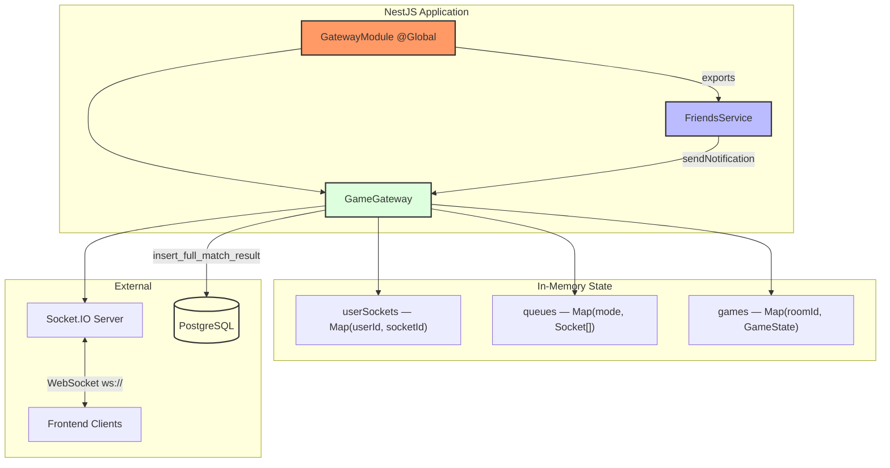
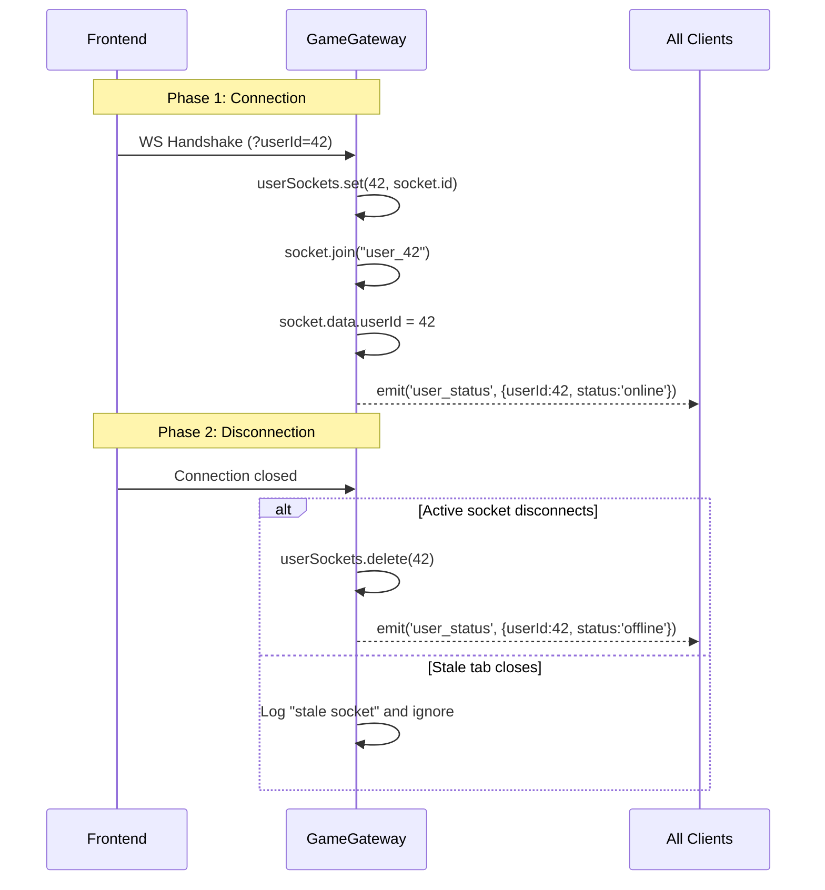
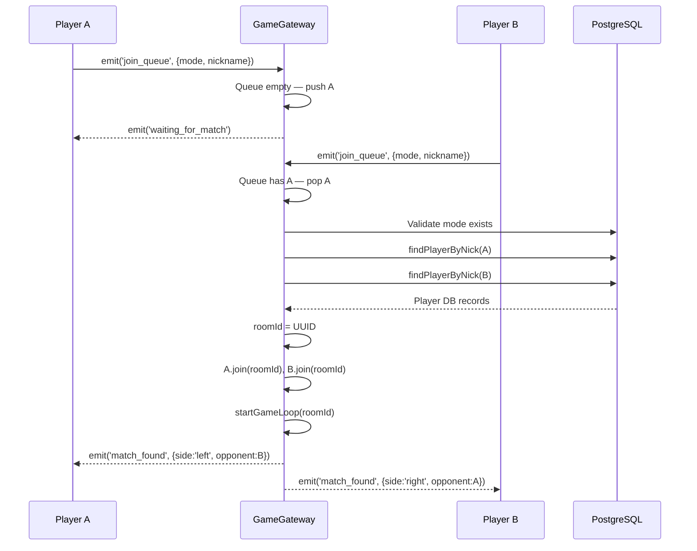
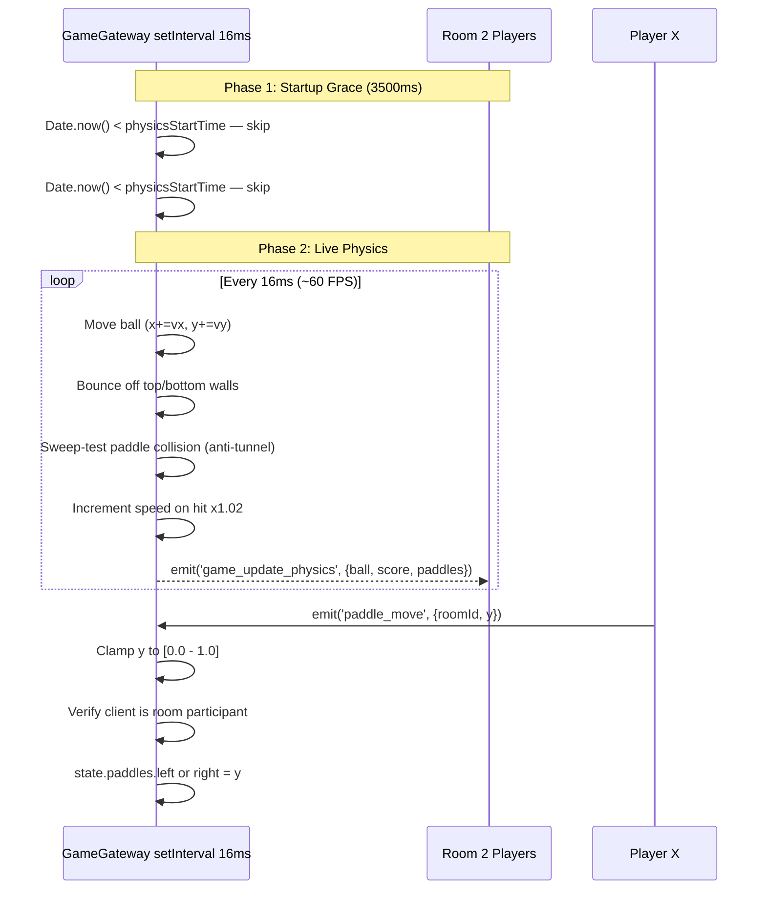
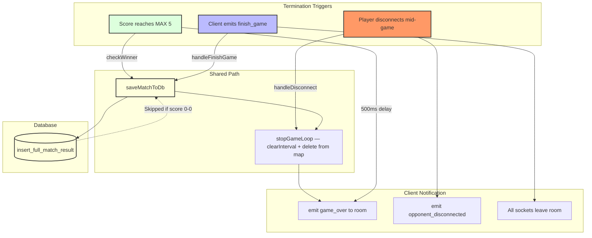
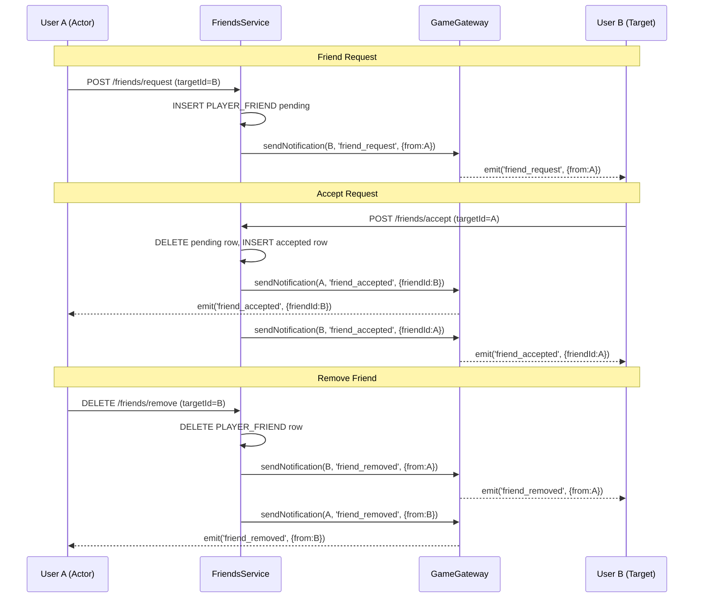
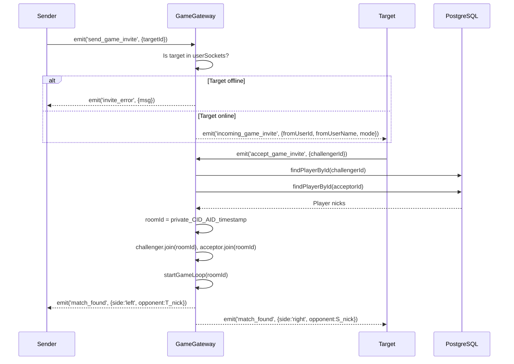

# WebSocket System - Documentation

## Overview

The WebSocket system provides real-time, bidirectional communication between the server and all connected clients. Built on top of **Socket.IO** and **NestJS Gateways**, it powers four critical features of the platform simultaneously: live Pong game state synchronization, user online/offline presence tracking, instant social notifications (friend requests, acceptances, removals, and game invitations), and the **real-time direct messaging (Chat) system**.

---

## Evaluation Module Mapping

This document serves as the primary technical evidence for two separate Major Modules in the project rubric:

### 1. Real-time features using WebSockets (Web Module)
*Fulfilled by the core Socket.IO integration and the unified `GameGateway` event loop.*
* **Zero Polling:** The entire platform operates without client-side polling. Every live feature is pushed from the server.
* **Global Presence:** The system accurately tracks user connections and broadcasts online/offline status platform-wide.
* **Instant Social Interactions:** Powers the real-time delivery of chat messages, friend requests, and private game invitations instantly across multiple browser tabs.

### 2. Remote players - Real-time multiplayer (Gaming & User Experience Module)
*Fulfilled by the matchmaking queue and the server-authoritative physics loop.*
* **Synchronized Gameplay:** Handles bidirectional streams for paddle inputs (Client → Server) and ball physics updates (Server → Client) at ~60 FPS.
* **Matchmaking & Lobbies:** Automatically pairs players in queues and generates private UUID-based WebSocket rooms for their matches.
* **Anti-Cheat & Resilience:** The server dictates the ultimate game state (preventing client-side manipulation) and safely handles mid-game network disconnections without crashing.

---

## System Architecture Diagram

The following Mermaid diagram illustrates the overall module structure and the flow of responsibility across the WebSocket system.



---

## Flow Diagrams

### 1. Connection & Presence

The following diagram illustrates the sequence of operations when a client connects and disconnects, and how presence is broadcast to all other clients.



---

### 2. Matchmaking Queue

The following diagram illustrates the sequence of operations when two players join the matchmaking queue and a match is found.



---

### 3. Game Loop & Physics

The following diagram illustrates the server-authoritative game loop, physics updates, and paddle input handling.



---

### 4. Game Termination

The following diagram illustrates the three termination paths a match can follow and the shared database persistence step.



---

### 5. Social Notifications

The following diagram illustrates how `FriendsService` uses the gateway to deliver real-time notifications to users for friend requests, acceptances, and removals.



---

### 6. Private Game Invitations

The following diagram illustrates the sequence of operations for sending and accepting a private game invitation between two users.



---

## Files Involved

```
srcs/backend/src/
│
├── gateway.module.ts          ← @Global NestJS module, exports GameGateway
├── game.gateway.ts            ← Core WebSocket gateway (all logic lives here)
│
└── friends/
    └── friends.service.ts     ← Injects GameGateway to send social notifications
```

---

## Module Details

### 1. `gateway.module.ts`

**Purpose:** Registers `GameGateway` as a globally available provider so any module in the application can inject it without re-importing `GatewayModule`.

```typescript
@Global()
@Module({
  providers: [GameGateway],
  exports: [GameGateway],
})
export class GatewayModule {}
```

The `@Global()` decorator is the key design decision here. Without it, every module that needs to push real-time notifications (e.g., `FriendsModule`) would need to explicitly import `GatewayModule` in its own `@Module` imports array. With it, a single registration in `AppModule` suffices.

---

### 2. `game.gateway.ts` — In-Memory State

Three `Map` structures hold all runtime state:

| Map | Key | Value | Purpose |
|-----|-----|-------|---------|
| `userSockets` | `userId: number` | `socketId: string` | Maps a DB user ID to their active socket |
| `queues` | `mode: string` | `Socket[]` | Waiting players per game mode |
| `games` | `roomId: string` | `GameState` | Full physics state for each live match |

**`GameState` interface:**

```typescript
interface GameState {
  roomId: string;
  playerLeftDbId: number;   // DB primary key (for final INSERT)
  playerRightDbId: number;
  playerLeftId: string;     // Socket ID (for disconnect detection)
  playerRightId: string;
  ball: {
    x: number;   // 0.0 – 1.0 normalized
    y: number;
    vx: number;  // velocity per frame
    vy: number;
    speed: number;
  };
  paddles: {
    left: number;   // Y center, 0.0 – 1.0
    right: number;
  };
  score: [number, number];   // [left, right]
  stats: {
    totalHits: number;
    maxRally: number;
    startTime: Date;
  };
  intervalId?: NodeJS.Timeout;
}
```

---

### 3. Physics Constants

| Constant | Value | Description |
|----------|-------|-------------|
| `PADDLE_HEIGHT` | `0.2` | Paddle height as fraction of screen |
| `INITIAL_SPEED` | `0.01` | Starting ball speed per frame |
| `SPEED_INCREMENT` | `1.02` | Speed multiplier per paddle hit (+2%) |
| `MAX_SCORE` | `5` | Points needed to win |
| `PADDLE_MARGIN` | `0.035` | X distance of paddle face from edge |

---

### 4. `sendNotification()` — Public API

Any NestJS service that injects `GameGateway` can call this method to push arbitrary events to a specific user, regardless of how many browser tabs they have open:

```typescript
public sendNotification(targetUserId: number, event: string, payload: any) {
  // Targets the named room "user_<id>" — works across multiple tabs
  this.server.to(`user_${targetUserId}`).emit(event, payload);
}
```

**Usage from `FriendsService`:**
```typescript
constructor(private readonly gateway: GameGateway) {}

// On friend request:
this.gateway.sendNotification(targetId, 'friend_request', { from: userId });

// On accept — notifies BOTH sides:
this.gateway.sendNotification(targetId, 'friend_accepted', { friendId: userId });
this.gateway.sendNotification(userId,   'friend_accepted', { friendId: targetId });

// On remove — notifies BOTH sides:
this.gateway.sendNotification(targetId, 'friend_removed', { from: userId });
this.gateway.sendNotification(userId,   'friend_removed', { from: targetId });
```

---

### 5. `isUserOnline()` — Presence Query

A synchronous helper consumed by `FriendsService` to enrich friend list responses with live presence data:

```typescript
public isUserOnline(userId: number): boolean {
  return this.userSockets.has(userId);
}
```

**Usage in `FriendsService.getFriends()`:**
```typescript
const enrichedResult = result.map((friend: any) => ({
  ...friend,
  status: this.gateway.isUserOnline(Number(friend.friend_id)) ? 'online' : 'offline'
}));
```

This avoids a round-trip to the database — presence is derived from the live in-memory map.

---

## Event Reference

### Events Received (Client → Server)

| Event | DTO / Payload | Handler | Description |
|-------|--------------|---------|-------------|
| `join_queue` | `{ mode: string, nickname: string }` | `handleJoinQueue()` | Enter matchmaking queue for a game mode |
| `paddle_move` | `{ roomId: string, y: number }` | `handlePaddleMove()` | Update paddle Y position (clamped 0–1) |
| `finish_game` | `{ roomId: string, winnerId: string }` | `handleFinishGame()` | Signal game end (forfeit or manual stop) |
| `send_game_invite` | `{ targetId: number }` | `handleSendInvite()` | Send a private game invitation |
| `accept_game_invite` | `{ challengerId: number }` | `handleAcceptInvite()` | Accept invitation and start private match |
| `send_message` | `{ receiverId: number, content: string }` | `handleSendMessage()` | Route a direct chat message to another user |

### Events Emitted (Server → Client)

| Event | Payload | Audience | Description |
|-------|---------|----------|-------------|
| `user_status` | `{ userId, status: 'online' \| 'offline' }` | All clients | Presence broadcast on connect/disconnect |
| `waiting_for_match` | `{ message, mode }` | Queued player only | Confirms player is in the waiting queue |
| `match_found` | `{ roomId, matchId, side, opponent, ballInit }` | Both matched players | Signals start of a match, assigns sides |
| `game_update_physics` | `{ ball: {x,y}, score, paddles: {left,right} }` | Room | Authoritative game state at ~60 FPS |
| `score_updated` | `{ score: [number, number] }` | Room | Immediate score change notification on goal |
| `game_over` | `{ winner: 'left' \| 'right' }` | Room | Match ended, indicates winning side |
| `opponent_disconnected` | _(none)_ | Room | Remaining player's opponent left mid-game |
| `incoming_game_invite` | `{ fromUserId, fromUserName, mode }` | Target user | Private game invitation received |
| `invite_error` | `{ msg: string }` | Sender | Target user is offline or unreachable |
| `friend_request` | `{ from: userId, msg }` | Target user | Incoming friend request notification |
| `friend_accepted` | `{ friendId, msg }` | Both parties | Friendship confirmed notification |
| `friend_removed` | `{ from: userId, msg }` | Both parties | Friendship removed notification |
| `receive_message` | `{ id, senderId, content, createdAt }` | Target user | Incoming direct chat message |

---

## Connection Lifecycle

### Frontend Connection Snippet

```typescript
import { io } from 'socket.io-client';

// Relative path ensures Nginx handles the secure WSS upgrade dynamically
const socket = io('/', {
  transports: ['websocket'],
  query: { userId: currentUser.id }  // ← Required for presence tracking
});

// Presence
socket.on('user_status', ({ userId, status }) => {
  updateFriendStatus(userId, status);
});

// Social & Chat
socket.on('friend_request',  (data) => showNotification(data));
socket.on('receive_message', (message) => appendToChatAndFormatLocalTime(message));

// Game invitation
socket.on('incoming_game_invite', (data) => showInviteModal(data));
```

### Multi-Tab Handling

A deliberate guard prevents a closing stale tab from marking a user as offline when they have another tab still open:

```typescript
handleDisconnect(client: Socket) {
  const currentSocketId = this.userSockets.get(userId);

  // Only act if THIS socket is the registered active one
  if (currentSocketId === client.id) {
    this.userSockets.delete(userId);
    this.server.emit('user_status', { userId, status: 'offline' });
  }
  // Otherwise: stale tab — ignore.
}
```

The `user_<id>` room (joined in `handleConnection`) ensures that if a user does have two tabs, any targeted notification via `sendNotification()` reaches both tabs simultaneously.

---

## Database Persistence

When a match concludes (by score, forfeit, or disconnect), `saveMatchToDb()` calls the PostgreSQL stored function `insert_full_match_result`, which atomically writes to three tables: `MATCH`, `COMPETITOR`, and `METRICS`.

```typescript
await this.db.execute(sql`
  SELECT insert_full_match_result(
    ${MODE_REMOTE_ID}::smallint,
    ${state.stats.startTime.toISOString()}::timestamp,
    ${durationMs}::integer,
    ${winnerPk}::integer,
    ${state.playerLeftDbId}::integer,
    ${state.score[0]}::float,
    ${state.playerRightDbId}::integer,
    ${state.score[1]}::float,
    ${state.stats.totalHits}::float
  )
`);
```

**Edge cases handled:**
- `score[0] === 0 && score[1] === 0` → skipped (no meaningful data)
- Tie (simultaneous disconnect) → left player assigned as fallback winner
- DB error → logged, does not crash the gateway

---

## Security Considerations

### Input Validation

All incoming WebSocket message bodies are validated through NestJS `ValidationPipe` with `whitelist: true`, applied at the gateway class level:

```typescript
@UsePipes(new ValidationPipe({ whitelist: true }))
@WebSocketGateway({ ... })
export class GameGateway { ... }
```

This means any property not declared in the DTO is silently stripped before reaching the handler.

### Coordinate Clamping

Paddle positions sent by clients are sanitized server-side before being applied to game state:

```typescript
newY = Math.max(0, Math.min(1, newY));
```

This prevents a client from teleporting their paddle outside the valid range, regardless of what the frontend sends.

### No Unauthenticated Game State Modification

Handlers verify that the requesting socket is actually a participant of the target room before applying changes:

```typescript
if (client.id === game.playerLeftId) {
  game.paddles.left = newY;
} else if (client.id === game.playerRightId) {
  game.paddles.right = newY;
}
// Otherwise: silently ignored
```

### CORS

Currently set to `origin: '*'` for development. Should be restricted to the frontend origin in production.

### WSS and Nginx Reverse Proxy
To comply with strict security constraints and avoid browser SSL certificate errors on local networks, the frontend does not connect to the backend's raw port (3000). Instead, the frontend uses relative paths (`io('/')`). 

An **Nginx Reverse Proxy** acts as the single point of entry over HTTPS (port 443/8443) and handles the WebSocket protocol upgrade using the following configuration:

```nginx
location ~ ^/(...|socket\.io) {
    proxy_pass http://backend:3000;
    proxy_http_version 1.1;
    proxy_set_header Upgrade $http_upgrade;
    proxy_set_header Connection "Upgrade";
}
```
---

## Performance

### Broadcasting Strategy

| Scenario | Method | Scope |
|----------|--------|-------|
| Game physics (~60 FPS) | `server.to(roomId).emit(...)` | Room (2 players) |
| Score update | `server.to(roomId).emit(...)` | Room (2 players) |
| Presence change | `server.emit(...)` | All connected clients |
| Notification | `server.to("user_X").emit(...)` | Specific user's room |

Physics updates are intentionally scoped to `roomId` rooms — a broadcast that reaches only the two players in a match, not every connected user on the platform.

### Game Loop Timing

A 3,500 ms grace period before physics processing begins allows both clients to render the countdown animation before the ball starts moving. After that, the server loop runs at 16 ms intervals (~60 FPS) and the client renders whatever state arrives.

---

## Troubleshooting

### Issue: User appears offline immediately after reconnecting

**Cause:** The new socket's ID may have been registered before the old socket's disconnect fired.  
**Check:** Confirm the guard `currentSocketId === client.id` is in place in `handleDisconnect()`. The multi-tab logic handles this automatically.

### Issue: Notifications not received

**Check:**
1. Is `userId` being passed in the connection query? (`io(URL, { query: { userId } })`)
2. Is the user's socket in `userSockets` map? (Check gateway logs for `✅ Cliente conectado`)
3. Was the `@Global()` decorator applied to `GatewayModule`? Without it, the injected gateway in `FriendsService` may be a different instance.

### Issue: Game physics desync between players

**Check:**
1. Is the client using `websocket` transport only? Polling introduces variable latency.
2. Does the client render `game_update_physics` events immediately without extra interpolation delay?

### Issue: Match not saved to database after game ends

**Check:**
1. Did both players have valid entries in the `player` table when the match started?
2. Was the final score `0-0`? Those are intentionally skipped.
3. Check backend logs for `❌ Error guardando partida en DB`.

### Issue: Chat messages show incorrect time (Timezone Desync)

**Cause:** The backend stores and emits `createdAt` timestamps in absolute UTC. If displayed directly, messages appear to be from the future or past depending on the user's location.  
**Check:** Ensure the frontend explicitly parses the ISO string as UTC (appending `Z` if necessary) and uses `Date.toLocaleTimeString()` to convert the timestamp to the client's local timezone before rendering.

---

## Testing Checklist

### Connection
- [ ] Client connects with `userId` query param and appears online
- [ ] `user_status { online }` broadcast received by other clients
- [ ] Client disconnects and `user_status { offline }` is broadcast
- [ ] Closing one of two open tabs does not trigger `offline` event

### Matchmaking
- [ ] First player to join receives `waiting_for_match`
- [ ] Second player triggers `match_found` for both
- [ ] `side: 'left'` and `side: 'right'` are assigned correctly
- [ ] Joining the same mode twice does not match a player against themselves

### Game Physics
- [ ] Ball position updates arrive at ~60 FPS
- [ ] Ball bounces off top and bottom walls
- [ ] Paddle hit redirects ball with angle variation
- [ ] Ball speed increases after each paddle hit
- [ ] Scoring increments correct player's score
- [ ] `score_updated` fires on each goal
- [ ] Game ends when a player reaches 5 points
- [ ] `game_over` fires 500 ms after final point

### Disconnection Mid-Game
- [ ] `opponent_disconnected` event received by remaining player
- [ ] Game loop stops and room is cleaned up

### Social Notifications
- [ ] `friend_request` received by target immediately after POST
- [ ] `friend_accepted` received by **both** parties
- [ ] `friend_removed` received by **both** parties

### Game Invitations
- [ ] `incoming_game_invite` received by online target
- [ ] `invite_error` sent to sender if target is offline
- [ ] Accepting invite starts a private match with correct sides

---

## Future Enhancements

1. **JWT Authentication** — Validate a token during the WebSocket handshake instead of trusting `userId` from the query string
2. **Reconnection Recovery** — Allow a disconnected player to rejoin an active match within a grace period
3. **Spectator Mode** — Let other users join a room as read-only observers
4. **Tournament Bracket Sync** — Emit bracket updates in real time as matches conclude
5. **Rate Limiting** — Throttle `paddle_move` events per socket to prevent abuse
6. **Redis Adapter** — Replace in-memory Maps with a Redis adapter to support horizontal scaling across multiple server instances

---

## Summary

The WebSocket system is the real-time nervous system of the platform. A single `GameGateway` class serves four responsibilities at once — presence tracking, game state synchronization, social event delivery, and direct messaging (Chat) — without any polling or page refreshes on the client side.

- ✅ **Real-time** — All game, presence, chat, and social events arrive in under a network round-trip
- ✅ **Authoritative** — Server owns the game state; clients send intent only
- ✅ **Resilient** — Multi-tab, stale socket, and mid-game disconnect cases are all handled
- ✅ **Efficient** — Physics broadcasts are scoped to 2-player rooms, not the full user base
- ✅ **Extensible** — Any service can push notifications via the injected `sendNotification()` API
- ✅ **Validated** — All incoming payloads pass through `ValidationPipe` with whitelisting

**Core files:** 2  
**Events handled:** 6 inbound, 12 outbound  
**Transport:** WebSocket (no polling)  
**Game loop:** ~60 FPS, server-authoritative

**Result:** Production-grade real-time infrastructure powering gameplay, presence, chat, and social interactions simultaneously.

---

[⬅ Return to Main modules table](../../../README.md#modules)