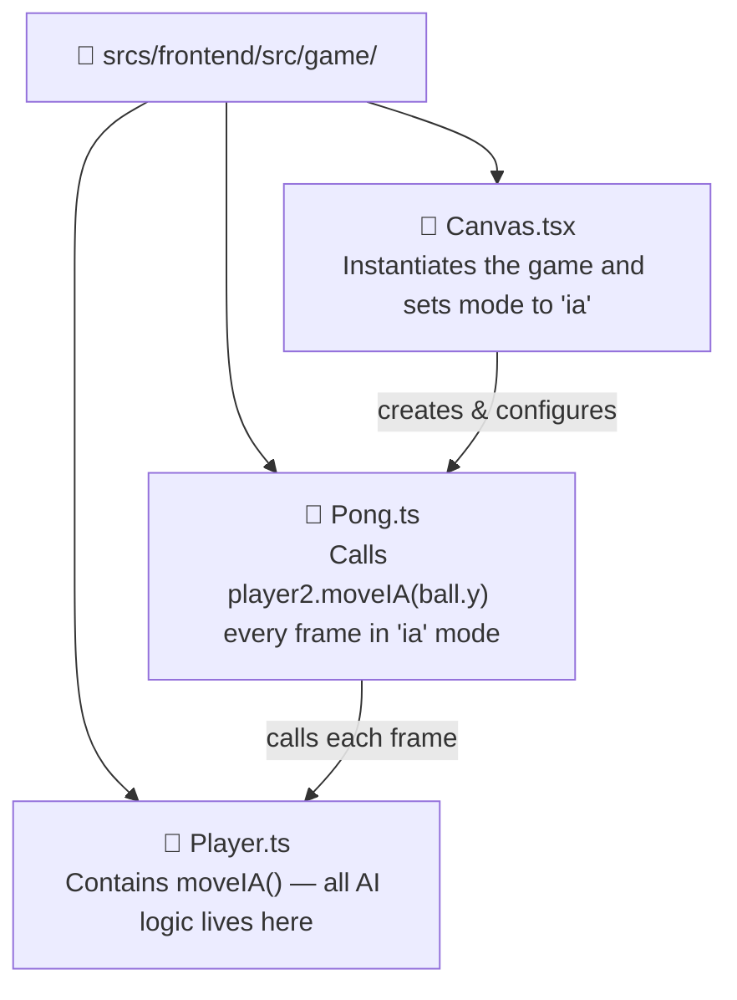
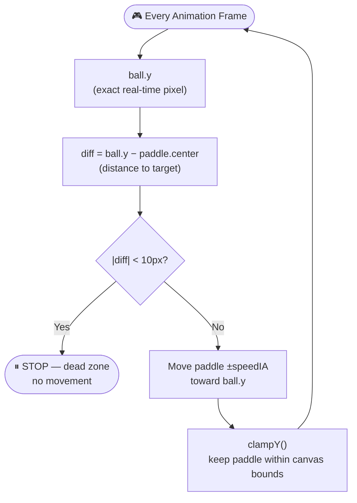

# AI Opponent System — Documentation

## Overview

The AI Opponent module is a **Major** requirement under the *Artificial Intelligence* category of the ft_transcendence subject (2 pts). It must satisfy three hard constraints:

- The AI **must be challenging** and able to win occasionally.
- The AI **must simulate human-like behaviour** — not perfect play.
- If game customization options exist, the AI **must be able to use them**.

This document describes the current implementation, identifies its compliance gaps, and proposes concrete improvements.

---

## Current Implementation

### Files Involved



### How It Works

The entire AI is a single method in `Player.ts`:

```typescript
moveIA(ballPosition: number)
{
    const center = this.y + this.height / 2;
    const diff = ballPosition - center;

    // Dead zone of 10px to avoid vibration
    if (Math.abs(diff) < 10) return;

    if (Math.abs(diff) > this.speedIA)
        this.y += this.speedIA * Math.sign(diff);
    else
        this.y += diff;
    this.clampY();
}
```

The AI paddle receives the **exact real-time Y position of the ball** every frame and moves toward it at `speedIA = 5` (half the human player speed of `10`). A 10 px dead zone prevents micro-jitter when the ball is centred.

### Game Loop Call (Pong.ts)

```typescript
// IA mode — called every animation frame
if (this.mode === 'ia') {
    this.handleLocalInput(this.player1, 'w', 's');
    this.player2.moveIA(this.ball.y);   // ← AI step
    this.ball.update([this.player1, this.player2]);
    this.checkLocalWin();
}
```

---

## Compliance Analysis

| Subject Requirement | Status | Notes |
|---|---|---|
| AI must be challenging and win occasionally | ⚠️ Partial | The AI can win because its speed is lower than perfect, but it never misses intentionally |
| AI must simulate human-like behaviour (not perfect play) | ⚠️ Partial | Speed cap creates imperfection, but there is no randomness, reaction delay, or prediction error |
| AI must use game customization options | ❌ Missing | Ball speed, paddle size, and score limit changes do not affect AI behaviour |
| Explainable during evaluation | ✅ OK | Simple enough to explain in 60 seconds |

### Identified Weaknesses

**1. No randomness or intentional error**
The AI always moves in the mathematically correct direction. If the ball moves slowly enough for `speedIA` to keep up, the AI never misses. A human always makes occasional errors.

**2. No reaction delay**
The AI reads the ball position at the exact pixel every frame. Real humans have a reaction time of ~150–300 ms. Without a delay, the AI behaves like a machine, not a person.

**3. No ball trajectory prediction**
A skilled human player anticipates *where the ball will be* when it arrives, not just where it is now. The current AI only tracks the present Y coordinate.

**4. No difficulty system**
There is a single fixed `speedIA = 5`. There is no way to tune the AI for different skill levels or game modes.

**5. Customization blindness**
If ball speed is increased via game customization, the AI does not compensate or change its behaviour. The AI is unaware of any game settings.

---

## Flow Diagram — Current AI Decision Loop



---

## Proposed Improvements

> The following section proposes concrete enhancements to make the AI fully compliant with the subject requirements and more interesting to play against.

---

### 1. Reaction Delay — Simulating Human Response Time

Introduce a **frame buffer** that delays the ball position seen by the AI by a configurable number of frames. This simulates the natural lag between seeing the ball and reacting.

```typescript
// In Player.ts — add a position history buffer
private ballHistory: number[] = [];
private reactionFrames: number = 8; // ~133ms at 60fps

moveIA(ballPosition: number): void {
    this.ballHistory.push(ballPosition);
    if (this.ballHistory.length > this.reactionFrames) {
        this.ballHistory.shift();
    }

    // AI reacts to where the ball WAS, not where it IS now
    const perceivedY = this.ballHistory[0] ?? ballPosition;

    const center = this.y + this.height / 2;
    const diff = perceivedY - center;
    if (Math.abs(diff) < 10) return;

    if (Math.abs(diff) > this.speedIA)
        this.y += this.speedIA * Math.sign(diff);
    else
        this.y += diff;
    this.clampY();
}
```

**Impact:** The AI now lags behind fast ball changes, causing it to miss deflections it "didn't see in time" — exactly like a human player under pressure.

---

### 2. Intentional Error System — Controlled Imperfection

Add a small random offset that drifts over time and occasionally causes the AI to aim slightly away from the perfect intercept point. This guarantees the AI is not perfect even at full speed.

```typescript
private errorOffset: number = 0;
private errorTimer: number = 0;

moveIA(ballPosition: number): void {
    // Drift the error offset every ~30 frames
    this.errorTimer++;
    if (this.errorTimer > 30) {
        this.errorTimer = 0;
        // Random drift in the range of ±20px
        this.errorOffset = (Math.random() - 0.5) * 40;
    }

    const target = ballPosition + this.errorOffset;
    const center = this.y + this.height / 2;
    const diff = target - center;

    if (Math.abs(diff) < 10) return;

    if (Math.abs(diff) > this.speedIA)
        this.y += this.speedIA * Math.sign(diff);
    else
        this.y += diff;
    this.clampY();
}
```

**Impact:** Even when the AI is fast enough to reach the ball, it sometimes aims for the wrong spot. This creates genuine misses and believable "human mistakes".

---

### 3. Difficulty Levels — Tuning the AI

Expose a difficulty setting that adjusts both speed and error magnitude. This also allows the AI to use **game customization options** indirectly (a harder AI compensates for faster balls, easier AI does not).

```typescript
export type AIDifficulty = 'easy' | 'medium' | 'hard';

// In Player constructor or via a setter:
setDifficulty(level: AIDifficulty): void {
    switch (level) {
        case 'easy':
            this.speedIA = 3;
            this.reactionFrames = 15;  // ~250ms lag
            this.maxErrorOffset = 60;
            break;
        case 'medium':
            this.speedIA = 5;
            this.reactionFrames = 8;   // ~133ms lag
            this.maxErrorOffset = 30;
            break;
        case 'hard':
            this.speedIA = 8;
            this.reactionFrames = 3;   // ~50ms lag
            this.maxErrorOffset = 10;
            break;
    }
}
```

**Impact:** Provides a proper difficulty spectrum. Easy AI misses often and reacts slowly. Hard AI is fast and sharp but still makes small errors. The AI is now meaningfully "challenging" at the hard level.

---

### 4. Ball Trajectory Prediction — Smarter Target Calculation

Instead of tracking the ball's current Y, predict where the ball **will be** when it reaches the AI's paddle X position. This is closer to what a skilled human player actually does mentally.

```typescript
predictBallY(ballX: number, ballY: number, ballVX: number, ballVY: number, canvasHeight: number): number {
    // Steps needed to reach our paddle
    if (ballVX === 0) return ballY;
    const stepsToReach = (this.x - ballX) / ballVX;

    let predictedY = ballY + ballVY * stepsToReach;

    // Simulate wall bounces
    predictedY = predictedY % (canvasHeight * 2);
    if (predictedY < 0) predictedY += canvasHeight * 2;
    if (predictedY > canvasHeight) predictedY = canvasHeight * 2 - predictedY;

    return predictedY;
}
```

**Impact:** The AI no longer just chases — it positions itself proactively. Combined with the error offset and reaction delay, this makes it feel like a thinking opponent rather than a tracking cursor.

---

### 5. Customization Awareness — Completing the Subject Requirement

If game customization options exist (ball speed, paddle size, score limit), the AI must adapt. The cleanest approach is to pass game settings into the AI on initialisation and scale its parameters accordingly.

```typescript
applyGameCustomization(ballSpeed: number, paddleSize: number): void {
    // Scale AI reaction to compensate for faster balls
    const speedFactor = ballSpeed / DEFAULT_BALL_SPEED;
    this.reactionFrames = Math.max(2, Math.round(8 / speedFactor));

    // Scale error zone proportionally to paddle size
    const sizeFactor = paddleSize / DEFAULT_PADDLE_HEIGHT;
    this.maxErrorOffset = 30 / sizeFactor;
}
```

**Impact:** This directly satisfies the subject requirement — *"If you implement game customization options, the AI must be able to use them."* A faster ball means a sharper AI. A larger paddle grants more error tolerance.

---

## Summary Table — Before vs After

| Feature | Current | Proposed |
|---|---|---|
| Ball tracking | Real-time exact Y | Delayed Y (reaction buffer) |
| Error / imperfection | None (only speed cap) | Random drift offset |
| Difficulty | Fixed `speedIA = 5` | Easy / Medium / Hard presets |
| Prediction | None (reactive only) | Trajectory bounce prediction |
| Customization awareness | None | Adapts speed & error to game settings |
| Subject compliance | ⚠️ Partial | ✅ Full |

---

*Documentation generated for ft_transcendence — AI Opponent Module (Major, 2 pts)*

[Return to Main modules table](../../../README.md#modules)