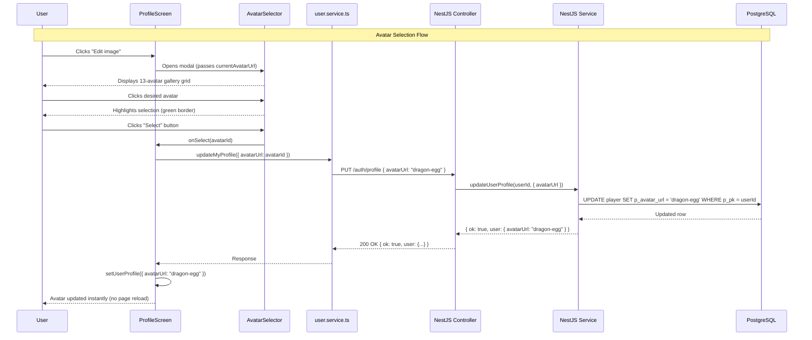
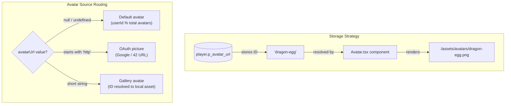

# Avatar System

## Executive Summary

The avatar system provides every player on the Transcendence platform with a persistent, visually distinctive identity marker displayed across all screens — profile page, game lobby, leaderboards, and chat. Rather than handling raw image uploads, the system stores a lightweight avatar **ID** (e.g. `"dragon-egg"`) in the database and resolves it at render time to the corresponding bundled asset. This design keeps the database footprint minimal, remains portable across environments, and is fully compatible with externally hosted OAuth profile pictures returned by Google or 42 School.

---

## Evaluation Justification: User Management Module
This module directly fulfills the requirements for the Major Module: **"Standard user management and authentication"**. 
Specifically, it handles the visual identity and personalization aspect of the user's account by implementing:
* **Identity Customization:** Users can securely update their profile identity by selecting a custom avatar from a curated gallery.
* **OAuth Integration:** The system natively supports and resolves external profile pictures provided by third-party authenticators (42 School and Google).
* **Efficient Account Data:** By storing lightweight string IDs rather than raw image files, the system ensures optimal performance during user data retrieval and database management.

---

## System Architecture Diagram





---

## File Map

### Frontend

```
srcs/frontend/src/
│
├── assets/avatars/
│   ├── index.ts               ← Registry: exports getAvatarList(), getAvatarUrlById(), getDefaultAvatar()
│   ├── adventure.png
│   ├── archer.png
│   ├── armor.png
│   └── ... (13 PNG files total)
│
├── components/
│   ├── Avatar.tsx             ← Display component: resolves ID → URL, handles fallbacks
│   └── AvatarSelector.tsx     ← Modal gallery: grid layout, selection feedback, i18n
│
├── screens/
│   └── ProfileScreen.tsx      ← Hosts avatar display and triggers the selector modal
│
└── services/
    └── user.service.ts        ← API client: updateMyProfile(), getMyProfile()
```

### Backend

```
srcs/backend/src/auth/
├── auth.controller.ts         ← PUT /auth/profile  |  GET /auth/profile
└── auth.service.ts            ← updateUserProfile(), findUserById()
```

### Database

```
PostgreSQL
└── Table: player
    └── p_avatar_url  VARCHAR(500)  NULLABLE   ← avatar ID or OAuth URL
```

---

## Component Reference

### `assets/avatars/index.ts`

Central registry. Vite's `import.meta.glob` loads all PNG files at build time, so dropping a new image into the folder is the only step required to make it available in the gallery.

| Function | Signature | Description |
|---|---|---|
| `getAvatarList` | `() → AvatarInfo[]` | Returns all avatars as `{ id, url, index, name }` objects |
| `getAvatarUrlById` | `(id: string) → string \| null` | Resolves an ID to its absolute asset URL |
| `getDefaultAvatar` | `(userId: number) → string` | Deterministic default: `userId % avatarCount` ensures the same user always receives the same fallback |

```typescript
// Example usage
const url = getAvatarUrlById("dragon-egg");
// → "/src/assets/avatars/dragon-egg.png"

const fallback = getDefaultAvatar(14);
// userId 14 with 13 avatars → index 1 → Avatar 2 URL
```

---

### `Avatar.tsx`

Stateless display component with automatic error handling and loading states. Accepts either a raw OAuth URL, a gallery ID, or `null`/`undefined`, and resolves each case transparently.

**Props**

| Prop | Type | Default | Description |
|---|---|---|---|
| `src` | `string \| null` | — | Avatar URL, gallery ID, or null |
| `userId` | `number` | — | Used to compute the deterministic fallback |
| `size` | `number` | `80` | Rendered width and height in pixels |
| `alt` | `string` | `'User avatar'` | Accessibility alt text |

**Resolution Logic**

```typescript
if (!src || imgError) {
    → getDefaultAvatar(userId)                    // Fallback
} else if (src.startsWith('http://') || src.startsWith('https://')) {
    → use src directly                            // OAuth picture
} else {
    → getAvatarUrlById(src) || getDefaultAvatar() // Gallery ID
}
```

**Features**
- Automatic error handling with fallback to default avatar
- Loading indicator for external OAuth images
- `onError`, `onLoad`, `onLoadStart` handlers for robust image loading
- Circular container with `overflow: hidden` and `borderRadius: 50%`

---

### `AvatarSelector.tsx`

Modal component rendered inside `ProfileScreen` when the user clicks the edit button. Uses a fixed overlay with grid layout for responsive avatar display.

**Props**

| Prop | Type | Description |
|---|---|---|
| `currentAvatarUrl` | `string \| null` | Pre-selects the current avatar in the grid (if not an OAuth URL) |
| `onSelect` | `(avatarId: string) → void` | Called with the chosen avatar ID when the user confirms |
| `onCancel` | `() → void` | Called when the user dismisses the modal |

**Behaviour**
- Displays all gallery avatars in a responsive grid (`repeat(auto-fill, minmax(120px, 1fr))`)
- Highlights the selected avatar with a 3px green border (`#4CAF50`)
- Hover effect changes background color for non-selected avatars
- Confirm button is disabled until a selection is made
- Fully internationalized: button labels and headings adapt to the active locale
- Debug logging for selection events

---

## API Reference

| Method | Endpoint | Auth | Description |
|---|---|---|---|
| `GET` | `/auth/profile` | JWT | Returns `avatarUrl` (and other profile fields) for the authenticated user |
| `PUT` | `/auth/profile` | JWT | Updates one or more profile fields including `avatarUrl` |

**GET `/auth/profile` — Response**

```json
{
  "id": 51,
  "nick": "archduke",
  "email": "archduke@example.com",
  "birth": "1995-07-12",
  "country": "ES",
  "lang": "en",
  "avatarUrl": "dragon-egg",
  "oauthProvider": null
}
```

**PUT `/auth/profile` — Request body** (all fields optional)

```json
{
  "nick": "archduke",
  "email": "archduke@example.com",
  "birth": "1995-07-12",
  "country": "ES",
  "lang": "en",
  "avatarUrl": "dragon-egg"
}
```

---

## Database Schema

**Table: `player`**

| Column | Type | Nullable | Notes |
|---|---|---|---|
| `p_avatar_url` | `VARCHAR(500)` | YES | Stores avatar gallery ID or full OAuth URL |

```sql
-- Migration: add column if upgrading from a schema without it
ALTER TABLE player
ADD COLUMN IF NOT EXISTS p_avatar_url VARCHAR(500);
```

---

## Data Flow Examples

### Example 1 — Regular user selects a gallery avatar

```
User clicks "dragon-egg" in AvatarSelector
    → AvatarSelector calls onSelect("dragon-egg")
    → ProfileScreen.handleAvatarSelect("dragon-egg")
    → PUT /auth/profile  { avatarUrl: "dragon-egg", ... }
    → UPDATE player SET p_avatar_url = 'dragon-egg' WHERE p_pk = 51
    → Response: { ok: true, user: { avatarUrl: "dragon-egg" } }
    → setUserProfile({ avatarUrl: "dragon-egg" })
    → setGlobalAvatarUrl("dragon-egg")
    → Avatar.tsx: "dragon-egg" → /assets/avatars/dragon-egg.png  ✅
```

### Example 2 — OAuth user replaces their provider picture with a gallery avatar

```
Initial state: avatarUrl = "https://cdn.intra.42.fr/users/fcatala-.jpg"

User selects "centaur" from gallery
    → PUT /auth/profile  { avatarUrl: "centaur" }
    → UPDATE player SET p_avatar_url = 'centaur' WHERE p_pk = 101
    → Avatar.tsx receives "centaur"
    → Does NOT start with "http" → resolves to gallery ID
    → getAvatarUrlById("centaur") → /assets/avatars/centaur.png  ✅
```

### Example 3 — New user with no avatar set

```
avatarUrl = null
    → Avatar.tsx: src is null
    → getDefaultAvatar(userId=14): 14 % 13 = 1 → Avatar 2
    → Renders: /assets/avatars/archer.png  (deterministic fallback) ✅
```

---

## Technical Decisions

### Why store IDs instead of full paths or base64?

| Strategy | Why rejected |
|---|---|
| Store full path (`/src/assets/avatars/dragon-egg.png`) | Path structure changes between dev and production builds |
| Store base64 | Inflates database rows; slow queries; images cannot be updated server-side |
| **Store ID (`dragon-egg`)** ✅ | Tiny footprint; environment-agnostic; compatible with OAuth URLs; images can be replaced without touching the database |

### Why modulo for default avatars?

Using `userId % avatarCount` produces a deterministic, uniform distribution with no database query. The same user always receives the same default regardless of session or device.

---

## Security Considerations

| Concern | Mitigation |
|---|---|
| SQL injection via `avatarUrl` | Drizzle ORM parameterized queries |
| Unauthorized profile updates | `JwtAuthGuard` ensures only the token owner can update their own row |
| Serving arbitrary external images | OAuth URLs originate from trusted providers (Google, 42); gallery IDs resolve only to bundled assets |

---

## Testing Checklist

### Frontend
- [x] Users with no avatar see a deterministic default
- [x] OAuth users see their provider picture before selecting a gallery avatar
- [x] Users with a gallery avatar see the correct image
- [x] "Edit image" button opens the selector modal
- [x] Modal renders all available avatars in a grid
- [x] "Select" button is disabled until an avatar is clicked
- [x] Avatar updates immediately without page reload
- [x] Page refresh preserves the selected avatar
- [x] UI labels display correctly in all 4 supported languages

### Backend
- [x] `PUT /auth/profile` with `avatarUrl` updates `p_avatar_url`
- [x] `GET /auth/profile` returns the current `avatarUrl`
- [x] `null` values are accepted
- [x] OAuth URLs are stored and returned unmodified
- [x] Request without a valid JWT is rejected with `401`

[Return to Main modules table](../../../README.md#modules)
