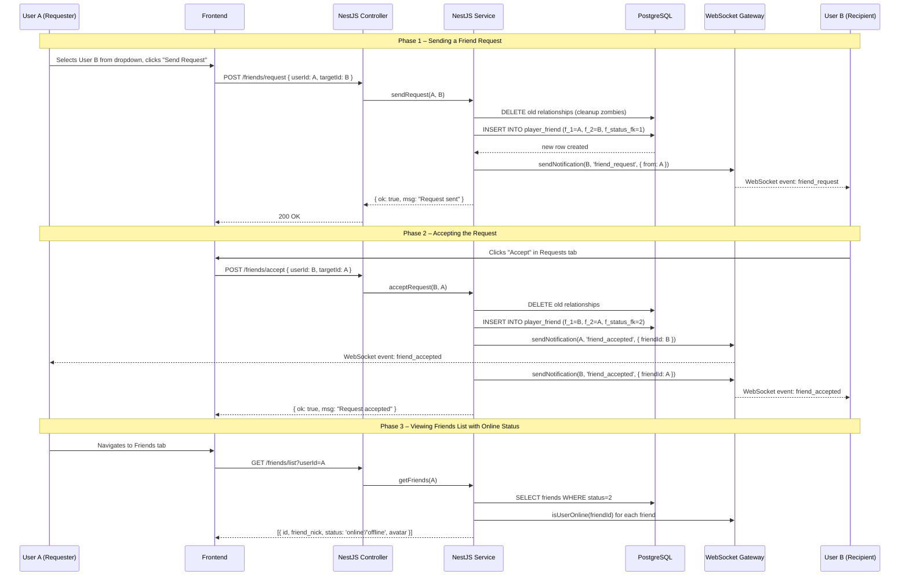
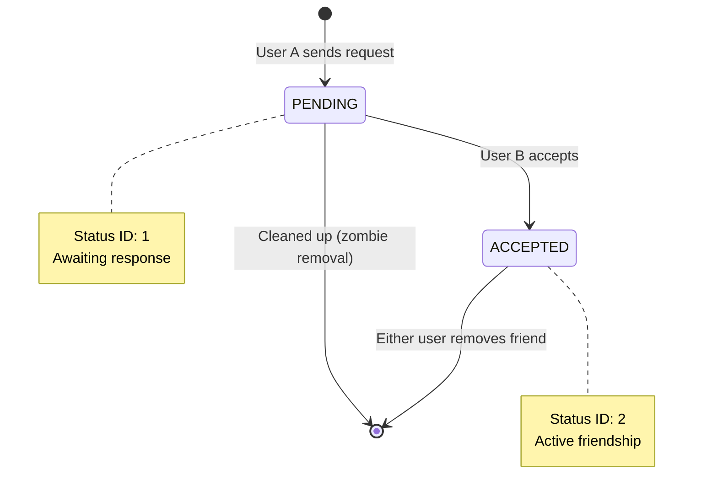

# Friends System

## Executive Summary

The friends system allows Transcendence players to build a social network within the platform. Users may send friend requests to other players, accept or decline incoming requests, view the live online status of confirmed friends, and remove friendships. All friendship state is persisted in the `player_friend` table with a status code drawn from the `friend_status` lookup table. Real-time presence information and friend request notifications are broadcast over WebSocket via the `GameGateway`, ensuring friends lists update instantly without polling.

---

## Evaluation Module Mapping

The Friends System provides foundational data and real-time events that satisfy two Major Modules:

### 1. Standard User Management (Relational State)
*Fulfilled by the `friends.service.ts` database operations and the `player_friend` table.*
* **State Persistence:** Manages the strict state-machine of relationships (`PENDING`, `ACCEPTED`, `BLOCKED`).
* **Data Integrity:** Ensures users cannot friend themselves and automatically cleans up orphaned/zombie requests using cascade rules.

### 2. Allow Users to Interact with Other Users (Social Actions)
*Fulfilled by the `GameGateway` WebSocket integration and `friends.controller.ts` endpoints.*
* **Real-Time Presence:** Tracks and broadcasts whether a friend is currently online or offline.
* **Live Notifications:** Alerts users instantly when a friend request is sent, accepted, or removed, encouraging immediate social interaction.

---

## System Architecture Diagram





---

## File Map

### Frontend

```
srcs/frontend/src/
│
├── screens/
│   └── ProfileScreen.tsx      ← Friends tab: list, requests, send invites, remove friends
│
├── services/
│   └── friend.service.ts      ← API client: getFriends(), sendRequest(), acceptRequest(), etc.
│
└── components/
    └── Avatar.tsx             ← Renders friend avatars with online status indicators
```

### Backend

```
srcs/backend/src/
│
├── friends/
│   ├── friends.controller.ts  ← REST endpoints for friends CRUD
│   ├── friends.service.ts     ← Business logic: send, accept, block, list, remove
│   ├── friends.module.ts      ← Module definition, imports DatabaseModule + GatewayModule
│   └── friends.dto.ts         ← Validation DTO
│
└── game.gateway.ts            ← WebSocket: sendNotification(), isUserOnline()
```

### Database

```
PostgreSQL
├── player_friend              ← Friendship relationships and their status
└── friend_status              ← Status lookup table (PENDING, ACCEPTED, BLOCKED)
```

---

## API Reference

All friends endpoints use the `/friends` prefix.

| Method | Endpoint | Params | Description |
|---|---|---|---|
| `GET` | `/friends/list` | `?userId=X` | List all confirmed friends with online status |
| `GET` | `/friends/pending` | `?userId=X` | List incoming pending friend requests |
| `GET` | `/friends/candidates` | `?userId=X` | List users available to invite (not already friends/pending) |
| `POST` | `/friends/request` | `{ userId, targetId }` | Send a friend request |
| `POST` | `/friends/accept` | `{ userId, targetId }` | Accept a pending friend request |
| `POST` | `/friends/block` | `{ userId, targetId }` | Block a user |
| `POST` | `/friends/remove` | `{ userId, targetId }` | Remove an existing friendship |

### `GET /friends/list?userId=X` — Response

```json
[
  {
    "id": 37,
    "friend_nick": "lezo_defender",
    "friend_lang": "Spanish",
    "friendship_since": "2025-11-04T14:22:00Z",
    "status": "online",
    "avatar": "centaur"
  },
  {
    "id": 52,
    "friend_nick": "admiral_v",
    "friend_lang": "English",
    "friendship_since": "2025-12-01T09:05:00Z",
    "status": "offline",
    "avatar": "https://cdn.intra.42.fr/users/admiral_v.jpg"
  }
]
```

### `GET /friends/pending?userId=X` — Response

```json
[
  {
    "id": 15,
    "nick": "new_player",
    "avatar": "dragon-egg"
  }
]
```

### `GET /friends/candidates?userId=X` — Response

```json
[
  {
    "id": 42,
    "nick": "player_42",
    "avatar": "archer"
  },
  {
    "id": 73,
    "nick": "pong_master",
    "avatar": null
  }
]
```

### `POST /friends/request` — Request body

```json
{
  "userId": 10,
  "targetId": 37
}
```

### `POST /friends/request` — Success response

```json
{
  "ok": true,
  "msg": "Solicitud enviada"
}
```

### `POST /friends/accept` — Request body

```json
{
  "userId": 37,
  "targetId": 10
}
```

---

## Database Schema

### Table: `player_friend`

| Column | Type | Nullable | Description |
|---|---|---|---|
| `friend_pk` | `INTEGER` (PK, identity) | NO | Unique relationship identifier |
| `f_1` | `INTEGER` (FK → player) | YES | User who initiated the current action |
| `f_2` | `INTEGER` (FK → player) | YES | User receiving the action |
| `f_date` | `TIMESTAMP` | YES | Timestamp of the last status change (defaults to `CURRENT_TIMESTAMP`) |
| `f_status_fk` | `SMALLINT` (FK → friend_status) | YES | Current relationship status |

### Table: `friend_status`

| Column | Type | Description |
|---|---|---|
| `fs_pk` | `SMALLINT` (PK) | Status identifier |
| `fs_i18n_name` | `JSONB` | Internationalised status label (e.g. `{"en": "Pending", "es": "Pendiente"}`) |

**Status Values (as implemented)**

| `fs_pk` | Constant | Meaning |
|---|---|---|
| 1 | `STATUS_PENDING` | Request sent, awaiting response |
| 2 | `STATUS_ACCEPTED` | Friendship confirmed |
| 3 | `STATUS_BLOCKED` | User blocked |

**Important Implementation Detail:** The system does **NOT** track historical states. When a friendship changes state (e.g., from PENDING to ACCEPTED), the old row is **DELETED** and a new row is **INSERTED** with the new status. This keeps the table clean and simplifies queries.

---

## Service Logic

### `sendRequest(userId, targetId)`

```typescript
async sendRequest(userId: number, targetId: number) {
    // 1. Guard: cannot add yourself
    if (userId === targetId) {
        return { ok: false, msg: "You can not aggregate yourself" };
    }
    
    try {
        // 2. Cleanup: delete any existing relationship (zombie removal)
        await this.db.execute(sql`
            DELETE FROM PLAYER_FRIEND 
            WHERE (f_1 = ${userId} AND f_2 = ${targetId}) 
               OR (f_1 = ${targetId} AND f_2 = ${userId})
        `);

        // 3. Insert new PENDING relationship
        await this.db.insert(schema.playerFriend).values({
            f1: userId,
            f2: targetId,
            fStatusFk: this.STATUS_PENDING  // 1
        });

        // 4. Notify recipient via WebSocket
        this.gateway.sendNotification(targetId, 'friend_request', { 
            from: userId,
            msg: "You have a new friendship request" 
        });

        return { ok: true, msg: "Request sent" };
    } catch (error) {
        console.error("Error in sendRequest:", error);
        return { ok: false, msg: "Database error" };
    }
}
```

### `acceptRequest(userId, targetId)`

```typescript
async acceptRequest(userId: number, targetId: number) {
    // 1. Delete the pending request (cleanup)
    await this.db.execute(sql`
        DELETE FROM PLAYER_FRIEND 
        WHERE (f_1 = ${userId} AND f_2 = ${targetId}) 
           OR (f_1 = ${targetId} AND f_2 = ${userId})
    `);
    
    // 2. Insert new ACCEPTED relationship
    await this.db.insert(schema.playerFriend).values({
        f1: userId,
        f2: targetId,
        fStatusFk: this.STATUS_ACCEPTED  // 2
    });
    
    // 3. Notify BOTH users
    this.gateway.sendNotification(targetId, 'friend_accepted', {
        friendId: userId,
        msg: "Your request has been accepted"
    });
    
    this.gateway.sendNotification(userId, 'friend_accepted', {
        friendId: targetId,
        msg: "You have accepted request"
    });

    return { ok: true, msg: "Request accepted" };
}
```

### `getFriends(userId)`

```typescript
async getFriends(userId: number) {
    const result = await this.db.execute(sql`
        SELECT 
            p.p_pk as friend_id, 
            p.p_nick as friend_nick,
            p.p_avatar_url as friend_avatar,
            l.lang_name as friend_lang,
            pf.f_date as friendship_since
        FROM PLAYER_FRIEND pf
        JOIN PLAYER p ON p.p_pk = (
            CASE 
                WHEN pf.f_1 = ${userId} THEN pf.f_2 
                ELSE pf.f_1 
            END
        )
        LEFT JOIN P_LANGUAGE l ON l.lang_pk = p.p_lang
        WHERE (pf.f_1 = ${userId} OR pf.f_2 = ${userId}) 
        AND pf.f_status_fk = ${this.STATUS_ACCEPTED}
    `);

    // Enrich with online status from GameGateway
    const enrichedResult = result.map((friend: any) => ({
        id: friend.friend_id,             
        friend_nick: friend.friend_nick,
        friend_lang: friend.friend_lang || 'Unknown',
        friendship_since: friend.friendship_since,
        status: this.gateway.isUserOnline(Number(friend.friend_id)) 
            ? 'online' 
            : 'offline',
        avatar: friend.friend_avatar
    }));

    return enrichedResult;
}
```

### `removeFriend(userId, targetId)`

```typescript
async removeFriend(userId: number, targetId: number) {
    // Delete the relationship in both directions
    await this.db.execute(sql`
        DELETE FROM PLAYER_FRIEND 
        WHERE (f_1 = ${userId} AND f_2 = ${targetId}) 
           OR (f_1 = ${targetId} AND f_2 = ${userId})
    `);

    // Notify BOTH users to refresh their friends list
    this.gateway.sendNotification(targetId, 'friend_removed', { 
        from: userId,
        msg: "A user removed his friendship with you" 
    });

    this.gateway.sendNotification(userId, 'friend_removed', { 
        from: targetId,
        msg: "You have removed a friend" 
    });

    return { ok: true, msg: "Friend removed correctly" };
}
```

---

## WebSocket Events

The friends system leverages the `GameGateway` for real-time notifications.

| Event name | Direction | Payload | Description |
|---|---|---|---|
| `friend_request` | Server → Client | `{ from: userId, msg: string }` | Notifies User B of a new incoming request from User A |
| `friend_accepted` | Server → Client | `{ friendId: userId, msg: string }` | Notifies both users that the request was accepted |
| `friend_removed` | Server → Client | `{ from: userId, msg: string }` | Notifies both users that the friendship was removed |

**Online Status:** The service calls `this.gateway.isUserOnline(userId)` which checks if the user has an active WebSocket connection.

```typescript
// In GameGateway
isUserOnline(userId: number): boolean {
    return this.userSockets.has(userId);
}
```

---

## Business Rules

- A user cannot send a friend request to themselves.
- When sending a new request, any existing relationship (in any direction, any status) is deleted first ("zombie cleanup").
- The `acceptRequest` method also deletes the old PENDING row and creates a new ACCEPTED row.
- The friendship is **bidirectional**: once accepted, both users see each other in their friends list.
- The `removeFriend` operation deletes the relationship in both directions.
- There is no "decline" endpoint; declining is implemented as ignoring the request or removing it client-side.
- The `blockUser` endpoint creates a BLOCKED status (value 3) but is not currently used in the UI.

---

## Data Flow Examples

### Example 1 — Sending a friend request

```
User A (id=10) selects User B (id=37) from the dropdown in the Friends tab.
Clicks "Send Request".

POST /friends/request  { userId: 10, targetId: 37 }

FriendsService:
  → Check: 10 !== 37 ✓
  → DELETE any existing rows between 10 and 37
  → INSERT INTO player_friend (f_1=10, f_2=37, f_status_fk=1)
  → gateway.sendNotification(37, 'friend_request', { from: 10 })

Response: 200 { ok: true, msg: "Solicitud enviada" }

User B receives WebSocket event → notification badge appears
```

### Example 2 — Accepting a request

```
User B sees notification in Requests tab.
Clicks "Accept" on request from User A (id=10).

POST /friends/accept  { userId: 37, targetId: 10 }

FriendsService:
  → DELETE rows between 37 and 10 (removes PENDING)
  → INSERT INTO player_friend (f_1=37, f_2=10, f_status_fk=2)
  → gateway.sendNotification(10, 'friend_accepted', { friendId: 37 })
  → gateway.sendNotification(37, 'friend_accepted', { friendId: 10 })

Response: 200 { ok: true, msg: "Solicitud aceptada" }

Both users receive WebSocket events → friends list refreshes
```

### Example 3 — Viewing friends list with online status

```
User A navigates to Friends tab.

GET /friends/list?userId=10

FriendsService:
  → SELECT all player_friend rows where (f_1=10 OR f_2=10) AND f_status_fk=2
  → JOIN with player table to get nick, avatar, lang
  → For each friend: gateway.isUserOnline(friendId) → 'online' or 'offline'
  → Return enriched array

Response:
[
  { id: 37, friend_nick: "lezo_defender", status: "online", avatar: "centaur" },
  { id: 52, friend_nick: "admiral_v", status: "offline", avatar: "https://..." }
]

Frontend renders friends list with green/gray status indicators
```

### Example 4 — Removing a friend

```
User A clicks "Remove" button next to User B in the friends list.

POST /friends/remove  { userId: 10, targetId: 37 }

FriendsService:
  → DELETE rows between 10 and 37
  → gateway.sendNotification(37, 'friend_removed', { from: 10 })
  → gateway.sendNotification(10, 'friend_removed', { from: 37 })

Response: 200 { ok: true, msg: "Amigo eliminado correctamente" }

Both users receive WebSocket events → friends disappear from lists immediately
```

---

## Security Considerations

| Concern | Mitigation |
|---|---|
| Sending requests to non-existent users | Foreign key constraint on `f_1` and `f_2` → database rejects invalid IDs |
| Accepting someone else's request | No explicit check, but frontend only shows requests where `userId` is `f_2` |
| Removing a friendship you're not part of | No explicit check in service, but frontend only sends requests for visible friendships |
| SQL injection | Raw SQL uses parameterized queries: `sql\`... WHERE f_1 = ${userId}\`` |
| Duplicate requests | Zombie cleanup deletes existing rows before inserting |
| Self-friending | Explicit guard: `if (userId === targetId) return { ok: false }` |

**Note:** The current implementation relies on the frontend to enforce some security rules (e.g., only showing actionable requests). For production, the backend should validate that the requesting user is authorized for each action.

---

## Testing Checklist

### Backend
- [x] `POST /friends/request` creates a PENDING row
- [x] `POST /friends/request` with same user returns error
- [x] Duplicate request deletes old row and creates new one (zombie cleanup)
- [x] `POST /friends/accept` changes status to ACCEPTED
- [x] `POST /friends/accept` sends notifications to BOTH users
- [x] `GET /friends/list` returns only ACCEPTED relationships
- [x] `GET /friends/list` enriches with online status
- [x] `GET /friends/pending` returns only incoming PENDING requests
- [x] `GET /friends/candidates` excludes current friends and pending requests
- [x] `POST /friends/remove` deletes the relationship
- [x] `POST /friends/remove` sends notifications to BOTH users

### Frontend
- [x] Friends tab shows confirmed friends with online/offline indicators
- [x] Requests tab shows incoming pending requests
- [x] Dropdown in Friends tab shows only valid candidates
- [x] Accepting a request moves user to friends list
- [x] Removing a friend removes them from the list immediately
- [x] WebSocket events update UI without page reload
- [x] Avatar images display correctly in friends list

---

## Future Enhancements

- **Block list** — prevent blocked users from sending new requests or appearing in search
- **Decline endpoint** — explicit rejection of friend requests (currently requires manual deletion)
- **Friend suggestions** — recommend players based on match history or mutual friends
- **Request expiry** — automatically cancel PENDING requests after N days
- **Authorization checks** — backend validation that user is authorized for each action (currently frontend-dependent)
- **Pagination** — for users with large friends lists
- **Search/filter** — search friends by name, filter by online status

[Return to Main modules table](../../../README.md#modules)