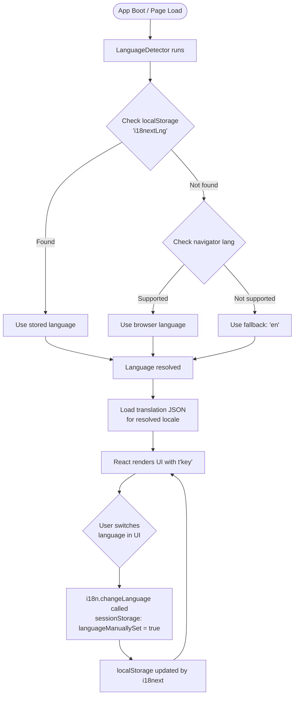
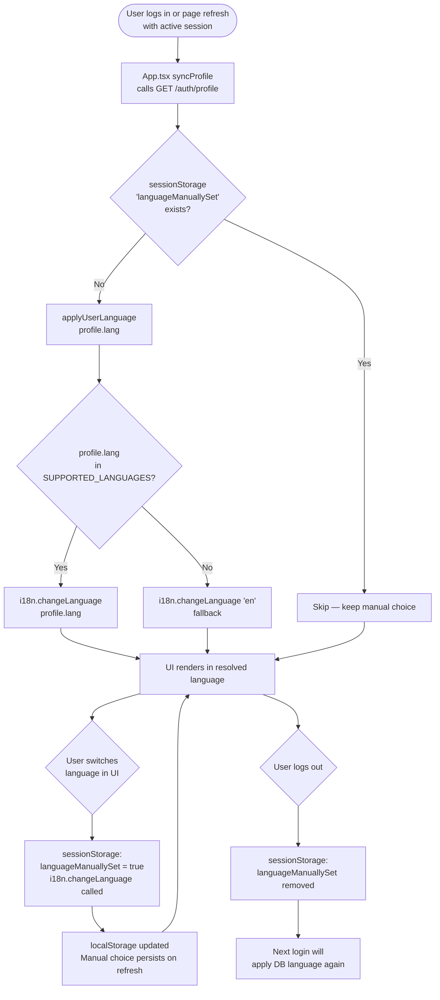

# Internationalization (i18n) System — Documentation

## Overview

The i18n system enables the application to support multiple languages, allowing users to interact with the UI in their preferred language. The implementation uses **i18next** and **react-i18next**, providing automatic language detection, persistent user preference storage, and seamless runtime switching between **4 languages**: English, Spanish, French, and Catalan.

When a user logs in, the language stored in their database profile is applied automatically. If the user manually switches language during a session, that choice is respected for the rest of the session and across page refreshes. On logout, the manual override is cleared so the next login always starts from the user's registered language.

Country names displayed in dropdowns and profile views are localised to the active UI language using the browser's built-in `Intl.DisplayNames` API — no database changes or extra libraries required.

---

## Supported Languages

| Code | Language | Translation File                    |
|------|----------|-------------------------------------|
| `en` | English  | `local/en/translation_en.json`      |
| `es` | Spanish  | `local/es/translation_es.json`      |
| `fr` | French   | `local/fr/translation_fr.json`      |
| `ca` | Catalan  | `local/ca/translation_ca.json`      |

> **Fallback:** If a translation key is missing or the detected/registered language is not in the supported list above, the system automatically falls back to **English (`en`)**.

---

## System Architecture

### Library Stack

| Library | Role |
|---------|------|
| `i18next` | Core i18n engine — key lookup, interpolation, fallback |
| `react-i18next` | React bindings — provides `useTranslation` hook |
| `i18next-browser-languagedetector` | Automatic detection from `localStorage` / browser |

### Language Resolution Priority

For **unauthenticated users**, detection runs in the following order (first match wins):

```
1. localStorage     ← User previously chose a language (cached by i18next)
2. navigator        ← Browser's configured language setting
3. fallbackLng: en  ← Default if nothing matched above
```

For **authenticated users**, language is resolved differently — see [Authenticated User Language Priority](#authenticated-user-language-priority).

---

## Flow Diagrams

### Unauthenticated User



### Authenticated User



---

## Authenticated User Language Priority

When a user logs in, `App.tsx` calls `GET /auth/profile` via `syncProfile`. The `lang` field from the database is passed to `applyUserLanguage()` from `i18n.ts`:

```typescript
// App.tsx — inside syncProfile useEffect
if (!sessionStorage.getItem('languageManuallySet')) {
    applyUserLanguage(profile.lang);
}
```

**Full priority table for authenticated users:**

| Situation | Language applied |
|-----------|-----------------|
| User logs in (no manual choice this session) | DB language (`profile.lang`) |
| DB language is unsupported (e.g. `de`, `pt`) | English (`en`) fallback |
| User refreshes page — no manual switch made | DB language re-applied |
| User switches language via switcher | Manual choice kept; DB language skipped on refresh |
| User logs out | `languageManuallySet` cleared from `sessionStorage` |
| Same user logs back in | DB language applied again |
| Different user logs in on same machine | DB language of new user applied |

---

## Configuration Reference (`src/i18n.ts`)

```typescript
import i18n from 'i18next';
import { initReactI18next } from 'react-i18next';
import LanguageDetector from 'i18next-browser-languagedetector';

import en from './local/en/translation_en.json';
import es from './local/es/translation_es.json';
import fr from './local/fr/translation_fr.json';
import ca from './local/ca/translation_ca.json';

// Any DB language code not in this list falls back to English
const SUPPORTED_LANGUAGES = ['en', 'es', 'fr', 'ca'];

i18n
  .use(LanguageDetector)
  .use(initReactI18next)
  .init({
    resources: {
      en: { translation: en },
      es: { translation: es },
      fr: { translation: fr },
      ca: { translation: ca },
    },
    fallbackLng: 'en',
    detection: {
      order: ['localStorage', 'navigator'],
      caches: ['localStorage'],
    },
    interpolation: {
      escapeValue: false,
    }
  });

/**
 * Apply the language from the user's database profile.
 * Called by App.tsx after a successful profile fetch.
 * Falls back to English for unsupported language codes.
 */
export function applyUserLanguage(dbLang: string | null | undefined): void {
  const lang = dbLang && SUPPORTED_LANGUAGES.includes(dbLang) ? dbLang : 'en';
  i18n.changeLanguage(lang);
}

export default i18n;
```

### Key Configuration Options

| Option | Value | Purpose |
|--------|-------|---------|
| `fallbackLng` | `'en'` | Language used when key or locale is not found |
| `escapeValue` | `false` | Avoids double-escaping (React handles XSS) |
| `caches` | `['localStorage']` | Persists language choice between sessions |
| `order` | `['localStorage', 'navigator']` | Detection priority for unauthenticated users |
| `SUPPORTED_LANGUAGES` | `['en','es','fr','ca']` | Guard for `applyUserLanguage` — unsupported codes fall back to `en` |

> **Note:** `debug: true` has been removed from the configuration. Re-add it temporarily during development to log missing keys to the browser console.

---

## File Structure

```
frontend/src/
├── i18n.ts                              ← i18n config, init, and applyUserLanguage()
├── components/
│   └── LanguageSwitcher.tsx             ← Dropdown UI; sets sessionStorage flag on manual switch
├── ts/
│   └── utils/
│       ├── countryName.ts               ← Localised country name utility (Intl.DisplayNames)
│       ├── loadHtmlContent.ts           ← Loads locale HTML files on demand
│       ├── loadImageLang.ts             ← Loads locale images with English fallback
│       └── string.ts                    ← sentence() and firstcap() text helpers
└── local/
    ├── en/
    │   ├── translation_en.json          ← English translations
    │   ├── terms.html                   ← Terms of Service (English)
    │   ├── privacy.html                 ← Privacy Policy (English)
    │   ├── about.html                   ← About page (English)
    │   ├── contact.html                 ← Contact page (English)
    │   ├── credits.html                 ← Credits page (English)
    │   └── image_pong.png               ← Localized Pong image (English)
    ├── es/
    │   ├── translation_es.json
    │   ├── terms.html
    │   ├── privacy.html
    │   ├── about.html
    │   ├── contact.html
    │   ├── credits.html
    │   └── image_pong.png
    ├── fr/
    │   ├── translation_fr.json
    │   ├── terms.html
    │   ├── privacy.html
    │   ├── about.html
    │   ├── contact.html
    │   ├── credits.html
    │   └── image_pong.png
    └── ca/
        ├── translation_ca.json
        ├── terms.html
        ├── privacy.html
        ├── about.html
        ├── contact.html
        ├── credits.html
        └── image_pong.png
```

Each locale folder contains both the JSON translation file **and** a set of HTML documents and a localized image. These are loaded on demand by the utility functions described below.

---

## LanguageSwitcher Component (`src/components/LanguageSwitcher.tsx`)

The switcher renders as a dropdown button in the header showing the active language with its flag. It supports all 4 languages plus a Catalan flag image (not a standard emoji, loaded from `src/assets/`).

```typescript
const changeLanguage = (lng: string) => {
    // Mark that the user made a manual choice this session so App.tsx
    // does not overwrite it with the DB language on the next syncProfile run.
    // Cleared on logout so the next login resets to DB language.
    sessionStorage.setItem('languageManuallySet', 'true');
    i18n.changeLanguage(lng);
    setActiveLanguage(lng);
    setOpen(false);
};
```

The dropdown closes automatically when the user clicks anywhere outside it (handled via a `mousedown` event listener on `document` with a `ref` on the dropdown container).

---

## Locale Asset Utilities

### `loadHtmlContent` (`src/ts/utils/loadHtmlContent.ts`)

Loads a locale-specific HTML file by name and language code. Used by `TermsModal` and `InfoScreen` to display Terms of Service, Privacy Policy, About, Contact, and Credits pages in the active language.

```typescript
export const loadHtmlContent = async (fileName: string, language: string): Promise<string> => {
    try {
        const htmlModule = await import(`../../local/${language}/${fileName}.html?raw`);
        return htmlModule.default;
    } catch (error) {
        // Falls back to English if the file is absent for the requested language
        const fallbackModule = await import(`../../local/en/${fileName}.html?raw`);
        return fallbackModule.default;
    }
};
```

**Usage:**
```typescript
const html = await loadHtmlContent('terms', i18n.language);
// Resolves to: local/fr/terms.html (or local/en/terms.html as fallback)
```

**Available file names:** `terms`, `privacy`, `about`, `contact`, `credits`

### `getLocalizedImagePath` (`src/ts/utils/loadImageLang.ts`)

Returns the URL of a locale-specific image using Vite's `import.meta.glob` for static asset resolution. Falls back to the English image if the requested locale's file does not exist.

```typescript
export const getLocalizedImagePath = (imageName: string, language: string): string => {
    const images = import.meta.glob('../../local/*/*.{png,jpg,jpeg,gif,webp}', { eager: true, as: 'url' });
    const imagePath = `../../local/${language}/${imageName}`;
    const resolvedImage = images[imagePath];
    if (resolvedImage) return resolvedImage as string;
    // Fallback to English
    const fallbackImage = images[`../../local/en/${imageName}`];
    return fallbackImage ? fallbackImage as string : '';
};
```

**Usage:**
```typescript
const src = getLocalizedImagePath('image_pong.png', i18n.language);
```

---

## Country Name Localisation (`src/ts/utils/countryName.ts`)

Country names fetched from the API are stored in the database in English (the `coun_name` column contains a single language). Rather than changing the database schema, the frontend resolves localised country names on the fly using the browser's built-in `Intl.DisplayNames` API. The input is the ISO 3166-1 alpha-2 code (e.g. `FR`, `ES`) which is already present everywhere — only the displayed label changes.

No external library or database migration is required.

### API

**`getCountryName(code, locale, fallback?)`** — plain function for use outside React:

```typescript
import { getCountryName } from '../ts/utils/countryName';

getCountryName('FR', 'fr')            // → "France"
getCountryName('ES', 'ca')            // → "Espanya"
getCountryName('DE', 'es')            // → "Alemania"
getCountryName('XX', 'en', 'Unknown') // → "Unknown" (unrecognised code)
```

**`useCountryNames()`** — React hook that returns a memoized resolver function. The resolver is recreated only when `i18n.language` changes, making it safe and efficient to call inside render:

```typescript
import { useCountryNames } from '../ts/utils/countryName';

const MyComponent = () => {
    const countryName = useCountryNames();
    return <span>{countryName('FR')}</span>;
    // → "France" / "França" / "Francia" depending on active language
};
```

The second argument is an optional fallback (typically the English name from the database):
```typescript
countryName(c.code, c.name)            // SignScreen — c.name is the DB English name
countryName(c.coun2_pk, c.coun_name)   // ProfileScreen — c.coun_name is the DB English name
```

### Where it is used

| Component | Context | Before | After |
|-----------|---------|--------|-------|
| `SignScreen` | Country registration dropdown | `{c.name} ({c.code})` — always English | `{countryName(c.code, c.name)} ({c.code})` — localised |
| `ProfileScreen` edit mode | Country edit dropdown | `{c.coun_name}` — always English | `{countryName(c.coun2_pk, c.coun_name)} ({c.coun2_pk})` — localised |
| `ProfileScreen` view mode | Country display field | `{userProfile.country}` — raw 2-letter code | `{countryName(userProfile.country, userProfile.country)}` — localised name |

### Localisation results

| Language | `ES` displays as | `DE` displays as | `FR` displays as |
|----------|-----------------|-----------------|-----------------|
| `en` | Spain | Germany | France |
| `es` | España | Alemania | Francia |
| `fr` | Espagne | Allemagne | France |
| `ca` | Espanya | Alemanya | França |

### Implementation

```typescript
// src/ts/utils/countryName.ts

import { useMemo } from 'react';
import { useTranslation } from 'react-i18next';

export function getCountryName(
    code: string,
    locale: string,
    fallback?: string
): string {
    if (!code) return fallback ?? '';
    try {
        const dn = new Intl.DisplayNames([locale], { type: 'region' });
        return dn.of(code.toUpperCase()) ?? fallback ?? code;
    } catch {
        return fallback ?? code;
    }
}

export function useCountryNames(): (code: string, fallback?: string) => string {
    const { i18n } = useTranslation();

    return useMemo(() => {
        try {
            const dn = new Intl.DisplayNames([i18n.language], { type: 'region' });
            return (code: string, fallback?: string): string => {
                if (!code) return fallback ?? '';
                return dn.of(code.toUpperCase()) ?? fallback ?? code;
            };
        } catch {
            return (code: string, fallback?: string): string => fallback ?? code;
        }
    }, [i18n.language]);
}
```

---

## String Utility (`src/ts/utils/string.ts`)

Two helper functions for locale-aware text formatting, used across components:

| Function | Behaviour | Example |
|----------|-----------|---------|
| `sentence(s)` | Capitalizes only the first character of the string | `"hello world"` → `"Hello world"` |
| `firstcap(s)` | Capitalizes the first letter of each word, respecting minor words (articles, prepositions) and French/Catalan contractions (`d'`, `l'`, etc.) | `"les amis de l'école"` → `"Les Amis de l'École"` |

```typescript
import { sentence, firstcap } from '../ts/utils/string';

sentence('password')   // → "Password"
firstcap("d'amics")    // → "d'Amics"
```

---

## Usage in Components

### Basic Translation

```typescript
import { useTranslation } from 'react-i18next';

const MyComponent = () => {
  const { t } = useTranslation();
  return <h1>{t('bienvenido')}</h1>;
};
```

### Accessing the Active Language

```typescript
const { t, i18n } = useTranslation();
console.log(i18n.language); // e.g. 'fr'
```

### Interpolation

```typescript
t('chat.with', { name: 'Alice' })
// → "chat with Alice"

t('success.backupCodeValidated', { count: 3 })
// → "Backup code validated. You have 3 codes remaining"
```

---

## Translation Keys Reference

All keys are defined in `translation_en.json` (English is the source of truth). The structure uses dot-notation namespacing.

### Top-Level Keys

| Key | English value |
|-----|--------------|
| `menu` | Main menu |
| `user` | Username |
| `crear_cuenta` | Create an account |
| `password` | password |
| `rep_pass` | Confirm password |
| `cumple` | Date of birth |
| `cod_pais` | Country (Code) |
| `lang` | Language |
| `borrar_t` | Clear |
| `enviar` | Submit |
| `enviando` | Submitting... |
| `bienvenido` | Welcome |
| `init_ses` | Sign in |
| `logout` | Sign out |
| `volver` | Back |
| `verificar` | Accept |
| `enable_2fa` | Enable 2FA |
| `sel_pais` | Select country |
| `sel_lang` | Select language |

### Namespaced Keys

| Namespace | Purpose |
|-----------|---------|
| `errors.*` | All user-facing error messages |
| `success.*` | Success feedback messages |
| `prof.*` | Profile screen labels, buttons, and messages |
| `chat.*` | Chat sidebar labels and messages |
| `info.*` | Info page link labels (Privacy Policy, Terms of Service, About, Contact, Credits) |
| `modal.*` | Modal button labels (Accept, Cancel, Reject, loading) |
| `oauth_terms.*` | OAuth terms acceptance screen (title, subtitle, confirm button) |
| `privacy.*` | Terms/privacy checkbox prefix, connector, and punctuation |
| `app.*` | App-level strings (Pong challenge modal) |
| `game.*` | In-game messages (match ended, winner, disconnection) |
| `leader.*` | Leaderboard labels |
| `history.*` | Match history labels |

### Selected `errors.*` Keys

| Key | English value |
|-----|--------------|
| `errors.mustAcceptTerms` | You must accept the Terms of Use and Privacy Policy to register. |
| `errors.invalidOrExpiredToken` | *(used by OAuthTermsScreen — not in translation_en.json, handled inline)* |
| `errors.userOrEmailExists` | Username or e-mail already exists |
| `errors.useOAuthProvider` | Please log in with your OAuth provider (42 or Google) |
| `errors.connectionError` | Connection error |
| `errors.noBirthDate` | Please provide a valid date of birth |
| `errors.birthFuture` | Date of birth cannot be in the future |
| `errors.userTooShort` | Username must be at least 3 characters. |
| `errors.userInvalidChars` | Username can only contain letters, numbers, hyphens, and underscores. |

### `privacy.*` Keys

Used by `SignScreen` and `OAuthTermsScreen` for the terms/privacy checkbox label:

| Key | English value |
|-----|--------------|
| `privacy.prefix` | I have read and agree to the |
| `privacy.and` | and the |
| `privacy.dot` | . |

### `oauth_terms.*` Keys

| Key | English value |
|-----|--------------|
| `oauth_terms.title` | One last step |
| `oauth_terms.subtitle` | Before we create your account, please read and accept our terms. |
| `oauth_terms.confirm_btn` | Create account |

---

## sessionStorage Flags

The i18n system uses `sessionStorage` (tab-scoped, cleared when the tab closes) for coordination between `LanguageSwitcher` and `App.tsx`:

| Key | Set by | Read/cleared by | Purpose |
|-----|--------|-----------------|---------|
| `languageManuallySet` | `LanguageSwitcher.changeLanguage()` | `App.tsx syncProfile` (read), `App.tsx handleLogout` (cleared) | Prevents `syncProfile` from overwriting a manual language choice with the DB language on page refresh |

---

## Examples

### Example 1: Unauthenticated User with Browser Set to French

```
Detection order:
  1. localStorage → ❌ not found
  2. navigator    → ✅ "fr" detected and supported

Result: UI renders in French
        "fr" cached in localStorage['i18nextLng'] for next visit
```

### Example 2: User Logs In with DB Language `es`

```
syncProfile runs:
  sessionStorage['languageManuallySet'] → not set
  applyUserLanguage('es') called
  i18n.changeLanguage('es') → UI re-renders in Spanish
  localStorage['i18nextLng'] = 'es'
```

### Example 3: Logged-In User Manually Switches to Catalan

```
LanguageSwitcher.changeLanguage('ca'):
  sessionStorage['languageManuallySet'] = 'true'
  i18n.changeLanguage('ca') → UI re-renders in Catalan
  localStorage['i18nextLng'] = 'ca'

User refreshes page:
  syncProfile runs again
  sessionStorage['languageManuallySet'] → 'true' → skip applyUserLanguage
  UI stays in Catalan ✅
```

### Example 4: User with Unsupported DB Language (`pt`)

```
syncProfile runs:
  applyUserLanguage('pt') called
  'pt' not in SUPPORTED_LANGUAGES → falls back to 'en'
  i18n.changeLanguage('en') → UI renders in English
```

### Example 5: User Logs Out and Logs Back In

```
handleLogout:
  sessionStorage.removeItem('languageManuallySet')

Next login — syncProfile runs:
  sessionStorage['languageManuallySet'] → not set
  applyUserLanguage(profile.lang) called → DB language applied again
```

### Example 6: Missing Translation Key

```
t('some.missing.key') with language = 'fr'

Result:
  - i18next tries French → ❌ key not found
  - Falls back to English → ✅ renders English string
```

### Example 7: Country Name in SignScreen (French UI)

```
countries = [{ code: 'ES', name: 'Spain' }, { code: 'DE', name: 'Germany' }, ...]
i18n.language = 'fr'

countryName('ES', 'Spain')   → "Espagne"
countryName('DE', 'Germany') → "Allemagne"

Dropdown renders: "Espagne (ES)", "Allemagne (DE)", ...
```

### Example 8: Country Name in ProfileScreen View Mode

```
userProfile.country = 'ES'
i18n.language = 'ca'

countryName('ES', 'ES') → "Espanya"

Profile view renders:  Country: Espanya
```

---

## Adding a New Language

**1. Create the translation file:**
```
src/local/de/translation_de.json
```

**2. Create the locale HTML documents** (copy from `en/` and translate):
```
src/local/de/terms.html
src/local/de/privacy.html
src/local/de/about.html
src/local/de/contact.html
src/local/de/credits.html
src/local/de/image_pong.png
```

**3. Import and register in `i18n.ts`:**
```typescript
import de from './local/de/translation_de.json';

// Add to SUPPORTED_LANGUAGES
const SUPPORTED_LANGUAGES = ['en', 'es', 'fr', 'ca', 'de'];

// Add to resources in .init()
de: { translation: de },
```

**4. Add to `LanguageSwitcher.tsx`:**
```typescript
// In getLanguageDisplay():
case 'de': return <>🇩🇪 Deutsch</>;

// In the dropdown JSX:
<button onClick={() => changeLanguage('de')}
    className={activeLanguage === 'de' ? 'lang-sel' : ''}>
    {getLanguageDisplay('de')}
</button>
```

> **Note:** No changes are needed in `countryName.ts` when adding a new language — `Intl.DisplayNames` supports all standard locales natively.

---

## Adding a New Translation Key

**1. Add to all 4 translation files** (all must have the key — missing keys silently fall back to English):

```json
{ "new_key": "New string in English" }       // translation_en.json
{ "new_key": "Nueva cadena en español" }     // translation_es.json
{ "new_key": "Nouvelle chaîne en français" } // translation_fr.json
{ "new_key": "Nova cadena en català" }       // translation_ca.json
```

**2. Use in the component:**
```typescript
<p>{t('new_key')}</p>
```

---

## Technical Decisions

### Why i18next?

| Alternative | Reason Not Chosen |
|-------------|-------------------|
| Manual string maps | No detection, no fallback, no tooling |
| react-intl (FormatJS) | More verbose API, ICU message format adds complexity |
| Custom context | Reinvents the wheel, maintenance burden |
| **i18next** ✅ | Mature, widely adopted, automatic detection, fallback |

### Why `Intl.DisplayNames` for Country Names?

| Alternative | Reason Not Chosen |
|-------------|-------------------|
| Add `coun_name` as JSONB in DB | Requires schema migration and data re-population for all countries |
| Ship a country name lookup JSON per language | Extra bundle weight, maintenance burden |
| **`Intl.DisplayNames`** ✅ | Built into all modern browsers, zero dependencies, covers all ISO 3166-1 codes, updates with the browser |

### Why localStorage over Cookie or sessionStorage?

- **localStorage** survives browser restarts and tab closes, does not expire ✅
- **Cookies** require server-side handling and add request overhead ❌
- **sessionStorage** is lost when the tab closes ❌

The `languageManuallySet` flag uses `sessionStorage` deliberately — it is a within-session override that should reset on the next login, which sessionStorage's tab-scoped lifetime naturally enforces.

### Why Separate JSON Files per Language?

- Each file is loaded independently — no unnecessary payload for unused languages ✅
- Easy for translators to work on a single file without touching code ✅
- Clear diff history in version control per language ✅

---

## Known Limitations

- `debug: true` was removed from the production configuration. Re-add it temporarily during development to catch missing translation keys in the browser console.
- No pluralization rules are currently configured beyond what i18next provides natively via the `_plural` suffix. If complex plural forms are needed, the `i18next-icu` plugin should be adopted.
- The `languageManuallySet` flag is tab-scoped (`sessionStorage`). If the user opens the app in a second tab and logs in there, the second tab will apply the DB language (the flag was not set in that tab). This is the expected and desirable behaviour.

---

## File Reference Summary

| File | Purpose |
|------|---------|
| `src/i18n.ts` | i18next init, `SUPPORTED_LANGUAGES`, `applyUserLanguage()` export |
| `src/components/LanguageSwitcher.tsx` | UI dropdown; sets `sessionStorage.languageManuallySet` on user switch |
| `src/App.tsx` | Calls `applyUserLanguage(profile.lang)` in `syncProfile`; clears flag on logout |
| `src/ts/utils/countryName.ts` | `getCountryName()` and `useCountryNames()` — localised country names via `Intl.DisplayNames` |
| `src/ts/utils/loadHtmlContent.ts` | Loads locale HTML files (`terms`, `privacy`, `about`, `contact`, `credits`) |
| `src/ts/utils/loadImageLang.ts` | Loads locale images (`image_pong.png`) with English fallback |
| `src/ts/utils/string.ts` | `sentence()` and `firstcap()` text formatting helpers |
| `src/local/<lang>/translation_<lang>.json` | Translation key-value files (one per language) |
| `src/local/<lang>/terms.html` | Terms of Service document (one per language) |
| `src/local/<lang>/privacy.html` | Privacy Policy document (one per language) |
| `src/local/<lang>/about.html` | About page document (one per language) |
| `src/local/<lang>/contact.html` | Contact page document (one per language) |
| `src/local/<lang>/credits.html` | Credits page document (one per language) |
| `src/local/<lang>/image_pong.png` | Localized Pong image (one per language) |

[Return to Main modules table](../../../README.md#modules)
