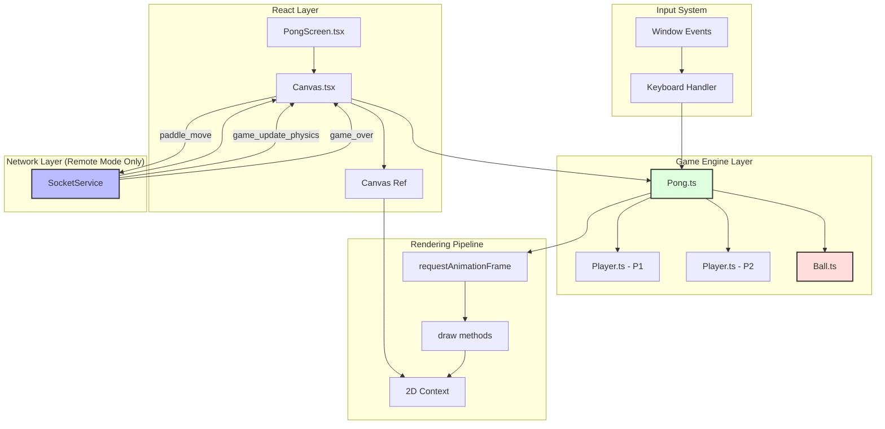
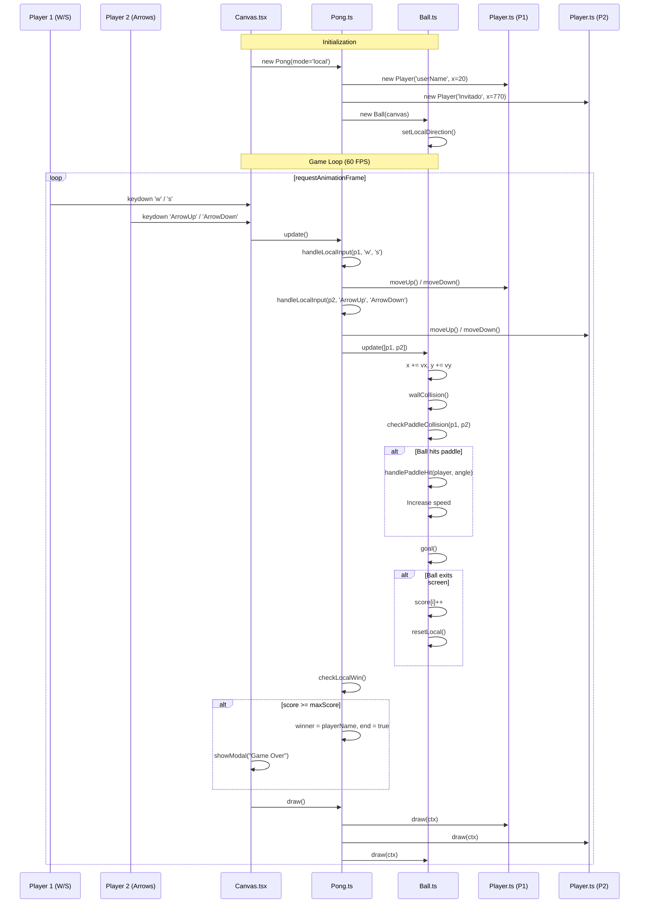
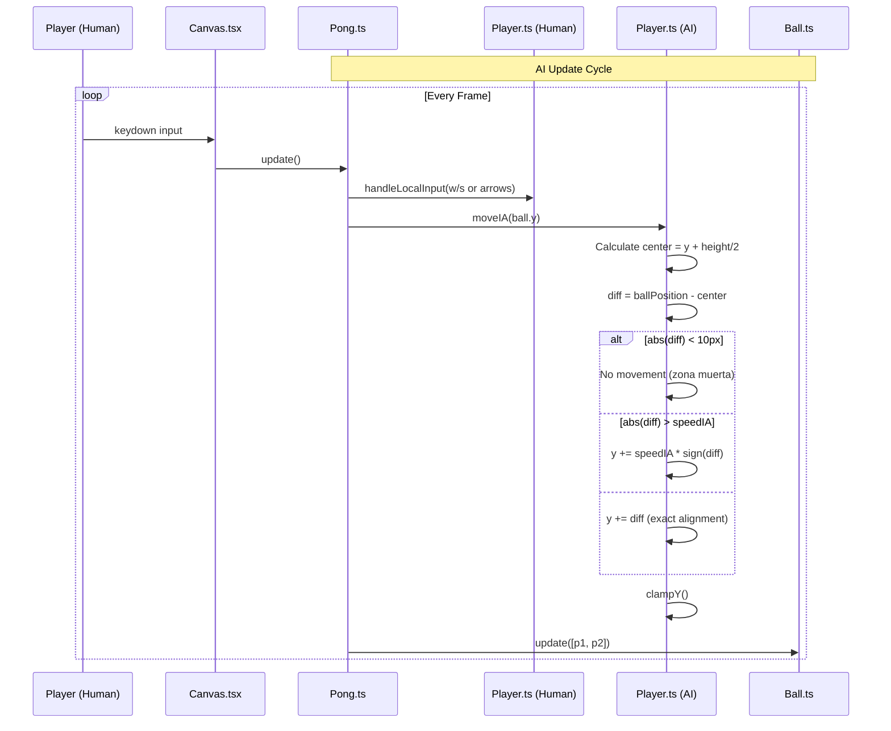
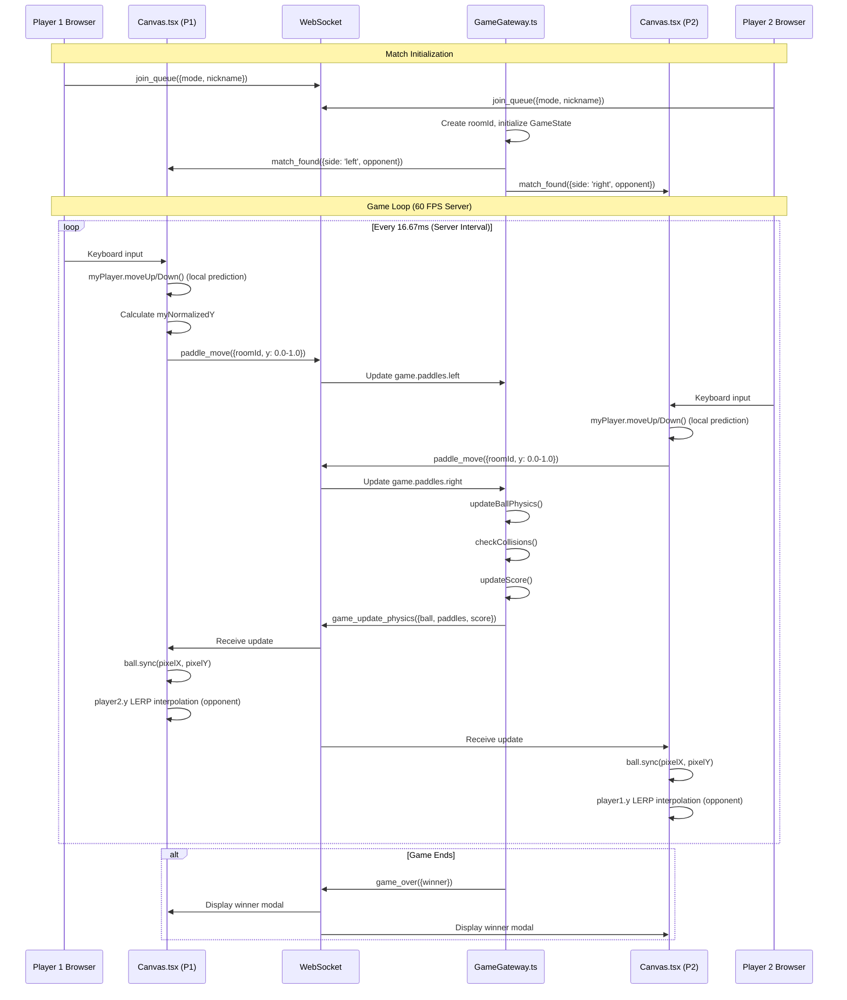
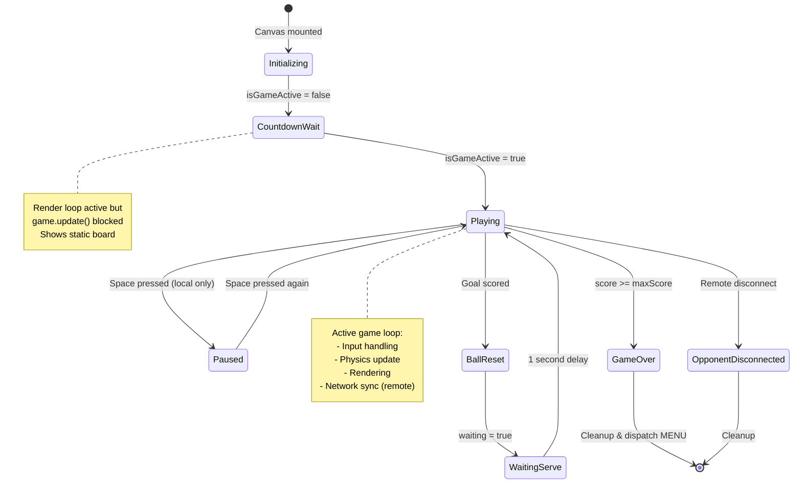
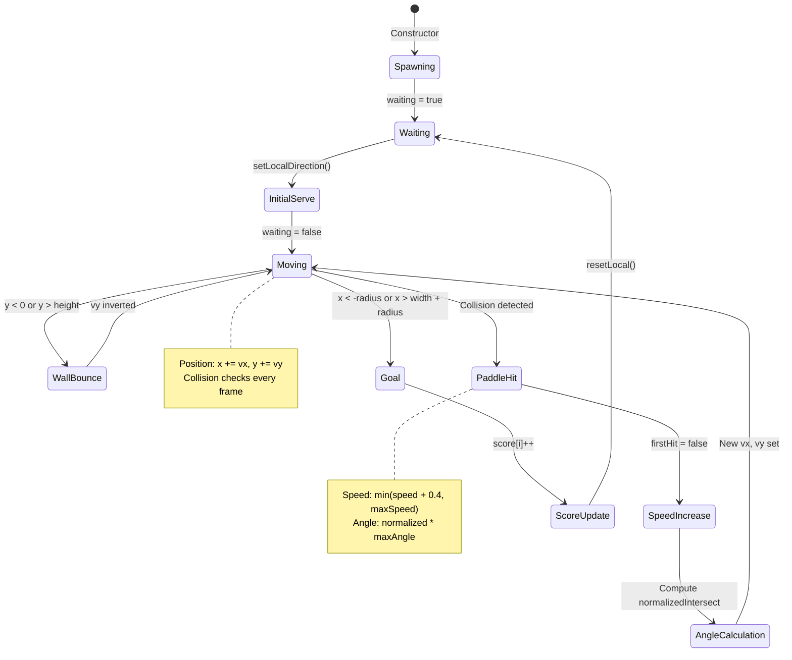
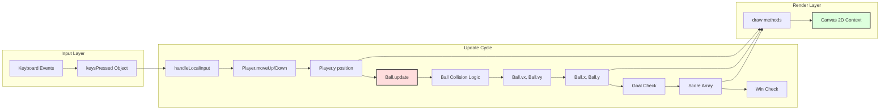
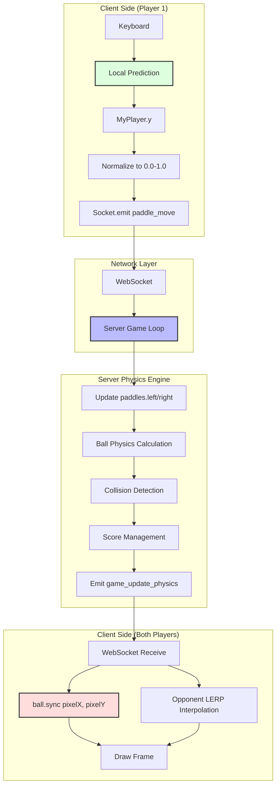

# Pong Game - Frontend Documentation

## Executive Summary

The frontend implementation establishes a high-performance, multi-mode Pong game architecture supporting three distinct gameplay flavors: local player-versus-player (PvP), local player-versus-AI (PvIA), and remote networked multiplayer. By leveraging TypeScript class-based models for game entities and React functional components for rendering, the system achieves deterministic physics simulation for local modes while seamlessly integrating WebSocket-driven server-authoritative gameplay for remote sessions.

The architecture is meticulously structured to decouple rendering concerns from game logic, ensuring that ball trajectory calculations, paddle collision detection, and input handling remain modular and testable. Real-time synchronization employs a hybrid "Trust Local + Interpolate Remote" strategy to minimize perceived latency while maintaining competitive integrity.

---

## Evaluation Justification: Web-based Pong Game Module

This document serves as the primary technical evidence for the Major Module: **"Web-based Pong game"**. 
It demonstrates how the core gameplay experience was built from scratch without the use of external game engines, fulfilling the strict project constraints:
* **Engine-less Rendering:** The game is rendered natively using HTML5 `<canvas>` and the 2D Context API, orchestrated by React `requestAnimationFrame` loops.
* **Responsive Input:** A custom event-driven input system accurately maps physical keyboard events (W/S and Arrow keys) to paddle movements in real time.
* **Standalone Playability:** Before any networking is applied, the frontend contains a complete, self-sufficient physics engine supporting local Player vs. Player (PvP) and Player vs. AI (PvIA) modes.

---

## System Architecture Overview

### Component Hierarchy Diagram



---

## Game Mode Comparison

| Mode | Physics Calculation | Input Handling | Score Management | Network |
|------|-------------------|----------------|------------------|---------|
| **local** (PvP) | Client-side (`Ball.update`) | P1: W/S, P2: Arrow Keys | Client-side | None |
| **ia** (PvIA) | Client-side (`Ball.update`) | Player: W/S or Arrows, AI: `moveIA` | Client-side | None |
| **remote** / **tournament** | Server-side (60 FPS) | Client sends normalized Y | Server-authoritative | WebSocket |

---

## Sequence Diagrams

### Local Mode (PvP) - Complete Game Flow



### AI Mode - AI Movement Logic



### Remote Mode - WebSocket Synchronization



---

## State Machine Diagrams

### Game State Flow



### Ball State Machine



---

## Data Flow Diagrams

### Local Mode Data Flow



### Remote Mode Data Flow



---

## Component Reference Documentation

### Ball.ts - Physics & Trajectory Engine

**Purpose**: Manages ball position, velocity, collision detection, and scoring logic for local game modes.

**Key Properties**:
```typescript
// Física (Necesarias para modo Local)
speed: number;           // Current scalar speed
initialSpeed: number;    // Starting speed (5)
baseSpeed: number;       // Speed after first hit (10)
maxSpeed: number;        // Speed ceiling (20)
increaseSpeed: number;   // Acceleration per hit (0.4)
vx: number;             // X velocity component
vy: number;             // Y velocity component

// State
firstHit: boolean;      // Triggers baseSpeed activation
waiting: boolean;       // Pauses physics during serve delay
maxAngle: number;       // Maximum reflection angle (π/4)
```

**Core Methods**:

| Method | Parameters | Returns | Description |
|--------|-----------|---------|-------------|
| `constructor` | `c: HTMLCanvasElement` | - | Initializes ball at center with relative sizing (`radious = width * 0.008`), sets initial direction |
| `draw` | `ctx: CanvasRenderingContext2D` | `void` | Renders white circle at current position |
| `sync` | `x: number, y: number` | `void` | **Remote mode only**: Directly updates position from server data |
| `update` | `players: Player[] \| Player, p2?: Player` | `void` | **Local mode only**: Executes physics loop with anti-tunneling protection |
| `wallCollision` | - | `void` | Detects and reflects ball from top/bottom walls |
| `checkPaddleCollision` | `p1: Player, p2: Player, prevX: number, prevY: number` | `void` | Raycasting-based collision with position correction |
| `handlePaddleHit` | `player: Player, hitY: number, direction: number` | `void` | Calculates new velocity based on impact point |
| `goal` | - | `void` | Detects scoring events and triggers `resetLocal()` |
| `resetLocal` | - | `Promise<void>` | Async 1-second delay before serving new ball |

**Anti-Tunneling Implementation**:
```typescript
// 1. Save previous position (CRUCIAL to avoid tunneling)
const prevX = this.x;
const prevY = this.y;

// 2. Move ball temporarily 
this.x += this.vx;
this.y += this.vy;

// 4. Check collision with Paddles using TRAJECTORY (Not just position)
this.checkPaddleCollision(player1, player2, prevX, prevY);
```

**Collision Detection Strategy**:
- Uses bounding box overlap detection (AABB)
- Determines relevant paddle based on ball's half-court position
- Applies position correction to prevent phasing through paddles:
  ```typescript
  if (player === p1) {
      this.x = pRight + this.radious + 1; // 1 = bounce to the right
  } else {
      this.x = pLeft - this.radious - 1;  // -1 = bounce to the left 
  }
  ```

**Angle Calculation**:
```typescript
// Normalizamos el impacto (-1 arriba, 0 centro, 1 abajo)
const normalizedIntersect = (hitY - paddleCenterY) / (player.getHeight() / 2);

// Limitamos ángulo
const angle = normalizedIntersect * this.maxAngle;

// Calcular nueva velocidad
this.vx = direction * this.speed * Math.cos(angle);
this.vy = this.speed * Math.sin(angle);
```

---

### Player.ts - Paddle Entity

**Purpose**: Represents a paddle with movement capabilities for human players and AI opponents.

**Key Properties**:
```typescript
nickname: string;     // Display name
x: number;           // Horizontal position (fixed)
y: number;           // Vertical position (dynamic)
width: number;       // Always 10 pixels
height: number;      // 20% of canvas height
speed: number;       // Manual movement speed (10 px/frame)
speedIA: number;     // AI movement speed (5 px/frame)
canvasHeight: number; // For boundary clamping
color: string;       // Always "white"
```

**Core Methods**:

| Method | Parameters | Returns | Description |
|--------|-----------|---------|-------------|
| `constructor` | `name: string, x: number, h: number` | - | Centers paddle vertically, sets `height = h * 0.20` |
| `moveIA` | `ballPosition: number` | `void` | AI tracking with 10px dead zone to prevent oscillation |
| `moveUp` | - | `void` | Decreases `y` by `speed`, clamps to bounds |
| `moveDown` | - | `void` | Increases `y` by `speed`, clamps to bounds |
| `clampY` | - | `void` | Private boundary enforcement (`0 <= y <= canvasHeight - height`) |
| `draw` | `ctx: CanvasRenderingContext2D` | `void` | Renders white rectangle |
| `getNormalizedY` | - | `number` | Returns center position as 0.0-1.0 for server transmission |
| `setY` | `val: number` | `void` | **Remote mode**: Allows external position updates with clamping |

**AI Movement Logic**:
```typescript
moveIA(ballPosition: number) {
    const center = this.y + this.height / 2;
    const diff = ballPosition - center;

    // 10px dead zone to prevent the AI from vibrating if the ball is in the center
    if (Math.abs(diff) < 10) return;

    if (Math.abs(diff) > this.speedIA)
        this.y += this.speedIA * Math.sign(diff);
    else
        this.y += diff;
    this.clampY();
}
```

**Normalized Position Calculation** (for remote sync):
```typescript
getNormalizedY(): number {
    // Visual position (Top) + Half height = Center
    const centerY = this.y + (this.height / 2);
    
    // Normalizamos (0.0 a 1.0)
    return centerY / this.canvasHeight;
}
```

---

### Pong.ts - Game State Manager

**Purpose**: Orchestrates game loop, input handling, mode-specific logic, and rendering coordination.

**Key Properties**:
```typescript
mode: GameMode;              // 'local' | 'ia' | 'remote' | 'tournament'
player1: Player;             // Left paddle
player2: Player;             // Right paddle
ball: Ball;
keysPressed: { [key: string]: boolean }; // Input state map
playerNumber: number;        // 1 (Left) or 2 (Right) for remote mode
score: number[];            // [P1 score, P2 score]
winner: string;             // Winner's name
maxScore: number;           // 5 points to win (local/IA only)
end: boolean;               // Game over flag
pause: boolean;             // Pause state (local modes only)
```

**Mode-Specific Input Schemes**:

| Mode | Player 1 Keys | Player 2 Keys | Notes |
|------|--------------|--------------|-------|
| `local` | W/S | Arrow Up/Down | Strict key binding |
| `ia` | W/S OR Arrow Up/Down | AI-controlled | Flexible for single player |
| `remote` / `tournament` | W/S OR Arrow Up/Down | N/A (opponent is remote) | Own paddle only |

**Core Methods**:

| Method | Parameters | Returns | Description |
|--------|-----------|---------|-------------|
| `constructor` | `c, ctx, mode, n, leftPlayerName, rightPlayerName, ballInit` | - | Initializes game state, syncs ball if `ballInit` provided |
| `moveOpponent` | `dir: 'up' \| 'down' \| 'stop'` | `void` | **Remote only**: Updates opponent's paddle visually |
| `update` | - | `void` | Main game loop logic, mode-specific physics delegation |
| `handleLocalInput` | `p: Player, upKey?, downKey?` | `void` | Private input processor with mode-aware key handling |
| `checkLocalWin` | - | `void` | Private win condition checker, sets `end` and `winner` |
| `draw` | - | `void` | Rendering orchestrator, calls entity draw methods |
| `drawScore` | - | `void` | Private HUD renderer for scores and names |
| `drawPause` | - | `void` | Private pause overlay |
| `drawNet` | - | `void` | Private center line decoration |

**Update Loop Logic**:
```typescript
update() {
    if (this.pause) return;

    // 1. AI MODE (Play against Bot)
    if (this.mode === 'ia') {
        this.handleLocalInput(this.player1, 'w', 's'); // Human (Left)
        this.handleLocalInput(this.player1, 'ArrowUp', 'ArrowDown'); // Alternative
        
        // Bot AI (Right) - Assuming Player has moveIA method
        // Si no lo tiene, avísame para dártelo.
        this.player2.moveIA(this.ball.y); 

        // Local Physics
        this.ball.update([this.player1, this.player2]); 
        this.checkLocalWin();
    }
    
    // 2. LOCAL MODE (1 PC, 2 Humans) 
    else if (this.mode === 'local') {
        this.handleLocalInput(this.player1, 'w', 's'); // P1: WASD
        this.handleLocalInput(this.player2, 'ArrowUp', 'ArrowDown'); // P2: Arrows
        
        // Local Physics
        this.ball.update([this.player1, this.player2]);
        this.checkLocalWin();
    }

    // 3. REMOTE MODE / TOURNAMENT (Online
    else {
        // We only manage OUR input for client prediction.
        // The ball physics and rival come from the server (Canvas.tsx).
        const myPlayer = this.playerNumber === 1 ? this.player1 : this.player2;
        this.handleLocalInput(myPlayer); 
    }
}
```

---

### Canvas.tsx - React Integration & Network Orchestration

**Purpose**: Manages React lifecycle, WebSocket event handling, render loop coordination, and mode-specific initialization.

**Component Props**:
```typescript
type CanvasProps = {
    mode: GameMode;                    // Game mode selector
    dispatch: React.Dispatch<any>;     // State machine dispatcher
    userName: string;                  // Current user's name
    opponentName?: string;             // Remote opponent name
    ballInit: { x: number, y: number } | null; // Server-provided initial position
    playerSide?: 'left' | 'right';     // Remote mode positioning
    roomId: string;                    // WebSocket room identifier
    isGameActive: boolean;             // Countdown gate
};
```

**Key Refs**:
```typescript
const canvasRef = useRef<HTMLCanvasElement>(null);    // Canvas DOM element
const animationIdRef = useRef<number | null>(null);   // RAF ID for cleanup
const gameRunningRef = useRef(false);                 // Unused legacy ref
const roomIdRef = useRef<string>(roomId);             // Stable room reference
const lastSentY = useRef<number>(0.5);                // Network throttling
const activeRef = useRef(isGameActive);               // Countdown blocker
```

**Initialization Logic**:
```typescript
// --- 1. POSITIONING LOGIC  ---
let finalPlayerNumber = 1; 
let leftName = "P1";
let rightName = "P2";

if (mode.includes('remote') || mode === 'tournament') {
    if (playerSide === 'left') {
        finalPlayerNumber = 1;
        leftName = userName;
        rightName = opponentName;
    } else {
        finalPlayerNumber = 2;
        leftName = opponentName;
        rightName = userName;
    }
} 
else if (mode === 'ia') {
    leftName = userName;
    rightName = "IA-Bot";
} 
else {
    leftName = userName;
    rightName = "Invitado";
}
```

**WebSocket Event Handlers**:

| Event | Frequency | Purpose | Handler Logic |
|-------|-----------|---------|---------------|
| `game_update_physics` | 60 FPS | Server physics sync | Updates `ball.sync()`, applies LERP to opponent paddle |
| `game_over` | Once | Match completion | Cancels RAF, shows winner modal, dispatches MENU |
| `opponent_disconnected` | Once | Connection loss | Shows abandonment modal, awards win by forfeit |

**LERP Interpolation Strategy**:
```typescript
const LERP = 0.3;

if (game.playerNumber === 1) {
    // --- I AM PLAYER 1 (Left)---
    
    // MY PADDLE (P1): WE DON'T TOUCH IT.
    // My keyboard moves it in the renderLoop. If I touch it here, it will vibrate.
    
    // RIVAL (P2): We smoothly interpolate it towards its destination
    game.player2.y = game.player2.y + (targetY_P2 - game.player2.y) * LERP;
} 
else if (game.playerNumber === 2) {
    // --- I AM PLAYER 2 (Right) ---

    //  MY PADDLE (P2): WE DON'T TOUCH IT.
    
    // RIVAL (P1): We smoothly interpolate it
    game.player1.y = game.player1.y + (targetY_P1 - game.player1.y) * LERP;
}
```

**Render Loop with Countdown Gate**:
```typescript
const renderLoop = () => {
    
    // MAIN LOOP BLOCKING During COUNTDOWN 
    if (!activeRef.current) {
        // If we are in countdown:
        // WE DRAW (to see the static board in the background)
        game.draw(); 
        // But WE DON'T UPDATE (game.update() is not called)
        
        // We request next frame and EXIT
        animationId = requestAnimationFrame(renderLoop);
        return; 
    }
    
    // 1. If activeRef.current is TRUE. Move paddle locally (Your keyboard updates game.player1.y here)
    game.update(); 
    game.draw(); 

    // --- NEW BLOCK: LOCAL / IA VICTORY CONTROL  ---
    // Only enters here if we are NOT in online mode
    if (!mode.includes('remote') && mode !== 'tournament') {
        if (game.hasWinner()) {
            const winnerName = game.getWinner();
            
            // We stop the loop immediately 
            cancelAnimationFrame(animationId);
            
            // We notify and exit with delay to give time to enter the last point on the scoreboard
            setTimeout(() => {
                // alert(`¡Juego Terminado! Ganador: ${winnerName}`);
                // dispatch({ type: "MENU" });
                showModal({
                    title: "🏆 ¡GAME OVER!",
                    message: `Winner: ${winnerName}`,
                    type: "success",
                    onConfirm: () => {
                        dispatch({ type: "MENU" });
                    }
                });
            }, 50);
            return; 
        }
    }
    
    // 2. SEND POSITION TO SERVER
    if (mode.includes('remote') || mode === 'tournament') {
        const myPlayer = game.playerNumber === 1 ? game.player1 : game.player2;
        
        // --- ABSOLUTE COORDINATE CALCULATION --- 
        // We get the paddle center in pixels 
        const myCenterPixel = myPlayer.y + (myPlayer.height / 2);
        
        // We convert it to percentage (0.0 to 1.0) 
        const myNormalizedY = myCenterPixel / canvas.height;

        // 3. Send only if it has changed (to not saturate)
        // We use roomIdRef.current to ensure we have the ID
        if (roomIdRef.current && Math.abs(myNormalizedY - lastSentY.current) > 0.001) {
            
            socket.emit('paddle_move', { 
                roomId: roomIdRef.current, 
                y: myNormalizedY // <--- We send the exact data, NOT 'up' or 'down'
            });
            lastSentY.current = myNormalizedY;
        }
    }

    animationId = requestAnimationFrame(renderLoop);
};
```

**Network Position Transmission**:
- Converts pixel-based paddle position to normalized 0.0-1.0 range
- Throttles updates using 0.001 delta threshold
- Sends `paddle_move` events with room ID and normalized Y coordinate

**Cleanup Procedure**:
```typescript
return () => {
    cancelAnimationFrame(animationId);
    window.removeEventListener("keydown", handleKeyDown);
    window.removeEventListener("keyup", handleKeyUp);
    socket.off('game_update_physics');
    socket.off('game_over', handleGameOver);
    socket.off('opponent_disconnected', handleOpponentDisconnected);
};
```

---

## Performance Considerations

### Frame Rate Management

| Context | Rate | Method | Notes |
|---------|------|--------|-------|
| Local render loop | ~60 FPS (browser-dependent) | `requestAnimationFrame` | Adaptive to monitor refresh rate |
| Remote server physics | Fixed 60 FPS (16.67ms) | `setInterval` | Server-side game loop |
| Network updates | Variable | WebSocket events | Depends on server broadcast frequency |

### Optimization Strategies

1. **LERP Interpolation (0.3 factor)**: Smooths opponent paddle movement while maintaining responsiveness
2. **Position Delta Threshold (0.001)**: Reduces network traffic by filtering negligible movements
3. **Bounding Box Collisions**: AABB checks are computationally cheaper than circle-to-rectangle
4. **Half-Court Paddle Selection**: Reduces collision checks from 2 to 1 per frame
5. **Countdown Gate**: Prevents physics calculations during pre-game phase while maintaining visual feedback

### Memory Management

- **useRef for Animation ID**: Prevents stale closure issues in RAF loop
- **useRef for Room ID**: Avoids dependency array triggers
- **WebSocket Event Cleanup**: Prevents memory leaks on component unmount
- **RAF Cancellation**: Ensures render loop termination

---

## Testing & Debugging

### Console Logging Strategy

The codebase includes strategic logging for debugging:

```typescript
console.log(`🎮 INICIANDO JUEGO [${mode}] | Soy: ${finalPlayerNumber} (${playerSide})`);
console.log(`⚔️ MATCH: ${leftName} (Izda) vs ${rightName} (Dcha)`);
```

### Common Issues & Solutions

| Issue | Symptom | Cause | Solution |
|-------|---------|-------|----------|
| Paddle vibration in remote | Jittery opponent paddle | Server updates overriding local state | Never interpolate own paddle, LERP opponent only |
| Ball tunneling | Ball passes through paddle | High velocity, single-frame detection | Use raycasting with `prevX`, `prevY` |
| Network lag spikes | Choppy ball movement | Server updates delayed | LERP smoothing mitigates visual artifacts |
| Countdown visual freeze | Black canvas during countdown | `game.update()` blocked entirely | Call `game.draw()` even when `!activeRef.current` |
| Score desync | Different scores on clients | Client-side scoring in remote mode | Use server-authoritative `data.score` |

---

## Code Walkthrough with Spanish Comments

This section presents the actual implementation code with all original Spanish comments preserved exactly as written. After each code snippet, you'll find a translation table for all Spanish comments.

---

### Ball.ts - Complete Implementation

#### Constructor and Initialization

```typescript
constructor(c: HTMLCanvasElement)
{
    this.canvasWidth = c.width;
    this.canvasHeight = c.height;
    
    // Initial configuration 
    this.spawnX = c.width / 2;
    this.spawnY = c.height / 2;
    this.x = this.spawnX;
    this.y = this.spawnY;

    this.radious = c.width * 0.008; // Your relative visual adjustment 

    // Physics values (Restored from your version A)
    this.vx = 0;
    this.vy = 0;
    this.score = [0, 0];

    this.initialSpeed = 5;
    this.speed = this.initialSpeed;
    this.baseSpeed = 10;
    this.maxSpeed = 20;
    this.increaseSpeed = 0.4; // cceleration per hit

    this.waiting = false;
    this.firstHit = true;
    this.maxAngle = Math.PI / 4; // 45 degrees

    // We only initialize direction if we're not waiting for server sync
    this.setLocalDirection(); 
}
```


**Technical Explanation**: The constructor initializes the ball at the canvas center with physics properties suitable for local gameplay. The radius is calculated as 0.8% of canvas width for responsive scaling. The comment about "version A" refers to a previous implementation that was merged with another version.

---

#### Update Method - Anti-Tunneling Physics

```typescript
/**
 * This update is ONLY called if the mode is 'local'.
 * It contains Anti-Tunnel logic (Raycasting) adapted to Pixels.
 */
update(players: Player[] | Player, p2?: Player) {
    if (this.waiting) return;
    
    //Added code to integrate AI and local modes
    let player1: Player;
    let player2: Player;

    if (Array.isArray(players)) {
        player1 = players[0];
        player2 = players[1];
    } else {
        player1 = players;
        player2 = p2!;
    }

    // 1. Save previous position (CRUCIAL to avoid tunneling)
    const prevX = this.x;
    const prevY = this.y;

    // 2. Move ball temporarily 
    this.x += this.vx;
    this.y += this.vy;

    // 3. Check collision with walls (Top/Bottom)
    this.wallCollision();

    // 4. Check collision with Paddles using TRAJECTORY (Not just position)
    this.checkPaddleCollision(player1, player2, prevX, prevY);
    
    // 5. Goals
    this.goal();
}
```


**Technical Explanation**: The update method implements the core physics loop for local modes. The critical anti-tunneling technique stores the previous frame's position before movement, then uses raycasting to detect if the ball's trajectory intersected a paddle between frames. This prevents high-speed balls from "phasing through" paddles.

---

#### Paddle Collision Detection - Raycasting Implementation

```typescript
private checkPaddleCollision(p1: Player, p2: Player, prevX: number, prevY: number) {
    // We determine which paddle to check based on which side of the field the ball is on
    let player = (this.x < this.canvasWidth / 2) ? p1 : p2;
    
    // PADDLE coordinates
    const pTop = player.getY();
    const pBottom = player.getY() + player.getHeight();
    const pLeft = player.getX();
    const pRight = player.getX() + player.getWidth();

    // BALL coordinates (Square box around the radius)
    const bTop = this.y - this.radious;
    const bBottom = this.y + this.radious;
    const bLeft = this.x - this.radious;
    const bRight = this.x + this.radious;

    // IS THERE COLLISION? (The boxes overlap)
    if (bRight > pLeft && bLeft < pRight && bBottom > pTop && bTop < pBottom) {
        
        // --- POSITION CORRECTION AND BOUNCE ---
        
        // Case: Left Paddle (P1)
        if (player === p1) {
            // We push the ball to the right so it doesn't get stuck
            this.x = pRight + this.radious + 1;
            this.handlePaddleHit(player, this.y, 1); // 1 = bounce to the right
        }
        // Case: Right Paddle (P2) 
        else {
            // We push the ball to the left
            this.x = pLeft - this.radious - 1;
            this.handlePaddleHit(player, this.y, -1); // -1 = bounce to the left 
        }
    }
}
```

**Technical Explanation**: This method uses Axis-Aligned Bounding Box (AABB) collision detection. The comment about "caja cuadrada" (square box) refers to treating the circular ball as a square hitbox for simpler calculations. The position correction (pushing the ball outside the paddle by radius + 1 pixel) prevents the ball from getting stuck inside the paddle geometry.

---

#### Angle Adjustment - Impact Point Physics

```typescript
private handlePaddleHit(player: Player, hitY: number, direction: number) {
    // Original angle change logic based on where it hit
    const paddleCenterY = player.getY() + player.getHeight() / 2;
    
    // We normalize the impact (-1 top, 0 center, 1 bottom)
    const normalizedIntersect = (hitY - paddleCenterY) / (player.getHeight() / 2);
    
    // We limit the angle 
    const angle = normalizedIntersect * this.maxAngle;

    //  Increase speed 
    if (this.firstHit) {
        this.speed = this.baseSpeed;
        this.firstHit = false;
    } else {
        this.speed = Math.min(this.speed + this.increaseSpeed, this.maxSpeed);
    }

    // Calculate new velocity
    this.vx = direction * this.speed * Math.cos(angle);
    this.vy = this.speed * Math.sin(angle);
}
```


**Technical Explanation**: The normalized intersection maps the hit point to a range of -1 (top edge) to 1 (bottom edge). Multiplying by `maxAngle` (45°) creates steeper angles for edge hits and shallow angles for center hits, simulating realistic paddle physics.

---

#### Ball Reset - Serve Delay Logic

```typescript
    // Reset for local game
public async resetLocal(): Promise<void> {
    this.waiting = true;
    this.firstHit = true;
    this.x = this.spawnX;
    this.y = this.spawnY;
    this.speed = this.initialSpeed;
    
    // Brief pause before serving
    await new Promise(r => setTimeout(r, 1000));
    
    this.setLocalDirection();
    this.waiting = false;
}
```


**Technical Explanation**: The async 1-second delay provides visual feedback after goals, allowing players to prepare for the next serve. The `waiting` flag prevents physics calculations during this pause.

---

### Player.ts - Complete Implementation

#### AI Movement Logic

```typescript
moveIA(ballPosition: number)
{
    const center = this.y + this.height / 2;
    const diff = ballPosition - center;

    // 10px dead zone to prevent the AI from vibrating if the ball is in the center
    if (Math.abs(diff) < 10) return;

    if (Math.abs(diff) > this.speedIA)
        this.y += this.speedIA * Math.sign(diff);
    else
        this.y += diff;
    this.clampY();
}
```


**Technical Explanation**: The "dead zone" (zona muerta) prevents micro-adjustments when the ball is near the paddle center. Without this, the AI would jitter back and forth, creating unrealistic movement. When the difference exceeds the AI speed, it moves at constant velocity; otherwise, it moves exactly to the ball position for precise tracking.

---

#### Position Normalization for Network Sync

```typescript
// ---  Sends absolute position to server (0.0 to 1.0)
getNormalizedY(): number {
    // Visual position (Top) + Half height = Center
    const centerY = this.y + (this.height / 2);
    
    // We normalize (0.0 to 1.0)
    return centerY / this.canvasHeight;
}

// IMPORTANT: Allows assigning position directly from Canvas.tsx (interpolation)
setY(val: number) { 
    this.y = val; 
    this.clampY();
}
```

**Technical Explanation**: The normalization converts pixel coordinates to a 0.0-1.0 range for resolution-independent network transmission. The `setY` method is crucial for remote mode, allowing the Canvas component to apply LERP interpolation to opponent paddle positions received from the server.

---

### Pong.ts - Complete Implementation

#### Mode-Specific Update Logic

```typescript
update()
{
    if (this.pause) return;

    // 1. AI MODE (Play against Bot)
    if (this.mode === 'ia') {
        this.handleLocalInput(this.player1, 'w', 's'); // Human (Left)
        this.handleLocalInput(this.player1, 'ArrowUp', 'ArrowDown'); // Alternative
        
        // Bot AI (Right) - Assuming Player has moveIA method
        this.player2.moveIA(this.ball.y); 

        // Local Physics
        this.ball.update([this.player1, this.player2]); 
        this.checkLocalWin();
    }
    
    // 2. LOCAL MODE (1 PC, 2 Humans) 
    else if (this.mode === 'local') {
        this.handleLocalInput(this.player1, 'w', 's'); // P1: WASD
        this.handleLocalInput(this.player2, 'ArrowUp', 'ArrowDown'); // P2: Arrows
        
        // Local Physics
        this.ball.update([this.player1, this.player2]);
        this.checkLocalWin();
    }

    // 3. REMOTE MODE / TOURNAMENT (Online
    else {
        // We only manage OUR input for client prediction.
        // The ball physics and rival come from the server (Canvas.tsx).
        const myPlayer = this.playerNumber === 1 ? this.player1 : this.player2;
        this.handleLocalInput(myPlayer); 
    }
}
```

**Technical Explanation**: The update method branches based on game mode. In AI mode, player 1 accepts flexible input (W/S or arrows) for single-player convenience. In local PvP, strict key bindings prevent conflicts. In remote mode, only the local player's paddle is updated here; server broadcasts handle the rest.

---

#### Input Handling - Multi-Key Support

```typescript
private handleLocalInput(p: Player, upKey: string = 'ArrowUp', downKey: string = 'ArrowDown') {
    // In online mode (without args), we accept both keys for the active player
    const wKey = 'w';
    const sKey = 's';
    const uKey = 'ArrowUp';
    const dKey = 'ArrowDown';

    // If keys are specified (local 1v1 mode), we are strict
    if (arguments.length > 1) {
         if (this.keysPressed[upKey]) p.moveUp();
         if (this.keysPressed[downKey]) p.moveDown();
    } 
    // If not (online mode or IA P1), we accept everything
    else {
         if (this.keysPressed[uKey] || this.keysPressed[wKey]) p.moveUp();
         if (this.keysPressed[dKey] || this.keysPressed[sKey]) p.moveDown();
    }
}
```

**Technical Explanation**: The method uses JavaScript's `arguments.length` to detect whether specific keys were provided. This enables flexible bindings for single-player modes while maintaining strict separation for local multiplayer.

---

#### Scoreboard Rendering

```typescript
private drawScore() {
    this.ctx.font = "48px Arial";
    this.ctx.fillStyle = "white";
    this.ctx.textAlign = "center";
    this.ctx.textBaseline = "top";
    
    // P1 Score
    this.ctx.fillText(this.score[0].toString(), this.c.width * 0.25, 20);
    // P2 Score
    this.ctx.fillText(this.score[1].toString(), this.c.width * 0.75, 20);
    
    // Names (Optional) 
    this.ctx.font = "20px Arial";
    this.ctx.fillText(this.player1.getName(), this.c.width * 0.25, 70);
    this.ctx.fillText(this.player2.getName(), this.c.width * 0.75, 70);
}
```

**Technical Explanation**: Scores are positioned at 25% and 75% of canvas width for balanced spacing. Player names appear below scores in smaller font.

---

### Canvas.tsx - Complete Implementation

#### Player Positioning Logic

```typescript
// --- 1. POSITIONING LOGIC  ---
let finalPlayerNumber = 1; 
let leftName = "P1";
let rightName = "P2";

if (mode.includes('remote') || mode === 'tournament') {
    if (playerSide === 'left') {
        finalPlayerNumber = 1;
        leftName = userName;
        rightName = opponentName;
    } else {
        finalPlayerNumber = 2;
        leftName = opponentName;
        rightName = userName;
    }
} 
else if (mode === 'ia') {
    leftName = userName;
    rightName = "IA-Bot";
} 
else {
    leftName = userName;
    rightName = "Invitado";
}

```

**Technical Explanation**: The positioning logic ensures correct player assignment in remote games. If you're the right player, your opponent (left player) gets shown on the left side of your screen. The console logs use "Izda" (left) and "Dcha" (right) abbreviations.

---

#### Server Physics Synchronization

```typescript
// --- SERVER PHYSICS ---
//  This event occurs 60 times per second 
socket.on('game_update_physics', (data: any) => {
    if (!game) return;

    if (!activeRef.current) return;

    // 1. SYNCHRONIZE BALL
    if (game.ball && data.ball) {
        // We multiply HERE by width/height
        const pixelX = data.ball.x * canvas.width;
        const pixelY = data.ball.y * canvas.height;
        
        // We pass already calculated pixels
        game.ball.sync(pixelX, pixelY);
    }
    
    //(Strategy: Trust Local + Rival Interpolation)
    if (data.paddles) {
        const p1Height = game.player1.getHeight();
        const p2Height = game.player2.getHeight();

        // Target positions according to the server
        const targetY_P1 = (data.paddles.left * canvas.height) - (p1Height / 2);
        const targetY_P2 = (data.paddles.right * canvas.height) - (p2Height / 2);

        // Smoothing factor (0.3 is balanced)
        const LERP = 0.3;

        if (game.playerNumber === 1) {
            // --- I AM PLAYER 1 (Left) ---
            
            // MY PADDLE (P1): WE DON'T TOUCH IT. 
            // 
            
            // RIVAL (P2): We smoothly interpolate it towards its destination
            game.player2.y = game.player2.y + (targetY_P2 - game.player2.y) * LERP;
        } 
        else if (game.playerNumber === 2) {
            // --- I AM PLAYER 2 (Right) ---

            //  MY PADDLE (P2): WE DON'T TOUCH IT.
            
            // RIVAL (P1): We smoothly interpolate it
            game.player1.y = game.player1.y + (targetY_P1 - game.player1.y) * LERP;
        }
    }
    // 3. Synchronize SCOREBOARD
    if (game.score && data.score) {
         game.score = data.score;
    }
});
```

**Technical Explanation**: This is the core synchronization strategy. The server sends normalized coordinates (0.0-1.0), which are converted to pixels client-side. The critical insight is that we NEVER modify our own paddle based on server data (to avoid input lag), but we DO interpolate the opponent's paddle using LERP for smooth visuals despite network jitter.

---

#### Render Loop with Countdown Gate

```typescript
const renderLoop = () => {
    
            // MAIN LOOP BLOCKING During COUNTDOWN 
            if (!activeRef.current) {
                // If we are in countdown:
                // WE DRAW (to see the static board in the background)
                game.draw(); 
                // But WE DON'T UPDATE (game.update() is not called)
                
                // We request next frame and EXIT
                animationId = requestAnimationFrame(renderLoop);
                return; 
            }
            
            // 1. If activeRef.current is TRUE. Move paddle locally (Your keyboard updates game.player1.y here)
            game.update(); 
            game.draw(); 

            // --- NEW BLOCK: LOCAL / IA VICTORY CONTROL  ---
            // Only enters here if we are NOT in online mode
            if (!mode.includes('remote') && mode !== 'tournament') {
                if (game.hasWinner()) {
                    const winnerName = game.getWinner();
                    
                    // We stop the loop immediately 
                    cancelAnimationFrame(animationId);
                    
                    // We notify and exit with delay to give time to enter the last point on the scoreboard
                    setTimeout(() => {
                        // alert(`¡Juego Terminado! Ganador: ${winnerName}`);
                        // dispatch({ type: "MENU" });
                        showModal({
                            title: "🏆 ¡GAME OVER!",
                            message: `Winner: ${winnerName}`,
                            type: "success",
                            onConfirm: () => {
                                dispatch({ type: "MENU" });
                            }
                        });
                    }, 50);
                    return; 
                }
            }
            
            // 2. SEND POSITION TO SERVER
            if (mode.includes('remote') || mode === 'tournament') {
                const myPlayer = game.playerNumber === 1 ? game.player1 : game.player2;
                
                // --- ABSOLUTE COORDINATE CALCULATION --- 
                // We get the paddle center in pixels 
                const myCenterPixel = myPlayer.y + (myPlayer.height / 2);
                
                // We convert it to percentage (0.0 to 1.0) 
                const myNormalizedY = myCenterPixel / canvas.height;

                // 3. Send only if it has changed (to not saturate)
                // We use roomIdRef.current to ensure we have the ID
                if (roomIdRef.current && Math.abs(myNormalizedY - lastSentY.current) > 0.001) {
                    
                    socket.emit('paddle_move', { 
                        roomId: roomIdRef.current, 
                        y: myNormalizedY // <--- We send the exact data, NOT 'up' or 'down'
                    });
                    lastSentY.current = myNormalizedY;
                }
            }

            animationId = requestAnimationFrame(renderLoop);
        };
```

**Technical Explanation**: The render loop has three critical sections: (1) Countdown gate that draws but doesn't update, (2) Local victory detection with 50ms delay to allow final score rendering, (3) Network position transmission with delta threshold to reduce bandwidth.

---

## Future Enhancement Opportunities

1. **Client-Side Prediction**: Implement ball trajectory prediction to reduce perceived latency in remote mode
2. **Input Buffering**: Queue inputs during lag spikes for smoother remote gameplay
3. **Replay System**: Record game states for post-match analysis
4. **Dynamic LERP Factor**: Adjust interpolation based on measured latency
5. **Spectator Mode**: Allow additional clients to observe matches without input
6. **Power-ups**: Extend `Ball.ts` with special effects and modifier logic
7. **Customizable Physics**: Expose speed, angle, and paddle size as configuration parameters

---

## References

- **RFC 6238** (TOTP Standard): Time-based synchronization principles applicable to network tick rates
- **RequestAnimationFrame API**: [MDN Documentation](https://developer.mozilla.org/en-US/docs/Web/API/window/requestAnimationFrame)
- **Socket.IO Client**: [Official Documentation](https://socket.io/docs/v4/client-api/)
- **AABB Collision Detection**: Axis-Aligned Bounding Box algorithm
- **LERP Interpolation**: Linear interpolation formula `lerp(a, b, t) = a + (b - a) * t`

---

**Document Version**: 1.0  
**Last Updated**: 2026-02-14  
**Authors**: Development Team  
**Confidentiality**: Internal Use Only

[Return to Main modules table](../../../README.md#modules)