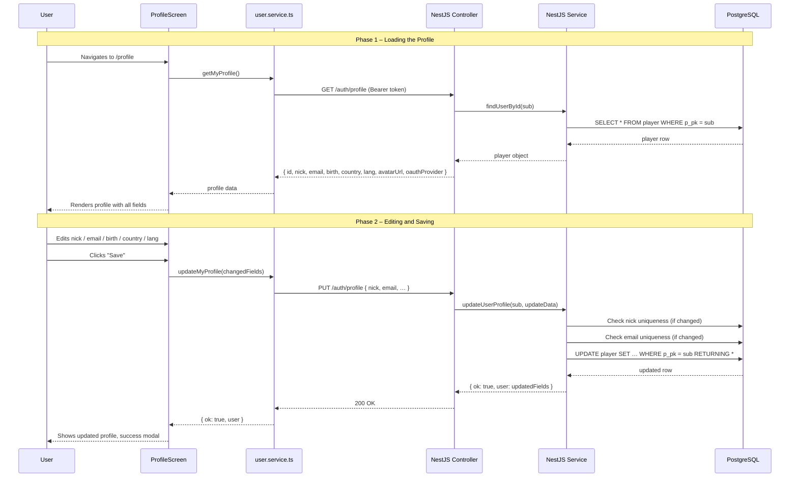
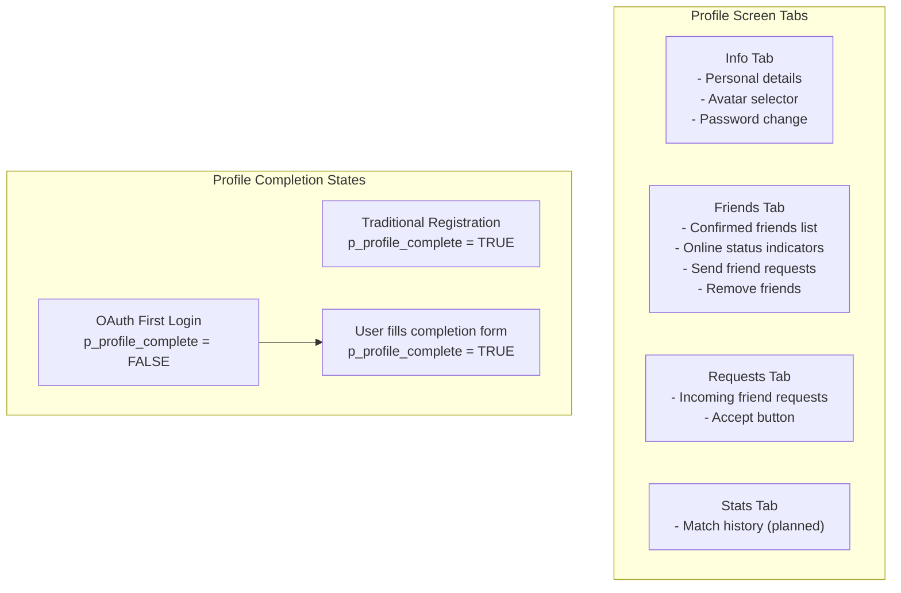
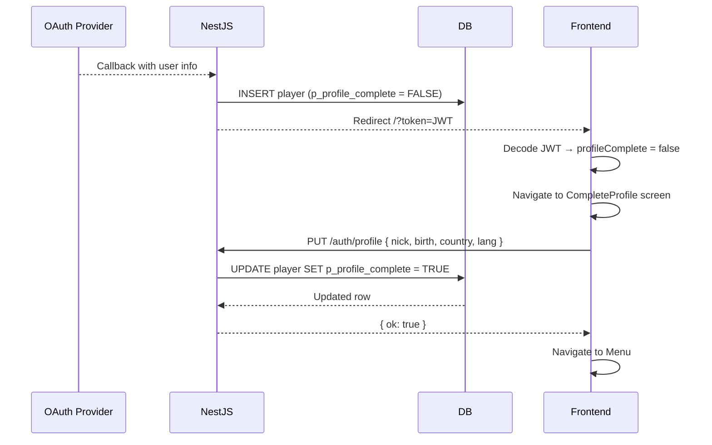

# Profile System

## Executive Summary

The profile system is the personal identity layer of the Transcendence platform. Each player owns a profile page that aggregates their display name, avatar, personal details, and social connections in one place. Authenticated users may update any editable field — nick, email, date of birth, country, preferred language, avatar, and password — through a unified `PUT /auth/profile` endpoint backed by field-level validation in the NestJS service. OAuth-registered users follow a distinct profile-completion flow at first login, since their initial record contains only the data provided by the identity provider.

The profile screen features a multi-tab interface:
- **Info Tab**: Personal details and avatar selection
- **Friends Tab**: Confirmed friends list with online status and invite system
- **Requests Tab**: Incoming friend requests with accept/decline actions
- **Stats Tab**: Full visualization of match history, user performance metrics, and global leaderboard.

---

## Evaluation Module Mapping

Because the Profile screen acts as the central hub for the user, its features are divided to satisfy two separate Major Modules in the project rubric:

### 1. Standard User Management and Authentication
*Fulfilled primarily by the **Info Tab** and the `auth.controller.ts` endpoints.*
* **Identity Management:** Users can update their unique display name (nick) and email with strict backend uniqueness validation.
* **Avatar System:** Users can select custom avatars or keep their default/OAuth pictures.
* **Security:** Traditional users can update their passwords safely (bcrypt validation), while OAuth profiles are handled separately.

### 2. Allow Users to Interact with Other Users
*Fulfilled primarily by the **Friends Tab** and **Requests Tab**.*
* **Social Hub:** Serves as the UI interface to view the friends list and check live online/offline status indicators.
* **Networking Actions:** Users can initiate interactions by sending friend requests directly from the profile interface or removing existing connections.

### 3. Game Statistics and Match History (Minor Module)
*Fulfilled by the **Stats Tab**.*
* While the UI is hosted within the Profile, the logic constitutes a separate game module.
* **Features:** Win/Loss tracking, Match History log, and Leaderboard.
* **Documentation:** Please refer to [GAME_STATS_MODULE.md](./GAME_STATS_MODULE..md) for the full technical breakdown and verification steps for this module.

---

## System Architecture Diagram





---

## File Map

### Frontend

```
srcs/frontend/src/
│
├── screens/
│   └── ProfileScreen.tsx      ← Multi-tab profile page: Info, Friends, Requests, Stats
│
├── services/
│   ├── user.service.ts        ← getMyProfile(), updateMyProfile(), getCountries()
│   └── friend.service.ts      ← getFriends(), sendRequest(), acceptRequest(), removeFriend()
│
└── components/
    ├── Avatar.tsx             ← Renders profile and friend avatars
    └── AvatarSelector.tsx     ← Modal for choosing a gallery avatar
```

### Backend

```
srcs/backend/src/auth/
├── auth.controller.ts         ← GET /auth/profile  |  PUT /auth/profile  |  GET /auth/countries
├── auth.service.ts            ← updateUserProfile(), findUserById(), getCountries()
└── dto/
    └── complete-profile.dto.ts   ← Validation DTO for OAuth profile completion
```

### Database

```
PostgreSQL
└── player                     ← Single source of truth for all profile data
```

---

## API Reference

| Method | Endpoint | Auth | Description |
|---|---|---|---|
| `GET` | `/auth/profile` | JWT | Retrieve the authenticated user's profile |
| `PUT` | `/auth/profile` | JWT | Update one or more profile fields |
| `GET` | `/auth/countries` | Public | Return the full list of countries for the country selector |

### `GET /auth/profile` — Response

```json
{
  "id": 51,
  "nick": "archduke",
  "email": "archduke@example.com",
  "birth": "1995-07-12",
  "country": "ES",
  "lang": "en",
  "avatarUrl": "dragon-egg",
  "oauthProvider": null
}
```

Fields returned for an OAuth user will include `"oauthProvider": "google"` or `"42"`. The `avatarUrl` may be an OAuth picture URL or a gallery ID depending on whether the user has customized their avatar.

### `PUT /auth/profile` — Request body (all fields optional)

```json
{
  "nick": "new_nickname",
  "email": "new@example.com",
  "birth": "1995-07-12",
  "country": "FR",
  "lang": "fr",
  "avatarUrl": "centaur",
  "currentPassword": "oldP@ssword",
  "newPassword": "newP@ssword"
}
```

`currentPassword` and `newPassword` are required together only when changing the password. OAuth users cannot change their password via this endpoint.

### `PUT /auth/profile` — Success response

```json
{
  "ok": true,
  "message": "Profile updated",
  "user": {
    "id": 51,
    "nick": "new_nickname",
    "email": "new@example.com",
    "birth": "1995-07-12",
    "country": "FR",
    "lang": "fr",
    "avatarUrl": "centaur"
  }
}
```

### `PUT /auth/profile` — Error responses

| HTTP code | Condition |
|---|---|
| `400` | Requested nick is already taken |
| `400` | Requested email is already in use |
| `400` | `currentPassword` is incorrect |
| `400` | OAuth user attempts to set a password |
| `401` | Missing or invalid JWT |

### `GET /auth/countries` — Response (excerpt)

```json
[
  { "coun2_pk": "ES", "coun_name": "Spain" },
  { "coun2_pk": "FR", "coun_name": "France" },
  { "coun2_pk": "GB", "coun_name": "United Kingdom" }
]
```

---

## Database Schema

### Table: `player`

| Column | Type | Nullable | Description |
|---|---|---|---|
| `p_pk` | `INTEGER` (PK, identity) | NO | Internal user ID |
| `p_nick` | `VARCHAR(255)` UNIQUE | NO | Display name |
| `p_mail` | `TEXT` UNIQUE | NO | Email address |
| `p_pass` | `TEXT` | YES | bcrypt hash; NULL for OAuth users |
| `p_avatar_url` | `VARCHAR(500)` | YES | Gallery ID or full OAuth picture URL |
| `p_profile_complete` | `BOOLEAN` | YES | FALSE until OAuth user completes their profile |
| `p_reg` | `TIMESTAMP` | YES | Account creation timestamp |
| `p_bir` | `DATE` | YES | Date of birth |
| `p_lang` | `CHAR(2)` (FK → p_language) | YES | ISO 639-1 language code |
| `p_country` | `CHAR(2)` (FK → country) | YES | ISO 3166-1 alpha-2 country code |
| `p_role` | `SMALLINT` (FK → p_role) | YES | Role (1 = player) |
| `p_status` | `SMALLINT` (FK → status) | YES | Account status (1 = active) |
| `p_oauth_provider` | `VARCHAR(20)` | YES | `"google"`, `"42"`, or NULL |
| `p_oauth_id` | `VARCHAR(255)` | YES | Provider-side user ID |
| `p_totp_enabled` | `BOOLEAN` | YES | 2FA enabled flag |
| `p_totp_secret` | `BYTEA` | YES | Encrypted TOTP secret |
| `p_totp_backup_codes` | `TEXT[]` | YES | Array of one-time recovery codes |

---

## ProfileScreen Component

The profile screen is a comprehensive React component with a tabbed interface and state management for profile data, friends, and pending requests.

### State Management

```typescript
const [activeTab, setActiveTab] = useState<'info' | 'friends' | 'requests' | 'stats'>('info');
const [userProfile, setUserProfile] = useState<UserProfile | null>(null);
const [friends, setFriends] = useState<Friend[]>([]);
const [requests, setRequests] = useState<PendingRequest[]>([]);
const [candidates, setCandidates] = useState<UserCandidate[]>([]);
const [isSelectingAvatar, setIsSelectingAvatar] = useState(false);
const [isEditing, setIsEditing] = useState(false);
```

### Data Loading

```typescript
useEffect(() => {
    loadUserProfile();
    loadCountries();
    loadSocialData();

    // WebSocket listeners
    socket.on('friend_request', handleFriendRequest);
    socket.on('friend_accepted', handleFriendAccepted);
    socket.on('friend_removed', handleFriendRemoved);

    return () => {
        socket.off('friend_request');
        socket.off('friend_accepted');
        socket.off('friend_removed');
    };
}, []);
```

### Info Tab Features

- **Profile Display**: Shows nick, email, birth date, country, language, avatar
- **Edit Mode**: Toggle between view and edit modes
- **Avatar Selection**: Opens modal gallery on "Edit image" click
- **Field Validation**: Nick and email uniqueness checks
- **Password Change**: Section for traditional users only (hidden for OAuth)
- **Delete Account**: Button to permanently delete user account

### Friends Tab Features

- **Friends List**: Displays confirmed friends with online/offline status indicators
- **Online Status**: Green indicator for online, gray for offline
- **Avatar Display**: Shows friend avatars (handles OAuth URLs and gallery IDs)
- **Send Invites**: Dropdown selector to choose users and send friend requests
- **Remove Friends**: Button to remove existing friendships
- **Real-time Updates**: WebSocket events refresh the list automatically

### Requests Tab Features

- **Pending Requests List**: Shows incoming friend requests
- **Accept Button**: Accepts the request and moves user to friends list
- **Badge Counter**: Shows number of pending requests in tab label

### Avatar Display Helper

```typescript
const getDisplayAvatar = (userId: number, avatarValue: string | null) => {
    if (!avatarValue) {
        return getDefaultAvatar(userId);
    } else if (avatarValue.startsWith('http')) {
        return avatarValue;  // OAuth URL
    } else {
        return getAvatarUrlById(avatarValue) || getDefaultAvatar(userId);
    }
};
```

---

## Validation Rules

All validation is enforced in `auth.service.ts` before any database write.

| Field | Rule |
|---|---|
| `nick` | Must be unique across all players (case-sensitive). If unchanged, the uniqueness check is skipped. |
| `email` | Must be unique across all players (case-insensitive via `citext`). Same skip logic applies. |
| `country` | Must be a valid ISO 3166-1 alpha-2 code present in the `country` table. |
| `lang` | Must be a valid ISO 639-1 code present in the `p_language` table. |
| `currentPassword` | Required when `newPassword` is supplied; verified against the stored bcrypt hash. |
| `newPassword` | Only accepted for users with `p_pass IS NOT NULL` (non-OAuth). |

---

## OAuth Profile Completion Flow

When a user authenticates via Google or 42 School for the first time, `findOrCreateOAuthUser` in `auth.service.ts` inserts a new `player` row with `p_profile_complete = FALSE`. The frontend detects this flag in the JWT payload and redirects the user to a completion form before granting access to the main application.



The `CompleteProfileDto` validates the fields required at this step:

```typescript
export class CompleteProfileDto {
  @IsString()  @MinLength(3)  nick: string;
  @IsDateString()             birth: string;
  @IsString()  @Length(2)     country: string;
  @IsString()  @Length(2)     lang: string;
}
```

---

## Service-Level Logic

### `updateUserProfile` — Step-by-step

```
1. findUserById(userId)         → abort with 404 if not found
2. if nick changed:
       SELECT from player WHERE p_nick = newNick AND p_pk ≠ userId
       → abort with 400 "Nick already in use" if row found
3. if email changed:
       SELECT from player WHERE p_mail = newEmail AND p_pk ≠ userId
       → abort with 400 "Email already in use" if row found
4. Build dataToUpdate map (only fields present in request)
5. if newPassword supplied:
       → abort with 400 if user has no password (OAuth)
       → bcrypt.compare(currentPassword, p_pass)  → abort with 400 if mismatch
       → bcrypt.hash(newPassword, 10)  → add to dataToUpdate
6. db.update(player).set(dataToUpdate).where(eq(p_pk, userId)).returning()
7. Return { ok: true, user: updatedFields }
```

---

## Data Flow Examples

### Example 1 — Changing a display name

```
User A (id=51, nick="archduke") wants the nick "lezo_hero".

PUT /auth/profile  { nick: "lezo_hero" }
JWT sub = 51

AuthService:
  → "lezo_hero" ≠ current nick → check uniqueness
  → No existing player with p_nick = 'lezo_hero' and p_pk ≠ 51 → OK
  → UPDATE player SET p_nick = 'lezo_hero' WHERE p_pk = 51

Response: { ok: true, user: { nick: "lezo_hero", ... } }

ProfileScreen:
  → setUserProfile({ nick: "lezo_hero" })
  → setGlobalUser("lezo_hero")  // Updates header
```

### Example 2 — Changing avatar

```
User clicks "Edit image" → AvatarSelector modal opens
User selects "centaur" → clicks "Select"

PUT /auth/profile  { avatarUrl: "centaur", ... }

AuthService:
  → UPDATE player SET p_avatar_url = 'centaur' WHERE p_pk = 51

Response: { ok: true, user: { avatarUrl: "centaur" } }

ProfileScreen:
  → setUserProfile({ avatarUrl: "centaur" })
  → setGlobalAvatarUrl("centaur")  // Updates header
```

### Example 3 — Viewing friends with online status

```
User navigates to Friends tab

GET /friends/list?userId=51

FriendsService:
  → SELECT friends WHERE (f_1=51 OR f_2=51) AND f_status_fk=2
  → For each friend: gateway.isUserOnline(friendId) → 'online' or 'offline'

Response:
[
  { id: 37, friend_nick: "player_37", status: "online", avatar: "archer" },
  { id: 42, friend_nick: "player_42", status: "offline", avatar: null }
]

ProfileScreen:
  → setFriends([...])
  → Renders list with green/gray indicators
```

---

## Security Considerations

| Concern | Mitigation |
|---|---|
| Updating another user's profile | `JwtAuthGuard` extracts `sub` from token; service only updates `WHERE p_pk = sub` |
| Nick / email enumeration | Uniqueness error messages do not reveal whether the conflict is with another real user |
| Password brute-force | bcrypt with cost factor 10; rate limiting should be applied at API gateway level |
| SQL injection | Drizzle ORM parameterized queries throughout |
| OAuth password bypass | Service rejects password change attempts when `p_pass IS NULL` |
| Incomplete OAuth profiles | `p_profile_complete` flag enforced at frontend routing level |

---

## i18n Keys (Profile Screen)

The profile screen uses extensive translation keys across `en.json`, `es.json`, `ca.json`, and `fr.json`:

| Key | English value |
|---|---|
| `prof.title` | My Profile |
| `prof.tab_info` | Info |
| `prof.tab_friends` | Friends ({{count}}) |
| `prof.tab_requests` | Requests |
| `prof.tab_stats` | Stats |
| `prof.nick` | Display name |
| `prof.email` | Email address |
| `prof.birth` | Date of birth |
| `prof.country` | Country |
| `prof.lang` | Language |
| `prof.save` | Save changes |
| `prof.edit_image` | Edit image |
| `prof.friends_title` | My Friends |
| `prof.no_friends` | You have no friends yet |
| `prof.send_request_btn` | Send Request |
| `prof.remove_btn` | Remove |
| `prof.requests_title` | Friend Requests |
| `prof.no_requests` | No pending requests |
| `prof.accept_btn` | Accept |

---

## Testing Checklist

### Backend
- [x] `GET /auth/profile` returns all expected fields for a traditional user
- [x] `GET /auth/profile` returns `oauthProvider` for an OAuth user
- [x] `PUT /auth/profile` with a new nick updates the database
- [x] `PUT /auth/profile` with a duplicate nick returns `400`
- [x] `PUT /auth/profile` with the same nick (no change) succeeds
- [x] `PUT /auth/profile` password change succeeds with correct `currentPassword`
- [x] `PUT /auth/profile` password change fails with incorrect `currentPassword`
- [x] OAuth user password change returns `400`
- [x] `GET /auth/countries` returns a non-empty list ordered alphabetically
- [x] Unauthenticated requests return `401`

### Frontend
- [x] Profile page loads and displays all fields on mount
- [x] Editing a field and saving updates the displayed value without a page reload
- [x] Validation errors (duplicate nick, wrong password) are shown via modal
- [x] OAuth users do not see the password change section
- [x] Country and language dropdowns are populated from the API
- [x] Friends tab displays confirmed friends with online/offline indicators
- [x] Requests tab displays pending friend requests
- [x] Accepting a request moves user to friends list
- [x] Removing a friend removes them from the list
- [x] WebSocket events update friends list in real-time
- [x] Profile screen renders correctly in all 4 supported languages

---

## Future Enhancements

- **Public profile pages** — allow viewing another player's profile at `/profile/:id` (read-only, no edit controls)
- **Account deletion** — GDPR-compliant self-service data removal (currently has button but needs backend implementation)
- **Email verification** — confirm new email addresses before applying changes
- **Username change cooldown** — enforce a minimum interval between nick changes to prevent abuse
- **Audit log** — record all profile changes (field, old value, new value, timestamp) for moderation purposes
- **Privacy settings** — control who can see your profile, send friend requests, etc.
- **Block management** — UI to view and manage blocked users


[Return to Main modules table](../../../README.md#modules)