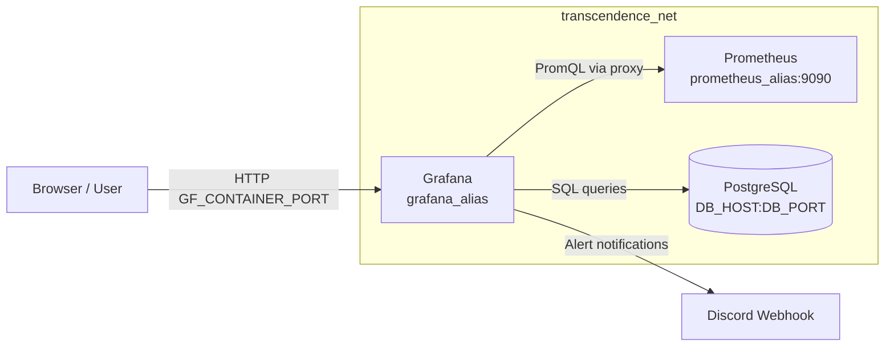
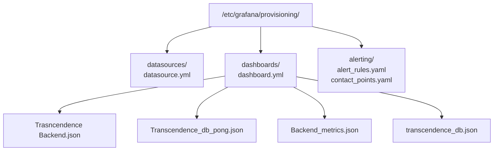
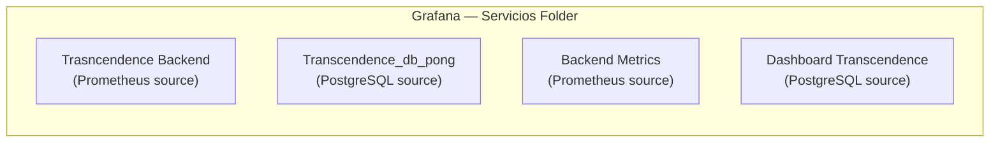
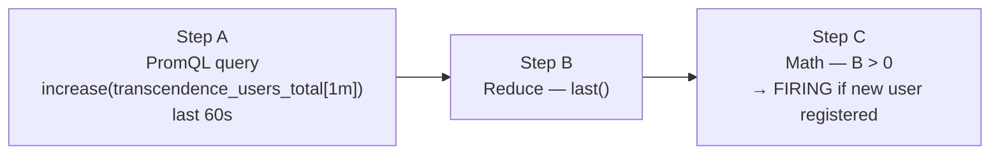
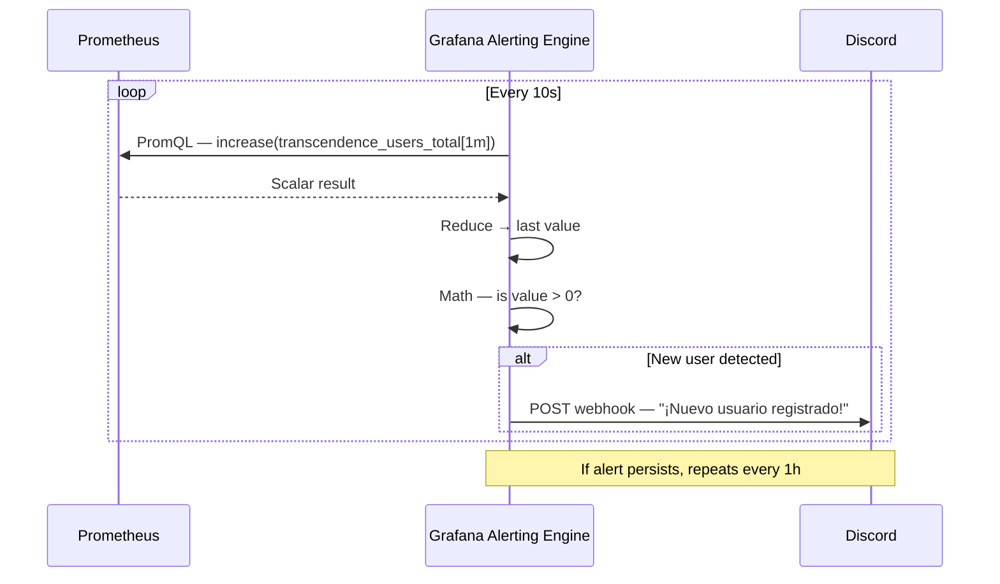

# Grafana Container — Documentation

## Overview

Grafana is the visualisation and alerting layer of the Transcendence monitoring stack. It connects to two data sources — **Prometheus** (application metrics) and **PostgreSQL** (game and user data) — and exposes a set of pre-provisioned dashboards and alert rules that are loaded automatically at startup via Grafana's provisioning system.

---

## Evaluation Justification: Monitoring System Module

This document serves as the technical evidence for the Major Module: **"Monitoring system with Prometheus and Grafana"** (Part 2: Visualization and Alerting).
It completes the DevOps monitoring requirement by translating raw data into actionable, visual insights:
* **Dual-Source Dashboards:** Connects seamlessly to both Prometheus (for real-time application performance metrics) and PostgreSQL (for persistent game and user statistics), offering a unified monitoring hub.
* **Automated Provisioning (Infrastructure as Code):** Dashboards, data sources, and alert rules are pre-configured via code (`.yaml`/`.json`). This ensures the entire monitoring environment is perfectly reproducible upon `docker compose up` without requiring any manual UI setup.
* **Active Alerting System:** Demonstrates proactive monitoring by continuously evaluating PromQL queries (e.g., detecting new user registrations) and dispatching automated webhook alerts to a Discord channel.

---

## Architecture Position



---

## Container Configuration

The container is defined in `docker-compose-grafana.yml` and joins the shared `transcendence_net` network.

| Parameter | Value |
|---|---|
| **Image** | `grafana/grafana-oss:latest` |
| **Container name** | `${GF_CONTAINER_NAME}` |
| **Restart policy** | `always` |
| **Host port** | `${GF_CONTAINER_PORT}` → `${GF_SERVER_HTTP_PORT}` |
| **Network alias** | `grafana_alias` |
| **Depends on** | `${DB_CONTAINER_NAME}` (PostgreSQL) |

### Volumes

| Host path | Container path | Purpose |
|---|---|---|
| `./provisioning/datasources/` | `/etc/grafana/provisioning/datasources/` | Auto-configure data sources |
| `./provisioning/dashboards/` | `/etc/grafana/provisioning/dashboards/` | Auto-load dashboard JSON files |
| `./provisioning/alerting/` | `/etc/grafana/provisioning/alerting/` | Auto-configure alert rules and contact points |
| `grafana_data` (named volume) | `/var/lib/grafana` | Persistent Grafana state (users, sessions, plugins) |

### Log Rotation

```yaml
logging:
  driver: "json-file"
  options:
    max-size: "30k"
    max-file: "3"
```

Keeps a maximum of three 30 KB log files per container, preventing uncontrolled disk growth.

---

## Security Configuration

Access control is managed entirely through environment variables, keeping credentials out of the repository.

| Variable | Description |
|---|---|
| `GF_SECURITY_ADMIN_USER` | Admin account username |
| `GF_SECURITY_ADMIN_PASSWORD` | Admin account password |
| `GF_AUTH_ANONYMOUS_ENABLED` | Enable/disable anonymous read access |
| `GF_AUTH_ANONYMOUS_ORG_NAME` | Org assigned to anonymous users |
| `GF_AUTH_ANONYMOUS_ORG_ROLE` | Role granted to anonymous users |
| `GF_SECURITY_ALLOW_EMBEDDING` | Allow Grafana panels in iframes |
| `GF_SECURITY_COOKIE_SAMESITE` | Cookie SameSite policy |
| `GF_SECURITY_COOKIE_SECURE` | Enforce HTTPS-only cookies |

> All variables are loaded from the project-level `../.env` file via `env_file`.

---

## Provisioning System

Grafana's provisioning feature reads YAML/JSON configuration from disk at startup, removing the need for manual UI setup. The provisioning tree is:



---

## Data Sources (`datasource.yml`)

Two data sources are provisioned on startup:

### PostgreSQL — `Postgres_Transcendence`

Connects directly to the project database to query game, user, and social data.

| Setting | Value |
|---|---|
| UID | `transcendence_001` |
| Host | `${DB_HOST}:${DB_PORT}` |
| Database | `${POSTGRES_DB}` |
| User | `${POSTGRES_USER}` |
| SSL Mode | `disable` |
| PostgreSQL version | `1600` (v16) |
| TimescaleDB | `false` |

### Prometheus — `Prometheus`

Connects to the Prometheus container to query application metrics.

| Setting | Value |
|---|---|
| UID | `prometheus_001` |
| URL | `http://prometheus_alias:9090` |
| Access mode | `proxy` |
| Default source | `false` |
| Scrape interval | `15s` |

---

## Dashboards

Dashboards are provisioned from the `dashboards/` folder and placed in the **Servicios** folder in Grafana. The provider checks for updates every **10 seconds**.



### Dashboard Inventory

| Dashboard | Data Source | Key Panels |
|---|---|---|
| **Trasncendence Backend** | Prometheus | CPU usage, Event Loop Lag, Node.js version, Process restarts, Memory (Heap total / used / available), Active Handles |
| **Backend Metrics** | Prometheus | Same Node.js process metrics (node.js prometheus client basic metrics) |
| **Transcendence_db_pong** | PostgreSQL | Total Matches, Registered Users, Active Friendships, Sent Messages |
| **Dashboard Transcendence** | PostgreSQL | Players per organisation, Users, Matches, Organisations |

### Dashboard Provider (`dashboard.yml`)

```yaml
providers:
  - name: 'Transcendence_Provider'
    orgId: 1
    folder: 'Servicios'
    type: file
    disableDeletion: false
    updateIntervalSeconds: 10
    options:
      path: /etc/grafana/provisioning/dashboards
```

Setting `disableDeletion: false` allows Grafana to remove a dashboard from the UI if its JSON file is removed from disk.

---

## Alerting

### Alert Rules (`alert_rules.yaml`)

One alert group is provisioned in the **Transcendence** folder with a **10-second** evaluation interval.



| Property | Value |
|---|---|
| **Rule UID** | `new_user_alert` |
| **Title** | Detector de Nuevos Usuarios |
| **Condition** | `increase(transcendence_users_total[1m]) > 0` |
| **Evaluation interval** | 10 seconds |
| **Fire delay (`for`)** | 0s (fires immediately) |
| **No-data state** | OK |
| **Error state** | Error |
| **Severity label** | `critical` |
| **Annotation** | `¡Nuevo usuario registrado!` |

### Contact Points (`contact_points.yaml`)

Alerts are delivered to a **Discord** channel via a webhook.

| Property | Value |
|---|---|
| **Contact point name** | `Discord-Alerts` |
| **Receiver UID** | `discord-receiver-1` |
| **Type** | Discord webhook |
| **Resolve message** | enabled |
| **Default policy** | `Discord-Alerts` |
| **Group by** | `grafana_folder`, `alertname` |
| **Group wait** | 5 seconds |
| **Group interval** | 10 seconds |
| **Repeat interval** | 1 hour |

> ⚠️ The Discord webhook URL in `contact_points.yaml` must be replaced with a valid, private URL before deploying to production.

---

## Alert Notification Flow



---

## Environment Variables Reference

| Variable | Description |
|---|---|
| `GF_CONTAINER_NAME` | Docker container name |
| `GF_CONTAINER_PORT` | Host port exposed to browser |
| `GF_SERVER_HTTP_PORT` | Internal Grafana HTTP port |
| `GF_SECURITY_ADMIN_USER` | Admin username |
| `GF_SECURITY_ADMIN_PASSWORD` | Admin password |
| `GF_AUTH_ANONYMOUS_ENABLED` | `true` / `false` |
| `GF_AUTH_ANONYMOUS_ORG_NAME` | Organisation for anonymous access |
| `GF_AUTH_ANONYMOUS_ORG_ROLE` | Role for anonymous users (e.g. `Viewer`) |
| `GF_SECURITY_ALLOW_EMBEDDING` | `true` / `false` |
| `GF_SECURITY_COOKIE_SAMESITE` | `lax`, `strict`, or `none` |
| `GF_SECURITY_COOKIE_SECURE` | `true` in HTTPS environments |
| `DB_CONTAINER_NAME` | PostgreSQL container (used in `depends_on`) |
| `DB_HOST` / `DB_PORT` | PostgreSQL connection details |
| `POSTGRES_DB` / `POSTGRES_USER` / `POSTGRES_PASSWORD` | Database credentials |

---

## Adding a New Dashboard

1. Export the dashboard JSON from the Grafana UI (`Share → Export → Save to file`).
2. Place the JSON file in `./provisioning/dashboards/`.
3. Grafana picks it up within **10 seconds** — no restart needed.

## Adding a New Alert Rule

Edit `provisioning/alerting/alert_rules.yaml` and add a new rule block under an existing or new group. Reload Grafana or wait for the provisioning cycle to apply it.

[Return to Main modules table](../../../README.md#modules)