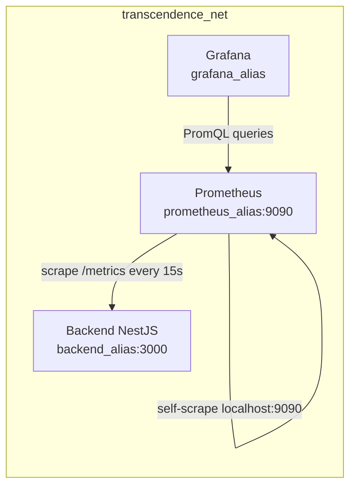
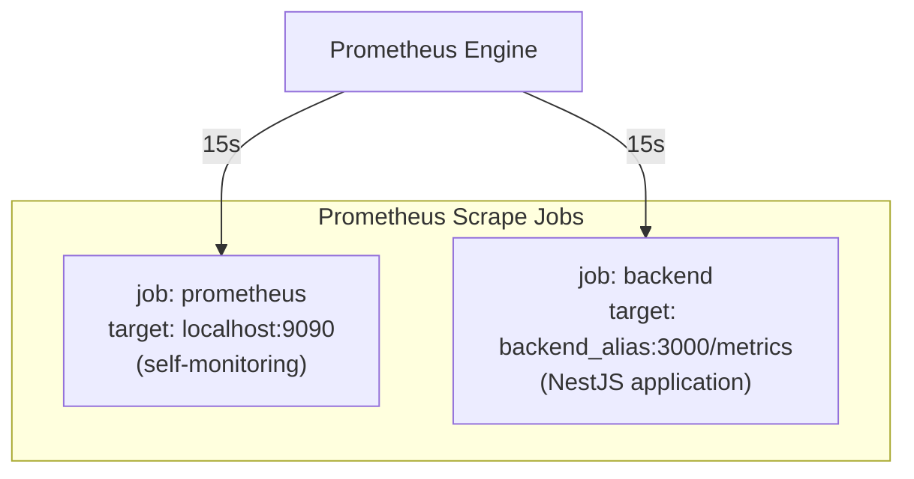
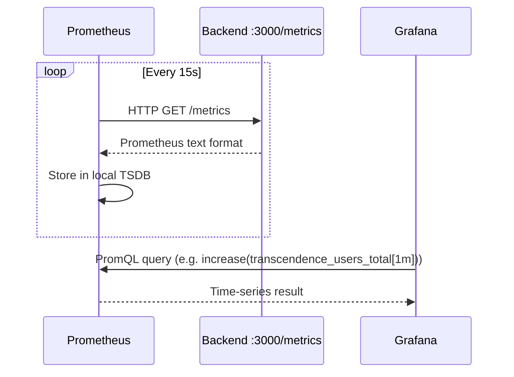

# Prometheus Container — Documentation

## Overview

Prometheus is the metrics collection engine of the Transcendence monitoring stack. It scrapes time-series data from configured targets at a fixed interval, stores them locally, and exposes a query API that Grafana consumes. The container runs as a long-lived service attached to the shared `transcendence_net` network, reachable by other services via its alias `prometheus_alias`.

---

## Evaluation Justification: Monitoring System Module

This document serves as the technical evidence for the Major Module: **"Monitoring system with Prometheus and Grafana"** (Part 1: Metrics Collection).
It fulfills the project requirements by implementing a robust time-series database and scraping engine:
* **Automated Data Aggregation:** Prometheus actively scrapes metrics from the NestJS backend and its own internal state at a fixed 15-second interval, eliminating the need for manual logging.
* **Custom Application Metrics:** Beyond standard hardware metrics (CPU/RAM), it tracks domain-specific data such as `transcendence_users_total`, directly linking the DevOps monitoring stack to the application's business logic.
* **Secure Containerized Integration:** Runs as an isolated container within the Docker network (`transcendence_net`), securely communicating with the backend without exposing raw metric endpoints to the public internet.

---

## Architecture Position



---

## Container Configuration

The container is defined in `docker-compose-prometheus.yml` and joins the project's shared network through an external network reference.

| Parameter | Value |
|---|---|
| **Image** | `prom/prometheus:latest` |
| **Container name** | `${PROM_CONTAINER_NAME}` (default: `prometheus`) |
| **Restart policy** | `unless-stopped` |
| **Run user** | `root` (required for volume writes on Linux) |
| **Host port** | `${PROM_CONTAINER_PORT}` → `9090` (default `9090:9090`) |
| **Network alias** | `prometheus_alias` |

### Volumes

| Host path | Container path | Purpose |
|---|---|---|
| `./prometheus.yml` | `/etc/prometheus/prometheus.yml` | Scrape configuration |
| `../../data/prometheus` | `/prometheus` | Persistent TSDB storage |

### Startup Command Flags

```
--config.file=/etc/prometheus/prometheus.yml
--storage.tsdb.path=/prometheus
--web.console.libraries=/usr/share/prometheus/console_libraries
--web.console.templates=/usr/share/prometheus/consoles
```

---

## Scrape Configuration (`prometheus.yml`)

The global scrape interval is **15 seconds**. Two jobs are defined:



### Job: `prometheus`

Prometheus monitors its own internal metrics (scrape durations, target health, memory, Go runtime) from `localhost:9090`.

### Job: `backend`

Scrapes the NestJS backend at `backend_alias:3000` on the path `/metrics`. The backend must expose a Prometheus-compatible endpoint (e.g., via the `prom-client` library or NestJS Prometheus module). Metrics collected include Node.js process stats, event loop lag, heap usage, and any custom application counters such as `transcendence_users_total`.

---

## Data Flow



---

## Exposed Metrics from Backend

The backend job at `/metrics` is expected to expose at minimum:

| Metric | Description |
|---|---|
| `process_cpu_user_seconds_total` | CPU time consumed |
| `nodejs_eventloop_lag_seconds` | Event loop lag |
| `nodejs_heap_size_total_bytes` | Total heap allocated |
| `nodejs_heap_size_used_bytes` | Heap currently in use |
| `nodejs_active_handles_total` | Active I/O handles |
| `process_resident_memory_bytes` | RSS memory |
| `transcendence_users_total` | Custom counter — registered users |

---

## Storage

TSDB data is written to `../../data/prometheus` on the host. The container is started as `root` to ensure it has write access to this directory on Linux systems. Data persists across container restarts because the path is a bind-mount, not a named volume.

---

## Accessing Prometheus UI

The web interface is available at `http://localhost:9090` (or the configured `PROM_CONTAINER_PORT`). It provides:

- **Graph** — ad-hoc PromQL queries and charts
- **Targets** — health status of all scrape jobs
- **Status → Configuration** — active config inspection
- **Alerts** — native alerting rules (if configured in `prometheus.yml`)

> ⚠️ Prometheus has **no authentication** by default. Access should be restricted to internal network traffic only. Grafana accesses it via the Docker network alias, not via the public port.

---

## Environment Variables

| Variable | Default | Description |
|---|---|---|
| `PROM_CONTAINER_NAME` | `prometheus` | Docker container name |
| `PROM_CONTAINER_PORT` | `9090` | Host-side exposed port |

---

## Integration with Grafana

Grafana connects to Prometheus using the datasource UID `prometheus_001`, configured in `provisioning/datasources/datasource.yml`:

```yaml
- name: Prometheus
  type: prometheus
  url: http://prometheus_alias:9090
  access: proxy
  uid: prometheus_001
  jsonData:
    timeInterval: "15s"
```

The `proxy` access mode means Grafana's backend makes the PromQL requests, keeping Prometheus off the browser network.

---

## Adding New Scrape Targets

To monitor additional services, add a new job block to `prometheus.yml` and restart the container:

```yaml
- job_name: 'my_service'
  metrics_path: '/metrics'
  static_configs:
    - targets: ['service_alias:PORT']
```

No Grafana restart is required — new metrics become automatically available as Prometheus collects them.

[Return to Main modules table](../../../README.md#modules)