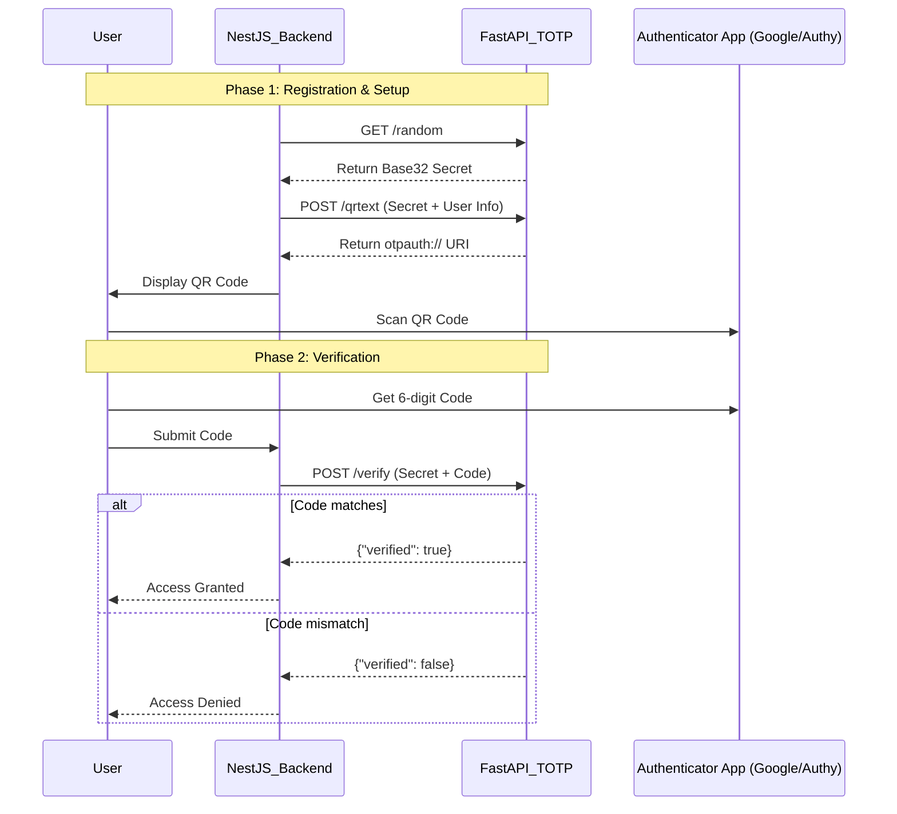
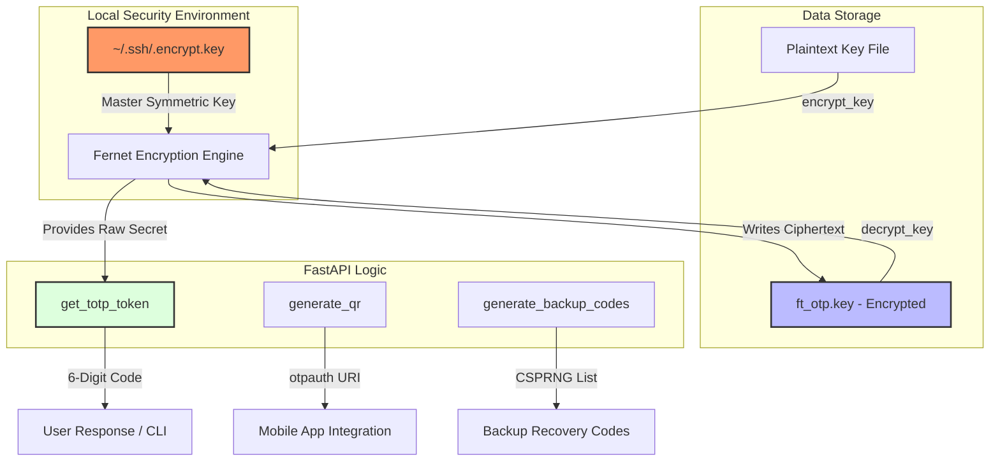

# TOTP server

Executive Summary

The container establishes a high-performance asynchronous API for Time-based One-Time Password (TOTP) management. By leveraging the FastAPI framework and Pydantic for rigorous data validation, the service facilitates the secure generation of cryptographic keys, the creation of QR code metadata for authenticator applications, and the real-time verification of user-submitted tokens.

The architecture is meticulously structured to ingest complex payloads from a primary application (notably NestJS), ensuring that sensitive multi-factor authentication workflows remain decoupled and highly maintainable.

### System Architecture Diagram
The following Mermaid diagram illustrates the sequence of operations between the user, the primary backend, and this FastAPI TOTP service.

|Procedure|Arguments|Returns|Description|
|---------|---------|-------|-----------|
|generate_random_key|length (int)|pathfile (str)|"Generates a cryptographically secure random sequence, encodes it to Base32, and saves it to ft_rand.key."|
|create_random_key|length (int)|random_key_b32 (bytes)|"Similar to the above, but returns the Base32-encoded bytes directly to the caller without file I/O."|
|user_correct_length|argument (str)|pathfile (str)|Converts a user-provided passphrase into a Base32-encoded byte string and stores it in ft_user.key.|
|correct_length|file (str)|pathfile (str)|A validator for the CLI; ensures the target file contains a valid Hexadecimal string of at least 64 characters.|
|correct_filename|argument (str)|filepath (str)|Validates that a specified file exists and that the current process has permissions to read it.|
|encrypt_key|path_to_key (str)|None|Encrypts a plain-text key using a master symmetric key (Fernet) and saves the ciphertext to ft_otp.key.|
|decrypt_key|path_to_key (str)|key_cyphered (bytes)|Retrieves the master key from the system path to decrypt the stored secret for active token generation.|
|get_totp_token|secret (str/bytes)|str_totp (str)|The Core Engine: Executes the RFC 6238 algorithm (HMAC-SHA1 + Dynamic Truncation) to return a 6-digit code.|
|generate_qr|"shared_secret_key, issuer, email"|"tuple (str, list)"|Returns the standard otpauth:// URI required for mobile apps and a list of backup codes.|
|generate_backup_codes|"num_codes| length"|codes (list)|Generates a set of high-entropy recovery codes using secrets.choice for emergency account access.|