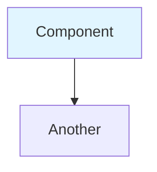
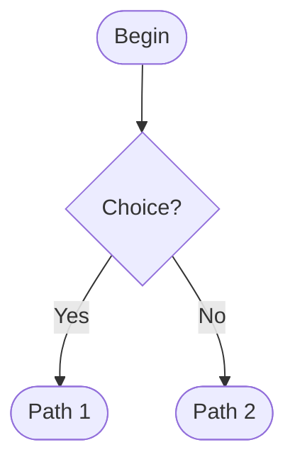
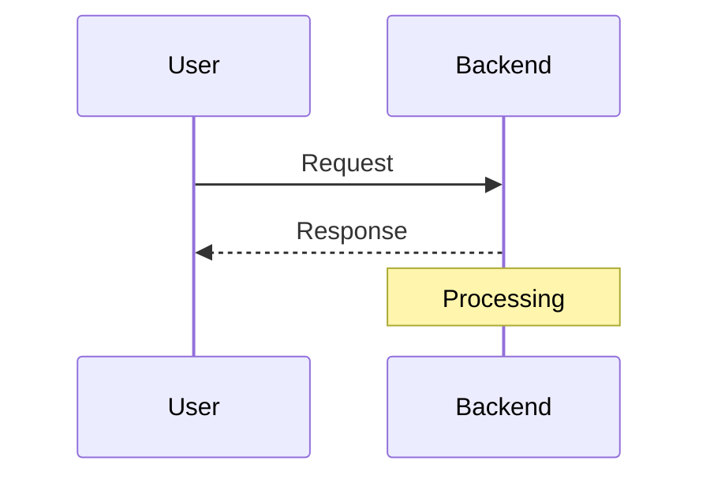
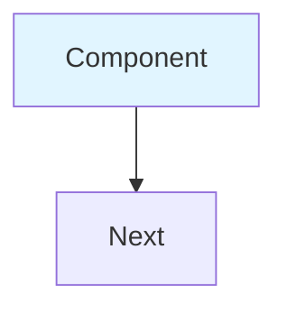

# Mermaid Diagrams Added to V2 Documentation

## Overview

All text-based flow diagrams have been replaced with professional **Mermaid diagrams** for better visualization and clarity.

---

## Diagrams Added

### 📄 **TWO_FACTOR_AUTHENTICATION_COMPLETE_DOCUMENTATION_V2.md**

#### **1. Architecture Diagram** (Line ~25)

**Type:** `graph TB` (Top-to-Bottom)

**Shows:**
- Frontend components (Registration, QR Display, Login)
- Backend components (Controller, Service, PostgreSQL)
- TOTP Microservice (app.py, totp.py, encryption key)
- Data flow with encryption/hashing indicators

**Features:**
- Color-coded sections (Frontend: blue, Backend: orange, TOTP: green, DB: gray)
- Shows bcrypt hashing flow
- Shows Fernet encryption flow
- Internal network communication

**Visual Highlights:**
- 🔐 Red boxes for encryption operations
- Database storage shown with encrypted/hashed indicators

---

#### **2. Registration Flow Diagram** (Line ~300)

**Type:** `flowchart TD` (Top-Down)

**Shows:**
- Complete registration process from form submission to completion
- Conditional logic (2FA enabled/disabled)
- TOTP secret encryption step (Fernet)
- Backup code hashing step (bcrypt)
- QR code generation and display
- User actions (scan QR, save codes)

**Security Highlights:**
- 🔐 Fernet encryption step highlighted in red
- 🔐 bcrypt hashing step highlighted in red
- ⚠️ Backup codes display warning (yellow)
- ✅ Completion indicator (green)

**Decision Points:**
- "2FA Enabled?" → Yes/No branches
- Clear end states for both paths

---

#### **3. Login Flow Diagram** (Line ~575)

**Type:** `flowchart TD` (Top-Down)

**Shows:**
- Two-phase login (password → 2FA)
- Smart code routing (6 digits vs 8 characters)
- TOTP verification with decryption
- Backup code verification with hashing
- JWT token generation
- Error handling paths

**Branching Logic:**
- Password correct? → Yes/No
- 2FA enabled? → Yes/No
- Code length? → 6 digits / 8 characters
- Code match? → Yes/No (for both TOTP and backup)

**Security Highlights:**
- 🔐 Decryption operation (red box)
- 🔐 bcrypt comparison (red box)
- ⚠️ Hash removal for single-use (yellow)
- ✅ JWT token generation (green)

**Features:**
- Multiple error paths clearly shown
- Success paths converge at JWT storage
- Clean separation of TOTP vs Backup flows

---

### 📄 **2FA_LOGIN_FLOW_UPDATED_V2.md**

#### **4. Complete Login Flow Diagram** (Line ~21)

**Type:** `flowchart TD` (Top-Down)

**Shows:**
- Same as diagram #3 but more detailed
- Includes all intermediate steps
- Shows frontend state changes
- Backend verification details
- Database operations

**Additional Details:**
- Frontend: `setShowTotpInput(true)`
- Backend: `bcrypt.compare(password, hash)`
- TOTP Service: 3-step verification process
- Backend: Loop through hashes logic

---

#### **5. TOTP Verification Sequence Diagram** (Line ~355)

**Type:** `sequenceDiagram`

**Shows:**
- Step-by-step message flow between components:
  - User → Frontend
  - Frontend → Backend
  - Backend → Database
  - Backend → TOTP Service
  - TOTP Service internal operations
  - Responses back through the chain

**Detailed Steps:**
1. User enters 6-digit code
2. Frontend sends to backend
3. Backend fetches encrypted secret from DB
4. Backend forwards to TOTP service
5. **TOTP decrypts** (Fernet operation highlighted)
6. **TOTP decodes Base32**
7. **TOTP generates current code** (RFC 6238 algorithm detailed)
8. **TOTP compares codes**
9. Response chain back to user

**Annotations:**
- "🔐 Step 1: DECRYPT" note over TOTP
- "Result: Base32 string" note
- "Step 2-4" algorithm details shown
- Alt block for match/no-match scenarios

**Visual Features:**
- Actor icons for User
- Box participants for services
- Activation bars during processing
- Alt/else blocks for conditional logic

---

#### **6. Backup Code Verification Sequence Diagram** (Line ~545)

**Type:** `sequenceDiagram`

**Shows:**
- Step-by-step message flow for backup code verification:
  - User → Frontend
  - Frontend → Backend
  - Backend → Database (multiple times)
  - Loop through hashes
  - Single-use enforcement

**Detailed Steps:**
1. User enters 8-character code
2. Frontend sends to backend
3. Backend fetches hashed codes from DB
4. **Backend loops through all hashes**
5. **bcrypt.compare() for each hash** (highlighted)
6. If match: **Remove hash from database**
7. **Count remaining codes**
8. **Generate JWT token**
9. Return success with codes remaining count

**Loop Logic:**
- `loop For each hash in storedHashes`
- Shows bcrypt comparison operation
- Alt block: match found vs no match
- Break loop on match

**Annotations:**
- "🔐 bcrypt.compare" operation highlighted
- "Single-use enforcement" note
- "Hash removed ✅" confirmation
- "Remaining count: 6" example shown

**Alt Blocks:**
- Hash match found → success path
- No match found → error path

---

## Diagram Summary Table

| # | Document | Diagram Type | Shows | Lines |
|---|----------|--------------|-------|-------|
| 1 | Complete Doc | graph TB | Architecture overview | ~25 |
| 2 | Complete Doc | flowchart TD | Registration flow | ~300 |
| 3 | Complete Doc | flowchart TD | Login flow | ~575 |
| 4 | Login Flow | flowchart TD | Detailed login | ~21 |
| 5 | Login Flow | sequenceDiagram | TOTP verification | ~355 |
| 6 | Login Flow | sequenceDiagram | Backup verification | ~545 |

---

## Color Coding Used

### **Flowcharts:**
- 🔵 **Blue** (`fill:#e1f5ff`) - Frontend components
- 🟠 **Orange** (`fill:#fff4e1`) - Backend components
- 🟢 **Green** (`fill:#e8f5e9`) - TOTP service, success states
- ⚪ **Gray** (`fill:#f0f0f0`) - Database
- 🔴 **Red** (`fill:#ffebee`) - Encryption/hashing operations
- 🟡 **Yellow** (`fill:#fff3e0`) - Warnings/important notices
- 🟢 **Light Green** (`fill:#c8e6c9`) - Completion states

### **Sequence Diagrams:**
- **Participants:** Auto-colored by Mermaid
- **Notes:** Yellow background for important steps
- **Alt blocks:** Light background for conditional logic

---

## Benefits of Mermaid Diagrams

### **1. Professional Appearance**
- ✅ Clean, modern design
- ✅ Consistent styling
- ✅ Auto-layout (no manual positioning)

### **2. Better Readability**
- ✅ Clear arrows and flow direction
- ✅ Color-coded security operations
- ✅ Visual grouping (subgraphs)

### **3. Interactive (in supporting tools)**
- ✅ Zoom in/out
- ✅ Pan around large diagrams
- ✅ Click to highlight paths

### **4. Maintainable**
- ✅ Text-based (easy to version control)
- ✅ Easy to update
- ✅ Renders in GitHub, GitLab, VS Code, etc.

### **5. Documentation Standards**
- ✅ Industry-standard diagram format
- ✅ Widely recognized syntax
- ✅ Supported by most markdown viewers

---

## How to View

### **GitHub/GitLab:**
Mermaid diagrams render automatically in markdown files.

### **VS Code:**
Install extension: "Markdown Preview Mermaid Support"

### **Local Viewer:**
Use Typora, Mark Text, or any Mermaid-supporting markdown viewer.

### **Online:**
- Copy diagram code to https://mermaid.live/
- Renders immediately with live editing

---

## Diagram Syntax Examples

### **Architecture (Graph TB):**


### **Flow (Flowchart TD):**


### **Sequence:**


---

## Key Features Highlighted in Diagrams

### **Security Operations:**
- 🔐 Fernet encryption (highlighted in red)
- 🔐 Fernet decryption (highlighted in red)
- 🔐 bcrypt hashing (highlighted in red)
- 🔐 bcrypt comparison (highlighted in red)

### **Important Warnings:**
- ⚠️ Backup codes shown ONCE (yellow)
- ⚠️ Password cleared after Phase 1 (yellow)
- ⚠️ Single-use hash removal (yellow)

### **Success States:**
- ✅ Registration complete (green)
- ✅ JWT token generated (green)
- ✅ Login successful (green)

### **Data Flow:**
- Plain text → Encryption → Encrypted storage
- User input → Hashing → Hashed storage
- Encrypted data → Decryption → Verification
- Hashed data → Comparison → Verification

---

## Update Summary

### **What Changed:**

**Before (V1):**
```
Text-based ASCII diagrams:
┌─────────────┐
│   Component │
└──────┬──────┘
       │
       ▼
```

**After (V2):**


### **Benefits:**
- ✅ Professional appearance
- ✅ Better visualization
- ✅ Security operations clearly marked
- ✅ Interactive in supporting tools
- ✅ Industry-standard format

---

## For Presentation/Evaluation

### **Show the diagrams:**
1. Open markdown in GitHub/VS Code with Mermaid support
2. Diagrams render beautifully
3. Point out security highlights (red boxes)
4. Walk through flows step-by-step

### **Highlight:**
- "We used Mermaid for professional documentation"
- "Security operations clearly marked in red"
- "Complete flows from user action to database storage"
- "Shows encryption, hashing, verification in detail"

---

## Conclusion

All 6 major flow diagrams have been converted to Mermaid format with:
- ✅ Professional visual design
- ✅ Security operations highlighted
- ✅ Clear data flow paths
- ✅ Complete user journeys
- ✅ Industry-standard format

**Your documentation is now presentation-ready with professional diagrams! 🎉**

---

**Files Updated:**
1. `TWO_FACTOR_AUTHENTICATION_COMPLETE_DOCUMENTATION_V2.md` (3 diagrams)
2. `2FA_LOGIN_FLOW_UPDATED_V2.md` (3 diagrams)

**Total Diagrams:** 6 professional Mermaid diagrams  
**Total Lines:** ~950 + ~1000 lines of comprehensive documentation
