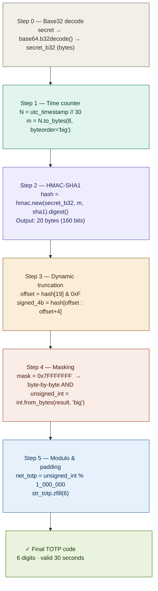
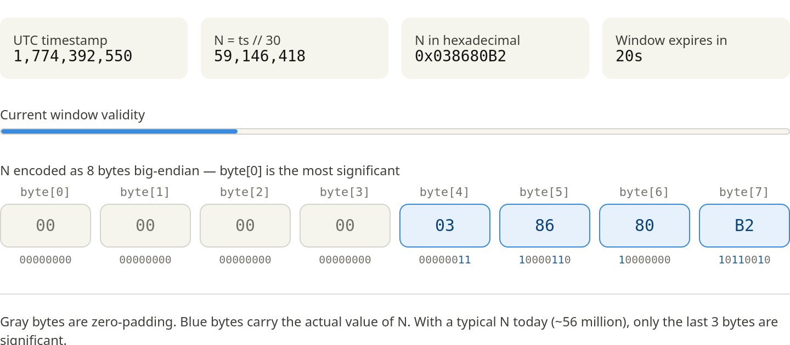
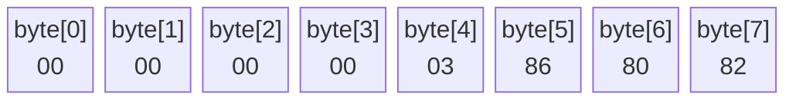
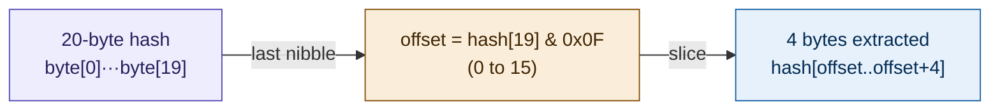
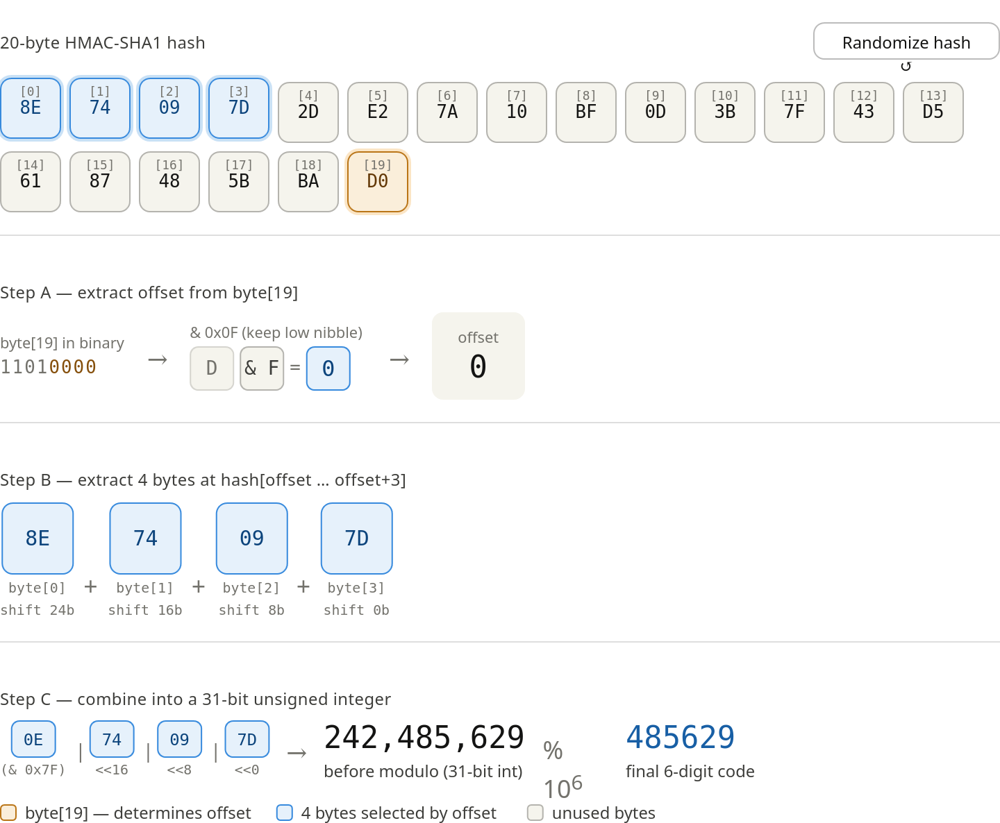
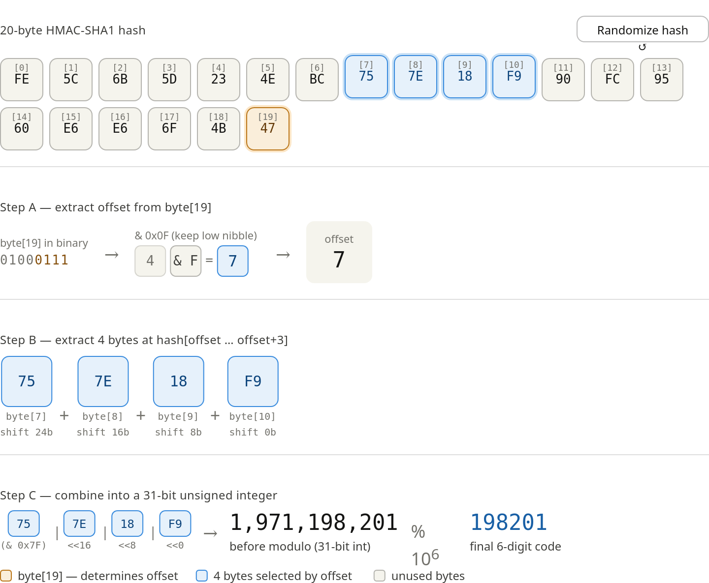
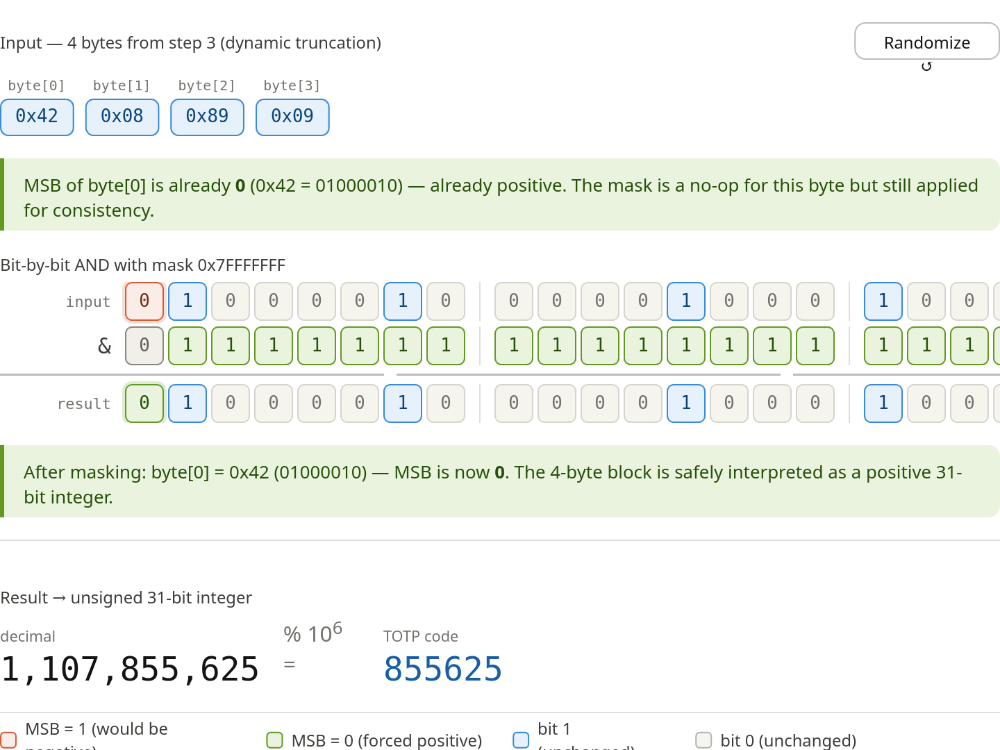
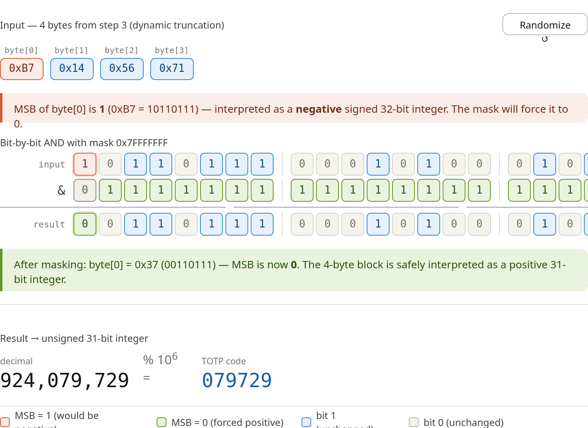
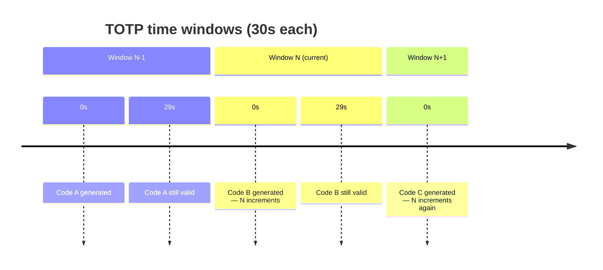

# Analysis of get_totp_token

The get_totp_token function faithfully implements the RFC 6238 standard and can be broken down into 5 clearly defined steps:

### Step 0 — Shared secret decoding
The first thing is to decode the secret key from Base32. This secret is shared between the server and the authenticator (Google Authenticator, etc.) at registration time.
### Step 1 — Time counter calculation (T)
The current UTC timestamp in seconds is obtained and integer-divided by 30 (TIME_STEP). This converts continuous time into 30-second "windows", so all codes generated within the same interval are identical. The result N is converted to 8 bytes in big-endian format, which is the format required by the HMAC function.
### Step 2 — HMAC-SHA1
HMAC-SHA1(secret_key, counter) is applied. The result is always a 20-byte (160-bit) block. This hash changes completely with each new time window, but is deterministic: given the same secret and the same window, it always produces the same result.
### Step 3 — Dynamic truncation
This is the cleverest part. Instead of always using the same bytes from the hash, the last nibble (last 4 bits) of the hash is used to compute a dynamic offset: offset = hash[19] & 0xF. Then 4 bytes are extracted starting at that position. This adds extra variability and avoids predictable patterns.
### Step 4 — Masking (removing the sign bit)
The 4 extracted bytes are masked with 0x7FFFFFFF to zero out the most significant bit. This avoids signed/unsigned interpretation issues when converting to an integer.
### Step 5 — Modulo and padding
The resulting integer is taken modulo 10^6 (1,000,000) to keep only the last 6 digits. If the number has fewer than 6 digits, it is left-padded with zeros.




A couple of additional details worth highlighting from the code:

**Why is the offset dynamic?** By using hash[19] & 0xF to decide where to extract the 4 bytes from, the function prevents an attacker from inferring the code based on fixed patterns in the hash. The offset can be anywhere from 0 to 15, and since the hash is 20 bytes long, 4 bytes are always available (15 + 4 = 19).

**Why 30 seconds?** The TIME_STEP = 30 value establishes that the same code is valid for that window. In practice, servers typically also accept the code from the previous and next windows to compensate for small clock differences between client and server.

Compatibility with standard authenticators: the code generates the otpauth://totp/... URL in generate_qr(), which is exactly the format read by apps like Google Authenticator or Microsoft Authenticator, making the tokens fully interoperable.

# Step 1 — Time counter calculation (T)

```python
int_dt_utc = int(datetime.datetime.now(datetime.timezone.utc).timestamp())
N = int_dt_utc // TIME_STEP          # TIME_STEP = 30
m = int.to_bytes(N, length=8, byteorder='big')
```





> Bytes 0–4 are zero-padding. The actual value of N lives in bytes 5–7.  
> Big-endian is **opposite** to most modern CPU architectures (little-endian), hence the explicit `byteorder='big'`.

Notice what it shows: with a typical N today (around 56 million), the number fits in 3 bytes. The first 5 bytes are always 00 — pure padding to ensure the block is exactly 8 bytes, which is what HMAC-SHA1 requires.

The progress bar shows how much of the current 30-second window has elapsed. When it reaches 100%, N increments by 1, all bytes change, and HMAC produces a completely different hash → new TOTP code.

The big-endian format is mandatory per RFC 4226: the most significant byte comes first (byte[0]), unlike most modern architectures (little-endian) where the least significant byte comes first. That's why the code explicitly uses byteorder='big' in int.to_bytes(N, length=8, byteorder='big').

# Step 2 — HMAC-SHA1

HMAC-SHA1 takes the secret as the key and the 8-byte counter as the message.  
The same secret + same time window **always** produces the same 20-byte digest.

```python
hash = hmac.new(secret_b32, m, hashlib.sha1).digest()
# Result: 20 bytes (160 bits)
```

# Step 3 — Dynamic truncation

```python
offset = hash[19] & 0xF          # last nibble → value 0..15
signed_4b_hash = hash[offset : offset + 4]
```



Using a **dynamic** offset (rather than a fixed one) adds extra unpredictability — an attacker cannot predict which portion of the hash will be used.


**Step A** — byte[19] (amber) is the "pointer byte". Its low nibble (last 4 bits) is AND-masked with 0x0F to produce the offset, a number between 0 and 15. The high nibble is discarded entirely.

**Step B** — The 4 bytes starting at hash[offset] are lifted out (blue). Notice the selected slice moves around the 20-byte array depending on the offset — that's the "dynamic" part. Byte [0] of the extracted slice also gets AND-masked with 0x7F (Step 4 in the full algorithm) to strip the sign bit.

**Step C** — The 4 bytes are concatenated via bit-shifts into a single 31-bit integer, then taken modulo 10⁶ to produce the final 6-digit code. The toLocaleString() number shown before the modulo can be up to ~2.1 billion — modulo is what keeps it to exactly 6 digits.



# Step 4 — Masking (removing the sign bit)
```python
mask = bytes.fromhex('7fffffff')
un_signed_4b_hash = bytes([h & m for h, m in zip(signed_4b_hash, mask)])
unsigned_int = int.from_bytes(un_signed_4b_hash, byteorder='big')
```

`0x7FFFFFFF` zeroes out the **most significant bit** of the 4-byte block.  
This guarantees a positive integer regardless of the platform's signed/unsigned integer handling.

```
Before:  1xxxxxxx xxxxxxxx xxxxxxxx xxxxxxxx   (MSB may be 1)
Mask:    01111111 11111111 11111111 11111111
After:   0xxxxxxx xxxxxxxx xxxxxxxx xxxxxxxx   (always positive)
```




The key insight is visible in the bit matrix:

The mask 0x7FFFFFFF translates to 01111111 11111111 11111111 11111111 in binary — notice that only the very first bit of byte[0] is a zero; all 31 remaining bits are ones. An AND with ones is a no-op, so those 31 bits pass through completely unchanged. The sole purpose of the mask is to silence that single MSB.

Why does the MSB matter? When you call int.from_bytes(4_bytes, 'big') in Python the result is always unsigned, but the RFC was written for languages like C and Java where a 4-byte block with MSB=1 would be interpreted as a negative int32. Zeroing the MSB ensures the code works identically across all platforms — it's a portability guarantee, not a security measure.

# Step 5 — Modulo and padding

```python
net_totp = gross_totp % TOTP_DIVISOR    # TOTP_DIVISOR = 10^6 = 1_000_000
str_totp = str(net_totp).zfill(6)       # e.g. 47832 → "047832"
```

Previous image also carries through the final two operations — the unsigned integer feeds straight into % 1_000_000 to produce the 6-digit TOTP code you'd type into an authenticator prompt.

# 4. Window timing



> In practice, servers accept codes from **N-1**, **N**, and **N+1** to tolerate clock skew between client and server.

# 5. QR code / authenticator compatibility

The `generate_qr()` function produces a standard `otpauth://` URI:

```
otpauth://totp/ISSUER (email)?secret=BASE32SECRET&issuer=Pong Evolution
```

This URI is the format consumed by **Google Authenticator**, **Microsoft Authenticator**, **Authy**, and any RFC 6238-compliant app — making tokens fully interoperable.

[Return to Main modules table](../../../README.md#modules)